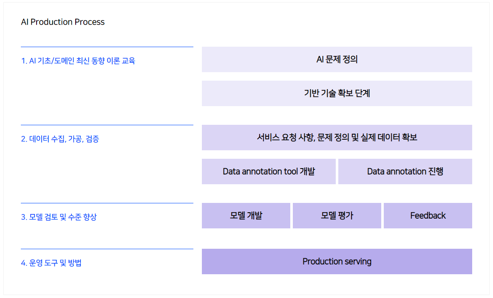
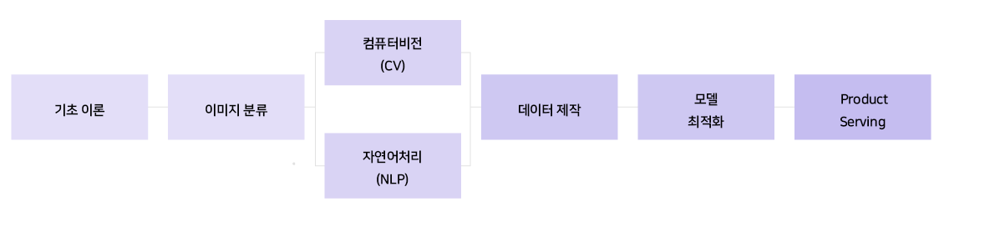
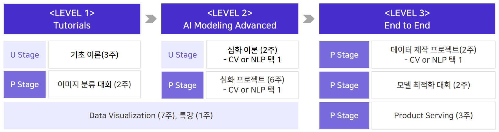

<!-- PROJECT LOGO -->
<div align="center">
</img>
<h1>Naver BoostCamp AI Tech 2</h1>
  An awesome AI education to jumpstart my NLP projects!
  <br />
  <a href="https://github.com/jinmang2/BoostCamp_AI_Tech_2/README.md"><strong>Explore the docs »</strong></a>
  <br />
  <a href="https://github.com/jinmang2">My Github</a>
  ·
  <a href="https://huggingface.co/jinmang2">My Huggingface Hub</a>
  ·
  <a href="https://boostcamp.connect.or.kr/">BoostCamp</a>
  ·
  <a href="https://github.com/jinmang2/BoostCamp_AI_Tech_2/issues">Request Feature</a>
</div>
<br></br>
<details open="open">
  <summary>Table of Contents</summary>
  <ol>
    <li>
      <a href="#about-the-project">About The Project</a>
      <ul>
        <li><a href="#why-did-i-apply-for-this-project?">Why did i apply for this project?</a>
        </li>
        <!-- <li><a href="#after-this-project-is-over">After this project is over</li> -->
      </ul>
    </li>
    <li>
      <a href="#path-of-growth">Path of Growth</a>
      <!-- <ul>
        <li><a href="#prerequisites">Prerequisites</a></li>
        <li><a href="#installation">Installation</a></li>
      </ul> -->
    </li>
    <li><a href="#pre-course">Pre-course</a></li>
    <li><a href="#total-curriculum">Total Curriculum</a></li>
      <ul>
        <li><a href="#level-1">LEVEL 1</a></li>
          <ul>
            <li><a href="#week-1">Week 1</a></li>
            <li><a href="#week-2">Week 2</a></li>
            <li><a href="#week-3">Week 3</a></li>
            <li><a href="#week-4">Week 4</a></li>
            <li><a href="#week-5">Week 5</a></li>
          </ul>
        <li><a href="#level-2">LEVEL 2</a></li>
        <ul>
          <li><a href="#week-6">Week 6</a></li>
          <li><a href="#week-7">Week 7</a></li>
          <li><a href="#week-8">Week 8</a></li>
          <li><a href="#week-9">Week 9</a></li>
          <li><a href="#week-10">Week 10</a></li>
          <li><a href="#week-11">Week 11</a></li>
          <li><a href="#week-12">Week 12</a></li>
          <li><a href="#week-13">Week 13</a></li>
          <li><a href="#week-14">Week 14</a></li>
        </ul>
        <li><a href="#level-3">LEVEL 3</a></li>
        <ul>
          <li><a href="#week-15">Week 15</a></li>
          <li><a href="#week-16">Week 16</a></li>
          <li><a href="#week-17">Week 17</a></li>
          <li><a href="#week-18">Week 18</a></li>
          <li><a href="#week-19">Week 19</a></li>
          <li><a href="#week-20">Week 20</a></li>
          <li><a href="#week-21">Week 21</a></li>
        </ul>
      </ul>
    <li><a href="#contact">Contact</a></li>
    <li><a href="#acknowledgements">Acknowledgements</a></li>
  </ol>
</details>

<!-- ABOUT THE PROJECT -->
## About The Project
- `2021.08.02` ~ `2021.12.27`까지 진행되는 AI 최상위 교육 과정
- 학계와 산업 현장의 최전방에서 달리고 있는 최고의 실력자들의 경험 공유를 기반으로 국내 최고 수준의 AI 교육을 진행

<br/>
<div align="right">
    <b><a href="#naver-boostcamp-ai-tech-2">↥ back to top</a></b>
</div>
<br/>

### Why did i apply for this project?
- 회사에서 TOD 관련 논문 및 구현체를 읽으며 관련 개념을 공부하던 때였음 (21년 5월)
- 그러던 와중에 1기분들의 v-log 및 [github](https://github.com/ydy8989/boostcamp)을 봤고
- 여러 논문을 뜯어가며 힘겹게 공부하던 내용들을(회사에선 배우지 못했던) 본 과정에서 가르쳐주는 것을 보고 굉장히 매력적이라 느낌
  - (+) Don't stop pretraining paper의 TAPT, DAPT 등,
  - (+) 최성철 교수님 주재걸 교수님 서민준 교수님 이활석님 이유경님 김성현님 등등...
  - 정말 너무 좋은 과정 + 좋은 마스터분들이 계시기에 퇴사 후 지원을 결심하게 됨

<br/>
<div align="right">
    <b><a href="#naver-boostcamp-ai-tech-2">↥ back to top</a></b>
</div>
<br/>

## Path of Growth
- 실제 Production Serving단까지 경험해볼 좋은 기회!!
- huggingface hub에 올린 모델을 django/flask로 real-world service로 만들어보자!

[](https://boostcamp.connect.or.kr/program_ai.html)

- 본 과정은 아래 과정처럼 진행됨
- NLP와 CV를 선택할 수 있으나, 본인은 `Natural Language Processing` 외길이기 때문에 NLP를 선택하여 본 교육 과정을 들을 예정

[](https://boostcamp.connect.or.kr/program_ai.html)

<br/>
<div align="right">
    <b><a href="#naver-boostcamp-ai-tech-2">↥ back to top</a></b>
</div>
<br/>

## Pre-course
- https://www.boostcourse.org/ai100

## Total Curriculum

[](https://boostcamp.connect.or.kr/program_ai.html)

<br/>
<div align="right">
    <b><a href="#naver-boostcamp-ai-tech-2">↥ back to top</a></b>
</div>
<br/>

### LEVEL 1
- AI 모델 개발과 서비스 적용에 필요한 기초 지식을 학습하고 도메인별로 널리 쓰이는 backbone 모델을 다루는 이론 학습 단계

#### Week 1
- **U-stage** `2021.08.02` ~ `2021.08.06`
- Python basics for AI, AI Math
- 마스터: 최성철 교수님, 임성빈 교수님

#### Week 2
- **U-stage** `2021.08.09` ~ `2021.08.13`
- Deep Learning Basics
- 마스터: 최성준 교수님

#### Week 3
- **U-stage** `2021.08.16` ~ `2021.08.20`
- Pytorch for AI
- 마스터: 최성철 교수님

#### Week 4
- **P-stage** `2021.08.23` ~ `2021.09.27`
- Image Classification
- 마스터: 김태진 강사님

#### Week 5
- **P-stage** `2021.08.30` ~ `2021.09.03`
- Image Classification
- 마스터: 김태진 강사님


<br/>
<div align="right">
    <b><a href="#naver-boostcamp-ai-tech-2">↥ back to top</a></b>
</div>
<br/>

### LEVEL 2
- 도메인 별 심화 이론 및 널리 쓰이는 backbone 모델 학습, 모델링 심화

#### Week 6
- **U-stage** `2021.09.06` ~ `2021.09.10`
- NLP 이론
- 마스터: 주재걸 교수님

#### Week 7
- **U-stage** `2021.09.13` ~ `2021.09.17`
- NLP 이론
- 마스터: 주재걸 교수님

#### Week 8
- **S-stage** `2021.09.20` ~ `2021.09.24`
- 다양한 주제 기반의 특강
- 마스터: 이활석, 박은정, 이준엽, 김상훈, 박성준, 문지형, 오혜연, 구종만 강사 및 교수님

#### Week 9
- **P-stage** `2021.09.27` ~ `2021.10.01`
- KLUE
- 마스터: 김성현 강사님

#### Week 10
- **P-stage** `2021.10.04` ~ `2021.10.08`
- KLUE
- 마스터: 김성현 강사님

#### Week 11
- **P-stage** `2021.10.11` ~ `2021.10.15`
- KLUE
- 마스터: 김성현 강사님

#### Week 12
- **P-stage** `2021.10.18` ~ `2021.10.22`
- Machine Reading Comprehension
- 마스터: 서민준 교수님

#### Week 13
- **P-stage** `2021.10.25` ~ `2021.10.29`
- Machine Reading Comprehension
- 마스터: 서민준 교수님

#### Week 14
- **P-stage** `2021.11.01` ~ `2021.11.05`
- Machine Reading Comprehension
- 마스터: 서민준 교수님

<br/>
<div align="right">
    <b><a href="#naver-boostcamp-ai-tech-2">↥ back to top</a></b>
</div>
<br/>

### LEVEL 3
- 실전 프로젝트를 통해 현업과 유사한 엔지니어링 프로세스를 경험하는 End-to-End 단계

#### Week 15
- **P-stage** `2021.11.08` ~ `2021.11.12`
- 데이터 다루기
- 마스터: 이활석, 한지윤 강사님

#### Week 16
- **P-stage** `2021.11.15` ~ `2021.11.19`
- 데이터 다루기
- 마스터: 이활석, 한지윤 강사님

#### Week 17
- **P-stage** `2021.11.22` ~ `2021.11.26`
- 모델 최적화
- 마스터: 김정훈 강사님

#### Week 18
- **P-stage** `2021.11.29` ~ `2021.12.03`
- 모델 최적화
- 마스터: 김정훈 강사님

#### Week 19
- **P-stage** `2021.12.06` ~ `2021.12.10`
- Product Serving
- 마스터: 변성윤 강사님

#### Week 20
- **P-stage** `2021.12.13` ~ `2021.12.17`
- Product Serving
- 마스터: 변성윤 강사님

#### Week 21
- **P-stage** `2021.12.20` ~ `2021.12.23`
- Product Serving
- 마스터: 변성윤 강사님


<br/>
<div align="right">
    <b><a href="#naver-boostcamp-ai-tech-2">↥ back to top</a></b>
</div>
<br/>

<!-- CONTACT -->
## Contact
- 본 문서는 강의 수강자 [진명훈](https://github.com/jinmang2)에 의해 관리되고 있습니다
- 수정/오류/질문 등에 대한 컨텍은 아래 연락처로 주시면 빠른 시일 내에 답변드리겠습니다.
  - [Gmail](jinmang2@gmail.com): jinmang2@gmail.com
  - [Github](https://github.com/jinmang2): github.com/jinmang2
  - [Huggingface Hub](huggingface.co/jinmang2): huggingface.co/jinmang2

<br/>
<div align="right">
    <b><a href="#naver-boostcamp-ai-tech-2">↥ back to top</a></b>
</div>
<br/>


<!-- ACKNOWLEDGEMENTS -->
## Acknowledgements
```
SUNG KIM (UPSTAGE CEO, 전 NAVER Clova AI Head)
최성철 (가천대학교 산업경영공학과)
임성빈 (UNIST 인공지능 대학원)
최성준 (고려대학교 인공지능학과)
오태현 (POSTECH, 전자전기공학과)
주재걸 (KAIST AI 대학원)
이활석 (전 Naver Clova Visual AI/OCR 헤드)
박은정 (전 네이버 파파고 AI 도델 팀 리더)
김재범 (전 카카오 AI기술팀 헤드)
김상훈 (Kaggle 세계 랭킹 12위)
문지형 (전 네이버 파파고 AI 모델 팀 리서치 엔지니어)
박성준 (Google PhD Fellowship)
이준엽 (전 NAVER Clova OCR팀 테크리더)
김태진 (번개장터)
김현우 (KAIST 산업및시스템공학과)
송원호 (KAIST 정보보호 대학원)
김성현 (Smilegate AI)
김성동 (Naver AI LAB)
서민준 (KAIST AI 대학원)

UP Stage and Naver Connect
```

<br/>
<div align="right">
    <b><a href="#naver-boostcamp-ai-tech-2">↥ back to top</a></b>
</div>
<br/>
