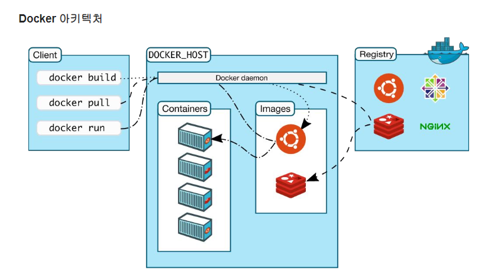

# Section 3. 도커 & 쿠버네티스 기초
- 출처: https://www.inflearn.com/course/머신러닝-엔지니어-실무/

[back to super](https://github.com/jinmang2/boostcamp_ai_tech_2/tree/main/o-stage/mlops)

<details open="open">
  <summary>Table of Contents</summary>
  <ol>
    <li>
      <a href="#도커-소개">도커 소개</a>
      <ul>
        <li><a href="#도커-개요">도커 개요</a>
          <ul>
            <li><a href="#"></a></li>
          </ul>
        </li>
        <li><a href="#도커-설치">도커 설치</a></li>
        <li><a href="#도커-실습">도커 실습</a>
          <ul>
            <li><a href="#"></a></li>
          </ul>
        </li>
      </ul>
    </li>
    <li>
      <a href="#쿠버네티스-기초">쿠버네티스 기초</a>
      <ul>
        <li><a href="#쿠버네티스-개요">쿠버네티스 개요</a>
          <ul>
            <li><a href="#"></a></li>
          </ul>
        </li>
        <li><a href="#쿠버네티스-설치">쿠버네티스 설치</a></li>
        <li><a href="#쿠버네티스-앱-배포-실습">쿠버네티스 앱 배포 실습</a>
          <ul>
            <li><a href="#"></a></li>
          </ul>
        </li>
      </ul>
      <li><a href="#references">References</a></li>
    </li>
  </ol>
</details>

## 도커 소개
Docker - Kubernetes - Kubeflow

일관된 환경으로 향상성 상승 + 개발력 상승

온보딩(Onboarding, 준비 사항)

### 도커 개요

#### Why Docker?
Application 개발, 제공 및 실행하기 위한 플랫폼

Docker를 사용하여 Application을 Infra에서 분리
- Software를 빠르게 제공 가능

코드를 신속하게 전달, 테스트 및 배포하기 위한 Docker의 방법론을 활용
- 코드 작성과 프로덕션 실행 사이의 지연을 크게 줄일 수 있음

#### 도커 플랫폼
`Container`: 느슨하게 격리된 환경에서 어플리케이션을 패키징하고 실행할 수 있는 기능
- `느슨하게 격리된?` 무슨 말일까?
    - 뭔가 tight하지 않고 Infra랑 격리된 유연한 배포 Tool?
    - 격리된 서비스라는 것이 Docker의 핵심인 듯.
- VM보다 가벼움
- Docker Registry, Container를 쉽게 공유할 수 있음
- 모든 사람이 동일한 방식으로 작동하는 동일한 Container를 가짐
- CI/CD 업무 프로세스 표준화 향상

우리는 도커를 사용하여
- Container를 사용하여 애플리케이션 및 지원 구성 요소를 개발
- Container는 애플리케이션을 배포하고 테스트하는 단위
- 준비가 되면 애플리케이션을 Container 또는 orchestration된 서비스로 production 환경에 배포
    - `orchestration`이란?
    - https://www.redhat.com/ko/topics/automation/what-is-orchestration
    - https://www.mantech.co.kr/container_orchestration/
    - 컨테이너 배포 관리를 흔히 `Container Orchestration`이라고 부른다고 함
    - 예를 들어 `Kubernetes`
- 이는 production 환경이 local data center, cloud 공급자 또는 둘의 hybrid든 상관없이 동일하게 동작

#### 도커는 어디에 사용할 수 있을까?

**빠르고 일관된 애플리케이션 제공**
- Local Container로 표준화된 환경에서 작업할 수 있음
- 개발 수명주기를 단축
- CI/CD workflow에 적합
- e.g., Container Image 공유

**반응형 배포 및 확장**
- 이식성이 뛰어남
- Local, Data Center의 물리적 또는 VM, 클라우드 공급자 또는 혼합 환경에서 실행 가능
- MLOps에서 매우 중요한 Component로 자리함
- GPU Cluster id 관리를 효과적으로 하려면 Docker를 사용할 수 밖에 없다고 함
    - [Nvidia Docker + 쿠버네티스 조합으로 포드에서 그래픽카드 사용하기](https://m.blog.naver.com/PostView.naver?isHttpsRedirect=true&blogId=alice_k106&logNo=221654023573)
    - [Kubernetes with Nvidia GPU Cluster](http://incredible.ai/kubernetes/2020/07/24/Kubernetes-Nvidia-GPU-Cluster/)

**동일한 하드웨어에서 더 많은 워크로드 실행**
- 동일한 hardware에서 많은 offload를 실행할 수 있음 (by VM)
    - 다른 내용일 수 있지만... [네트워크 관리 TOE(TCP offload engine)](https://m.blog.naver.com/PostView.naver?isHttpsRedirect=true&blogId=hymne&logNo=220945826028)
    - offload는 뭔가 내리는 것을 의미하는 것 같음
    - TOE도 설명을 보면 OS에서 처리되는 TCP/IP 스택을 네트워크 컨트롤러로 내려서 처리하는 것이라고 함
    - ZeRO offload도 optimizer state를 cpu에 내리는 기법! (용량 확보)
    - Hardware의 자원을 확보하는 기법 중 하나인듯
- Docker는 가볍고 빠름

#### 도커 아키텍쳐

Client-Server Architecture 사용

`Docker Client`는 `Docker Demon`과 통신
- Docker Demon은 `Docker Container`를 빌드, 실행 및 배포하는 무거운 작업을 수 있음
- 원격으로 연결 가능

`Docker Client/Demon`은 `UNIX socket` 혹은 네트워크 인터페이스를 통해 `REST API`를 사용하여 통신
- 또 다른 Docker Client로는 `Docker Compose`가 있다고 함


- Static Image
- Run Container

#### Docker Demon
- Dockerd API 요청 수신
- Image, Container, Network, Volumn같은 Docker 객체 관리
- 다른 Demon과 통신하여 Docker Service를 관리할 수 있음

#### Docker Client
- 많은 Docker 유저가 Docker와 상호작용하는 기본 방법
- `docker run`과 같은 명령을 사용하면 Client가 명령을 docker에 전송하여 실행
- 위 명령은 Docker API를 사용
- Docker Client는 둘 이상의 데몬과 통신 가능

#### Docker Registry
- Docker Image를 저장
- Docker Hub: 누구나 사용할 수 있는 공용 레지스트리
- `docker pull` 또는 `docker run` 명령을 통해 필수 이미지를 가져옴
- `docker push` 명령어로 이미지가 구성된 레지스트리로 푸쉬

### Docker Object
- Image, Container, Network, Volumn, Plugin 및 기타 객체를 생성하게

#### Docker Image
- `from`으로 다른 이미지에서 만들 수 있음
- `Dockerfile`: 고유한 이미지를 빌드할 때 필요한 단계를 정의하는 간단한 구문을 담은 파일
    - 파일 내부의 각 명령어는 이미지에 레이어를 만듦
- 다른 VM과 비교할 때 이미지를 매우 가볍고, 작고, 빠르게 만드는 요소임

#### Docker Container
- 이미지의 실행 가능한 instance
    - `Docker run`
- Docker API 또는 CLI를 사용하여 생성, 시작, 중지 가능
- Container를 하나 이상의 네트워크에 연결하거나 스토리지를 연결하거나 현재 상태 기반으로 새 이미지를 만들 수도 있음
- 다른 Container, Host system과 비교적 잘 **격리** 되어 있음

### 도커 명령 예시

```
# ubuntu image를 컨테이너로 실행
# bash창을 띄워서 명령을 보낼 수 있게 만듦
$ docker run -i -t ubuntu /bin/bash
```

1. ubuntu local image가 없는 경우 `docker pull ubuntu`로 구성된 registry에서 image를 가져옴
2. Docker는 `docker container create` 명령과 유사하게 새 컨테이너를 만듦
3. Docker는 read-write file system을 최종 layer로 container에 할당
    - 이를 통해 실행 중인 container는 local file system에서 file과 directory를 만들거나 수정이 가능
4. Container를 기본 네트워크에 연결하는 network interface를 만듦
    - network option을 지정하지 않았기 때문
    - 여기엔 IP 주소 할당 포함
    - 기본적으로 host machine의 network 연결을 사용하여 외부 네트워크에 연결 가능
5. `/bin/bash`로 container가 대화형으로 실행됨
    - `-i -t` 플래그로 터미널에 연결되어 있음
    - 출력이 터미널에 기록되는 동안 키보드를 사용하여 입력을 제공할 수 있음
6. `exit`으로 입력 /bin/bash하면 컨테이너는 중지되지만 제거되진 않음
    - 다시 시작하거나 제거 가능


### 도커 설치

Mac용 Docker Desktop 다운로드
- https://desktop.docker.com/mac/stable/Docker.dmg

Window용 Docker Desktop 다운로드
- https://desktop.docker.com/win/stable/Docker%20Desktop%20Installer.exe
- Pro 혹은 Enterprise만 가능...ㅎㅎ

Linux에 Docker Engine 설치
- https://docs.docker.com/engine/install/


### 도커 실습
- `-d`: 분리 모드에서 컨테이너 실행 (백그라운드에서)
- `-p 80:80`: 호스트의 포트 80을 컨테이너의 포트 80에 매핑
- `docker/getting-started` 사용할 이미지

```
$ docker run -d -p 80:80 docker/getting-started
Unable to find image 'docker/getting-started:latest' locally
latest: Pulling from docker/getting-started
540db60ca938: Pull complete
0ae30075c5da: Pull complete
9da81141e74e: Pull complete
b2e41dd2ded0: Pull complete
7f40e809fb2d: Pull complete
758848c48411: Pull complete
23ded5c3e3fe: Pull complete
38a847d4d941: Pull complete
Digest: sha256:10555bb0c50e13fc4dd965ddb5f00e948ffa53c13ff15dcdc85b7ab65e1f240b
Status: Downloaded newer image for docker/getting-started:latest
0ab56f8df96b763dc860b081369b22c929380817e39ea815329d682ee30ebecf
```

#### Dockerfile
- Dockerfile은 사용자가 이미지를 조합하기 위해 명령 줄에서 호출할 수 있는 모든 명령이 포함된 텍스트 문서

```
# Dockerfile
FROM node:12-alpine
RUN apk add --no-cache python g++ make
WORKDIR /app
COPY . .
RUN yarn install --production
CMD ["node", "src/index.js"]

```

```
$ docker build -t getting-started .
[+] Building 18.4s (10/10) FINISHED
 => [internal] load build definition from Dockerfile                                             0.1s
 => => transferring dockerfile: 185B                                                             0.0s
 => [internal] load .dockerignore                                                                0.0s
 => => transferring context: 2B                                                                  0.0s
 => [internal] load metadata for docker.io/library/node:12-alpine                                3.5s
 => [internal] load build context                                                                0.0s
 => => transferring context: 20.23kB                                                             0.0s
 => [1/5] FROM docker.io/library/node:12-alpine@sha256:1ea5900145028957ec0e7b7e590ac677797fa896  4.8s
 => => resolve docker.io/library/node:12-alpine@sha256:1ea5900145028957ec0e7b7e590ac677797fa896  0.0s
 => => sha256:b30595aabe5318da9f18acff21c79aa1caedb0314fa4028f0dd6a4801e988ad0 6.53kB / 6.53kB   0.0s
 => => sha256:6a428f9f83b0a29f1fdd2ccccca19a9bab805a925b8eddf432a5a3d3da04afbc 2.82MB / 2.82MB   0.5s
 => => sha256:d0fe2b74aff960282c3c01d80bbbb5b45a12e84f7e2ad3b65daac8f42351d5a 24.62MB / 24.62MB  2.9s
 => => sha256:8a7ab7725978320093e26b86ae395a5b6e50ab2d4888b9e2a6c2ffd447598da8 2.24MB / 2.24MB   1.5s
 => => sha256:1ea5900145028957ec0e7b7e590ac677797fa8962ccec4e73188092f7bc14da5 1.43kB / 1.43kB   0.0s
 => => sha256:125db6f2d6101b0748ce4de1ffdbc6a3c40664db57b348b88e6d87e70d46abd6 1.16kB / 1.16kB   0.0s
 => => extracting sha256:6a428f9f83b0a29f1fdd2ccccca19a9bab805a925b8eddf432a5a3d3da04afbc        0.2s
 => => sha256:f1c9d3375a027db46ec3b2edda79e800652d66b831df7e740c719db6000dbaf0 283B / 283B       0.9s
 => => extracting sha256:d0fe2b74aff960282c3c01d80bbbb5b45a12e84f7e2ad3b65daac8f42351d5a6        1.4s
 => => extracting sha256:8a7ab7725978320093e26b86ae395a5b6e50ab2d4888b9e2a6c2ffd447598da8        0.1s
 => => extracting sha256:f1c9d3375a027db46ec3b2edda79e800652d66b831df7e740c719db6000dbaf0        0.0s
 => [2/5] RUN apk add --no-cache python g++ make                                                 8.3s
 => [3/5] WORKDIR /app                                                                           0.1s
 => [4/5] COPY . .                                                                               0.1s
 => [5/5] RUN yarn install --production                                                          0.5s
 => exporting to image                                                                           1.1s
 => => exporting layers                                                                          1.0s
 => => writing image sha256:c6b37d804c48c6368d5c61b742bf0760a73561ed8b594b0595337fc92a38662c     0.0s
 => => naming to docker.io/library/getting-started                                               0.0s

Use 'docker scan' to run Snyk tests against images to find vulnerabilities and learn how to fix them
```
- 위 커맨드는 Dockerfile을 사용하여 새로운 container image를 만드는데 사용
- 위에 보면 많은 `layer`들을 다운받음
- 머신에 해당 image가 없기 때문에 다운받은 것
- image 다운로드 후엔 application을 복사하고 `yarn`을 사용해서 dependencies 설치
- `CMD` 지시문은 이 image에서 container를 시작할 때 실행할 기본 명령어를 지정
- `-t`는 우리 image를 tag를 지정. 사람이 읽을 수 있는 최종 image의 이름같은 느낌
- command의 끝에 `.`은 Docker가 현재 directory에서 Dockerfile을 찾아야 한다고 알려줌

```
$ docker run -dp 3000:3000 getting-started
24737f4045ed366720d837cf1bcde4ae8f00276e316dccb0b4b60681f1ae84ad

$ docker run -ii -p 3000:3000 getting-started
internal/modules/cjs/loader.js:818
  throw err;
  ^

Error: Cannot find module '/app/src/index.js'
    at Function.Module._resolveFilename (internal/modules/cjs/loader.js:815:15)
    at Function.Module._load (internal/modules/cjs/loader.js:667:27)
    at Function.executeUserEntryPoint [as runMain] (internal/modules/run_main.js:60:12)
    at internal/main/run_main_module.js:17:47 {
  code: 'MODULE_NOT_FOUND',
  requireStack: []
}
```

빌드가 성공하면 새 이미지를 저장할 저장소와 태그를 지정 가능

```
$ docker build -t shykes/myapp .
```

```
# 강사님이 사용하실 Dockerfile
FROM python:3.7-alpine
COPY requirements.txt /
RUN pip install -r requirements.txt
COPY src/ /app
WORKDIR /app
EXPOSE 8080
CMD ["gunicorn", "-w 4", "-b 0.0.0.0:8000", "main:app"]
```

- 여러 tag 지정 가능
```
$ docker build -t chrisai/myapp:1.0.2 -t chrisai/myapp:latest .
```

- Docker Demon은 새 image의 id를 출력하기 전에 필요한 경우 각 명령의 결과를 새 이미지에 commit하면서 하나씩 지침을 실행
- Docker Demon은 사용자가 보낸 context를 자동으로 정리
- 각 명령어는 독립적으로 실행되며 새 image가 생성됨
- `FROM`으로 시작해야 함
    - 주석, 전역 범위 `ARG`뒤에 있어도 되긴 함
- `CMD`명령은 세 가지 형태가 있음
    - `CMD ["executable", "param1", "param2"]` exec형식, 선호
    - `CMD ["param1", "param2"]` ENTRYPOINT의 기본 매개 변수로
    - `CMD command param1 param2` 쉘 형태
- Dockerfile에서 `CMD` 명령은 하나만 가능
- `LABEL`은 metadata를 추가
    - ""와 \으로 공백 포함 가능
    - `docker image inspect --format=" myimage"`로 레이블만 표시 가능
- `EXPOSE`명령은 컨테이너가 런타임에 지정된 네트워크 포트에서 수신 대기한다는 것을 Docker에게 알림
- 포트가 TCP, UDP에서 수신하는지 여부 지정 가능
- 프로토콜이 지정되지 않은 경우 기본값은 TCP
    - `EXPOSE <port> [<port>/<protocol>...]`
- `-p` 플래그로 `EXPOSE` 설정과 관계없이 runtime 재정의 가능
    - `docker run -p 80:80/tcp -p 80:80/udp ...`
- `ENV`지시는 환경 변수 설정 <key>값을 <value>로 설정
    ```
    ENV MY_NAME="John Doe"
    ENV MY_DOG=Rex\ The \Dog
    ENV MY_CAT=fluffy
    ```
    - docker inspect를 사용하여 변경 가능
    - `docker run --env <key>=<value>`


## 쿠버네티스 기초

### 쿠버네티스 개요

### 쿠버네티스 설치

### 쿠버네티스 앱 배포 실습

## References
- [Docker overview](https://www.098.co.kr/docker-docker-overview/)
- [도커 컨테이너 보안 취약점 스캔 도구 Anchore](https://bcho.tistory.com/1309)
- [도커 기본 사용법](http://pyrasis.com/Docker/Docker-HOWTO)
- [네트워크 관리 TOE(TCP offload engine)](https://m.blog.naver.com/PostView.naver?isHttpsRedirect=true&blogId=hymne&logNo=220945826028)
- [이제는, 딥러닝 개발환경도 Docker로 올려보자!! - 이상수 모두연](http://moducon.kr/2018/wp-content/uploads/sites/2/2018/12/leesangsoo_slide.pdf)
- [PyTorch/Tensorflow를 위한 Docker 시작하기](https://www.quantumdl.com/entry/PyTorchTensorflow%EB%A5%BC-%EC%9C%84%ED%95%9C-Docker-%EC%8B%9C%EC%9E%91%ED%95%98%EA%B8%B0)
- [초보를 위한 도커 안내서 - 설치하고 컨테이너 실행하기](https://subicura.com/2017/01/19/docker-guide-for-beginners-2.html)
- [65. Dockerfile 개요 및 간단한 작성법 가이드](https://blog.naver.com/PostView.nhn?blogId=alice_k106&logNo=220646382977)
- [도커 이미지와 컨테이너 삭제 방법](https://brunch.co.kr/@hopeless/10)
- [삵, Docker 이미지 생성(run), 확인(ps), 삭제(rm)](https://sarc.io/index.php/cloud/1158-docker-run-ps-rm)
- [Docker - 이미지와 컨테이너, 10분 정리](https://www.sangkon.com/hands-on-docker-part1/)
- [Docker 정리 #8 (Dockerfile)](https://jungwoon.github.io/docker/2019/01/13/Docker-8.html)
- [vim - 01. 저장 및 종료](https://www.opentutorials.org/course/730/4561)
- [간단하게 살펴보는 Docker for Windows](https://www.sysnet.pe.kr/2/0/11204)
- [dangling image ( 이름 없는 이미지 / none 이미지 / <none>:<none> 이미지) 제거](https://web-front-end.tistory.com/102)
- [Dockerfile Entrypoint 와 CMD의 올바른 사용 방법](https://bluese05.tistory.com/77)
- [dockerfile 역할과 활용 정리](https://lejewk.github.io/docker-dockerfile/)
- [Khaiii의 Dockerfile](https://github.com/kakao/khaiii/blob/master/docker/Dockerfile)
- [Docker에서 jupyter 사용하기](https://hoony-gunputer.tistory.com/74)


<br/>
<div align="right">
    <b><a href="#section-3-도커-쿠버네티스-기초">↥ back to top</a></b>
</div>
<br/>
