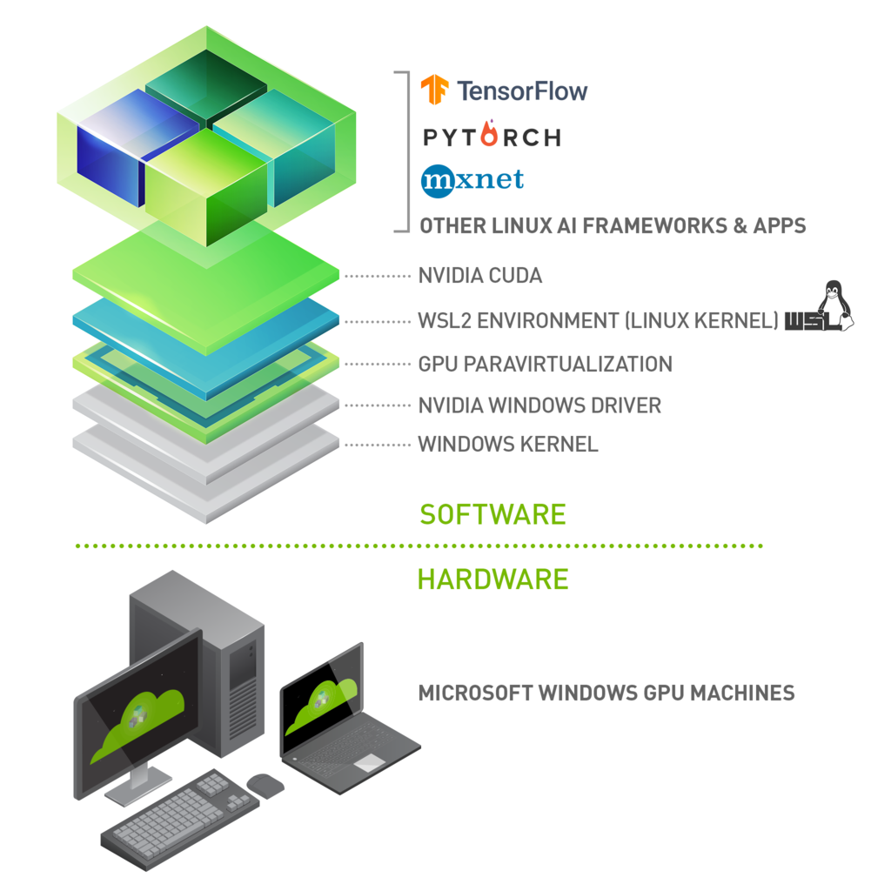

# Docker Installation

## Windows

### Window 10 pro & enterprise
- https://desktop.docker.com/win/stable/Docker%20Desktop%20Installer.exe
- 해결!

### Window 10 home
```
Installation failed: one prerequisite is not fulfilled
Docker Desktop requires Windows 10 Pro or Enterprise version 15063 to run.
```
- [ToolBox](https://github.com/jinmang2/bring_it_on/blob/master/TIL/Docker/Install_docker_on_win10.md)는 무리무리. 더이상 지원하지 않음
- WSL2로 설치
    - 이거 지금은 GPU 지원되려나?

## WSL2
- [Window 10 Docker 설치 완벽 가이드](https://www.lainyzine.com/ko/article/a-complete-guide-to-how-to-install-docker-desktop-on-windows-10/)

- Docker는 동명의 회사에서 개발하는 경량 가속화 기술인 linux container를 구현하는 Application.
- Docker를 사용하여 실행하고자 하는 process만 격리된 환경에서 실행하는 것이 가능
    - 느슨한 격리

### WSL2를 설치하고 활성화하기
- [WSL2 설치 및 사용법](https://www.lainyzine.com/ko/article/how-to-install-wsl2-and-use-linux-on-windows-10/)
- [Windows Terminal 설치 및 사용법](https://www.lainyzine.com/ko/article/how-to-install-windows-terminal-powershell-wsl2/)

1. `windows` + `s`에서 PC 정보 확인
    - 20H1, 20H2, 21H1 이상 버전이어야 함
2. MS Store에서 Windows Terminal 설치
3. DISM으로 WSL 관련 기능 활성화
    - `Microsoft-Windows-Subsystem-Linux` 기능 활성화

    ```
    $ dism.exe /online /enable-feature /featurename:Microsoft-Windows-Subsystem-Linux /all /norestart
    배포 이미지 서비스 및 관리 도구
    버전: 10.0.19041.844

    이미지 버전: 10.0.19043.1237

    기능을 사용하도록 설정하는 중
    [==========================100.0%==========================]
    작업을 완료했습니다.
    ```
    - dism 명령어로 `VirtualMachinePlatform` 기능 활성화

    ```
    $ dism.exe /online /enable-feature /featurename:VirtualMachinePlatform /all /norestart
    배포 이미지 서비스 및 관리 도구
    버전: 10.0.19041.844

    이미지 버전: 10.0.19043.1237

    기능을 사용하도록 설정하는 중
    [==========================100.0%==========================]
    작업을 완료했습니다.
    ```
4. 재부팅
5. WSL2 Linux 커널 업데이트
    - [Windows 10에 WSL 설치 | Microsoft Docs](https://docs.microsoft.com/ko-kr/windows/wsl/install#step-4---download-the-linux-kernel-update-package)
    - [x64 머신용 최신 WSL2 Linux 커널 업데이트 패키지](https://wslstorestorage.blob.core.windows.net/wslblob/wsl_update_x64.msi)
6. WSL Version 2로 setting
```
$ wsl --set-default-version 2
WSL 2와의 주요 차이점에 대한 자세한 내용은 https://aka.ms/wsl2를 참조하세요
작업을 완료했습니다.
```

7. MS Store에서 Linux 설치
8. Ubuntu 앱에서 사용자 이름과 패스워드 입력
```
Installing, this may take a few minutes...
Please create a default UNIX user account. The username does not need to match your Windows username.
For more information visit: https://aka.ms/wslusers
Enter new UNIX username: jinmang2
New password:
Retype new password:
passwd: password updated successfully
Installation successful!
To run a command as administrator (user "root"), use "sudo <command>".
See "man sudo_root" for details.

Welcome to Ubuntu 20.04.3 LTS (GNU/Linux 5.10.16.3-microsoft-standard-WSL2 x86_64)

 * Documentation:  https://help.ubuntu.com
 * Management:     https://landscape.canonical.com
 * Support:        https://ubuntu.com/advantage

  System information as of Sat Sep 25 06:08:12 KST 2021

  System load:  0.31               Processes:             8
  Usage of /:   0.5% of 250.98GB   Users logged in:       0
  Memory usage: 0%                 IPv4 address for eth0: 172.31.21.24
  Swap usage:   0%

1 update can be applied immediately.
To see these additional updates run: apt list --upgradable


The list of available updates is more than a week old.
To check for new updates run: sudo apt update


This message is shown once a day. To disable it please create the
/home/jinmang2/.hushlogin file.
```

9. 터미널(관리자 아니어도 ok)에서 wsl 명령어 사용 가능한지 체크
    - *는 default machine을 의미
```
$ wsl -l -v
  NAME      STATE           VERSION
* Ubuntu    Running         2
```

### WSL2 command
- https://docs.microsoft.com/en-us/windows/wsl/basic-commands

### WSL2로 Ubuntu 리눅스 맛보기
```
$ wsl cat /etc/lsb-release
DISTRIB_ID=Ubuntu
DISTRIB_RELEASE=20.04
DISTRIB_CODENAME=focal
DISTRIB_DESCRIPTION="Ubuntu 20.04.3 LTS"
```

```
$ wsl bash
To run a command as administrator (user "root"), use "sudo <command>".
See "man sudo_root" for details.

jinmang2@DESKTOP-029MHGN:/mnt/c/Users/jinma$
```

### Docker Desktop 다운로드 및 설치

1. Docker Desktop for Windows 다운로드
    - https://www.docker.com/products/docker-desktop
2. WSL2를 설치하기 전에는 X 되는지 확인하자
    - 된다...!! 개쩐다...
3. Docker Desktop 사용하면 된다
4. WSL2 설정 확인 + WSL 통합 설정
    - settings 들어가서 체크

### Docker 설치 확인 및 간단한 nginx 서버 예제 실행
```
$ wsl -l -v
  NAME                   STATE           VERSION
* Ubuntu                 Running         2
  docker-desktop-data    Running         2
  docker-desktop         Running         2
```

```
$ docker version
Client:
 Cloud integration: 1.0.17
 Version:           20.10.8
 API version:       1.41
 Go version:        go1.16.6
 Git commit:        3967b7d
 Built:             Fri Jul 30 19:58:50 2021
 OS/Arch:           windows/amd64
 Context:           default
 Experimental:      true

Server: Docker Engine - Community
 Engine:
  Version:          20.10.8
  API version:      1.41 (minimum version 1.12)
  Go version:       go1.16.6
  Git commit:       75249d8
  Built:            Fri Jul 30 19:52:10 2021
  OS/Arch:          linux/amd64
  Experimental:     false
 containerd:
  Version:          1.4.9
  GitCommit:        e25210fe30a0a703442421b0f60afac609f950a3
 runc:
  Version:          1.0.1
  GitCommit:        v1.0.1-0-g4144b63
 docker-init:
  Version:          0.19.0
  GitCommit:        de40ad0
```

```
$ docker ps
CONTAINER ID   IMAGE     COMMAND   CREATED   STATUS    PORTS     NAMES
```

- http://127.0.0.1:4567/ 에 접속해보자

```
$ docker run -p 4567:80 -d nginx:latest
Unable to find image 'nginx:latest' locally
latest: Pulling from library/nginx
a330b6cecb98: Pull complete
e0ad2c0621bc: Pull complete
9e56c3e0e6b7: Pull complete
09f31c94adc6: Pull complete
32b26e9cdb83: Pull complete
20ab512bbb07: Pull complete
Digest: sha256:853b221d3341add7aaadf5f81dd088ea943ab9c918766e295321294b035f3f3e
Status: Downloaded newer image for nginx:latest
b891f89f2a6e2a52c12e709e9874632151deadc2991a7972338c2f5a6b77b263

$ docker ps
CONTAINER ID   IMAGE          COMMAND                  CREATED              STATUS              PORTS                                   NAMES
b891f89f2a6e   nginx:latest   "/docker-entrypoint.…"   About a minute ago   Up About a minute   0.0.0.0:4567->80/tcp, :::4567->80/tcp   intelligent_wiles

$ docker rm -f b891f89f2a6e
```

### Docker에 대한 글 목록
- https://www.lainyzine.com/ko/subject/docker/


### CUDA on WSL
- https://www.docker.com/blog/wsl-2-gpu-support-is-here/
- https://better-tomorrow.tistory.com/entry/WSL-2에서-GPU-accelerated-machine-learning-trainingGPU-사용하기-2
-https://docs.nvidia.com/cuda/wsl-user-guide/index.html#installing-wsl2




## Linux
- 지금 서버가 없어서... 보류 (다음주 진행)


## References
- [Windows에서 WSL2를 이용하여 Docker 설치하기](https://seonghyeon-drew.tistory.com/75)
- [Windows 10 Docker 설치 완벽 가이드(Home 포함)](https://www.lainyzine.com/ko/article/a-complete-guide-to-how-to-install-docker-desktop-on-windows-10/)
- [윈도우 10 홈 버전에 도커(Docker) 설치(with WSL 2)](https://javaworld.co.kr/131)
- [Win10 Home 도커(Docker) 설치하기](https://blog.dalso.org/article/win10-home-docker-install)
