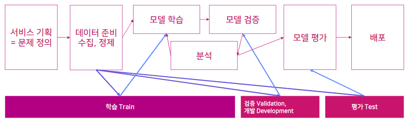
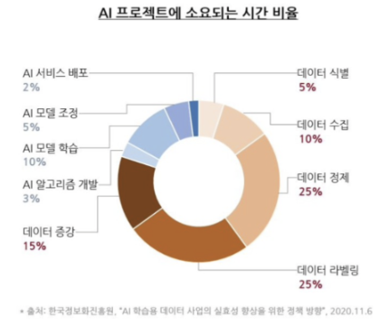
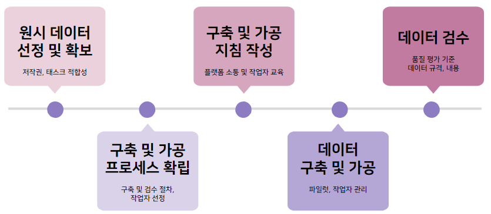
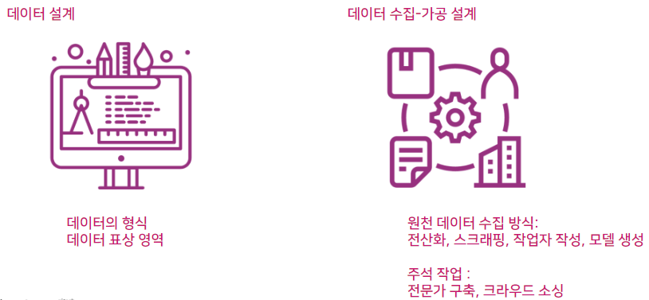
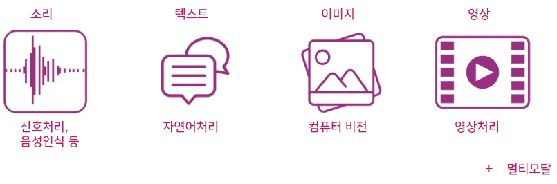
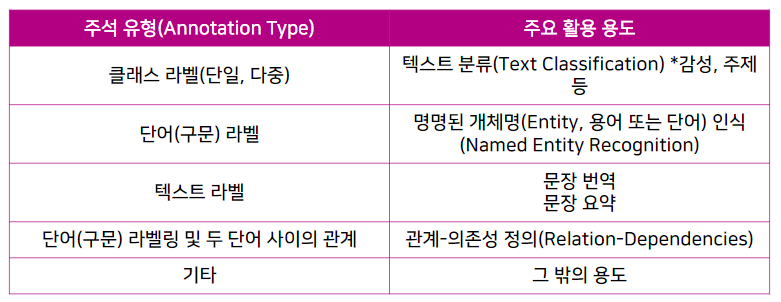
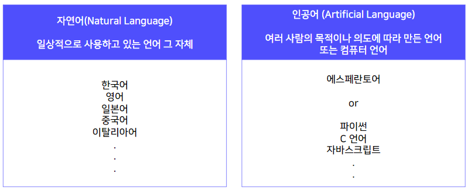
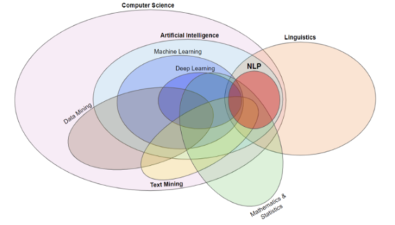

# 1강 데이터 제작의 A to Z

[back to super](https://github.com/jinmang2/boostcamp_ai_tech_2/tree/main/p-stage/data_annotation)

## 데이터 제작의 중요성

인공지능 서비스 개발 과정을 떠올려보자!

위 과정에서 데이터는 보통 세 종류로 준비를 해야한다.

위 도표에서 제일 많은 비중을 차지하는 것은? **데이터 관련 작업!**
- 전체 프로젝트에서 80% 정도 차지한다.

## 데이터 구축 과정과 설계 기초

머신러닝은 배운다! 하면 제일 추천하는 것은?
- 기존에 이미 정제된 데이터를 가지고 모델을 돌려보는 연습하기!

위 과정을 진행하다 실제로 서비스 혹은 상품을 만들고 싶다는 생각이 들면?
- 데이터를 만들게 될 것!

1. 원시 데이터 선정 및 확보
    - 저작권과 태스크 적합성을 신경써야함
2. 구축 및 가공 프로세스 확립
    - 구축 및 검수 절차
    - 작업자 선정
3. 구축 및 가공 지침 작성
    - 어떤 작업자를 선정할지?
    - 가이드라인 작성 후 교육
4. 데이터 구축 및 가공
    - 파일럿, 작업자 관리
5. 데이터 검수
    - 품질 평가 기준
    - 데이터 규격, 내용

### 데이터 설계
- 데이터 자체를 설계
    - 데이터의 Type 혹은 표상 영역
- 데이터를 수집, 가공하는 단계를 설계
    - 전산화, 스크래핑, 작업자 작성, 모델 생성
    - 전문가 구축 및 크라우드 소싱

### 데이터의 유형
- 강의에서는 Text data에 대해 얘기합니다!

### 데이터의 Input / Output 형식
다양한 파일 양식들이 있음!
- HTML, XML, CSV, TSV, TXT, JSON, JSONL
- JPG, Jpeg, PDF, png, ocr
- .wav, .mp3, .pcm, .script

설계 단계에서 어떤 i/o를 사용하고 어떤 스크립트로 변환시킬 것인지 설계하는 것이 중요

### 데이터(train/dev/test) 별 규모와 구분(split) 방식
- 규모 선정에 필요한 정보: 확보 가능한 raw data의 규모, 주석 작업 시간
- 구분 방식? 데이터별 비율과 기준 정하기
    - random vs specific condition
    - 데이터 특성 별로 다름
    - label되면 비율이 다른 경우가 많음
- 어떤 데이터는 unseen data를 위해 train에 없던 어휘를 추가하는 경우도 있음

### 데이터 주석 유형: 자연어처리

- https://aihub.or.kr/sample/intro/제2권._인공지능_학습용_데이터셋_구축_안내서.pdf

## 데이터 수집-가공 설계

### 원시 데이터 수집 방식
전산화, 스크래핑, 작업자 작성, 모델 생성
- 적합한 데이터란 무엇인지 기준 세우기
- 예를 들어, 발화를 입력하거나 모델이 생성한 샘플을 검증하는 작업

### 작업자 선정
주석 작업의 난이도와 구축 규모에 맞는 작업자 선정 및 작업 관리
- 전문가: 품질은 높지만 단가가 높다
- 크라우드 소싱: 직관적인 작업들에 좋음

### 구축 및 검수 설계
구축 작업의 난이도와 구축 규모, 태스크 특성에 맞는 구축 및 검수 방식 설계
- 예로, 전문가 or IAA
- 30,000 문장
- 100개 문장은 직접 작업을 해본 다음 작업자에게 할당해보는 것을 추천

**파일럿 작업**
- 설계 시 발견하지 못한 이슈 발굴 및 해결
- 가이드라인 보완 및 개정
- 작업자 선정

**본 구축**
- 작업 일정 관리
- 작업자 관리
- 중간 검수를 통한 데이터 품질 관리
- 1~3차로 나눠서 진행하는 것이 일반적

**전문가 평가 및 분석**
- 샘플링 검사
    - 튀는 경우 잘못된 작업일 확률이 큼
- 가이드라인 적합도 분석

**자동 평가 및 분석**
- 데이터 형식
- 레이블별 분포 파악
- 일괄 수정 사항 반영

## 자연어처리 데이터

### 자연어란?

### 자연어처리(NLP)란?

인공지능의 한 분야, 사람의 언어를 컴퓨터가 알아듣도록 처리하는 인터페이스 역할.

자연어 이해(NLU)와 자연어 생성(NLG)으로 구성

자연어 처리의 최종 목표?
- 컴퓨터가 사람의 언어를 이해하고 여러 가지 문제를 수행할 수 있도록 하는 것

### 자연어처리와 관련 연구 분야

- https://gritmind.blog/2020/10/09/nlp_overview/

**관점에 따른 NLP tasks**

### 데이터 분류 방식

**원천 데이터 장르(Domain)**
- 문어 (가사, 도서 등)
- 구어 (대화 등)
- 웹 (메신저 대화, 게시판 등)

**과제의 유형**
- 자연어 이해 (형태 분석, 구문 분석, 문장 유사도 평가 등)
- 자연어 생성 (기계 번역, 추상 요약 등)
- 혼합 (챗봇 등)

\+ 자연어처리 데이터를 만들 때는 복잡한 과제도 단순화하여 단계별로 구축
