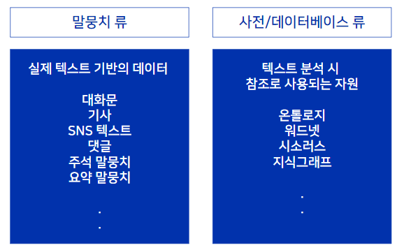
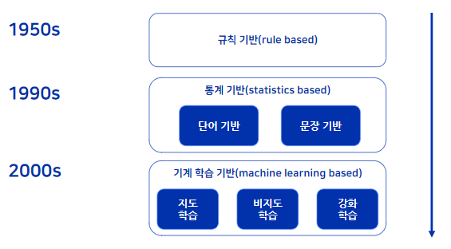
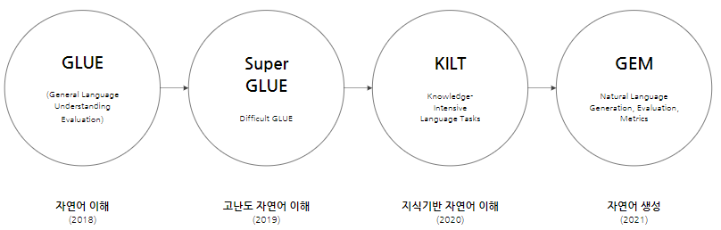
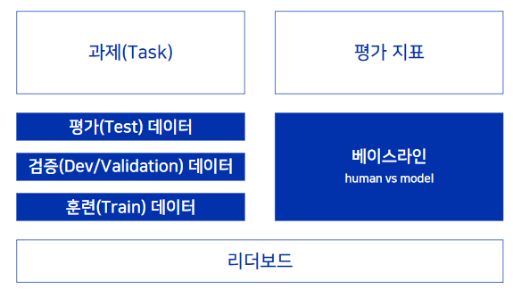
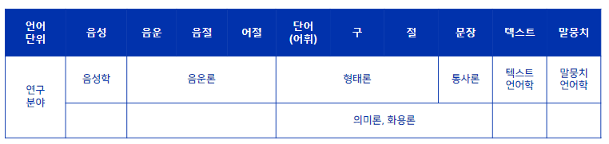
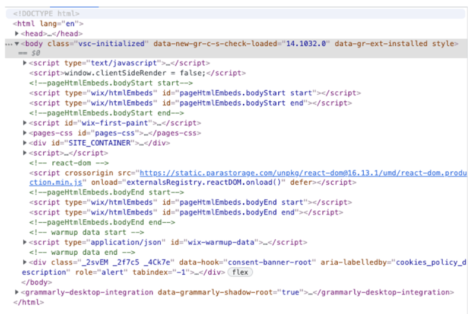
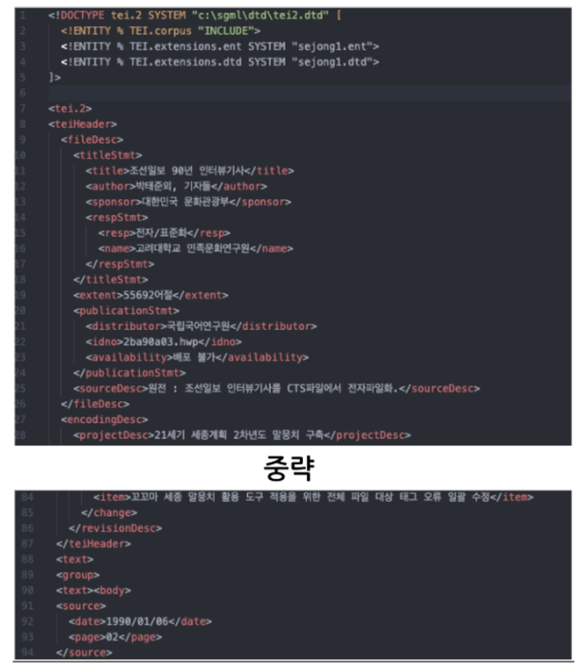

# 2장 자연어처리 데이터 기초

[back to super](https://github.com/jinmang2/boostcamp_ai_tech_2/tree/main/p-stage/data_annotation)

## 1. 인공지능 모델 개발을 위한 데이터

### 데이터의 종류

- 말뭉치 류
- 사전/데이터베이스 류
    - 온톨로지: 지식을 표상하기 위한 체계에 따라서 각각의 어휘들을 연결한 것
    - 워드넷/시소러스: 단어 간의 관계

### 인공지능 기술의 발전

과제(TASK)와 데이터는 그대로! 다만 기법이 달라졌음
- 추상 요약, 대화 시스템, 기계 번역, 형태 분석, 구문 분석, 개체명 인식, 관계 추출 등 새로 생긴 task도 많음
- 최대한 기존에 구축한 데이터도 사용하는 경우가 많음

### 언어 모델 평가를 위한 종합적인 벤치마크 등장
- KLUE도 이에 해당!
    - 직접 데이터를 구축 ㄷㄷ

### 벤치마크의 구성

## 2. 데이터 관련 용어 정리

### 텍스트 text
주석, 번역, 서문 및 부록 따위에 대한 본문이나 원문.

『언어』문장보다 더 큰 문법 단위. 문장이 모여서 이루어진 한 덩어리의 글을 이룸

### 말뭉치 corpus, plural corpora
말뭉치(이상섭, 1988): 어떤 기준으로든 한 덩어리로 볼 수 있는 말의 뭉치(한 저작자의 저작 전부, 특정 분야 저작 전체)
- text archive vs corpus(selected, structured, designed)
- corpus? corpora? 단수냐 복수냐의 차이

### 데이터 data
『정보·통신』컴퓨터가 처리할 수 있는 문자, 숫자, 소리, 그림 따위의 형태로 된 정보

말뭉치 데이터 corpus data: 말뭉치 자체

말뭉치의 데이터 data from corpus: 용례 색인 결과, 연어 추출 결과, 통계 분석 결과

### 주석
주석: tag, label, annotation
- 이순신/NP
- 짜증나/negative
- entailment

주석하다: tagging, labeling

#### 형태소 분석기 VS 형태소 주석기
영어로는 POS(Part of speech) tagger
- Segmentation
- Tagging
- 언어 사실을 분석하고자 하는 열망이 반영되어 **분석기** 라는 이름이 붙음!

### 언어학의 연구 분야

### 텍스트 데이터의 기본 단위
- English 말뭉치 계량 단위: 단어(space 단위) / 문장 or 발화
- Korean 말뭉치 계량 단위: 어절(space 단위) / 문장 or 발화

한국어의 "단어"?: 9품사로 분석됨
- 명사, 수사, 대명사, 동사, 형용사, 관형사, 부사, 조사, 감탄사
- 이 중 `조사`는 체언(명사, 수사, 대명사)와 붙어서 사용되기 때문에 띄어쓰기 단위와 단어의 단위가 일치하지 않음!
- 또한 `어미`는 하나의 품사로 인정되지 않으며 형태 단위이므로 독립된 단어가 아님

[조사와 어미의 차이](https://m.blog.naver.com/zzzz2000kr/221641945272)
- 조사는 체언 뒤에 붙고 어미는 용언이나 서술격조사 '이다'의 어간 뒤에 붙음
- [[소방국어] 『조사 vs. 어미 vs. 접사』 눈으로 빠르게 이해하기!](https://www.youtube.com/watch?v=MRqYd426yGQ)
- [국어문법 개념정리 61 조사 어미 접사의 차이 (형식형태소, 격조사, 접속조사, 보조사, 선어말어미, 종결어미, 연결어미, 전성어미, 접사)](https://www.youtube.com/watch?v=EL30NHn7t1g)
- 조사는 문장(자립 형식)과 결합하고 어미는 용언의 어간 뒤에 붙음

품사: 단어를 문법적 성질의 공통성에 따라 몇 갈래로 묶어 놓은 것

품사 분류의 기준: 의미(뜻, meaning), 기능(구실, function), 형식(꼴, form)

### 타입 type & 토큰 token
- 토큰화 tokenization > 표제어 추출 lemmatization > 품사 주석 POS(part of speech) tagging
- TTR: type/token ratio - 말뭉치 크기와 반비례
- 토큰: 언어를 다루는 가장 작은 기본 단위, 단어 word, 형태소 morpheme, 서브워드 subword
- 타입: 토큰의 대표 형태

**한국어 예시**, "이 사람은 내가 알던 사람이 아니다"
- 토큰화: 이 사람은 내 가 알 더 ㄴ 사람 이 아니 다
- 표제어 추출: 이, 사람, 나, 알다, 아니다
- 품사 주석: 이/MM 사람/NNG+은/JX 나/NP+가/JKS 알/VV+더/EP+ㄴ/ETM 사람/NNG+이/JKS 아니/VA+다/EF
- 토큰 수: 12개, 타입 수: 10개

**영어 예시**, "She is gone but she used to be mine"
- 토큰화: She is gone but she used to be mine
- 표제어 추출: She, be, go, but, use, to, mine
- 품사 추적: she_PRP is_VBZ gone_VBN but_IN she_PRP used_VBD to_TO be_VB mine_JJ
- 토큰 수: 9개, 타입 수: 8개

[What is the difference between word type and token](https://www.researchgate.net/post/What_is_the_difference_between_Word_Type_and_Token)
- The term "token" refers to the total number of words in a text, corpus etc.
- The term "type" refers to the number of distinct words in a text, corpus etc.

### N-gram
연속된 N개의 단위. 입력된 단위는 글자, 형태소, 단어, 어절 등으로 사용자가 지정할 수 있음

**예시**, "흔들리는 꽃들 속에서 네 샴푸향이 느껴진거야"

- 글자수 bi-gram
    흔+들, 들+리, 리+는, 는+꽃, 꽃+들 ...
- 형태소 bi-gram
    흔들리+는, 는+꽃, 꽃+들, 들+속 ...
- 어절 bi-gram
    흔들리는+꽃들, 꽃들+속에서, 속에서+네 ...

### 표상 representation
대표로 삼을 만큼 상징적인 것.

표상-하다「001」「동사」【...을】추상적이거나 아니한 것을 구체적인 형상으로 드러내어 나타내다

NLP에서 표현으로 번역하기도 하나 자연어를 컴퓨터가 이해할 수 있는 기법으로 표시한다는 차원에서 `표상`이 더 적합!

표시를 통해 재현 과정을 통해 나타내는 작업

PLM, Word2Vec 등등

## 3. 자연어처리 데이터 형식

### HTML
우리가 보는 웹페이지가 어떻게 구조화되어 있는지 브라우저로 하여금 알 수 있도록 하는 마크업 언어

보통 웹페이지를 크롤링한 자료는 HTML 형식으로 되어 있음

파싱 라이브러리(beautifulsoup 등)을 통해 태크를 제외한 순수한 텍스트만 추출하여 사용

### XML

사람과 기계가 동시에 읽기 편한 구조

다른 특수한 목적을 갖는 마크업 언어를 만드는데 사용하도록 권장하는 다목적 마크업 언어

<>안에 태그 정보를 부여

여는 태그 <*>와 닫는 태그 </\*>로 구성

**HTML과의 차이?
- HTML은 태크가 지정되어 있으나 XML은 사용자가 임의로 지정하여 사용할 수 있음

### JSON(JavaScript Object Notation)과 JSONL(JSON Lines)
속성-값 쌍(attribute-value pairs and array data types or any other serializable value) 또는 키-값 쌍으로 이루어진 데이터 오브젝트를 전달하기 위해 인간이 읽을 수 있는 텍스트를 사용하는 개방형 표준 포맷

기본 자료형: 수, 문자열, 불린, 배열, 객체, null

JSONL은 JSON을 한 줄(Line)으로 만든 것

### CSV와 TSV
- CSV(comma-separated values)
    - 몇 가지 필드를 쉼표(,)로 구분한 텍스트 데이터 및 텍스트 파일
- TSV(tab-separated values)
    - 몇 가지 필드를 탭(\t)으로 구분한 텍스트 데이터 및 텍스트 파일

## 4. 공개 데이터
- kaggle, dacon
- 국립국어원, aihub
- paperswithcode, nlpprogress
