# 3강 자연어처리 데이터 소개 1

[back to super](https://github.com/jinmang2/boostcamp_ai_tech_2/tree/main/p-stage/data_annotation)

## 1. 국내 언어 데이터의 구축 프로젝트

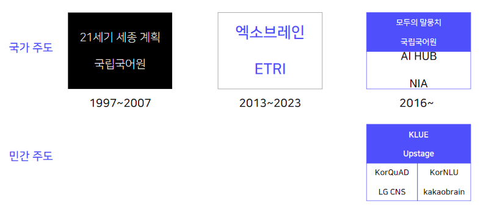

## 2. 21세기 세종 계획과 모두의 말뭉치

### 21세기 세종 계획
'21세기 세종계획'은 1997년에 그 계획이 수립되었고 이듬해인 1998년부터 2007년까지 10년 동안 시행된 한국의 국어 정보화 중장기 발전 계획(홍윤표, 2009) 총 2억 어절의 자료 구축, 공개 XML 형식, 언어정보나눔터 누리집을 통해 배포하다 중단 후 DVD로만 배포

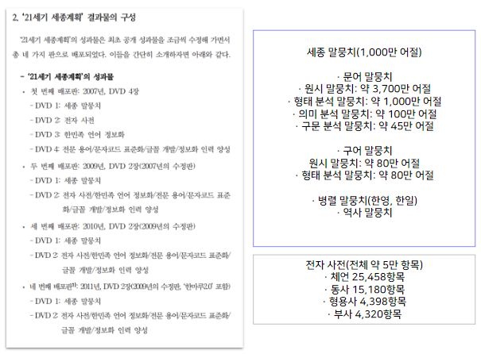

- 세종 현대 문서 윈시
    - `<head>.*</head>`: 제목
    - `
`: paragraph, 단락, 절

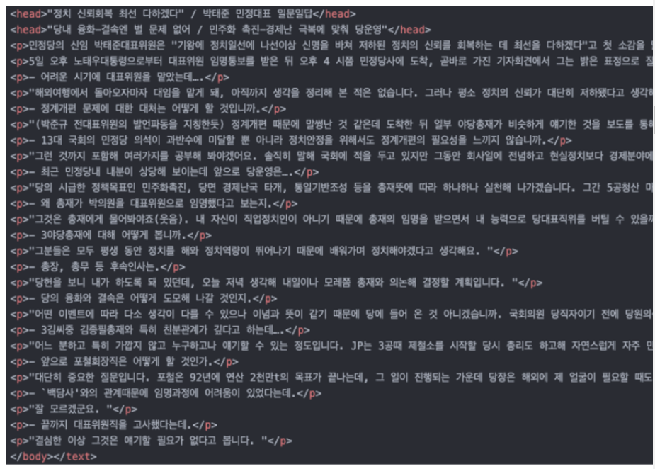

- 세종 현대 구어 원시
    - `<u>`: utterance 발화
    - `<who>` 발화자
    - `s`: 억양 단위 표시, n을 이용하여 일련 번호를 붙임
    - `desc`: description
    - 구어는 사람이 듣고 이를 전사하여 만들어진 데이터임
    - 때문에 양식이 특이함

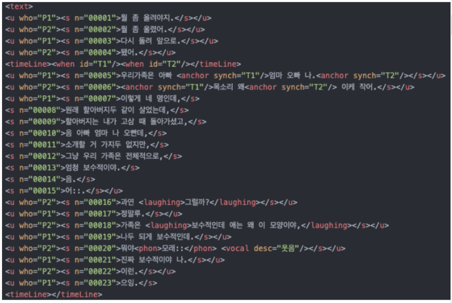

- 세종 현대 문어 형태 분석
    - 한국어 형태소 분석 방식의 원류

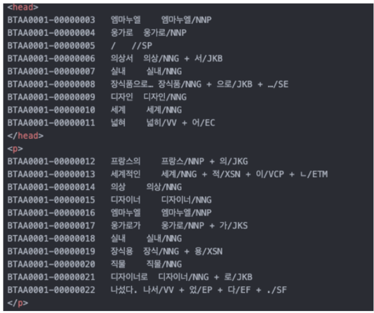

**세종 형태 분석 태그표**

- Mecab, Khaiii, Kkma, Hannanum, Komoran 등에서 채택
- [konlpy tag set](https://docs.google.com/spreadsheets/d/1OGAjUvalBuX-oZvZ_-9tEfYD2gQe7hTGsgUpiiBSXI8/edit#gid=0)

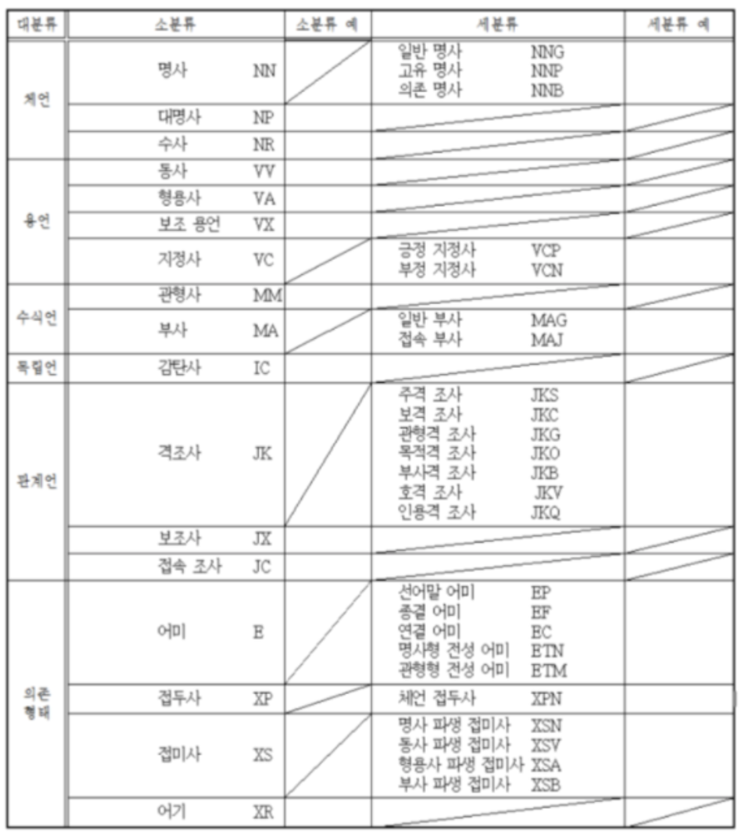

- 어미와 접사는 품사가 아님!
- 조사는 문장에 기반하여 붙는 친구임
- 체언, 용언, 수식언, 독립언, 관계연은 품사임!
- 관계언도 사실은 앞말에 붙여 씀(??)
- 체언류: `N*`, 용언류: `V*`
    - text mining! `NN*`?
    - 주제어는 `NNG`, `NNP`만 필요!
- 동사와 형용사는 어간형을 추출하기에 기본형으로 복원해주는 lemmatization을 해줘야 함
- Mecab은 일본어 형태소 분석기를 가져와서 쓰는 것

**세종 현대 문어 구문 분석**

- Penn TreeBank의 구구조 분석 방식을 따름
- 추후 모두의 말뭉치에서는 의존구문 분석 방식으로 변경
- 3분지에서 2분지로 변화했다고 함

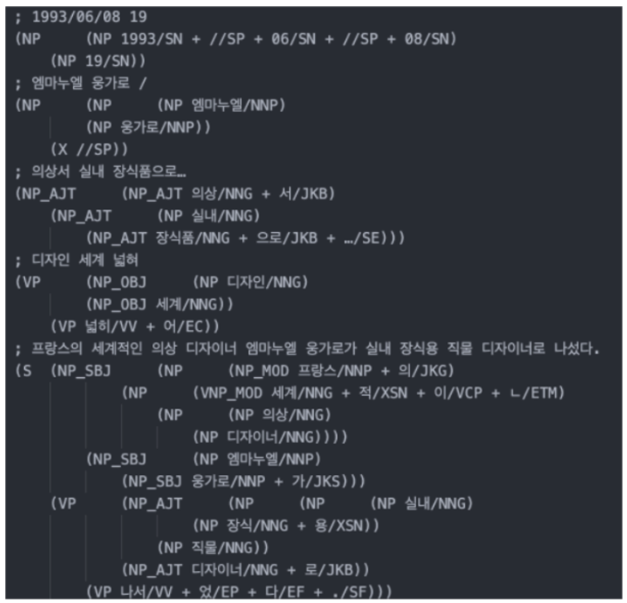

### 모두의 말뭉치
인공지능의 한국어 처리 능력 향상에 필수적인 한국어 학습 자료 공개 플랫폼. '21세기 세종계획'에 비해 일상 대화, 메신저, 웹 문서 등 구어체 자료의 비중을 높임. 다층위 주석 말뭉치 포함(형태, 구문, 어휘 의미, 의미역, 개체명, 상호 참조 등)

JSON 형식, 모두의 말뭉치 누리집(https://corpus.korean.go.kr/)에서 배포

- 원시 말뭉치와 주석 말뭉치로 구성

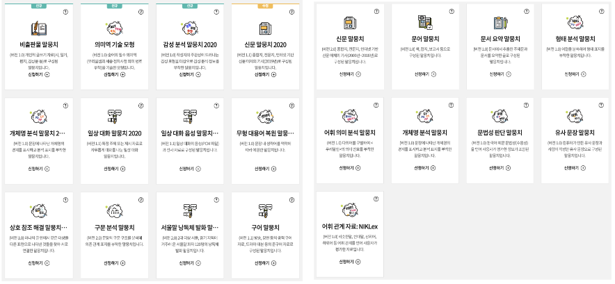

## 3. 엑소브레인

ExoBrain: 내 몸 바깥에 있는 인공 두뇌

엑소브레인은 인간의 지적 노동을 보조할 수 있는 언어처리 분야의 AI 기술개발을 위해, 전문직 종사자(예: 금융, 법률, 또는 특허 등)의 조사·분석 등의 지식노동을 보조 가능한
1. 언어 문법 분석을 넘어선 언어의 의미 추론 기술 개발
2. 전문분야 원인, 절차, 상관관계 등 고차원 지식 학습 및 축적 기술 개발
3. 전문분야 대상 인간과 기계의 연속적인 문답을 통한 심층질의응답 기술 개발

및 국내외 표준화를 통해 힉심 IRP을 확보하는 우리나라 대표 인공지능 국가 R&D 프로젝트

21세기 세종 계획에서 개발된 주석 말뭉치의 체계를 확장하고 추가하여 TTA 표준안 마련 (형태, 구문, 개체명)

http://exobrain.kr/pages/ko/business/index.jsp

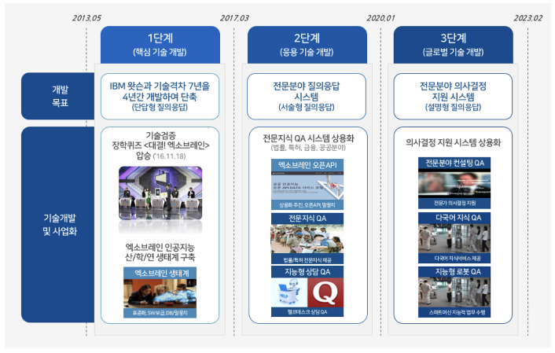

### ETRI의 오픈 AI API, DATA 서비스 누리딥에서 데이터셋 배포

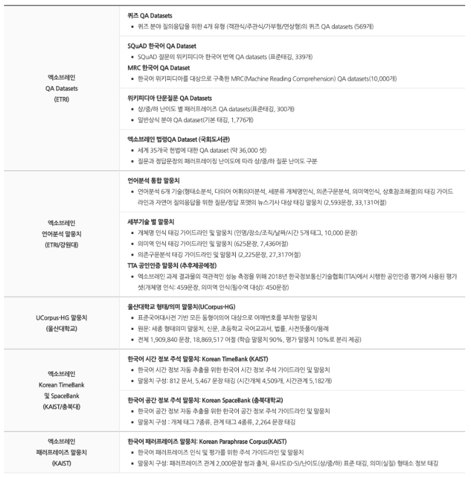

- NER? PLO + time, price 등으로 구축
- 이상하게 한국어 개체명 과제는 100여개 이상의 개체명으로 분석
- 왜? QA를 위한 개체명이 백과사전처럼 다양하게 구분되어야 성공! (장학퀴즈 이겨먹으려고)
- KLUE는 PLO + 기타로만 주석

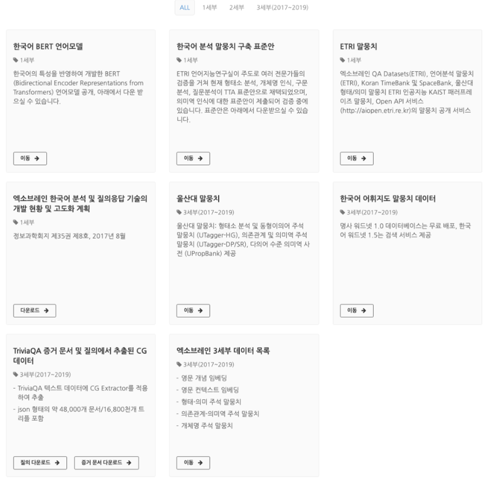

## 4. AI 허브

AI 기술 및 제품·서비스 개발에 필요한 AI 인프라(AI 데이터, AI SW API, 컴퓨팅 자원)를 지원하는 누구나 활용하고 참여하는 AI 통합 플랫폼

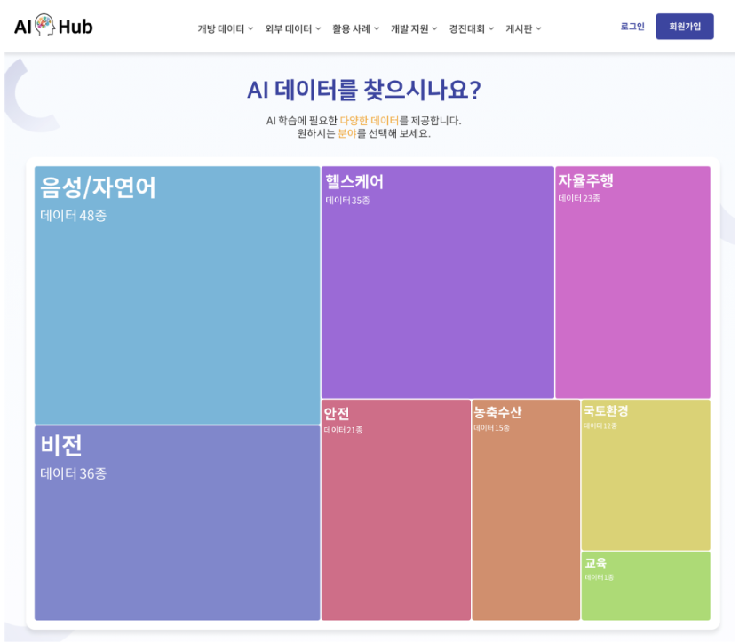

데이터별로 데이터 설명서, 구축활용 가이드 제공

JSON, 엑셀 등 다양한 형식의 데이터 제공

실제 산업계 수요 조사를 반영하여 다양한 TASK를 수행할 수 있는 자원 구축

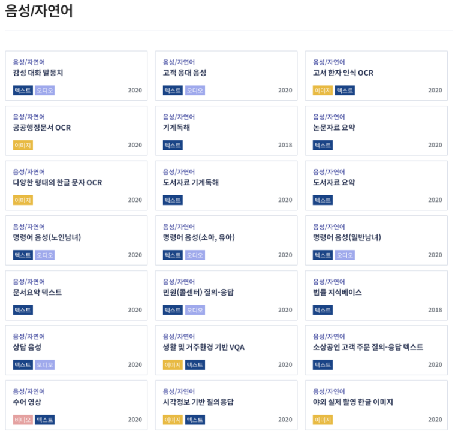

## 5. 민간 주도 데이터셋

### KLUE

한국어 이해 능력 평가를 위한 벤치마크
- 뉴스 헤드라인 분류
- 문장 유사도 비교
- 자연어 추론
- 개체명 인식
- 관계 추출
- 형태소 및 의존 구문 분석
- 기계 독해 이해
- 대화 상태 추적

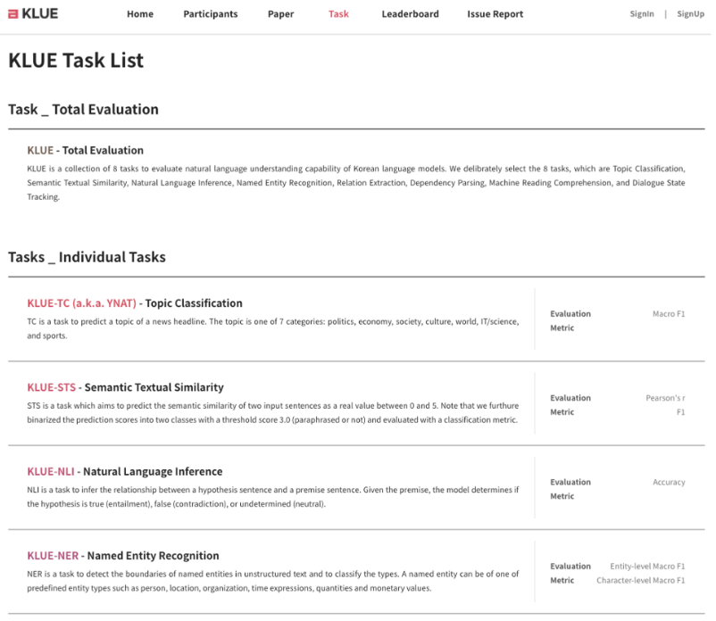

### KorQuAD 1.0 & 2.0
KorQuAD 2.0은 KorQuAD 1.0에서 질문답변 20,000+ 쌍을 포함하여 총 100,000+ 쌍으로 구성된 한국어 기계 독해(Machine Reading Comprehension) 데이터셋

스탠포드 대학교에서 공개한 SQuAD를 벤치마킹!

CC BY-ND 2.0 KR

https://korquad.github.io/

### KorNLU

영어로 된 자연어 추론(NLI, Natural language inference) 및 문장 의미 유사도(STS, semantic textual similarity) 데이터셋을 기계 번역하여 공개

CCBY-SA4.0

https://github.com/kakaobrain/KorNLUDatasets

## Further Reading
- [Open Korean Corpora](https://aclanthology.org/2020.nlposs-1.12/)
- [A Survey on Awesome Korean NLP Datasets](https://www.preprints.org/manuscript/202110.0247/v1)
