# 5강 원시 데이터의 수집과 가공

[back to super](https://github.com/jinmang2/boostcamp_ai_tech_2/tree/main/p-stage/data_annotation)

## 1. 원시 데이터의 정의

### 원시 데이터란?
과제를 해결하기 위해 특정 도메인, 장르, 주제 등에 대하여 조건에 맞춰 수집하였으나, 주석 단계를 거치지 않은 상태의 데이터

원하는 형태로 가공하기 이전의 데이터로 목적에 맞는 전처리 과정을 거쳐 가공이 되어야 활용할 수 있음

**원시 텍스트 수집 시 검토 사항**

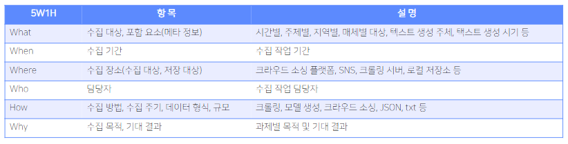

- 수집 대상이 10대라면 60대의 발화는 중요하지 않을 것
- 짧게 혹은 긴 기간 동안 모아야할 수 있음
- 데이터가 어디에 있는가 혹은 어디에 저장할 것인가?
- 데이터 수집 담당자 선정!
    - 수집, 가공, 검수의 전체 과정을 파악 및 관리
- 어떻게 수집할 것인가, 어떤 주기로? 그리고 데이터의 형식은? 규모는?

### 원시 데이터 수집 방식에 따른 분류
- 웹 스크래핑
- 직접 사람이 만들어서 입력
- 모델을 활용해서 자연어를 생성
- 모두의 말뭉치, AI Hub, Kaggle 등 기존의 데이터셋에서 확장시켜 활용하는 방안
    - 기존에 있는 데이터도 내 목적에 안맞는 경우가 많음

**수집 절차 예시**
- 크라우드 워커를 모집
- 워커 모집 단계에서 개인정보 수집 및 이용 동의와 저작권 활용 계약을 체결
    - 굉장히 중요함
- 대화 데이터의 기준, 대화 진행 방법, 데이터 제출 방법 등의 교육을 진행
- 전처리, 메타 데이터 일괄 처리 어떻게 할지도 중요함
- opinion, column -> 기고문
- 법률: 만연체

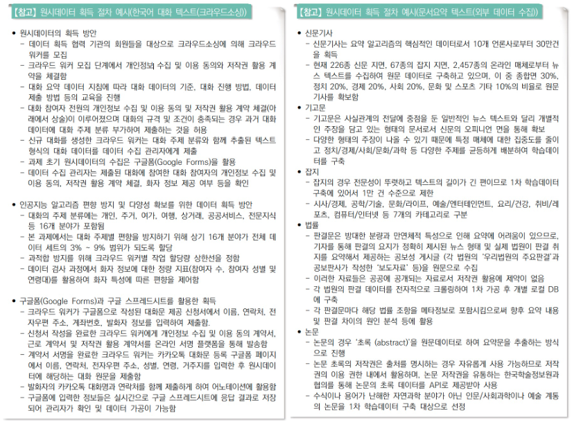

### 원시 텍스트 데이터 사용역(장르)에 따른 분류

**문어**: 신문기사, 소설, 수필, 논문, 잡지, 보고서 등

**구어(음성 파일을 텍스트로 전사)**: 일상 대화, 연설, 강연
- 준구어: 방송 대본, 영화 대본 등
- 감투어

**웹**: SNS, 커뮤니티 게시판, 메신저 대화, 블로그, 이메일 등
- 공간에 따라 문어/구어의 특징이 달라진다는 특징이 있음

### 원시 텍스트 데이터의 메타 정보

텍스트 외에 텍스트를 설명하는 정보.

텍스트 ID, 이름, 저장 정보, 매체 정보, 주석 정보, 출처, 형태/구문

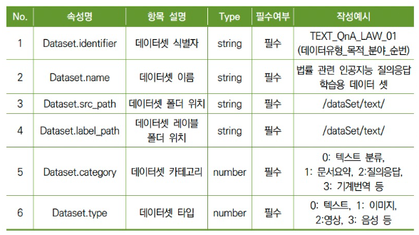
- Data Scheme
- 위는 NIA의 텍스트 데이터 메타 정보 예시

### 원시 데이터 수집 시 고려 사항

**획득 가능성**
- 획득이 불가능하거나 통제 불가능한 주기를 가지고 있다면 원시 데이터의 정책에 의존하게 되므로 바람직하지 않음
- 획득이 용이하더라도 서비스 활용 측면에서 데이터를 활용하기 위해 가공 처리에 많은 비용이 드는 데이터는 선정하기 어려움
- 직접 산출이 어려운 경우 획득 난이도 측면에서 트래픽량과 저장 처리 장치의 용량 등을 고려 대상, 획득 대상의 대안 필요

**데이터 균형과 다양성**
- 개체의 다양성, 목적 및 상황의 다양성, 시간별, 종류별, 사람별, 지역별 다양성

**신뢰성**
- 데이터의 품질이 신뢰할 수 있는지 검토
- 대화의 원문을 수집해 봤더니 조금 이상하더라!
    - e.g., 심심이로 대화를 많이 만들어서 제출

**법 제도 준수**
- 개인정보 및 사생활 보호가 필요한 항목 획득 시, 개인정보 보호법 등에 따라 적절한 법적, 기술적 절차를 거친 데이터를 활용하며
- 그렇지 않은 데이터는 정제 과정에서 처리될 수 있도록 함

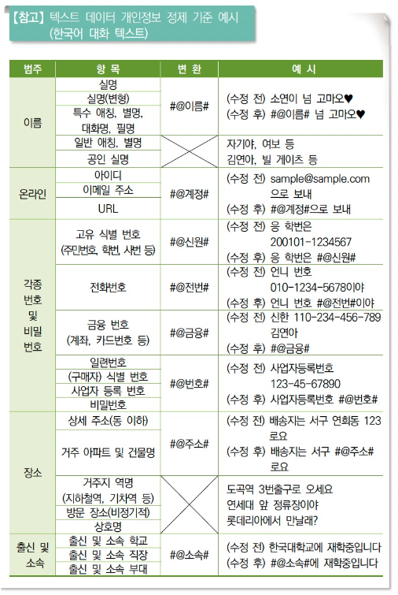

## 2. 원시 데이터 수집 시 고려 사항

### 저작권
원시 데이터에 주석 작업을 하는 경우, 결과물은 2차적 저작물로 간주되며 라이센스는 원시 데이터를 따름
- http://ccl.cckorea.org/

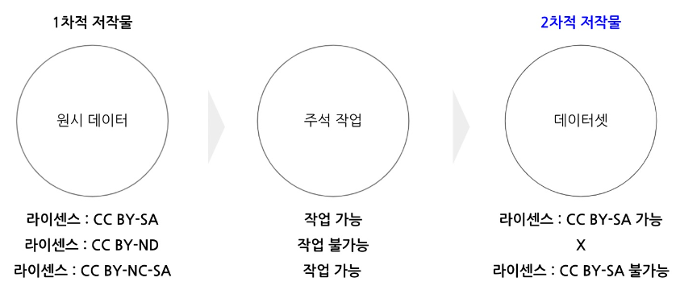

### 데이터 윤리

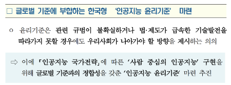

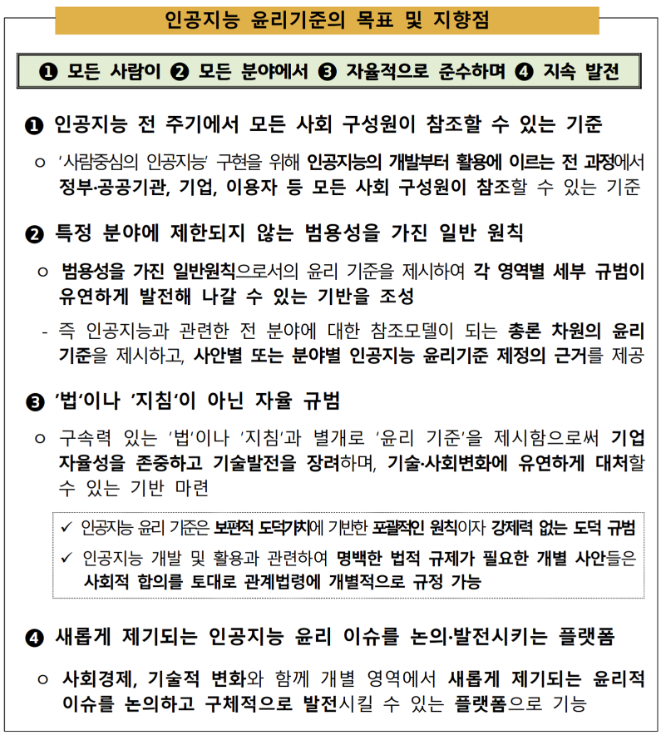

## 3. 원시 데이터 전처리

### 전처리 단계

**추출 대상 확인**
- 메타 정보
- 주석 대상 텍스트
    - 주석 대상 표현 포함 텍스트 여부
    - 텍스트 길이 범위

**불필요 요소 제거 및 변환**
- 개인정보 비식별화
- 비윤리적 표현 정제

**정제 대상 확인**
- 숫자, 외국어, 기호, 이모지
- 띄어쓰기, 맞춤법, 오탈자
- 개인 정보
- 문장 분리

### 말뭉치 정제 기준 예시

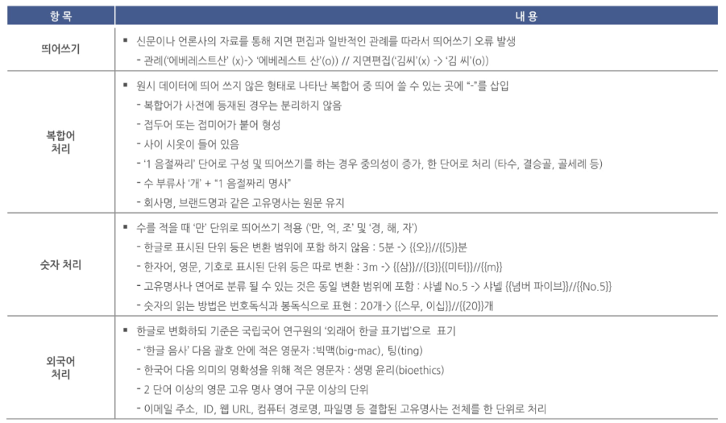

- 복합어 처리?
- 신문은 지면에 제한이 있음!
    - 에베레스트 산, 김 씨
    - 위를 붙여씀

## 4. 원시 데이터의 가공 - 주석 도구

### 주석(annotation, labeling)
- 원시 데이터를 가공하여 원하는 정보를 부착하는 작업
- 텍스트를 단순히 분류하여(긍부정, 주제) 해당 분류를 텍스트에 삽입하거나
- 개체명, 관계 정보 등의 정보를 문자열에 직접 주석할 수 있음
- 주석 시에는 다양한 도구(tool)가 사용됨

### 주석 도구의 종류

**구글 스프레드 시트**
- 여러 명의 작업자 동시 작업 가능
- 작업과 동시에 저장
- 데이터 관리 용이
- csv 형식으로 export 가능

**구글 폼**
- 단순 분류 문제 등 복잡한 주석 도구가 필요하지 않은 경우에 적합
- 결과를 구글 스프레드 시트로 확인할 수 있음
- 작업자 모집에도 활용

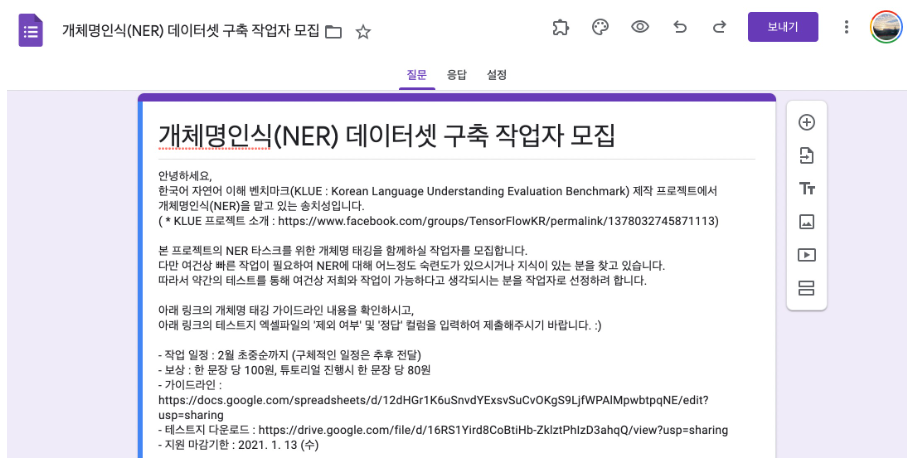

**Brat**
- 오픈 소스 데이터 주석기
- 오래 전 발표 됨

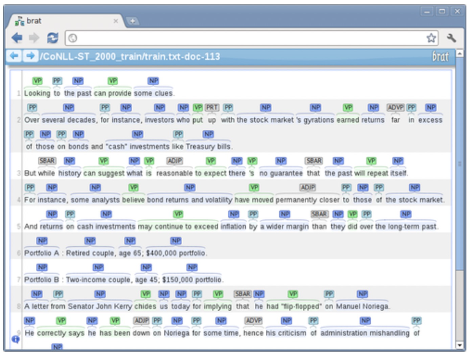

**Doccano**
- NER, 감정분석, 기계 번역 등
- 주석 기능 제공
- 서버 또는 로컬에 설치하여 사용

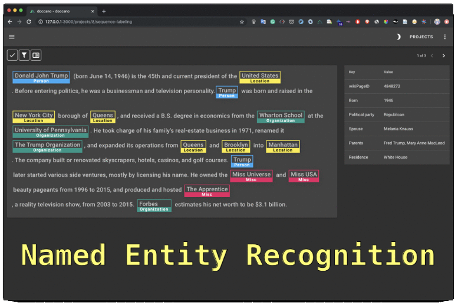

**Tagtog**
- 웹 기반 주석 도구
- 다양한 형식 지원
- 무료 이용시 데이터 공개

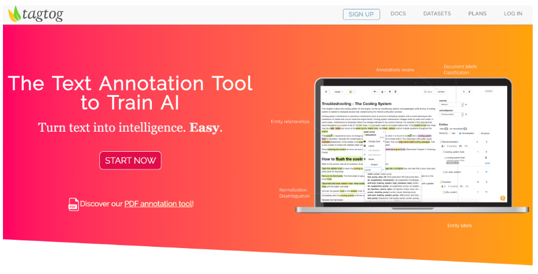

### 참고 문헌

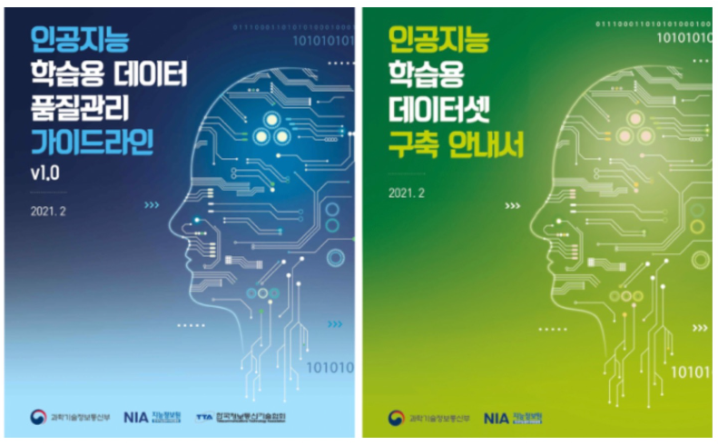

## Further Reading
- [나만의 웹 크롤러 만들기 시리즈](https://beomi.github.io/gb-crawling/)
- [다양한 분야의 개인정보보호 가이드라인](https://www.privacy.go.kr/inf/gdl/selectBoardList.do)
- [AI HUB 데이터 구축 및 활용 가이드라인](https://aihub.or.kr/intro/guide)
