# 6장 데이터 구축 작업 설계

[back to super](https://github.com/jinmang2/boostcamp_ai_tech_2/tree/main/p-stage/data_annotation)

## 1. 데이터 구축 프로세스

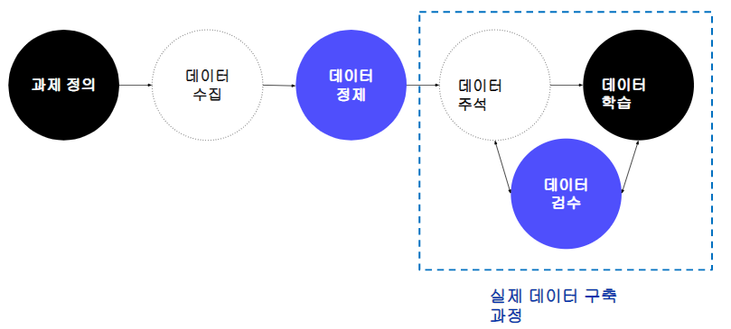

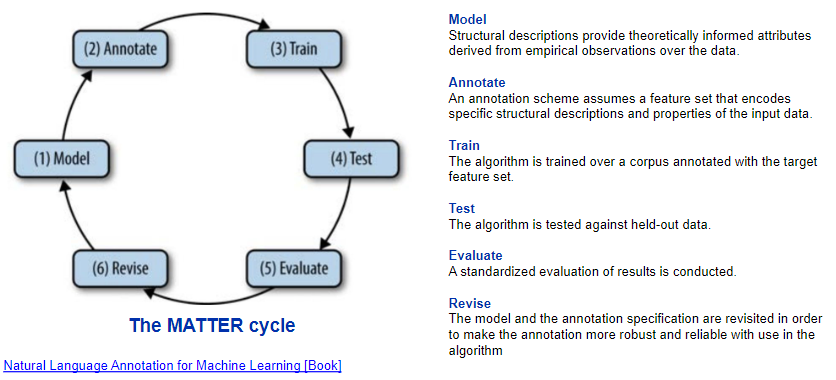

https://www.oreilly.com/library/view/natural-language-annotation/9781449332693/

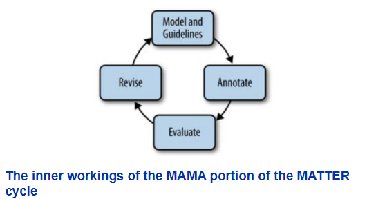

### 예시

### 데이터 구축 프로세스 정의 예시

[『인공지능 (AI) 학습용 데이터 품질관리 가이드라인 (v.1.0)』](http://knconsulting.co.kr/knowledge/?q=YToyOntzOjQ6InBhZ2UiO2k6MTtzOjEyOiJrZXl3b3JkX3R5cGUiO3M6MzoiYWxsIjt9&bmode=view&idx=6009133&t=board&category=bgG58851V4)

[『인공지능 (AI) 학습용 데이터셋 구축 안내서』](http://knconsulting.co.kr/knowledge/?q=YToyOntzOjQ6InBhZ2UiO2k6MTtzOjEyOiJrZXl3b3JkX3R5cGUiO3M6MzoiYWxsIjt9&bmode=view&idx=6009133&t=board&category=bgG58851V4)

- 도표로 정리
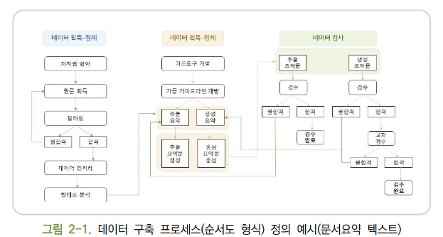

- 줄글로 정리
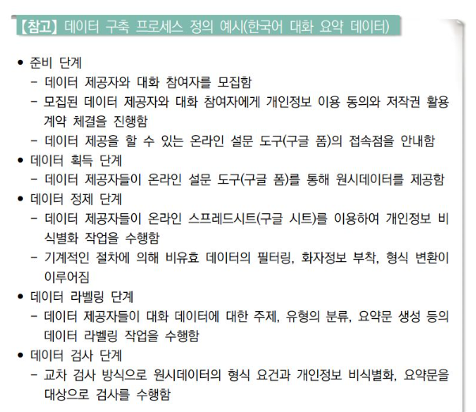

- 표로 정리
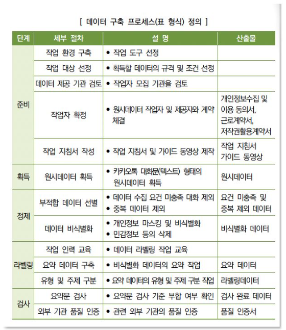

## 2. 데이터 주석

### 데이터 주석 유형 1 분류
문장 또는 텍스트에 대한 분류 레이블 주석하는 유형
- 감성 분석, 주제 분류, 자연어 추론 등
- 구축 난이도는 일반적으로 낮은 편
- https://opendatahub.io/news/2019-09-04/sentiment-analysis-blog.html

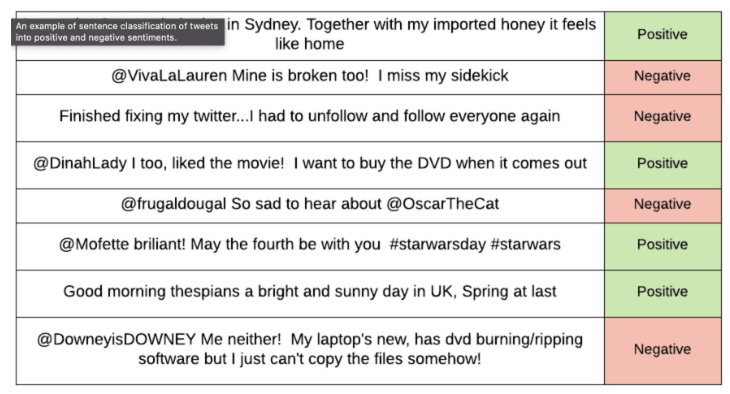

### 데이터 주석 유형 2 특정 범위(span) 주석

#### NER

- 텍스트의 일부를 선택하여 특정한 레이블을 주석하는 유형
- 개체명, 형태 분석 등
- https://medium.com/@b.terryjack/nlp-pretrained-named-entity-recognition-7caa5cd28d7b

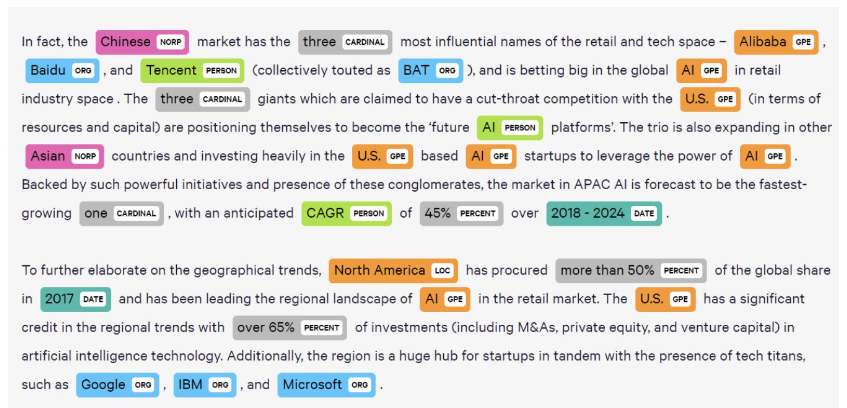

#### 형태 분석

- 텍스트의 일부를 선택하여 특정한 레이블을 주석하는 유형
- 구축 난이도는 과제에 따라 다름
- http://habit-project.eu/wiki/CorpusAnnotationTool

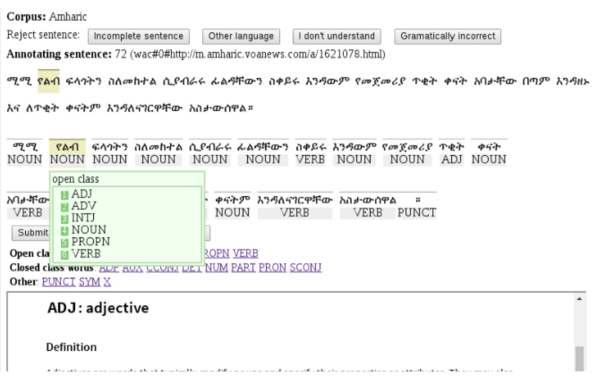

### 데이터 주석 유형 3 대상 간 관계 주석
- 대상 간 관계를 주석하는 유형
- 관계 추출, 개체명 연결, 구문 분석 등
- 두 단계에 걸쳐 구축해야 하므로 구축 난이도는 높은 편

#### 개체명 연결
- https://brat.nlplab.org/introduction.html

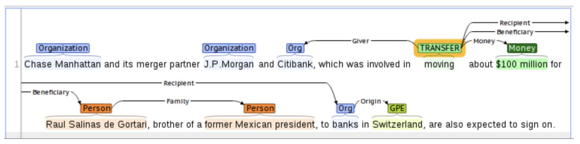

#### 구문 분석
- https://aclanthology.org/W17-7604.pdf

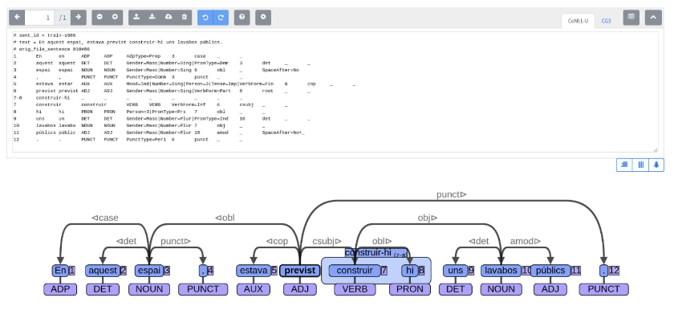

### 데이터 주석 유형 4 텍스트 생성
- 주어진 텍스트에 대한 텍스트 또는 발화를 생성하는 유형
- 대화문, 번역, 요약 등

#### 번역
- https://www.researchgate.net/figure/The-HUME-annotation-tool-The-top-orange-box-contains-the-translation-The-source_fig2_312250884

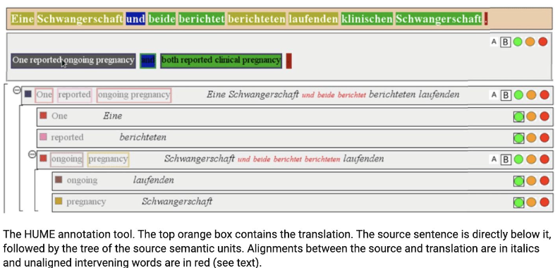

### 데이터 주석 유형 5 그 외 - 복합 유형
- 앞선 유형의 데이터 구축 방식을 복합적으로 사용하여 다양한 정보를 주석하는 유형
- 질의 응답, 슬롯 필링 대화 등
- https://medium.com/uaslava/top-nlp-tools-for-chatbot-creators-38f5ecdc3655

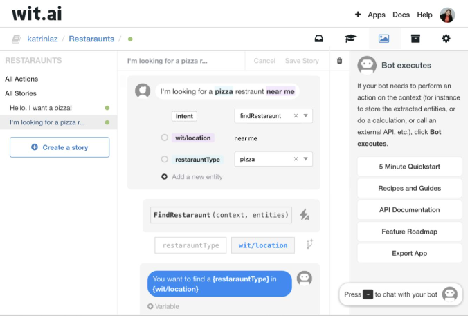

## 3. 데이터 검수

- **가이드라인 정합**: 각 주석 절차 및 주석 내용이 가이드라인에 부합하는지 확인
    - 주석의 체계, 체계 별 정의가 가이드라인에 포함되어 있어야 한다.
- **데이터 형식**: 메타 정보, 레이블, 텍스트 내용 등의 형식이 맞는지 확인
- **통계 정보**: 메타 정보 및 레이블의 분포, 문장 길이, 단위 별 규모 확인
- **모델 성능 확인**: 모델 학습을 통해 결과값 확인

### 오류 원인 분석
- **구축 방법 측면의 오류 원인**: 모델·데이터의 대상 선정, 수집, 정제, 라벨링 등의 통제 미흡으로 인하여 구축 절차, 구조, 학습모델 측면의 다양한 오류 데이터 생성
- **가이드라인 측면의 오류 원인**: 구축 가이드라인의 불완전성, 미준수로 인하여 작업자간 서로 상이하게 작업을 수행하거나 데이터간 일관성 위배
- **데이터셋 측면의 오류 원인**: 데이터셋 설계의 부족, 구문정확성 위배, 데이터 구축 중복 등
- **학습모델 측면의 오류 원인**: 학습모델에 적합한 데이터 구축이 수행되지 않았거나, 잘못된 학습모델 선정으로 데이터 구축 방향이 잘못된 경우

### 데이터 검수 유형
- 표본 추출:
- 전수 검사:

### 데이터 평가
- 작업자 간 일치도 (IAA)
    - Inter-Annotator Agreement
    - Cohen's 𝜅
    - Fleiss's 𝜅
- 모델 평가 (Evaluation)
    - 정확도 (Accuracy)
    - 정밀도 (Precision)
    - 재현율 (Recall)
    - F1

## 4. 데이터 구축 프로세스 설계 시 유의 사항
- 데이터 구축 기간은 넉넉하게 설정할 것
- 검수에 충분한 시간을 확보할 것
- 검수 내용을 어느 시점에 어떻게 반영할 것인가 하는 계획을 세울 것
- 품질 미달인 경우의 보완책을 마련할 것
- 작업 난이도에 따라 참여 인력을 산정하고, 참여 인력 모집 및 관리를 어떻게 할 것인지 고민할 것
- 각 단계별 작업의 주체를 고려할 것
- 각 단계별 검수 유형을 지정해둘 것
- 외부 인력 및 자원을 활용하는 경우 비용 산정을 위해 기본 단가 선정 기준을 잘 세울 것

## Further Reading
- [Natural language annotation](https://doc.lagout.org/science/Artificial%20Intelligence/Machine%20learning/Natural%20Language%20Annotation%20for%20Machine%20Learning_%20A%20Guide%20to%20Corpus-...%20%5BPustejovsky%20%26%20Stubbs%202012-11-04%5D.pdf)
- [Natural language annotation - Short version ](https://www.cs.brandeis.edu/~cs140b/CS140b_slides/NLAML_CS140b-2015.pdf)
- [Fleiss' Kappa](https://hrcak.srce.hr/89395)
- [Krippendorff's Alpha](https://repository.upenn.edu/cgi/viewcontent.cgi?article=1043&context=asc_papers)
