# 7장 데이터 구축 가이드라인 작성 기초

[back to super](https://github.com/jinmang2/boostcamp_ai_tech_2/tree/main/p-stage/data_annotation)

## 1. 가이드라인의 유형

- 목적에 따라
    - 수집을 위한 가이드라인
    - 주석을 위한 가이드라인
    - 검수를 위한 가이드라인
- 제시 방식
    - 문서형
    - 화면 노출형 튜토리얼형

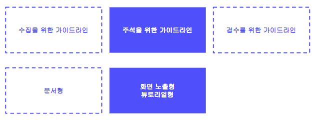

### 문서형 가이드라인 예시

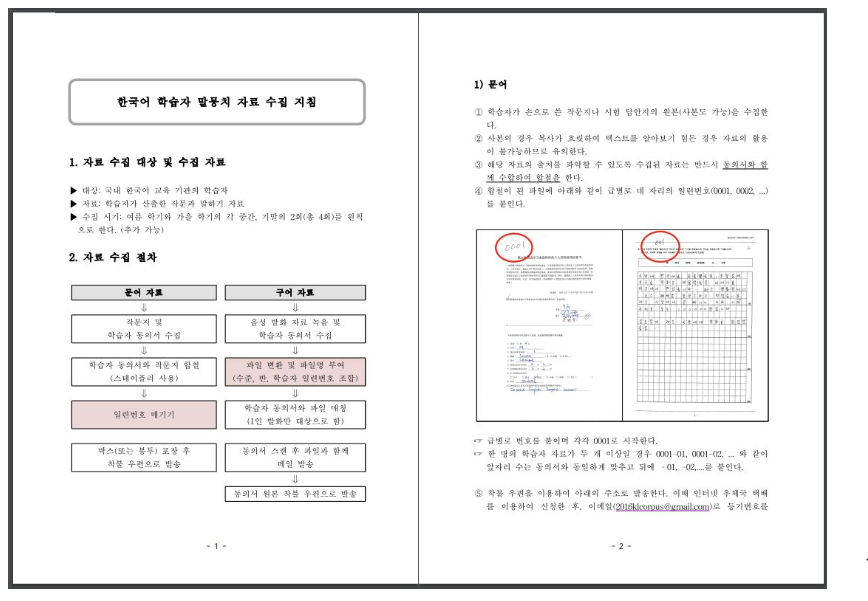

### 튜토리얼 가이드라인 예시
- https://www.cashmission.com/
- 미션 공통 튜토리얼은 해당 유형의 미션의 첫 번째 튜토리얼로 등장하며, '(기초)' 표시가 함께 적혀 있음

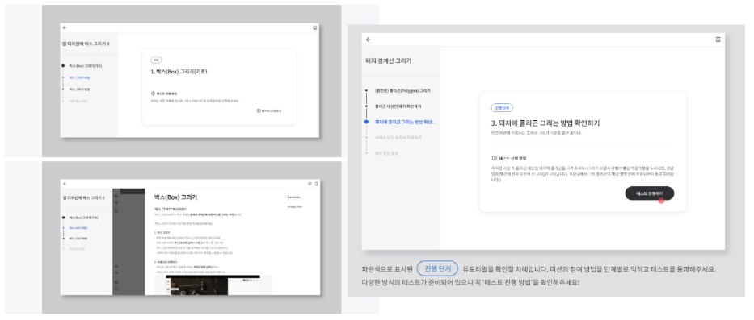

## 2. 가이드라인의 구성 요소

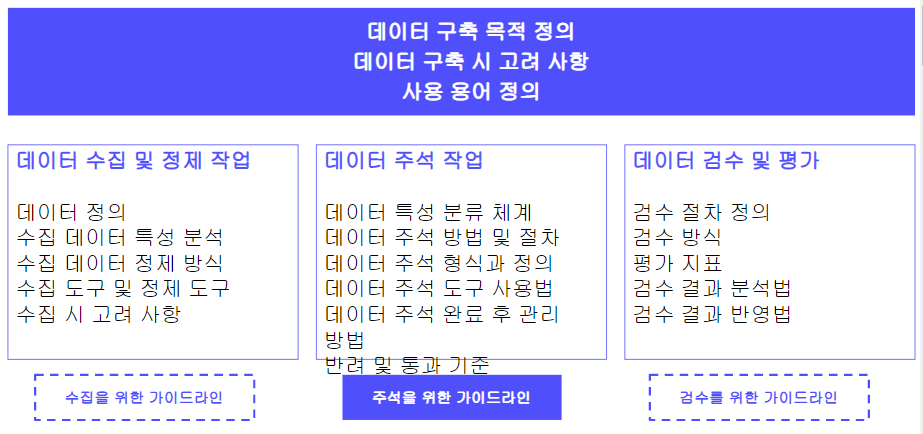
- 참가자들이 사전 지식없이 작업하는 경우가 더 좋은 경우가 있지만
- 보통은 잘 아는 것이 좋음
- **데이터 구축의 목적**을 정의하는 것이 가장 중요함
- 고유명사, 복합명사 처리를 어떻게 할 것인가?
- 위 구성요소에서 어떤 것을 보여주고 어떤 것을 보여주지 않을지도 생각해야 함

### 데이터 구축 목적 정의 예시
- 작업자들의 작업에 대한 이해도를 높여 더 높은 품질의 데이터를 만들 수 있도록 돕는 역할

**예시) 데이터 구축 목적 정의 예시**
- 데이터 구축 목적
    - 작업자들이 고품질 데이터를 만들 수 있는데 도움이 됨! (Motivation)
- 데이터 구축 필요성
- 데이터 구축 방향성
- 데이터 활용 분야

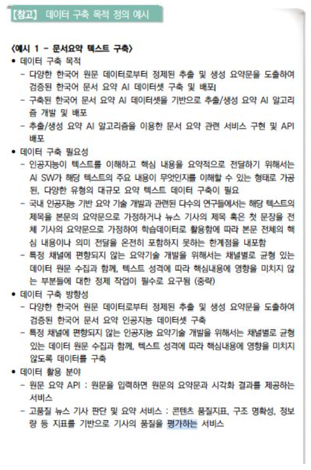

**예시) 한국어 SNS 텍스트 데이터 구축**
- 데이터 구축 목적
- 데이터 구축 필요성
- 데이터 활용 분야

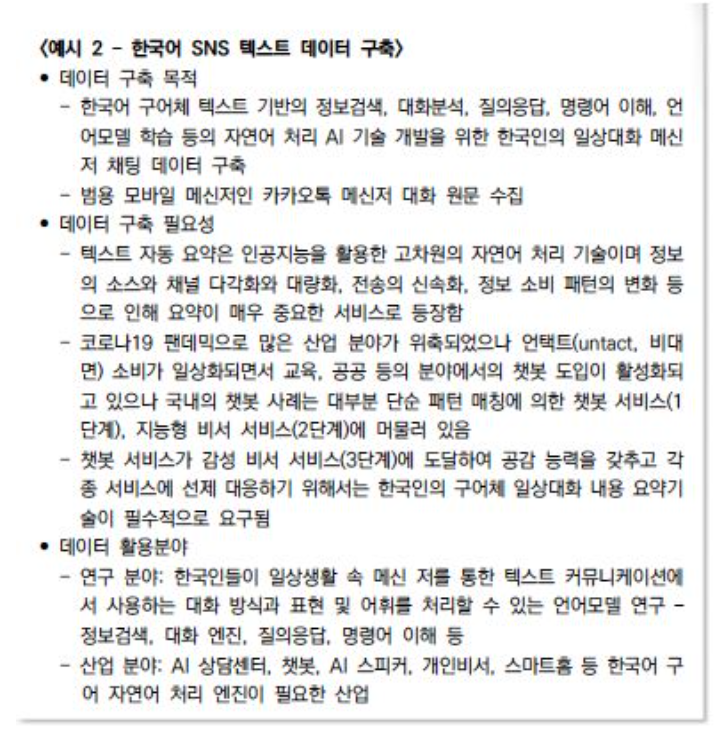

### 데이터 구축 가이드라인 용어 정의
- https://alt.qcri.org/semeval2016/task5/data/uploads/absa2016_annotationguidelines.pdf

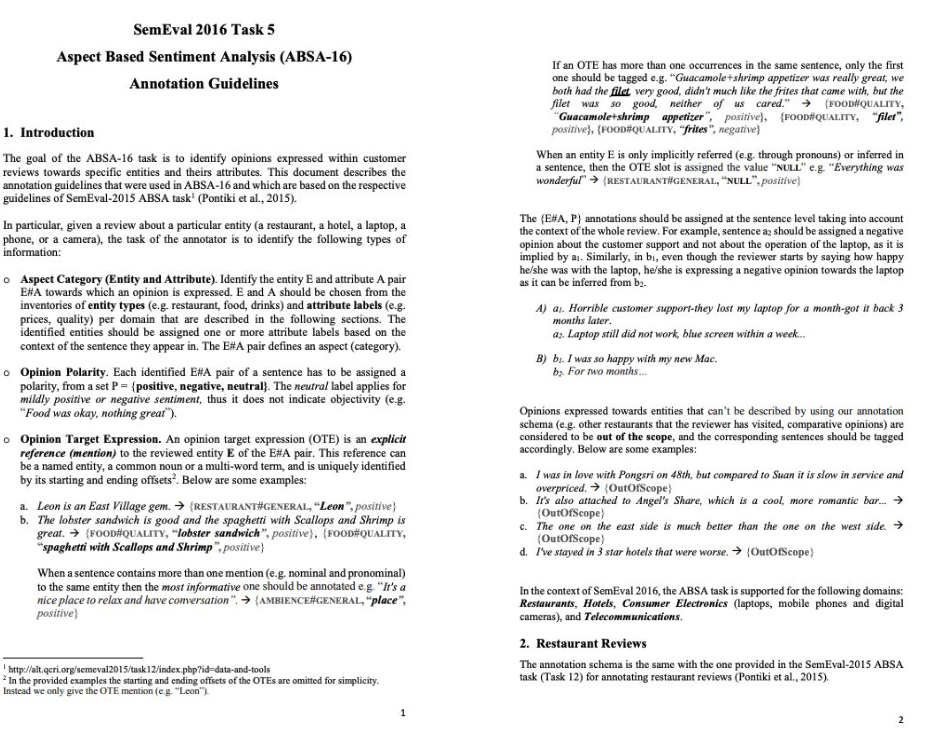
- task에 대한 소개와 용어 정리를 하며 시작

### 데이터 수집 가이드라인 예시
- https://kcorpus.korean.go.kr/boardFileDownload.data?seq=63

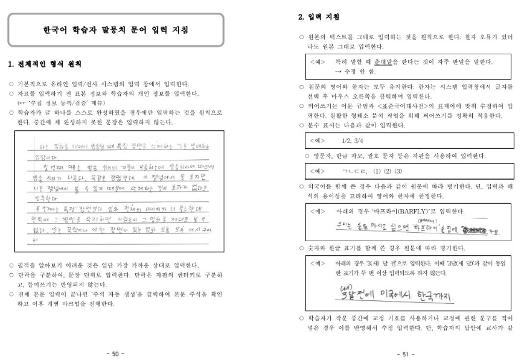
- offline 교육 때 사용했던 예시

### 데이터 체계 제시 예시
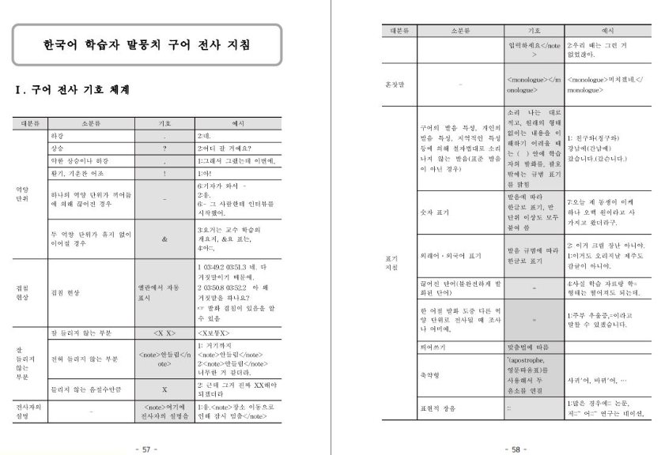
- 무엇을 어떻게 주석해야 하는가?
- 기호화에 대해 상세한 예시를 제시

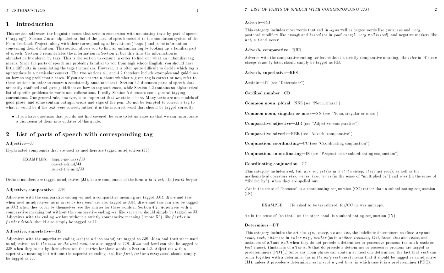
- https://www.cis.upenn.edu/~bies/manuals/tagguide.pdf
- 구문 분석 -> 품사 태깅이 된 상태에서 문장에서 어떠한 기능을 하는지 태깅
- 태그들의 정보가 무엇인지 제시
- 굉장히 신경써서 만든 자료

### 데이터 구축 도구 사용법 예시

- https://balsamiq.com/learn/articles/wireframe-annotations/
- 도구를 어떻게 사용하는지도 당연히 설명해줘야 한다!

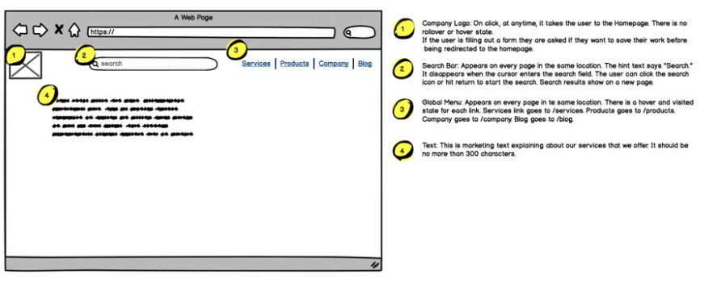

## 3. 가이드라인의 버전 관리
- 가이드라인은 구축과 검수 과정을 통해 지속적으로 개정되어야 함
- 개정 전과 개정 후 어떤 것이 변화하였는지 비교하여 볼 수 있도록 버전 관리가 되는 것이 가장 좋음
- 버전별로 작성자와 개정일을 기입해두는 것이 관리에 도움이 됨

## 4. 가이드라인 작성 도구

### Google Docs

- 공유가 가능
- 따로 저장하지 않아도 자동으로 저장됨

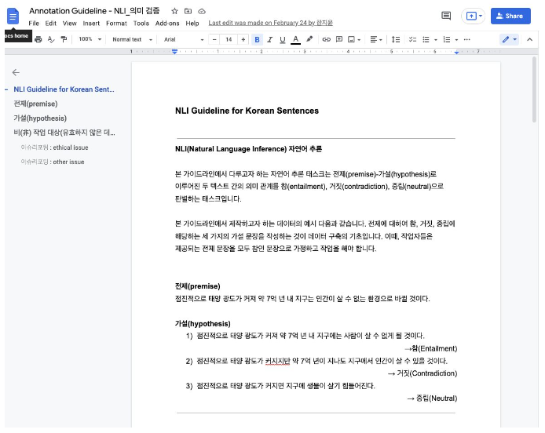

### Notion

- 노션에선 굉장히 많은 페이지를 제공
- 진행사항/QA도 가능

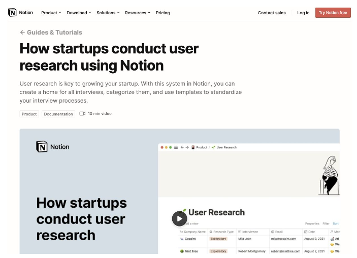

### 워드 및 한글

- 정부 사업 때 유용하게 사용

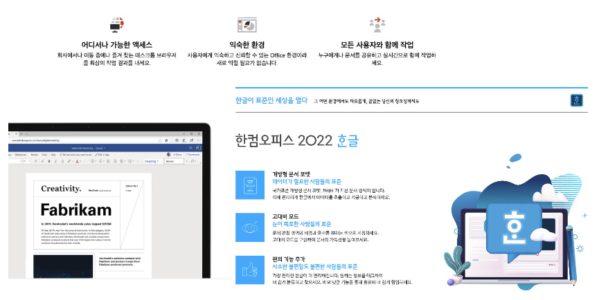

### 그 외
- 레이블링 에이전시에서 제공하는 도구
- 위키
- etc

## 5. 가이드라인 작성 시 유의 사항

- 가이드라인의 유형별 특성을 이해하고 그에 알맞는 정보를 작성한다
- 작업자의 작업 이해도를 고려하여 작성한다
- 작업자에게 공개해야 하는 필수 정보와 부가적인 정보가 무엇인지 사전에 고려한다
- 가이드라인 구성 요소의 배치를 어떻게 할 지 고민한다
- 작업자의 가독성을 고려한다

## Further Reading
- [Annotation Guideline for ABSA SemEval 2016-5](https://alt.qcri.org/semeval2016/task5/data/uploads/absa2016_annotationguidelines.pdf)
- [한국어 학습자 말뭉치 구어 전사 지침 (일부)](https://www.korean.go.kr/common/download.do;front=6D77D8BF0BE7B31D106B9CF1271E84F8?file_path=reportData&c_file_name=77dc5f04-c855-440b-8139-1bf7548d7e3a_0.pdf&o_file_name=2017년%20한국어%20학습자%20말뭉치%20연구%20및%20구축%20사업.pdf)
