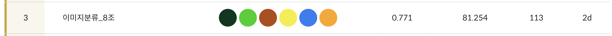
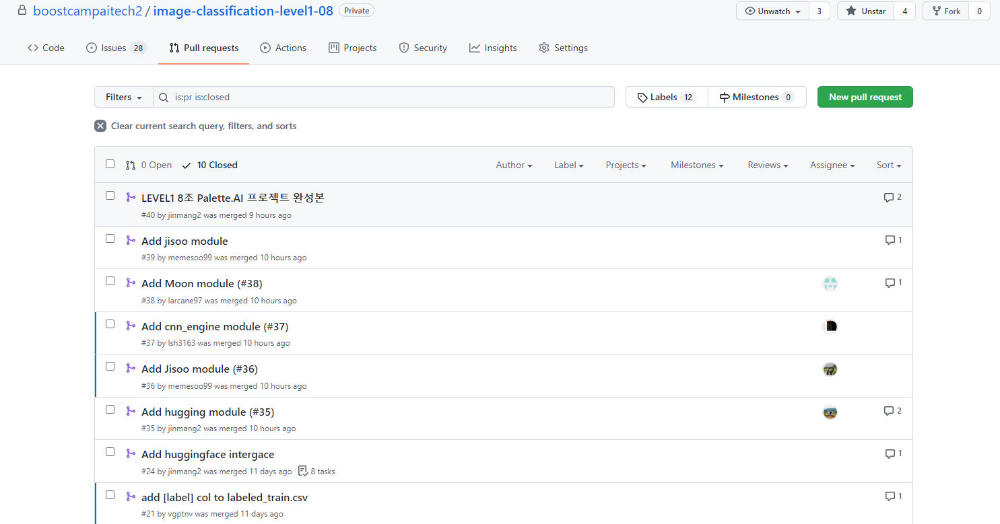

# P-stage Level 1 Wrap-Up

이미지 분류 대회를 마무리 하며...

`NAVER  Boostcamp AI Tech 2 8조` `진명훈`

아래 내용은 대회 기간 중 제가 한 흔적들에 집중하여 작성하였습니다!

## 개인 회고록

U-stage 3주 그리고 P-stage Level-1 2주를 진행하며 정말 많은 것들을 얻을 수 있었다. 최종적으로 내가 한 것들을 정리하며 프로젝트를 마무리 하고자 한다.

참고로 본 프로젝트를 마무리하며 boostcamp에서 지시하진 않았지만 우리가 한 흔적들을 아래 presentation 파일로 만들어서 기록했다.

- [https://github.com/jinmang2/boostcamp_ai_tech_2/blob/main/assets/ppt/paletteai.pdf](https://github.com/jinmang2/boostcamp_ai_tech_2/blob/main/assets/ppt/paletteai.pdf)

우선 첫 날에는 빠르게 baseline을 만들어서 리더보드에 결과를 제출하고 싶었다. 나는 NLP를 선택했기 때문에 `huggingface` 라이브러리를 사용하여 구축했고 최종 template을 내 github에 공유했다. (팀 repo에서도 확인할 수 있다. 지속적으로 업데이트 예정이다.)

- [https://github.com/jinmang2/HuggingTemplate](https://github.com/jinmang2/HuggingTemplate)

facebook ai의 Data Efficient ViT인 `DeiT`를 사용하여 모델을 제출한 결과, F1 Score `71.27` 점을 기록, public score 3등을 기록했다! 처음 제출한 결과가 리더보드 상위권을 기록하여 대회에 더욱 열중하게 되었다. (물론 곧 8위로 떨어졌다...ㅎ)

그 다음 날에는 코드를 모듈화하는 과정을 거쳤다. 첫 날에 빠르게 제출하기 위해 notebook으로 실험 관리를 하니까 setting 관리가 전혀 되질 않았고 향후 코드 재사용을 위해 미리 정리해야겠다고 생각했다.

실험 중에 이상한 점을 발견했다. 강의에서 분명히 `Train Data Augmentation`과 `Test Time Augmentation`이 효과가 있을 것이라고 했는데 성능 향상에 영향이 없고 되려 떨어지는 경우도 존재했다. 이에 대해 2주 동안 팀원들과 회의한 결과, 사진 데이터 특성 상 Random Crop보단 Center Crop이 더욱 효과가 좋을 것이고 되려 심한 noise가 되어서 학습이 더욱 힘들어졌을 것이라는 결론을 지었다.

다른 camper들은 어떻게 진행하고 있을까 궁금하여 게시판을 보니 라벨링이 잘못된 데이터가 존재한다는 소식을 들었다. 이에 대해 팀원들에게 언급하고 `Active Learning`에서 영감을 얻어 라벨링이 틀린 부분을 모델이 직접 찾아내자고 제안했다. 그리고 이를 직접 구현하여 게시판에서 언급한 이미지 외에 3명의 인물에 대해 labeling이 잘못된 부분을 교정했다.

`DeiT` 외에 21년 6월에 나온 BERT ViT 모델 `BEIT`을 사용했다. 확실히 적은 데이터로도 높은 효과를 보이는 모델답게 성능향상을 못 거두던 때에 `73.8` 점을 기록, 리더보드 상위권을 탈환했다. 하지만 팀 병합 전 최종 9위를 기록하며 더 큰 성능 향상을 거두지는 못했다...

도대체 왜 분류 성능이 많이 안오르는지 의아하여 모델의 결과를 분석한 결과 아래 3가지의 insight를 얻었다!

- 특정 의상을 입은 남/녀에 대한 구별이 힘듦 (검은 옷의 빨간 외투)
- 60대 노인을 구분하기 어려움
- Incorrect와 Not Wear의 class 수는 비슷하나 incorrect가 압도적으로 구분하기 어려움

해당 문제를 어떻게 풀 수 있을까? 2주차부턴 해당 문제를 팀원들과 같이 고민하며 실험했다. 총 4가지의 방법을 사용하며 우리는 public 2위, private 3위를 달성할 수 있었다!

### 첫 번째, Handling Class Imbalance

`Focal Loss`, `Weighted Loss`, `Weighted Sampling`, `Three-Head Model`등 다양한 기법을 적용했다.

### 두 번째, Age 모델을 별도로 구축

 `Mask`, `Gender` 과 별개로 `Age` 모델엔 더욱 특별한 setting을 부여했다. 단순히 30대 미만, 60대 이상, 그 외로 분류 loss만 준 것이 아니라 나이를 scalar값으로 보고 `SmoothL1Loss` 로 regression 문제도 풀었다. 나이 모델의 최종 loss는 $\mathcal{L}_{total}=\mathcal{L}_{cross\_entropy}+\gamma \mathcal{L}_{smooth\_l1}$으로 학습했다.

60대 이상은 특이하게도 60~70대라고 명시되어 있었으나 전부 60세로 되어있었다. 원활한 학습을 위해 poisson 분포로 parameter 5을 주어 60~70살의 값을 가지도록 수정해줬다.

### 세 번째, Data Augmentation

위에서 얻은 세 가지의 insight을 해결해줄 방법으로 외부 dataset을 활용하였다. 남/녀 분별을 위해 `All Age Dataset` 을 사용했고 incorrect를 잡기 위해 해당 class가 많은 `Kaggle 500GB Mask Dataset` 를 사용했다.

### 네 번째, 모델 성능 극대화

`BEIT`의 경우further pretraining을 위해 성능 극대화를 도모했고 `ensemble`, `oof`, `stacking` 등으로 모델이 분류를 더욱 잘하도록 실험했다.

최종적으론 `EfficientNet B5`, `BEIT`, `NFNet` 을 사용했으며 앞서 언급한 바와 같이 최종 3위의 성적을 달성하였다. 마스터님의 말씀대로 순위가 중요했기 보다 우리가 어떠한 전략을 왜 세웠고 해당 결과가 성능 향상으로 얻어진 부분에 더욱 집중하여 앞으로도 지속 가능한 AI Engineer로 성장하고 싶다!

## 팀 회고록
- https://github.com/jinmang2/boostcamp_ai_tech_2/blob/main/assets/ppt/P-stage_Level_1_Team8_Report.pdf

## 팀 소스 코드
- 전체 source code는 공개 불가
- 개인적으로 구축한 huggingface template은 아래 링크에서 확인 가능
    - https://github.com/jinmang2/HuggingTemplate
- 서로 Pull Request로 코드 리뷰 실시

