# 1강 인공지능과 자연어 처리

이제 본격적으로 자연어처리 공부를 시작해보겠습니다! 🥰
인공지능이 발전함에 따라 자연어와 관련된 여러 Task들을 해결할 수 있게 되었습니다.
이번 강의에는 인공지능의 발전이 어떻게 자연어 처리 분야에 영향을 주고 발전하게 되었는지 알아봅니다.
또한 앞으로의 과정을 위해 배경지식이 될 수 있는 자연어처리의 기초에 대해서 소개합니다.
그리고 ‘언어모델’의 개념이 어떻게 탄생하게 됐는지 살펴보겠습니다.

[back to super](https://github.com/jinmang2/boostcamp_ai_tech_2/tree/main/p-stage/klue_re)

  
Table of Contents

  <ol>
    <li>
      <a href="#1-인공지능의-탄생과-자연어처리">인공지능의 탄생과 자연어처리</a>
      <ul>
        <li><a href="#11-자연어처리-소개">자연어처리 소개</a></li>
        <li><a href="#12-자연어처리의-응용분야">자연어처리의 응용분야</a></li>
      </ul>
    </li>
    <li>
      <a href="#2-딥러닝-기반의-자연어-처리">딥러닝 기반의 자연어 처리</a>
      <ul>
        <li><a href="#21-언어모델">언어모델</a></li>
        <li><a href="#22-seq2seq">Seq2Seq</a></li>
        <li><a href="#23-attention">Attention</a></li>
        <li><a href="#24-self-attention">Self-Attention</a></li>
      </ul>
    </li>
    <li><a href="#further-reading">Further Reading</a></li>
  </ol>

## 1. 인공지능의 탄생과 자연어처리

### 1.1 자연어처리 소개
- 인공지능? 인간의 지능이 가지는 학습, 추리, 적응, 논증 따위의 기능을 갖춘 컴퓨터 시스템
- 갈리테이아
- 콜로서스 컴퓨터
- 이미테이션 게임
    - 기계에 지능이 있는가?
    - 컴퓨터가 인간처럼 대화가 가능하다면 그 컴퓨터는 인간처럼 사고할 수 있다
- AI의 황금기: 1956~1974 ELIZA
    - Turing Test를 적용할 수 있는 최초의 Human-Like AI
    - 단순 Rule-based
    - https://www.eclecticenergies.com/psyche/eliza

 

    <b><a href="#1강-인공지능과-자연어-처리">↥ back to top</a></b>

 

### 1.2 자연어처리의 응용분야

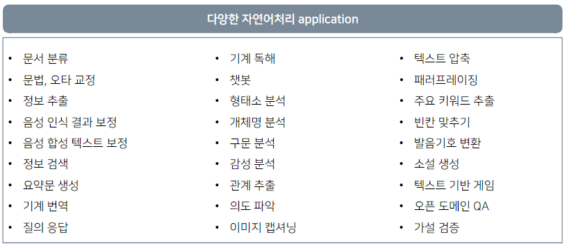

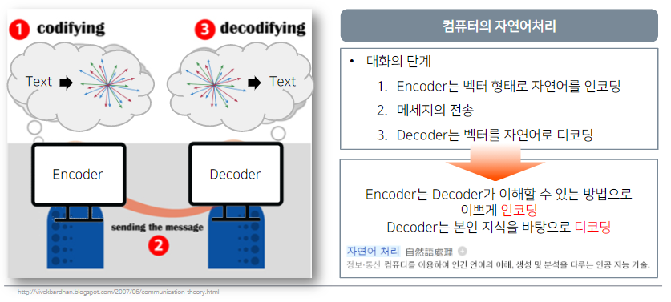

자연어를 컴퓨터가 이해할 수 있게 수학적으로 어떻게 이쁘게 인코딩할 수 있는가?

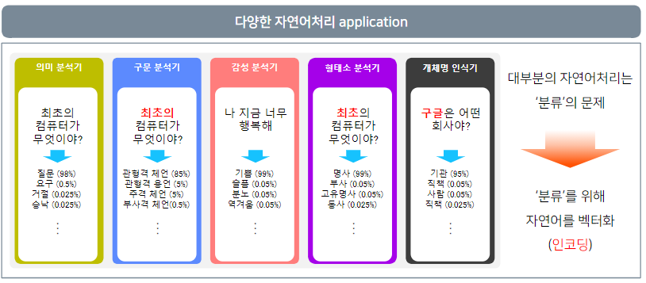

 

    <b><a href="#1강-인공지능과-자연어-처리">↥ back to top</a></b>

 

### 1.3 자연어 단어 임베딩
- 분류를 위해 자연어를 벡터화 (인코딩)
- 데이터의 특징을 파악 (Feature Selection)
- 자연어를 어떻게 좌표평면 위에 표현할 수 있을까?

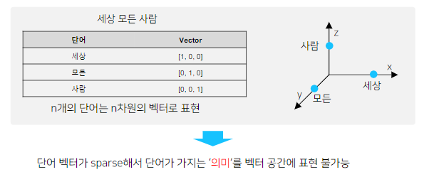

- Word2Vec은 자연어를 이쁘게 벡터화하고 그 거리를 계산하는 것이 가능
- 즉, 관계 파악을 할 수 있음!
- 하지만 단어의 Subword를 무시하고
    - 예를 들어, 서울 vs 서울시 vs 고양시
- Out of Vocabulary에서 적용 불가능하다는 단점이 있음

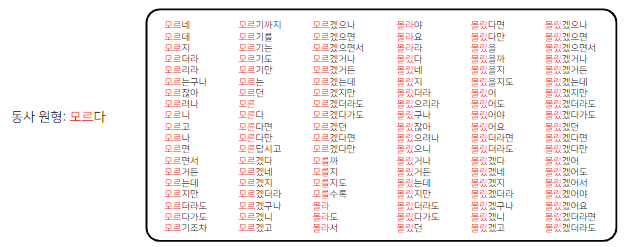

- Word2Vec의 단점을 결정적으로 나타내는 예제
- Word2Vec은 위 공통된 원형을 무시하고 전부 vocab에 유지함

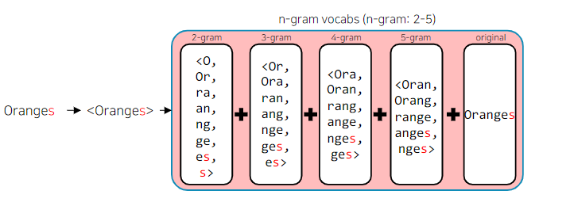

- FastText는 Word2Vec과 다르게 단어를 n-gram으로 분리한 다음
- 모든 n-gram vector를 합산한 후 평균을 통해 단어 벡터를 획득
- https://link.springer.com/chapter/10.1007/978-3-030-12385-7_3
- https://github.com/MrBananaHuman/JamoFastText
- fasttext는 오탈자, OOV, 등장 횟수가 적은 학습 단어에 대해 강세임

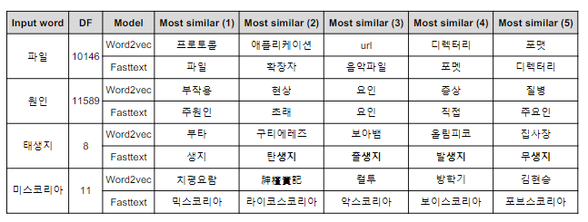

- 그러나 fasttext와 word2vec이 가지는 공통적인 단점이 있음
- 동형어, 다의어 등에 대해서는 embedding 성능이 좋지 못함
- 맥락 전체가 아니라 주변 단어를 통해 학습이 이루어지기 떄문

 

    <b><a href="#1강-인공지능과-자연어-처리">↥ back to top</a></b>

 

## 2. 딥러닝 기반의 자연어 처리

### 2.1 언어모델
- `언어`는 말 그대로 말
- 모델은? input으로 output을 도출
- 특히 우리는 이전 state를 기반으로 미래의 state를 예측할 것
- 언어모델은 이전에 등장한 단어로 다음에 등장할 단어를 예측하는 것으로 정의!
- 초기의 LM은 다음의 단어나 문장이 나올 확률을 통계와 단어의 n-gram을 기반으로 계산
- DL기반의 LM은 아래 확률을 최대로 하도록 네트워크를 학습함

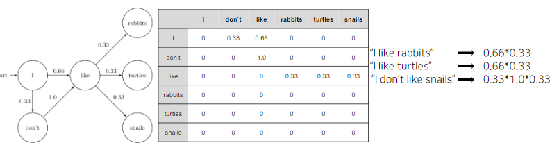

- RNN은 sequential data를 모델링하기 위해 제안된 Neural Network
- 최종 출력은 앞선 단어들의 문맥을 고려해서 만들어진 최종 출력 벡터!
    - `Context Vector`

 

    <b><a href="#1강-인공지능과-자연어-처리">↥ back to top</a></b>

 

### 2.2 Seq2Seq
- RNN을 두 개 붙여서 Encoder-Decoder 구조로 만들면 다양한 문제를 풀 수 있다
- Encoder로 Context Vector를 만들고
- Decoder로 Context Vector를 활용한 NLG가능!

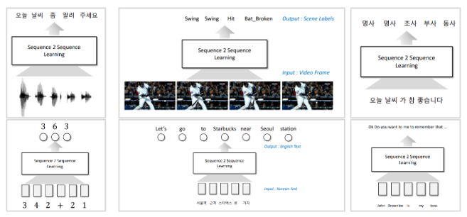

- RNN의 문제점? long-term dependency 포착이 어려움
- Fixed size context vector bottleneck...

 

    <b><a href="#1강-인공지능과-자연어-처리">↥ back to top</a></b>

 

### 2.3 Attention
- 인간이 정보를 처리할 때 모든 sequence를 고려하면서 정보처리를 하는 것이 아님
- 적절한 부분에 집중해서 처리하자!

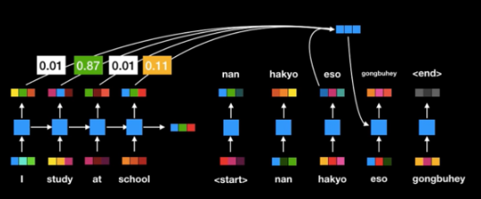

- U-stage에서 학습했음!
- 엄청난 개선을 얻었음
- 하지만 Recurrence한 연산의 한계가 아직 존재 (병렬 처리 불가, time step에서 hidden dim에 quadratic 연산)

 

    <b><a href="#1강-인공지능과-자연어-처리">↥ back to top</a></b>

 

### 2.4 Self-Attention

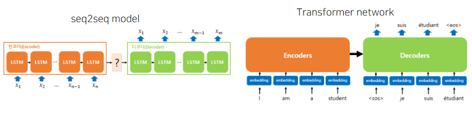

- 간 밤에 발생한 RNN 살뉴 사건!

 

    <b><a href="#1강-인공지능과-자연어-처리">↥ back to top</a></b>

 

## Further Reading
- [자연어처리](https://www.youtube.com/watch?v=jlCerj5eI4c)
- [FastText](https://www.youtube.com/watch?v=7UA21vg4kKE)
- [Seq2Seq](https://www.youtube.com/watch?v=4DzKM0vgG1Y)
- [Seq2Seq + attention](https://www.youtube.com/watch?v=WsQLdu2JMgI)

 

    <b><a href="#1강-인공지능과-자연어-처리">↥ back to top</a></b>

 
