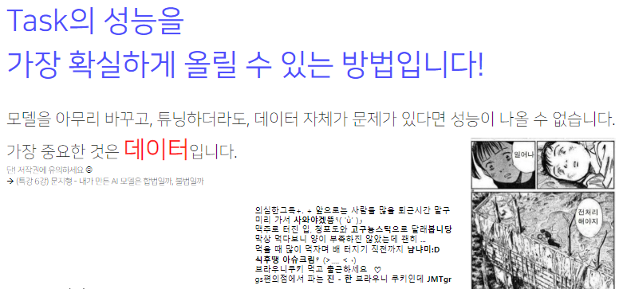
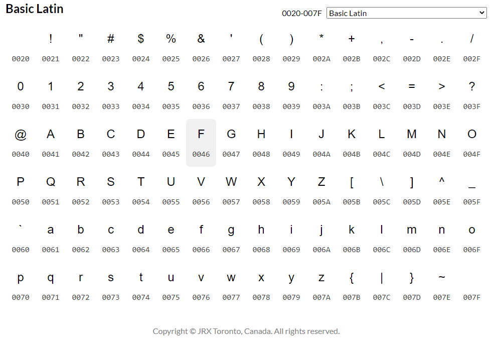

# 2강 자연어의 전처리

인공지능에서 가장 중요한 데이터!! “Garbage in, garbage out” 이라는 말이 있습니다.
일반적으로 좋은 데이터를 학습해야 좋은 성능의 모델을 기대할 수 있습니다.
또한 데이터 전처리는 단순히 '정제' 의 개념이 아니라, 어떤 문제를 해결하겠다는 task 정의의 의미도 포함하고 있습니다! ☺️
반드시 날 것의 데이터와 친하게 지내세요!!!

이번 강의에는 다양한 한국어에 특화된 전처리 기법을 배우고 실습합니다.😎
한국어로 할 수 있는 거의 모든 전처리를 포함하고 있습니다! 😀

[back to super](https://github.com/jinmang2/boostcamp_ai_tech_2/tree/main/p-stage/klue_re)

<details open="open">
  <summary>Table of Contents</summary>
  <ol>
    <li>
      <a href="#1-자연어-전처리">자연어 전처리</a>
      <ul>
        <li><a href="#11-자연어처리의-단계">자연어처리의 단계</a></li>
        <li><a href="#12-python-string-관련-함수">Python string 관련 함수</a></li>
        <li><a href="#13-코드-실습">코드 실습</a></li>
      </ul>
    </li>
    <li>
      <a href="#2-자연어-토크나이징">자연어 토크나이징</a>
      <ul>
        <li><a href="#21-한국어-토큰화">한국어 토큰화</a></li>
        <li><a href="#22-코드-실습">코드 실습</a></li>
      </ul>
    </li>
    <li><a href="#further-reading">Further Reading</a></li>
  </ol>
</details>

## 1. 자연어 전처리

### 1.1 자연어처리의 단계



- Task 설계
- 필요 데이터 수집
- 통계학적 분석
    - Token 갯수, dictionary 정의
- 전처리
    - 개행문자, 특수문자, 공백 등등 제거
- Tagging
- Tokenizing
    - 어절, 형태소, WordPiece 등
- 모델 설계
- 모델 구현
- 성능 평가

<br/>
<div align="right">
    <b><a href="#2강-자연어의-전처리">↥ back to top</a></b>
</div>
<br/>

### 1.2 Python string 관련 함수
- `upper`
- `lower`
- `capitalize`
- `title`
- `swapcase`
- `strip`
- `rstrip`
- `lstrip`
- `replace`
- `split`
- `join`
- `splitlines`
- `isdigit`
- `isalpha`
- `isalnum`
- `islower`
- `isupper`
- `isspace`
- `startswith`
- `endswith`
- `count`
- `find`
- `rfind`
- `index`
    - 뒤의 인자로 중복 처리 가능
- `rindex`

위와 친숙해지는 것 너무나 중요!

<br/>
<div align="right">
    <b><a href="#2강-자연어의-전처리">↥ back to top</a></b>
</div>
<br/>

### 1.3 코드 실습

```python
# url을 입력으로 text를 추출해주는 라이브러리
# https://github.com/codelucas/newspaper
$ pip install newspaper3k

import newspaper
newspaper.languages()
```
```

Your available languages are:

input code		full name
  en			  English
  et			  Estonian
  bg			  Bulgarian
  mk			  Macedonian
  he			  Hebrew
  fi			  Finnish
  ru			  Russian
  pt			  Portuguese
  it			  Italian
  de			  German
  no			  Norwegian
  da			  Danish
  zh			  Chinese
  ja			  Japanese
  es			  Spanish
  id			  Indonesian
  ro			  Romanian
  tr			  Turkish
  pl			  Polish
  be			  Belarusian
  vi			  Vietnamese
  el			  Greek
  ko			  Korean
  sl			  Slovenian
  nl			  Dutch
  hu			  Hungarian
  sv			  Swedish
  uk			  Ukrainian
  hi			  Hindi
  fa			  Persian
  sr			  Serbian
  fr			  French
  hr			  Croatian
  ar			  Arabic
  nb			  Norwegian (Bokmål)
  sw			  Swahili
```

- 뉴스 크롤링!

```python
from newspaper import Article

article = Article(news_url, language='ko')

article.download()
article.parse()

print('title:', article.title)

print('context:', article.text)
```

- 전처리 실습을 위해 임의의 텍스트 추가

```python
context = article.text.split('\n')
context.append("<h1>여기에 태그가 있네요!</h1> <h3>이곳에도 태그가 있구요</h3> html은 <b>태그</b>로 이루어진 문서입니다. 텍스트를 <b>진하게</b> 만들 수도 있고, <u>밑줄</u>을 칠 수도 있습니다. ‘<br>이 줄은 실제 뉴스(news,)에 포함되지 않은 임시 데이터임을 알립니다…<br>‘")
context.append("(서울=위키트리) 김성현 기자 (seonghkim@smilegate.com) <저작권자(c) 무단전재-재배포 금지> ‘<br>이 줄은 실제 뉴스(news,)에 포함되지 않은 임시 데이터임을 알립니다…<br>‘")
context.append("(사진=위키트리, 무단 전재-재배포 금지) ‘<br>이 줄은 실제 뉴스(news,)에 포함되지 않은 임시 데이터임을 알립니다…<br>‘")
context.append("#이세돌 #알파고 #인공지능 #딥러닝 #바둑")
```
```
0
1 <h1>여기에 태그가 있네요!</h1> <h3>이곳에도 태그가 있구요</h3> html은 <b>태그</b>로 이루어진 문서입니다. 텍스트를 <b>진하게</b> 만들 수도 있고, <u>밑줄</u>을 칠 수도 있습니다. ‘<br>이 줄은 실제 뉴스(news,)에 포함되지 않은 임시 데이터임을 알립니다…<br>‘
2 (서울=위키트리) 김성현 기자 (seonghkim@smilegate.com) <저작권자(c) 무단전재-재배포 금지> ‘<br>이 줄은 실제 뉴스(news,)에 포함되지 않은 임시 데이터임을 알립니다…<br>‘
3 (사진=위키트리, 무단 전재-재배포 금지) ‘<br>이 줄은 실제 뉴스(news,)에 포함되지 않은 임시 데이터임을 알립니다…<br>‘
4 #이세돌 #알파고 #인공지능 #딥러닝 #바둑
```

- HTML 테그 제거!

```python
import re


def remove_html(texts):
    """
    HTML 태그를 제거합니다.
    ``<p>안녕하세요 ㅎㅎ </p>`` -> ``안녕하세요 ㅎㅎ ``
    """
    preprcessed_text = []
    for text in texts:
        text = re.sub(r"<[^>]+>\s+(?=<)|<[^>]+>", "", text).strip()
        if text:
            preprcessed_text.append(text)
    return preprcessed_text
```

- 문장 분리
    - 현웅이의 kss 사용
    - 룰 기반

```python
# Korean Sentence Splitter
$ pip install kss

import kss

sents = []

for sent in context:
    sent = sent.strip()
    if sent:
        splited_sent = kss.split_sentences(sent)
        sents.extend(splited_sent)
```
```
0 여기에 태그가 있네요!
1 이곳에도 태그가 있구요
2 html은 태그로 이루어진 문서입니다.
3 텍스트를 진하게 만들 수도 있고, 밑줄을 칠 수도 있습니다. ‘이 줄은 실제 뉴스(news,)에 포함되지 않은 임시 데이터임을 알립니다…‘
4 (서울=위키트리) 김성현 기자 (seonghkim@smilegate.com) ‘이 줄은 실제 뉴스(news,)에 포함되지 않은 임시 데이터임을 알립니다…‘
5 (사진=위키트리, 무단 전재-재배포 금지) ‘이 줄은 실제 뉴스(news,)에 포함되지 않은 임시 데이터임을 알립니다…‘
6 #이세돌 #알파고 #인공지능 #딥러닝 #바둑
```

<br/>
<div align="right">
    <b><a href="#2강-자연어의-전처리">↥ back to top</a></b>
</div>
<br/>

- Normalizing

```python
# remove email
text = re.sub(r"[a-zA-Z0-9+-_.]+@[a-zA-Z0-9-]+\.[a-zA-Z0-9-.]+", "", text).strip()

# remove hashtag
text = re.sub(r"#\S+", "", text).strip()

# remove user mention
text = re.sub(r"@\w+", "", text).strip()

# remove url
text = re.sub(r"(http|https)?:\/\/\S+\b|www\.(\w+\.)+\S*", "", text).strip()
text = re.sub(r"pic\.(\w+\.)+\S*", "", text).strip()

# remove bad char
bad_chars = {"\u200b": "", "…": " ... ", "\ufeff": ""}
text = text.replace(bad_char, bad_chars[bad_char])
text = re.sub(r"[\+á?\xc3\xa1]", "", text)

# remove press
re_patterns = [
    r"\([^(]*?(뉴스|경제|일보|미디어|데일리|한겨례|타임즈|위키트리)\)",
    r"[가-힣]{0,4} (기자|선임기자|수습기자|특파원|객원기자|논설고문|통신원|연구소장) ",  # 이름 + 기자
    r"[가-힣]{1,}(뉴스|경제|일보|미디어|데일리|한겨례|타임|위키트리)",  # (... 연합뉴스) ..
    r"\(\s+\)",  # (  )
    r"\(=\s+\)",  # (=  )
    r"\(\s+=\)",  # (  =)
]
text = re.sub(re_pattern, "", text).strip()

# remove copyright
re_patterns = [
    r"\<저작권자(\(c\)|ⓒ|©|\(Copyright\)|(\(c\))|(\(C\))).+?\>",
    r"저작권자\(c\)|ⓒ|©|(Copyright)|(\(c\))|(\(C\))"
]
text = re.sub(re_pattern, "", text).strip()

# remove photo info
text = re.sub(r"\(출처 ?= ?.+\) |\(사진 ?= ?.+\) |\(자료 ?= ?.+\)| \(자료사진\) |사진=.+기자 ", "", text).strip()

# remove useless breaket
# ``수학(,)`` -> ``수학``
# ``수학(數學,) -> ``수학(數學)``
bracket_pattern = re.compile(r"\((.*?)\)")

# repeat normalize
$ pip install soynlp
from soynlp.normalizer import *
print(repeat_normalize('와하하하하하하하하하핫', num_repeats=2))
>>> 와하하핫

# clean punctuation
punct_mapping = {
    "‘": "'", "₹": "e", "´": "'",
    "°": "", "€": "e", "™": "tm",
    "√": " sqrt ", "×": "x",
    "²": "2", "—": "-", "–": "-",
    "’": "'", "_": "-", "`": "'",
    '“': '"', '”': '"', '“': '"',
    "£": "e", '∞': 'infinity',
    'θ': 'theta', '÷': '/', 'α': 'alpha',
    '•': '.', 'à': 'a', '−': '-',
    'β': 'beta', '∅': '', '³':
    '3', 'π': 'pi'
}

# remove repeated spacing
text = re.sub(r"\s+", " ", text).strip()

# remove duplicate sentence
from collections import OrderedDict
texts = list(OrderedDict.fromkeys(texts))

# spacing sentence
$ pip install git+https://github.com/haven-jeon/PyKoSpacing.git
from pykospacing import Spacing
spacing = Spacing()
text = spacing(text)

# 마춤뻡 검사
$ pip install git+https://github.com/ssut/py-hanspell.git
from hanspell import spell_checker
sent = "대체 왜 않돼는지 설명을 해바"
spelled_sent = spell_checker.check(sent)
checked_sent = spelled_sent.checked

# morpheme based filtering
from konlpy.tag import Mecab
mecab = Mecab()
morphs = mecab.pos("아버지가방에들어가신다.", join=False)
NN_TAGS = ["NNG", "NNP", "NNB", "NP"]
V_TAGS = ["VV", "VA", "VX", "VCP", "VCN", "XSN", "XSA", "XSV"]
J_TAGS = ["JKS", "J", "JO", "JK", "JKC", "JKG", "JKB", "JKV", "JKQ", "JX", "JC", "JKI", "JKO", "JKM", "ETM"]

# excluded word filter
for word in excluded_words:
    if word in text:
        include_flag = True

# remove stopwords
stopwords = ['소취요', '-', '조드윅', '포스터', '앓는', '서린']

# min max filter
if min_len < len(text) and len(text) < max_len:
```

- 유니코드 기반 filtering

1. 유니코드란?
> 유니코드(Unicode)는 전 세계의 모든 문자를 컴퓨터에서 일관되게 표현하고 다룰 수 있도록 설계된 산업 표준이며, 유니코드 협회(Unicode Consortium)가 제정한다. 또한 이 표준에는 ISO 10646 문자 집합, 문자 인코딩, 문자 정보 데이터베이스, 문자들을 다루기 위한 알고리즘 등을 포함하고 있다. - 위키피디아 -

* 한국인들은 주로 영어, 한국어, 숫자들에 익숙해 있습니다. 그런데 갑자기 러시아어, 아랍어, 불어와 같은 언어들을 처리해야 한다면?!
* 이런 고민을 유니코드를 사용하면 해결할 수 있습니다!
* 이번 장에서는 간단하게 유니코드를 python 프로그래밍에서 사용하는 방법을 배우도록 하겠습니다.

2. 유니코드 표현
* 유니코드는 16진수로 표현되어 있습니다. 간단한 예제를 통해 알아보겠습니다.
* 다양한 언어와 문자에 대한 유니코드는 https://jrgraphix.net/r/Unicode/0020-007F 이 사이트에서 쉽게 확인 가능합니다.

```python
sentence = 'hello world'

print('* 원본 문장')
print(sentence)

print('\n* 10진수로 표현된 유니코드')
for w in sentence:
  print(ord(w), end=' ') # 문자 -> 10진수 변환

print('\n\n* 16진수로 표현된 유니코드')
for w in sentence:
  print(hex(ord(w)), end=' ') # 문자 -> 16진수 변환
```
```
* 원본 문장
hello world

* 10진수로 표현된 유니코드
104 101 108 108 111 32 119 111 114 108 100

* 16진수로 표현된 유니코드
0x68 0x65 0x6c 0x6c 0x6f 0x20 0x77 0x6f 0x72 0x6c 0x64
```

```python
range_s = int('0370',16) # 그리스 문자 유니코드 범위
range_e = int('03FF',16) # 16진수 -> 10진수 변환

for i in range(range_s, range_e + 1): #
  print(chr(i), end=' ')
```
```
Ͱ ͱ Ͳ ͳ ʹ ͵ Ͷ ͷ ͸ ͹ ͺ ͻ ͼ ͽ ; Ϳ ΀ ΁ ΂ ΃ ΄ ΅ Ά · Έ Ή Ί ΋ Ό ΍ Ύ Ώ ΐ Α Β Γ Δ Ε Ζ Η Θ Ι Κ Λ Μ Ν Ξ Ο Π Ρ ΢ Σ Τ Υ Φ Χ Ψ Ω Ϊ Ϋ ά έ ή ί ΰ α β γ δ ε ζ η θ ι κ λ μ ν ξ ο π ρ ς σ τ υ φ χ ψ ω ϊ ϋ ό ύ ώ Ϗ ϐ ϑ ϒ ϓ ϔ ϕ ϖ ϗ Ϙ ϙ Ϛ ϛ Ϝ ϝ Ϟ ϟ Ϡ ϡ Ϣ ϣ Ϥ ϥ Ϧ ϧ Ϩ ϩ Ϫ ϫ Ϭ ϭ Ϯ ϯ ϰ ϱ ϲ ϳ ϴ ϵ ϶ Ϸ ϸ Ϲ Ϻ ϻ ϼ Ͻ Ͼ Ͽ
```



- 이렇게 특정 언어를 지울 수 있음

```python
def remove_language(range_s, range_e, sentence):
    a = int(range_s, 16) # 16진수 -> 10진수 변환
    b = int(range_e, 16)
    return_sentence = ''
    for i, w in enumerate(sentence):
        if a<= ord(w) and ord(w) <= b:  # 음절 단위로 사전에 정의한 유니코드 범위 내에 존재하는가
            continue
        return_sentence+=w
    return return_sentence
```

- 아래 예시처럼 한글 리스트도 만들 수 있음
    - https://gist.github.com/jinmang2/5319e0d9918e8be0b9586305c53939f9

```python
def nextKorLetterFrom(letter):
    lastLetterInt = 15572643
    if not letter:
        return '가'
    a = letter
    b = a.encode('utf8')
    c = int(b.hex(), 16)
    if c == lastLetterInt:
        return False
    d = hex(c + 1)
    e = bytearray.fromhex(d[2:])
    flag = True
    while flag:
        try:
            r = e.decode('utf-8')
            flag = False
        except UnicodeDecodeError:
            c = c + 1
            d = hex(c)
            e = bytearray.fromhex(d[2:])
    return e.decode()

def get_all_korean_char():
    flag = True
    k = ""
    koreans = ""
    while flag:
        k = nextKorLetterFrom(k)
        if k is False:
            flag = False
        else:
            koreans += k
    return koreans
```

- 유니코드 핸들링시 유의할 점!
- 띄어쓰기 유니코드가 포함되어 있을 수 있음!
- 주의주의

<br/>
<div align="right">
    <b><a href="#2강-자연어의-전처리">↥ back to top</a></b>
</div>
<br/>

## 2. 자연어 토크나이징

### 2.1 한국어 토큰화

**토큰화(Tokenizing)**
- 주어진 데이터를 토큰(Token)이라 불리는 단위로 나누는 작업
- 토큰이 되는 기준은 다를 수 있음(어절, 단어, 형태소, 음절, 자소 등)

**문장 토큰화(Sentence Tokenizing)**
- 문장 분리

**단어 토큰화(Word Tokenizing)**
- 구두점 분리, 단어 분리

**한국어엔?**
- 한국어는 영어와 같은 굴절어와 다르게 교착어임
- 띄어쓰기만으로는 전처리 부족
- 형태소도 고려할 수 있음

<br/>
<div align="right">
    <b><a href="#2강-자연어의-전처리">↥ back to top</a></b>
</div>
<br/>

### 2.2 코드 실습

- 데이터를 colab에서 다운로드

```python
data = open('my_data/wiki_20190620_small.txt', 'r', encoding='utf-8')
lines = data.readlines() # 전체 문장을 list에 저장하는 함수입니다.
for line in lines[0:5]:
    print(line, end="")
```
```
제임스 얼 "지미" 카터 주니어는 민주당 출신 미국 39번째 대통령 이다.
지미 카터는 조지아주 섬터 카운티 플레인스 마을에서 태어났다.
조지아 공과대학교를 졸업하였다.
그 후 해군에 들어가 전함·원자력·잠수함의 승무원으로 일하였다.
1953년 미국 해군 대위로 예편하였고 이후 땅콩·면화 등을 가꿔 많은 돈을 벌었다.
```

<br/>
<div align="right">
    <b><a href="#2강-자연어의-전처리">↥ back to top</a></b>
</div>
<br/>

#### 어절 단위 tokenizing
- 모든 문장을 띄어쓰기 단위로 분리

```python
text = "이순신은 조선 중기의 무신이다."
tokenized_text = text.split(" ")    # split 함수는 입력 string에 대해서 특정 string을 기반으로 분리해줍니다.
print(tokenized_text)  
>>> ['이순신은', '조선', '중기의', '무신이다.']
```

- 왜 token화를 해주는가?
    - 의미를 지닌 단위로 단어를 분절
    - Model의 학습 시, 동일한 size로 입력

- 직접 tokenizer 클래스 만들어보기
```python
print(my_tokenizer.tokenize("이순신은 조선 중기의 무신이다.", "word"))
print(my_tokenizer.batch_tokenize(["이순신은 조선 중기의 무신이다.", "그는 임진왜란을 승리로 이끌었다."], "word"))
```
```
['이순신은', '조선', '중기의', '무신이다.', '[PAD]', '[PAD]', '[PAD]', '[PAD]', '[PAD]', '[PAD]']
[['이순신은', '조선', '중기의', '무신이다.', '[PAD]', '[PAD]', '[PAD]', '[PAD]', '[PAD]', '[PAD]'], ['그는', '임진왜란을', '승리로', '이끌었다.', '[PAD]', '[PAD]', '[PAD]', '[PAD]', '[PAD]', '[PAD]']]
```

<br/>
<div align="right">
    <b><a href="#2강-자연어의-전처리">↥ back to top</a></b>
</div>
<br/>

#### 형태소 단위 tokenizing
- konlpy로 실습

```python
...
elif tokenizer_type == "morph":
    tokenized_text = [lemma[0] for lemma in mecab.pos(text)]
...

print(my_tokenizer.tokenize("이순신은 조선 중기의 무신이다.", "morph"))
print(my_tokenizer.batch_tokenize(["이순신은 조선 중기의 무신이다.", "그는 임진왜란을 승리로 이끌었다."], "morph"))
```
```

<br/>
<div align="right">
    <b><a href="#2강-자연어의-전처리">↥ back to top</a></b>
</div>
<br/>

```

#### 음절 단위 tokenizing
- 자연어를 한 글자씩 분리

```python
text = "이순신은 조선 중기의 무신이다."
tokenized_text = list(text)    # split 함수는 입력 string에 대해서 특정 string을 기반으로 분리해줍니다.
print(tokenized_text)
>>> ['이', '순', '신', '은', ' ', '조', '선', ' ', '중', '기', '의', ' ', '무', '신', '이', '다', '.']
```

```python
...
elif tokenizer_type == "syllable":
    tokenized_text = list(text)
...
print(my_tokenizer.tokenize("이순신은 조선 중기의 무신이다.", "syllable"))
print(my_tokenizer.batch_tokenize(["이순신은 조선 중기의 무신이다.", "그는 임진왜란을 승리로 이끌었다."], "syllable"))
```
```
['이', '순', '신', '은', ' ', '조', '선', ' ', '중', '기', '의', ' ', '무', '신', '이', '다', '.', '[PAD]', '[PAD]', '[PAD]']
[['이', '순', '신', '은', ' ', '조', '선', ' ', '중', '기', '의', ' ', '무', '신', '이', '다', '.', '[PAD]', '[PAD]', '[PAD]'], ['그', '는', ' ', '임', '진', '왜', '란', '을', ' ', '승', '리', '로', ' ', '이', '끌', '었', '다', '.', '[PAD]', '[PAD]']]
```

<br/>
<div align="right">
    <b><a href="#2강-자연어의-전처리">↥ back to top</a></b>
</div>
<br/>

#### 자소 단위 tokenizing
- 한글을 하나의 문자도 최대 초성, 중성, 종성 총 3개의 자소로 분리가 가능
- hgtk 라이브러리 사용

```python
$ pip install hgtk

import hgtk
text = "이순신은 조선 중기의 무신이다."
tokenized_text = list(hgtk.text.decompose(text))
print(tokenized_text)
>>> ['ㅇ', 'ㅣ', 'ᴥ', 'ㅅ', 'ㅜ', 'ㄴ', 'ᴥ', 'ㅅ', 'ㅣ', 'ㄴ', 'ᴥ', 'ㅇ', 'ㅡ', 'ㄴ', 'ᴥ', ' ', 'ㅈ', 'ㅗ', 'ᴥ', 'ㅅ', 'ㅓ', 'ㄴ', 'ᴥ', ' ', 'ㅈ', 'ㅜ', 'ㅇ', 'ᴥ', 'ㄱ', 'ㅣ', 'ᴥ', 'ㅇ', 'ㅢ', 'ᴥ', ' ', 'ㅁ', 'ㅜ', 'ᴥ', 'ㅅ', 'ㅣ', 'ㄴ', 'ᴥ', 'ㅇ', 'ㅣ', 'ᴥ', 'ㄷ', 'ㅏ', 'ᴥ', '.']
```

```python
...
elif tokenizer_type == "jaso":
    tokenized_text = list(hgtk.text.decompose(text))
...

print(my_tokenizer.tokenize("이순신은 조선 중기의 무신이다.", "jaso"))
print(my_tokenizer.batch_tokenize(["이순신은 조선 중기의 무신이다.", "그는 임진왜란을 승리로 이끌었다."], "jaso"))
```
```
['ㅇ', 'ㅣ', 'ᴥ', 'ㅅ', 'ㅜ', 'ㄴ', 'ᴥ', 'ㅅ', 'ㅣ', 'ㄴ', 'ᴥ', 'ㅇ', 'ㅡ', 'ㄴ', 'ᴥ', ' ', 'ㅈ', 'ㅗ', 'ᴥ', 'ㅅ']
[['ㅇ', 'ㅣ', 'ᴥ', 'ㅅ', 'ㅜ', 'ㄴ', 'ᴥ', 'ㅅ', 'ㅣ', 'ㄴ', 'ᴥ', 'ㅇ', 'ㅡ', 'ㄴ', 'ᴥ', ' ', 'ㅈ', 'ㅗ', 'ᴥ', 'ㅅ'], ['ㄱ', 'ㅡ', 'ᴥ', 'ㄴ', 'ㅡ', 'ㄴ', 'ᴥ', ' ', 'ㅇ', 'ㅣ', 'ㅁ', 'ᴥ', 'ㅈ', 'ㅣ', 'ㄴ', 'ᴥ', 'ㅇ', 'ㅙ', 'ᴥ', 'ㄹ']]
```

<br/>
<div align="right">
    <b><a href="#2강-자연어의-전처리">↥ back to top</a></b>
</div>
<br/>

#### WordPiece tokenizing

```python
$ pip install transformers

from tokenizers import BertWordPieceTokenizer

# Initialize an empty tokenizer
wp_tokenizer = BertWordPieceTokenizer(
    clean_text=True,    # [이순신, ##은, ' ', 조선]
    handle_chinese_chars=True,
    strip_accents=False,    # True: [YepHamza] -> [Yep, Hamza]
    lowercase=False,
)

# And then train
wp_tokenizer.train(
    files="my_data/wiki_20190620_small.txt",
    vocab_size=10000,
    min_frequency=2,
    show_progress=True,
    special_tokens=["[PAD]", "[UNK]", "[CLS]", "[SEP]", "[MASK]"],
    limit_alphabet=1000,
    wordpieces_prefix="##"
)

# Save the files
wp_tokenizer.save_model("wordPieceTokenizer", "my_tokenizer")
```
```
Encoding(num_tokens=10, attributes=[ids, type_ids, tokens, offsets, attention_mask, special_tokens_mask, overflowing])
['이', '##순', '##신은', '조선', '중', '##기의', '무', '##신이', '##다', '.']
[706, 1350, 7569, 2001, 755, 2603, 453, 8419, 1076, 16]
```

|제목|어절|음절|형태소|Wordpiece|
|------|---|---|---|---|
|Unique word|51975|1546|16292|9591|
|문장 내 단어 개수의 평균|12|56|29|23|
|문장 내 단어 개수의 중앙값|12|50|27|21|
|문장 내 단어 개수의 최대/최소값|77/1|374/0|185/0|179/0|
|빈번한 상위 5개 단어|['있다.', '수', '이', '그', '한다.']|[' ', '이', '다', '의', '.']|['하', '.', '이', '의', '는']|['.', ',', '##의', '##에', '##을']|

- 동일한 코퍼스를 처리하더라도 사용하는 토크나이저의 특성에 따라 많이 달리짐

<br/>
<div align="right">
    <b><a href="#2강-자연어의-전처리">↥ back to top</a></b>
</div>
<br/>

## Further Reading
- [청와대 국민청원 데이터 전처리 (소개)](https://www.youtube.com/watch?v=9QW7QL8fvv0)
- [청와대 국민청원 데이터 전처리 (실습)](https://www.youtube.com/watch?v=HIcXyyzefYQ)


<br/>
<div align="right">
    <b><a href="#2강-자연어의-전처리">↥ back to top</a></b>
</div>
<br/>
