# 3강 BERT 언어모델

<details open="open">
  <summary>Table of Contents</summary>
  <ol>
    <li>
      <a href="#1-bert-언어모델">BERT 언어모델</a>
      <ul>
        <li><a href="#11-bert-모델-소개">BERT 모델 소개</a></li>
        <li><a href="#12-bert의-응용">BERT의 응용</a></li>
        <li><a href="#13-한국어-bert-모델">한국어 BERT 모델</a></li>
      </ul>
    <li><a href="#코드-실습">코드 실습</a></li>
  </ol>
</details>

## 1. BERT 언어모델

### 1.1 BERT 모델 소개

- BERT까지 긴 여정이었음!


- BERT는 Auto-Encoding처럼 학습함
    - Auto-Encoder는 아님
    - 왜? 단일 Encoder 구조임

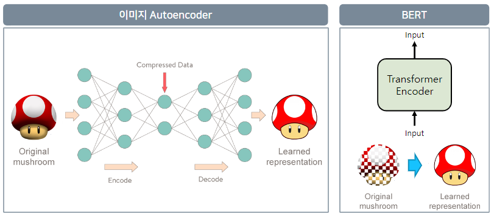

- BERT는 아래처럼 학습함! GPT의 CLM과 차이가 보이죠?

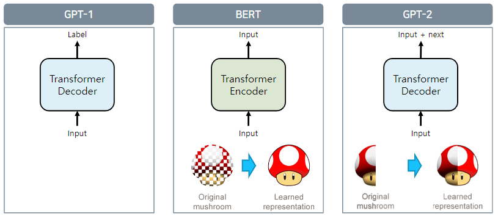

- BERT의 구조도
- 12개의 Transformer Encoder로 context 파악

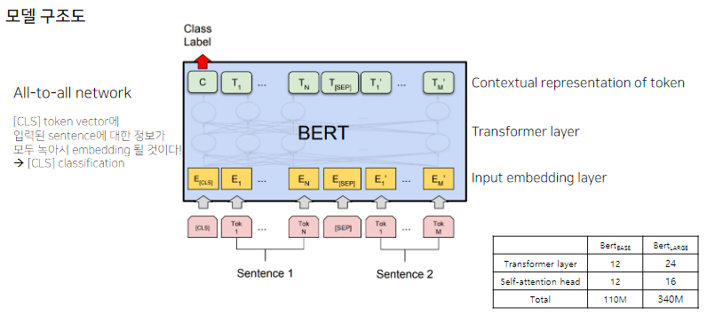

- 학습은
    - BooksCorpus (800M)
    - English Wikipedia (2,500M)
    - 30,000 token vocab

- 제일 중요한 개념 Masked Language Model
- 저번에 구현도 했기에 넘어가겠음

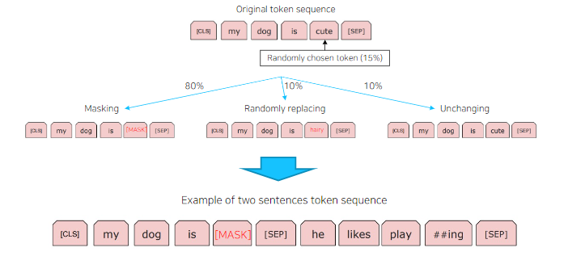

<br/>
<div align="right">
    <b><a href="#3강-bert-언어모델">↥ back to top</a></b>
</div>
<br/>

### 1.2 BERT의 응용

#### 감성 분석
- NSMC(https://github.com/e9t/nsmc)
- 학습 150,000 평가 50,000 긍/부정 이진 분류

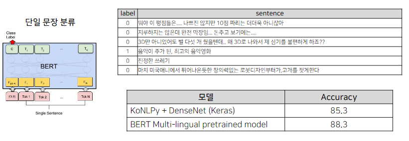

#### 관계 추출
- KAIST가 구축한 Silver data 사용
    - 1명의 전문가가 annotation
- 학습 985,806 평가 100,001
- 총 81개의 label

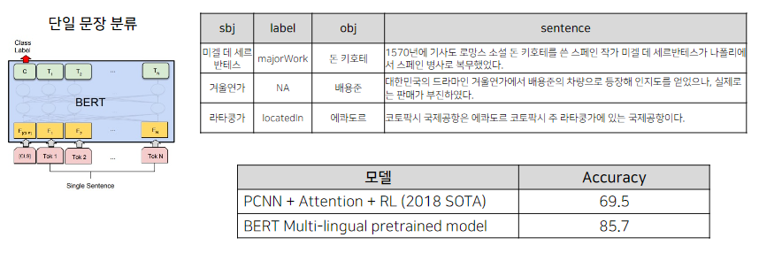

#### 의미 비교
- 디지털 동반자 Paraphrasing QA 문장 데이터를 이용하여 질문-질문 데이터 생성 및 학습
- 학습 3,401 문장 쌍 (유사 X: 1,700, 유사 O: 1,701)
- 평가 1,001 문장 쌍 (유사 X: 500, 유사 O: 501)

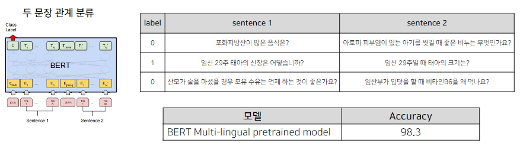

#### 개체명 분석
- ETRI 개체명 인식 데이터를 활용하여 학습 및 평가 진행 (정보통신단체표준 TTA.KO-10.0852)
- 학습 95,787 평가 10,503


#### 기계 독해
- LG CNS에서 공개한 한국어 QA 데이터 셋, KorQuAD(https://korquad.github.io/)
- Wikipedia article에 대해 10,645건의 문단과 66,181개의 질의응답
- 학습 60,407 Dev 5,774

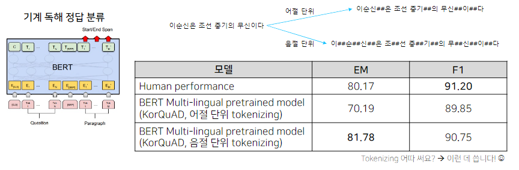

<br/>
<div align="right">
    <b><a href="#3강-bert-언어모델">↥ back to top</a></b>
</div>
<br/>

### 1.3 한국어 BERT 모델

#### ETRI KoBERT tokenizing

- ETRI 모델 좋긴한데 형태소 모델 쓰려면 ETRI 형태소 분석기를 사용해야 한다.

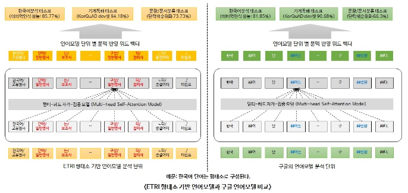

- 한국어 tokenizing에 따른 성능 비교
    - https://arxiv.org/abs/2010.02534

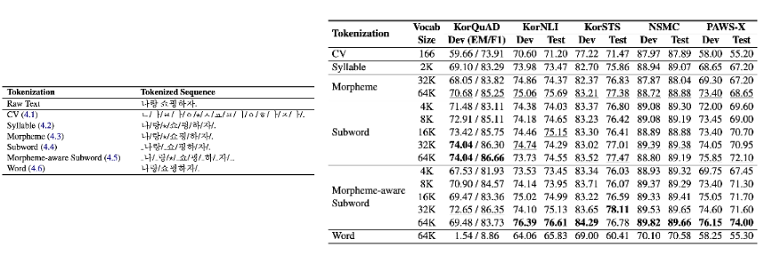

- KBQA에서 제일 중요한 Entity 정보가 BERT에선 무시되기에 이를 발전시킨 모델을 적용!

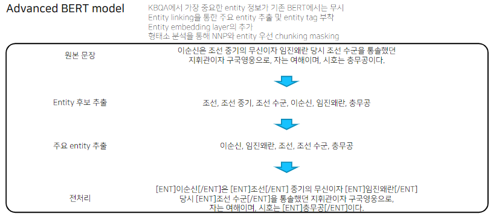

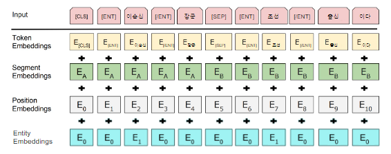

- Input Repr vs Model inject vs Head restrict

<br/>
<div align="right">
    <b><a href="#3강-bert-언어모델">↥ back to top</a></b>
</div>
<br/>

## 코드 실습
- huggingface 라이브러리 체험
- PLM은 huggingface 기반!

### `add_tokens` vs `add_special_tokens`

#### add_tokens
- tokenizer class에 새로운 token들의 list를 추가
- vocab indices에 추가됨
- `resize_token_embeddings` 수행해줘야 함
- `_add_tokens` 메서드를 어떻게 구현하냐에 따라 다른 듯
- `PretrainedTokenizerFast`같은 경우엔 아래처럼 구현되어 있음

```python
def _add_tokens(self, new_tokens: List[Union[str, AddedToken]], special_tokens=False) -> int:
    if special_tokens:
        return self._tokenizer.add_special_tokens(new_tokens)

    return self._tokenizer.add_tokens(new_tokens)
```

- add_special_tokens의 기능도 같이 하는 메서드

#### add_special_tokens
- 코드 뜯어보니, 여러 예외처리 해주면서 add_tokens에서 special_tokens 옵션을 True로 만들어 줌
- 즉, 큰 차이는 없다.
- 얘도 vocab에 추가가 된다
- 특별하게 관리해주냐의 차이

### [CLS] 토큰 활용하여 문장의 유사도를 측정

```python
sent1 = tokenizer("오늘 하루 어떻게 보냈나요?", return_tensors="pt")
sent2 = tokenizer("오늘은 어떤 하루를 보내셨나요?", return_tensors="pt")
sent3 = tokenizer("이순신은 조선 중기의 무신이다.", return_tensors="pt")
sent4 = tokenizer("깟뻬뜨랑 리뿔이 뜨럽거 므리커럭이 케쇽 냐왜쇼 우뤼갸 쳥쇼섀료다혀뚜여", return_tensors="pt")


outputs = model(**sent1)
sent_1_pooler_output = outputs.pooler_output

outputs = model(**sent2)
sent_2_pooler_output = outputs.pooler_output

outputs = model(**sent3)
sent_3_pooler_output = outputs.pooler_output

outputs = model(**sent4)
sent_4_pooler_output = outputs.pooler_output

from torch import nn

cos = nn.CosineSimilarity(dim=1, eps=1e-6)
print(cos(sent_1_pooler_output, sent_2_pooler_output))
print(cos(sent_2_pooler_output, sent_3_pooler_output))
print(cos(sent_3_pooler_output, sent_4_pooler_output))
print(cos(sent_1_pooler_output, sent_4_pooler_output))
```
```
tensor([0.9757], grad_fn=<DivBackward0>)
tensor([0.6075], grad_fn=<DivBackward0>)
tensor([0.6089], grad_fn=<DivBackward0>)
tensor([0.9459], grad_fn=<DivBackward0>)
```

<br/>
<div align="right">
    <b><a href="#3강-bert-언어모델">↥ back to top</a></b>
</div>
<br/>

### BERT ChatBot
- https://github.com/songys/Chatbot_data

진행 과정
1. 사용자의 질문(query)를 입력 받는다.
2. query를 pretrained BERT의 입력으로 넣어, query 문장에 해당하는 [CLS] token hidden을 얻는다.
3. 사전에 준비된 질의응답 Dataset에 존재하는 모든 질문들을 pretrained BERT의 입력으로 넣어, 질문들에 해당하는 [CLS] token hidden을 얻는다.
4. query의 [CLS] token hidden과 질문들의 [CLS] token hidden간의 코사인 유사도를 구한다.
5. 가장 높은 코사인 유사도를 가진 질문의 답변을 반환시켜준다.
6. 위 과정 반복.

#### 데이터 예시
- 같은 index가 서로 pair임

```
chatbot_Question = ['기차 타고 여행 가고 싶어','꿈이 이루어질까?','내년에는 더 행복해질려고 이렇게 힘든가봅니다', '간만에 휴식 중', '오늘도 힘차게!'] # 질문
chatbot_Answer = ['꿈꾸던 여행이네요.','현실을 꿈처럼 만들어봐요.','더 행복해질 거예요.', '휴식도 필요하죠', '아자아자 화이팅!!'] # 답변
print(len(chatbot_Question), len(chatbot_Answer))
>>> 5 5
```

```python
def get_cls_token(sent_A):
    model.eval()
    tokenized_sent = tokenizer(
            sent_A,
            return_tensors="pt",
            truncation=True,
            add_special_tokens=True,
            max_length=128
    )
    with torch.no_grad():# 그라디엔트 계산 비활성화
        outputs = model(    # **tokenized_sent
            input_ids=tokenized_sent['input_ids'],
            attention_mask=tokenized_sent['attention_mask'],
            token_type_ids=tokenized_sent['token_type_ids']
            )
    logits = outputs.last_hidden_state[:,0,:].detach().cpu().numpy()
    return logits
```


## Reference
- [Paper: BERT](https://arxiv.org/abs/1810.04805)
- [BERT 톺아보기](https://docs.likejazz.com/bert/)


<br/>
<div align="right">
    <b><a href="#3강-bert-언어모델">↥ back to top</a></b>
</div>
<br/>
