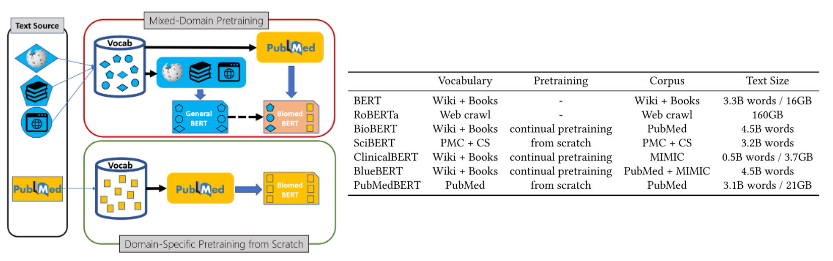
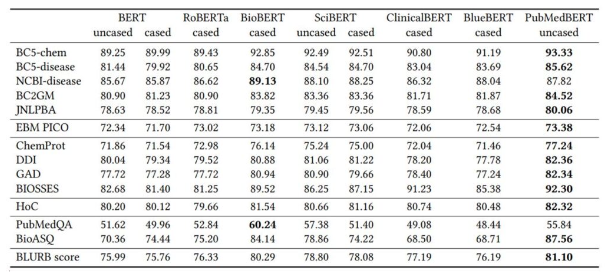
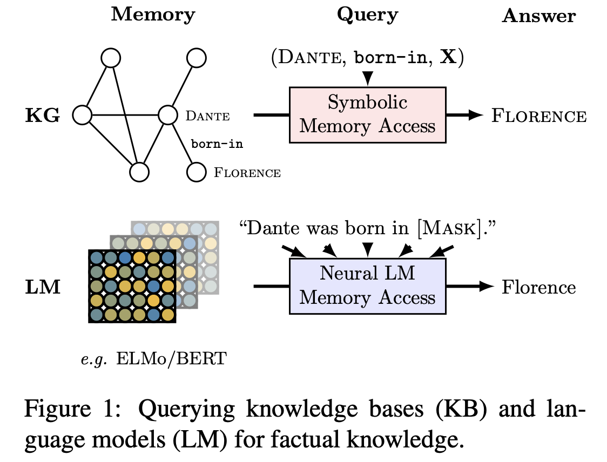

# 4강 한국어 BERT 언어 모델 학습

이번에는 3강에서 소개한 BERT를 직접 학습하는 강의입니다.

다양한 언어 모델들을 활용하고 공유할 수 있는 Huggingface Hub에 대해 소개하고, 직접 본인의 모델을 공유하는 실습을 진행합니다.🤓

<details open="open">
  <summary>Table of Contents</summary>
  <ol>
    <li>
      <a href="#1-bert-학습하기">BERT 학습하기</a>
      <ul>
        <li><a href="#11-bert-모델-학습">BERT 모델 학습</a></li>
      </ul>
    </li>
    <li><a href="#bert-mask-token-공격">BERT [MASK] token 공격!</a></li>
    <li><a href="#한국어-bert-모델-학습">한국어 BERT 모델 학습</a></li>
    <li><a href="#referece">Reference</a></li>
  </ol>
</details>

## 1. BERT 학습하기

### 1.1 BERT 모델 학습
- 이미 있는 거 쓰지, 왜 새로 학습해야  하나요?
- Domain-specific한 경우, 도메인 특화된 학습 데이터만 사용하는 것이 성능이 더 좋음



- 생리학 데이터를 모아서 scratch로 학습한 것이 domain 특화에선 더 좋음



<br/>
<div align="right">
    <b><a href="#4강-한국어-bert-언어-모델-학습">↥ back to top</a></b>
</div>
<br/>

## BERT [MASK] token 공격!



```python
$ pip install transformers

from transformers import BertForMaskedLM, AutoTokenizer
# Store the model we want to use
MODEL_NAME = "bert-base-multilingual-cased"

# We need to create the model and tokenizer
model = BertForMaskedLM.from_pretrained(MODEL_NAME)
tokenizer = AutoTokenizer.from_pretrained(MODEL_NAME)

from transformers import pipeline

nlp_fill = pipeline('fill-mask', top_k=5, model=model, tokenizer=tokenizer)
nlp_fill('Martin is living in [MASK].')
```

- 버락 오바마의 정보를 얻어보자

```python
nlp_fill('Barack Hussein Obama graduated from [MASK] University.')
```
```
[{'score': 0.07715228945016861,
  'sequence': 'Barack Hussein Obama graduated from Harvard University.',
  'token': 16744,
  'token_str': 'Harvard'},
 {'score': 0.04509279131889343,
  'sequence': 'Barack Hussein Obama graduated from Georgetown University.',
  'token': 57543,
  'token_str': 'Georgetown'},
 {'score': 0.028830749914050102,
  'sequence': 'Barack Hussein Obama graduated from Northwestern University.',
  'token': 78396,
  'token_str': 'Northwestern'},
 {'score': 0.02869964763522148,
  'sequence': 'Barack Hussein Obama graduated from Lincoln University.',
  'token': 16944,
  'token_str': 'Lincoln'},
 {'score': 0.02225659042596817,
  'sequence': 'Barack Hussein Obama graduated from Boston University.',
  'token': 13683,
  'token_str': 'Boston'}]
```

```python
nlp_fill('Obama was [MASK] of the United States.')
```
```
[{'score': 0.48057445883750916,
  'sequence': 'Obama was President of the United States.',
  'token': 12811,
  'token_str': 'President'},
 {'score': 0.05541132390499115,
  'sequence': 'Obama was president of the United States.',
  'token': 12931,
  'token_str': 'president'},
 {'score': 0.044774625450372696,
  'sequence': 'Obama was War of the United States.',
  'token': 11277,
  'token_str': 'War'},
 {'score': 0.02629113756120205,
  'sequence': 'Obama was part of the United States.',
  'token': 10668,
  'token_str': 'part'},
 {'score': 0.02169841341674328,
  'sequence': 'Obama was States of the United States.',
  'token': 10859,
  'token_str': 'States'}]
```

```python
nlp_fill('Obama was born in [MASK], Hawaii.')
```
```
[{'score': 0.8043831586837769,
  'sequence': 'Obama was born in Honolulu, Hawaii.',
  'token': 56348,
  'token_str': 'Honolulu'},
 {'score': 0.16054971516132355,
  'sequence': 'Obama was born in Hawaii, Hawaii.',
  'token': 21729,
  'token_str': 'Hawaii'},
 {'score': 0.001997528364881873,
  'sequence': 'Obama was born in County, Hawaii.',
  'token': 10886,
  'token_str': 'County'},
 {'score': 0.001665070652961731,
  'sequence': 'Obama was born in Mesa, Hawaii.',
  'token': 25076,
  'token_str': 'Mesa'},
 {'score': 0.0008855816558934748,
  'sequence': 'Obama was born in Kai, Hawaii.',
  'token': 26387,
  'token_str': 'Kai'}]
```

<br/>
<div align="right">
    <b><a href="#4강-한국어-bert-언어-모델-학습">↥ back to top</a></b>
</div>
<br/>

## 한국어 BERT 모델 학습

- Tokenizer 만들기

```python
from tokenizers import BertWordPieceTokenizer

# Initialize an empty tokenizer
wp_tokenizer = BertWordPieceTokenizer(
    clean_text=True,   # ["이순신", "##은", " ", "조선"] ->  ["이순신", "##은", "조선"]
    # if char == " " or char == "\t" or char == "\n" or char == "\r":
    handle_chinese_chars=True,  # 한자는 모두 char 단위로 쪼게버립니다.
    strip_accents=False,    # True: [YehHamza] -> [Yep, Hamza]
    lowercase=False,    # Hello -> hello
)

# And then train
wp_tokenizer.train(
    files="my_data/wiki_20190620_small.txt",
    vocab_size=20000,   # vocab size 를 지정해줄 수 있습니다.
    min_frequency=2,
    show_progress=True,
    special_tokens=["[PAD]", "[UNK]", "[CLS]", "[SEP]", "[MASK]"],
    wordpieces_prefix="##"
)

# Save the files
wp_tokenizer.save_model("wordPieceTokenizer", "my_tokenizer")

tokenizer = BertTokenizerFast(
    vocab_file='/content/wordPieceTokenizer/my_tokenizer-vocab.txt',
    max_len=128,
    do_lower_case=False,
)

tokenizer.add_special_tokens({'mask_token':'[MASK]'})
print(tokenizer.tokenize("이순신은 [MASK] 중기의 무신이다."))
```

- 모델 껍데기 가져오기

```python
from transformers import BertConfig, BertForPreTraining

config = BertConfig(    # https://huggingface.co/transformers/model_doc/bert.html#bertconfig
    vocab_size=20000,
    # hidden_size=512,
    # num_hidden_layers=12,    # layer num
    # num_attention_heads=8,    # transformer attention head number
    # intermediate_size=3072,   # transformer 내에 있는 feed-forward network의 dimension size
    # hidden_act="gelu",
    # hidden_dropout_prob=0.1,
    # attention_probs_dropout_prob=0.1,
    max_position_embeddings=128,    # embedding size 최대 몇 token까지 input으로 사용할 것인지 지정
    # type_vocab_size=2,    # token type ids의 범위 (BERT는 segmentA, segmentB로 2종류)
    # pad_token_id=0,
    # position_embedding_type="absolute"
)

model = BertForPreTraining(config=config)
model.num_parameters()
```

- MLM DataCollator
    - 와... 이걸 지원해주네?

```python
from transformers import DataCollatorForLanguageModeling
```

- Next Sentence Prediction
    - 두 번 다시 안볼거라 이번에 열심히 보자

```python
# Google BERT의 GitHub 공식 코드
class TextDatasetForNextSentencePrediction(Dataset):
    """
    This will be superseded by a framework-agnostic approach soon.
    """

    def __init__(
        self,
        tokenizer: PreTrainedTokenizer,
        file_path: str,
        block_size: int,
        overwrite_cache=False,
        short_seq_probability=0.1,
        nsp_probability=0.5,
    ):
        # 여기 부분은 학습 데이터를 caching하는 부분입니다 :-)
        assert os.path.isfile(file_path), f"Input file path {file_path} not found"

        self.block_size = block_size - tokenizer.num_special_tokens_to_add(pair=True)
        self.short_seq_probability = short_seq_probability
        self.nsp_probability = nsp_probability

        directory, filename = os.path.split(file_path)
        cached_features_file = os.path.join(
            directory,
            "cached_nsp_{}_{}_{}".format(
                tokenizer.__class__.__name__,
                str(block_size),
                filename,
            ),
        )

        self.tokenizer = tokenizer

        lock_path = cached_features_file + ".lock"

        # Input file format:
        # (1) One sentence per line. These should ideally be actual sentences, not
        # entire paragraphs or arbitrary spans of text. (Because we use the
        # sentence boundaries for the "next sentence prediction" task).
        # (2) Blank lines between documents. Document boundaries are needed so
        # that the "next sentence prediction" task doesn't span between documents.
        #
        # Example:
        # I am very happy.
        # Here is the second sentence.
        #
        # A new document.

        with FileLock(lock_path):
            if os.path.exists(cached_features_file) and not overwrite_cache:
                start = time.time()
                with open(cached_features_file, "rb") as handle:
                    self.examples = pickle.load(handle)
                logger.info(
                    f"Loading features from cached file {cached_features_file} [took %.3f s]", time.time() - start
                )
            else:
                # 본격적으로 데이터를 만드는 과정!
                # cache가 없으면 아래를 실행
                logger.info(f"Creating features from dataset file at {directory}")
                self.documents = [[]]
                with open(file_path, encoding="utf-8") as f:
                    """ 일단 문장을 읽음 """
                    while True:
                        line = f.readline()
                        if not line:
                            break
                        line = line.strip()

                        # 문단 단위로 데이터를 저장
                        if not line and len(self.documents[-1]) != 0:
                            self.documents.append([])
                        tokens = tokenizer.tokenize(line)
                        tokens = tokenizer.convert_tokens_to_ids(tokens)
                        if tokens:
                            self.documents[-1].append(tokens)
                # """  """
                logger.info(f"Creating examples from {len(self.documents)} documents.")
                self.examples = []
                # """  """
                for doc_index, document in enumerate(self.documents):
                    self.create_examples_from_document(document, doc_index)

                start = time.time()
                with open(cached_features_file, "wb") as handle:
                    pickle.dump(self.examples, handle, protocol=pickle.HIGHEST_PROTOCOL)
                logger.info(
                    "Saving features into cached file %s [took %.3f s]", cached_features_file, time.time() - start
                )

    def create_examples_from_document(self, document: List[List[int]], doc_index: int):
        """Creates examples for a single document."""
        # 128 - 2 = 126
        max_num_tokens = self.block_size - self.tokenizer.num_special_tokens_to_add(pair=True)

        # We *usually* want to fill up the entire sequence since we are padding
        # to `block_size` anyways, so short sequences are generally wasted
        # computation. However, we *sometimes*
        # (i.e., short_seq_prob == 0.1 == 10% of the time) want to use shorter
        # sequences to minimize the mismatch between pretraining and fine-tuning.
        # The `target_seq_length` is just a rough target however, whereas
        # `block_size` is a hard limit.

        # 2~126의 token들만 학습 데이터로 사용
        target_seq_length = max_num_tokens
        if random.random() < self.short_seq_probability:
            target_seq_length = random.randint(2, max_num_tokens)

        current_chunk = []  # a buffer stored current working segments
        current_length = 0
        i = 0

        # sent+..+sent [SEP] sent+...+sent
        # 기준은 target_seq_lenght
        while i < len(document):
            segment = document[i]
            current_chunk.append(segment)
            current_length += len(segment)
            if i == len(document) - 1 or current_length >= target_seq_length:
                if current_chunk:
                    # `a_end` is how many segments from `current_chunk` go into the `A`
                    # (first) sentence.
                    a_end = 1
                    # If sent+sent before [SEP],
                    # 길이를 random하게 자름
                    if len(current_chunk) >= 2:
                        a_end = random.randint(1, len(current_chunk) - 1)
                    tokens_a = []
                    for j in range(a_end):
                        tokens_a.extend(current_chunk[j])
                    # 이제 [SEP] 뒷 부분인 segmentB를 살펴볼까요?
                    tokens_b = []
                    # 50%의 확률로 랜덤하게 다른 문장을 선택하거나, 다음 문장을 학습데이터로 만듭니다.
                    if len(current_chunk) == 1 or random.random() < self.nsp_probability:
                        is_random_next = True
                        target_b_length = target_seq_length - len(tokens_a)

                        # This should rarely go for more than one iteration for large
                        # corpora. However, just to be careful, we try to make sure that
                        # the random document is not the same as the document
                        # we're processing.
                        for _ in range(10):
                            random_document_index = random.randint(0, len(self.documents) - 1)
                            if random_document_index != doc_index:
                                break
                        # 여기서 랜덤하게 선택합니다 :-)
                        random_document = self.documents[random_document_index]
                        random_start = random.randint(0, len(random_document) - 1)
                        for j in range(random_start, len(random_document)):
                            tokens_b.extend(random_document[j])
                            if len(tokens_b) >= target_b_length:
                                break
                        # We didn't actually use these segments so we "put them back" so
                        # they don't go to waste.
                        num_unused_segments = len(current_chunk) - a_end
                        i -= num_unused_segments
                    # Actual next
                    else:
                        is_random_next = False
                        for j in range(a_end, len(current_chunk)):
                            tokens_b.extend(current_chunk[j])

                    # 126 token을 기준으로 truncation
                    def truncate_seq_pair(tokens_a, tokens_b, max_num_tokens):
                        """Truncates a pair of sequences to a maximum sequence length."""
                        while True:
                            total_length = len(tokens_a) + len(tokens_b)
                            if total_length <= max_num_tokens:
                                break
                            trunc_tokens = tokens_a if len(tokens_a) > len(tokens_b) else tokens_b
                            assert len(trunc_tokens) >= 1
                            # We want to sometimes truncate from the front and sometimes from the
                            # back to add more randomness and avoid biases.
                            if random.random() < 0.5:
                                del trunc_tokens[0]
                            else:
                                trunc_tokens.pop()

                    truncate_seq_pair(tokens_a, tokens_b, max_num_tokens)

                    assert len(tokens_a) >= 1
                    assert len(tokens_b) >= 1

                    # add special tokens
                    input_ids = self.tokenizer.build_inputs_with_special_tokens(tokens_a, tokens_b)
                    # add token type ids, 0 for sentence a, 1 for sentence b
                    token_type_ids = self.tokenizer.create_token_type_ids_from_sequences(tokens_a, tokens_b)

                    example = {
                        "input_ids": torch.tensor(input_ids, dtype=torch.long),
                        "token_type_ids": torch.tensor(token_type_ids, dtype=torch.long),
                        "next_sentence_label": torch.tensor(1 if is_random_next else 0, dtype=torch.long),
                    }

                    self.examples.append(example)

                current_chunk = []
                current_length = 0

            i += 1

    def __len__(self):
        return len(self.examples)

    def __getitem__(self, i):
        return self.examples[i]
```

- DataCollator로 마스킹

```python
tokenizer.decode(data_collator(dataset.examples)['input_ids'][0].tolist())
```
```
[CLS] [MASK] 얼 " 지미 " 카터 주니 [MASK] 민주당 출신 미국 39번째 대통령 이다 [MASK] 지미 [MASK] [MASK] 섬터 카 [MASK]티 플레인스 마을에서 태어났다. 조지아 공과대학교를 졸업하였다. [SEP] 주어진 두 벡터 [MASK] 사이의 유가와 변환의 집합은 점별 벡터 덧셈과 점별 스칼라 곱셈에 의하여 벡터 공간을 이룬다. 두 유한 차원 벡터 공간 사이의 선형 [MASK] [MASK] 기저에 대한 행렬로 나타낼 수 있다. 선택 공리를 가정하자. 체 formula _ 1에 대한 벡터 공간 formula _ 4에 기계제 다음이 성립한다. 즉, 주어진 체에 대한 벡터 공간은 그 차원에 따라서 완전히 분류된다. 이는 선택 공리를 필요로 하며, 선택 공리가 없으면 모든 벡터 [MASK] 차원을 갖는다는 것을 보일 수 없다 [MASK] [SEP]
```

- 결과 테스트

```python
from transformers import BertForMaskedLM, pipeline

my_model = BertForMaskedLM.from_pretrained('model_output')

nlp_fill = pipeline('fill-mask', top_k=5, model=my_model, tokenizer=tokenizer)

nlp_fill('이순신은 [MASK] 중기의 무신이다.')
```
```

[{'score': 0.030770400539040565,
  'sequence': '[CLS] 이순신은, 중기의 무신이다. [SEP]',
  'token': 14,
  'token_str': ','},
 {'score': 0.03006444126367569,
  'sequence': '[CLS] 이순신은. 중기의 무신이다. [SEP]',
  'token': 16,
  'token_str': '.'},
 {'score': 0.012540608644485474,
  'sequence': '[CLS] 이순신은 _ 중기의 무신이다. [SEP]',
  'token': 63,
  'token_str': '_'},
 {'score': 0.008801406249403954,
  'sequence': '[CLS] 이순신은 있다 중기의 무신이다. [SEP]',
  'token': 1888,
  'token_str': '있다'},
 {'score': 0.008582047186791897,
  'sequence': '[CLS] 이순신은 formula 중기의 무신이다. [SEP]',
  'token': 1895,
  'token_str': 'formula'}]
```

<br/>
<div align="right">
    <b><a href="#4강-한국어-bert-언어-모델-학습">↥ back to top</a></b>
</div>
<br/>


## Reference
- [LM training from scratch](https://colab.research.google.com/github/huggingface/blog/blob/master/notebooks/01_how_to_train.ipynb#scrollTo=5oESe8djApQw)
- 나만의 BERT Wordpiece Vocab 만들기
    - [Wordpiece Vocab 만들기](https://monologg.kr/2020/04/27/wordpiece-vocab/)
    - [Wordpiece Tokenizer 만들기](https://velog.io/@nawnoes/Huggingface-tokenizers%EB%A5%BC-%EC%82%AC%EC%9A%A9%ED%95%9C-Wordpiece-Tokenizer-%EB%A7%8C%EB%93%A4%EA%B8%B0)
- [Extracting training data from large language model](https://www.youtube.com/watch?v=NGoDUEz3tZg)
- [BERT 추가 설명](https://jiho-ml.com/weekly-nlp-28/)


<br/>
<div align="right">
    <b><a href="#4강-한국어-bert-언어-모델-학습">↥ back to top</a></b>
</div>
<br/>
