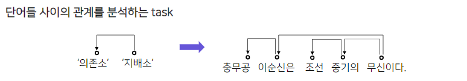
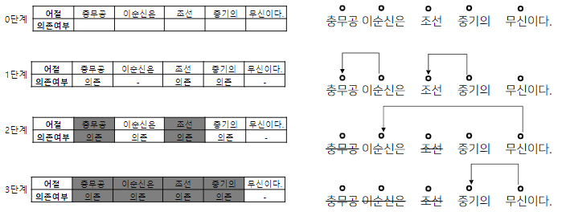
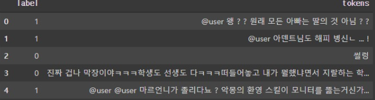
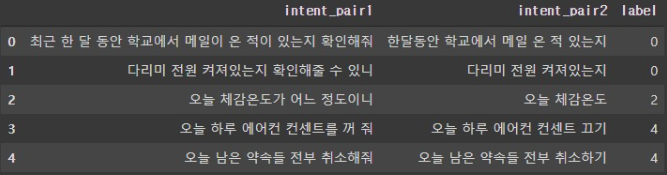
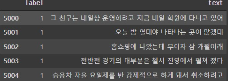
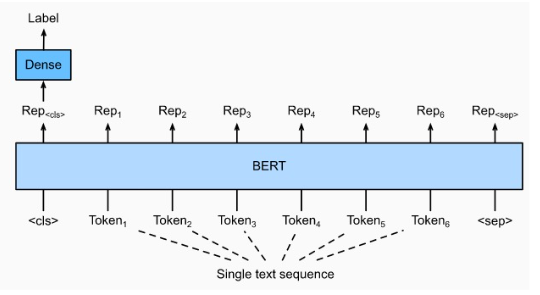
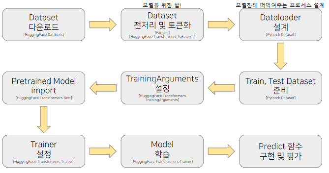

# 5강 BERT 기반 단일 문장 분류 모델 학습

3강에서 배운 BERT를 가지고 자연어 처리 Task를 해결해 봅니다. 🧐

단일 문장 분류 모델은 주어진 문장에 대하여 특정 라벨을 예측하는 것입니다.

활용 분야로는 리뷰의 긍정/부정 등의 감성 분석, 뉴스의 카테고리 분류, 비속어 판단 모델 등이 있습니다.

<details open="open">
  <summary>Table of Contents</summary>
  <ol>
    <li>
      <a href="#1-klue-데이터셋-소개">KLUE 데이터셋 소개</a>
      <ul>
        <li><a href="#11-klue-데이터셋">KLUE 데이터셋</a></li>
      </ul>
    </li>
    <li>
      <a href="#2-단일-문장-분류-task-소개">단일 문장 분류 task 소개</a>
      <ul>
        <li><a href="#21-문장-분류-task">문장 분류 task</a></li>
        <li><a href="#22-문장-분류를-위한-데이터">문장 분류를 위한 데이터</a></li>
      </ul>
    </li>
    <li><a href="#3-단일-문장-분류-모델-학습">단일 문장 분류 모델 학습</a></li>
  </ol>
</details>

## 1. KLUE 데이터셋 소개
과제에서 사용될 KLUE 데이터셋 소개

### 1.1 KLUE 데이터셋
- Korean Language Understanding Evaluation
    - 문장 분류 (5강)
    - 관계 추출 (5강)
    - 문장 유사도 (e.g, [CLS])
    - 자연어 추론 (6강)
    - 개체명 인식 (7강)
    - 품사 태깅 (7강)
    - 질의 응답 (7강)
    - 목적형 대화 (김성동님 DST강의)
    - 의존 구문 분석 (ㅎㅎ)

#### 의존 구문 분석?



1. 특징
    - 지배소: 의미의 중심이 되는 요소
    - 의존소: 지배소가 갖는 의미를 보완해주는 요소 (수식)
    - 어순과 생략이 자유로운 한국어와 같은 언어에서 주로 연구

2. 분류 규칙
    - 지배소는 후위언어. 즉, 지배소는 항상 의존소보다 뒤에 위치
    - 각 의존소의 지배소는 하나
    - 교차 의존 구조는 없음
3. 분류 방법
    - Sequence Labeling 방식으로 처리 단계를 나눔
    - 앞 어절에 의존소가 없고 다음 어절이 지배소인 어절을 삭제하며 의존 관계를 만듦



- 이를 통해 복잡한 자연어 형태를 그래프로 구조화해서 표현할 수 있다!

<br/>
<div align="right">
    <b><a href="#5강-bert-기반-단일-문장-분류-모델-학습">↥ back to top</a></b>
</div>
<br/>

## 2. 단일 문장 분류 task 소개

### 2.1 문장 분류 task

#### 감정분석(Sentiment Analysis)
- 문장의 긍/부정 또는 중립 등 성향을 분류하는 프로세스
- 기업에서 모니터링, 고객지원 또는 댓글 필터링 자동화하는 작업에 주로 사용
- 활용 방안
    - 혐오 발언 분류: 댓글, 게임 대화 등 혐오 발언 분류하여 조치를 취하는 용도로 활용
    - 기업 모니터링: 소셜, 리뷰 등 데이터에 대해 기업 이미지, 브랜드 선호도, 제품평가 등 긍/부정 요인 분석

#### 주제 라벨링(Topic Labeling)
- 문장의 내용을 이해, 적절한 범주로 분류
- 활용 방안
    - 대용량 문서 분류
    - VoC(Voice of Customer): 고객의 피드백을 제품 가격, 개선점, 디자인 등 적절한 주제로 분류하여 데이터를 구조화

#### 언어 감지(Language Detection)
- 문장이 어떤 나라 언어인지를 분류
- 번역기에서 정확한 번역을 위해 어떤 언어인지 타켓팅
- 활용 방안
    - 번역기: 변역할 문장에 대해 적절한 언어를 감지
    - 테이터 필터링: 타켓 언어 이외 데이터는 필터링

#### 의도 분류(Intent Classification)
- 문장이 가진 의도를 분류하는 프로세스
- 활용 방안
    - 챗봇: 문장의 의도인 질문, 명령, 거절 등을 분석, 적절한 답변을 주기 위해 활용

<br/>
<div align="right">
    <b><a href="#5강-bert-기반-단일-문장-분류-모델-학습">↥ back to top</a></b>
</div>
<br/>

### 2.2 문장 분류를 위한 데이터

#### kor_hate
- 혐오 표현에 대한 데이터
- 특정 개인 또는 집단에 대한 공격적 문장
- 무례, 공격적이거나 비꼬는 문장
- 부정적이지 않은 문장


#### kor_sarcasm
- 비꼬지 않은 표현의 문장
- 비꼬는 표현의 문장



#### kor_sae
- 예/아니오로 답변 가능한 질문
- 대안 선택을 물어봄
- (who, what, where, when, why, how) 질문
- 금지, 요구, 강한 요구



#### Kor_3i4k
- 단어 or 문장 조각
- 평서문, 질문, 명령문, 수사적 질문, 수사적 명령문, 억양에 의존하는 의도



<br/>
<div align="right">
    <b><a href="#5강-bert-기반-단일-문장-분류-모델-학습">↥ back to top</a></b>
</div>
<br/>

## 3. 단일 문장 분류 모델 학습

### 모델 구조도


### 학습 과정


<br/>
<div align="right">
    <b><a href="#5강-bert-기반-단일-문장-분류-모델-학습">↥ back to top</a></b>
</div>
<br/>

### 코드 실습
- 모르는 코드 혹은 도움이 될만한 코드만 기입

```python
# 중복 데이터 제거
train_data.drop_duplicates(subset=['document'], inplace= True)
test_data.drop_duplicates(subset=['document'], inplace= True)

# null 데이터 제거
train_data['document'].replace('', np.nan, inplace=True)
test_data['document'].replace('', np.nan, inplace=True)
train_data = train_data.dropna(how = 'any')
test_data = test_data.dropna(how = 'any')
```

- 예측함수를 huggingface Trainer의 predict를 사용하지 않고 직접 torch로 구축하심

```python
# predict함수
def sentences_predict(sent):
    model.eval()
    tokenized_sent = tokenizer(
            sent,
            return_tensors="pt",
            truncation=True,
            add_special_tokens=True,
            max_length=128
    )
    tokenized_sent.to(device)

    with torch.no_grad():# 그라디엔트 계산 비활성화
        outputs = model(
            input_ids=tokenized_sent['input_ids'],
            attention_mask=tokenized_sent['attention_mask'],
            token_type_ids=tokenized_sent['token_type_ids']
            )

    logits = outputs[0]
    logits = logits.detach().cpu().numpy()
    result = np.argmax(logits)
    return result
```


## Reference
- [BERT Text Classification Using Pytorch](https://towardsdatascience.com/bert-text-classification-using-pytorch-723dfb8b6b5b)
- [Sentiment Analysis with BERT](https://curiousily.com/posts/sentiment-analysis-with-bert-and-hugging-face-using-pytorch-and-python/)
- [네이버 영화리뷰 감정분석](https://colab.research.google.com/drive/1tIf0Ugdqg4qT7gcxia3tL7und64Rv1dP)
- [Sequence Classification using Pytorch Lightning with BERT](https://knswamy.medium.com/sequence-classification-using-pytorch-lightning-with-bert-on-imbd-data-5e9f48baa638)
- [BERT Fine-Tuning Tutorial with PyTorch](https://mccormickml.com/2019/07/22/BERT-fine-tuning/)


<br/>
<div align="right">
    <b><a href="#5강-bert-기반-단일-문장-분류-모델-학습">↥ back to top</a></b>
</div>
<br/>
