# 1강 MRC Intro & Python Basics

기계독해(MRC) 강의에 오신걸 환영합니다. 첫 강의에서는 기계독해에 대한 소개 기본적인 파이썬 지식들에 관한 강의입니다. 기계독해란 무엇인지, 어떠한 종류가 있는지, 평가는 어떻게 해야할 지에 대해 알아보고, 자연어 처리에 필요한 unicode / tokenization 개념을 배울 예정입니다. 마지막으로 한국어 기계독해 데이터인 KorQuAD를 살펴보며 실제 기계독해 데이터가 어떠한 형태로 이루어 졌는지 배워보겠습니다

[back to super](https://github.com/jinmang2/boostcamp_ai_tech_2/tree/main/p-stage/mrc)

## 1. Introduction to MRC

### Concept of MRC
주어진 지문(Context)을 이해하고, 주어진 질의(Query/Question)의 답변을 추론하는 문제

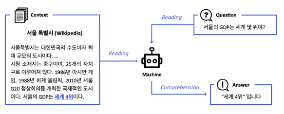

- Search Engine and Dialog system with MRC

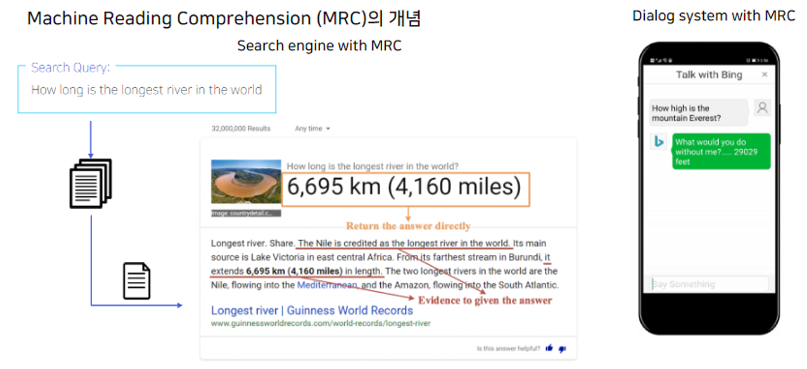

### MRC의 종류

1. Extractive Answer Datasets
- 질의(question)에 대한 답이 항상 주어진 지문(context)의 segment (or span)으로 존재

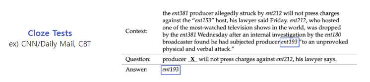

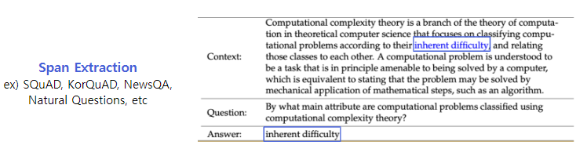

2. Descriptive/Narrative Answer Datasets
- 답이 지문 내에서 추출한 span이 아니라, 질의를 보고 생성된 sentence (or free-form)의 형태
- e.g., MS MARCO, Narrative QA

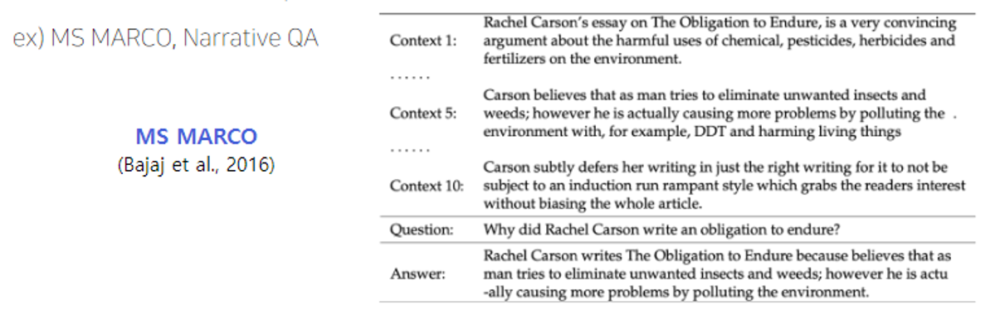

3. Multiple-choice Datasets
- 질의에 대한 답을 여러 개의 answer candidates 중 하나로 고르는 형태
- e.g., MCTest, RACE, ARC, etc.

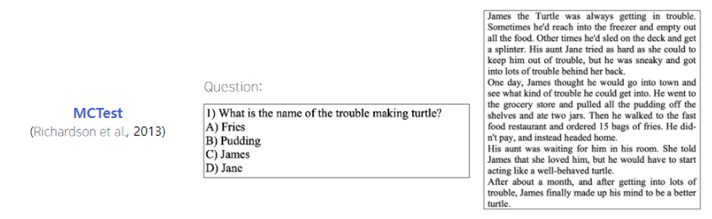


- MRC의 시작은 언제일까? 연구자마다 다름
- 분명한 것은 2013, 2015~ 엄청나게 발전을 거듭함!

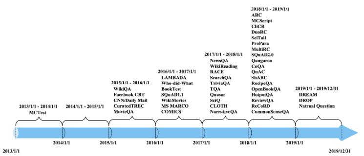

### Challenges in MRC

#### 동일한 의미의 문장을 이해하는 것

- 단어들의 구성이 유사하지는 않지만 동일한 의미의 문장을 이해
- example: DuoRC(paraphrased paragraph) / QuoRef(coreference resolution)
- 아래 예제를 보면 P1이 P2보다 상대적으로 쉬워보임
- Coreference Resolution, 단어가 무엇을 지칭하는지를 알아야 지문을 이해할 수 있는 경우가 많음
    - 이 task도 상당히 중요함

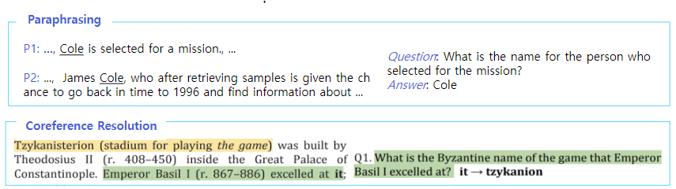

#### Unanswerable questions
- ex. SQuAD 2.0
- 아래 예시에서 later laws가 모델 입장에서 맞는 답이지만 사실은 답이 없음

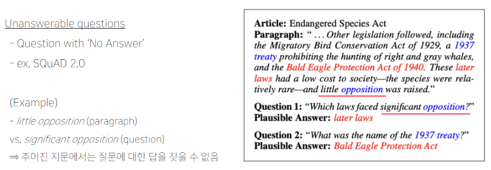

#### Multi-hop reasoning
- 여러 개의 document에서 질의에 대한 supporting fact를 찾아야지만 답을 찾을 수 있음
- ex. HotpotQA, QAngaroo

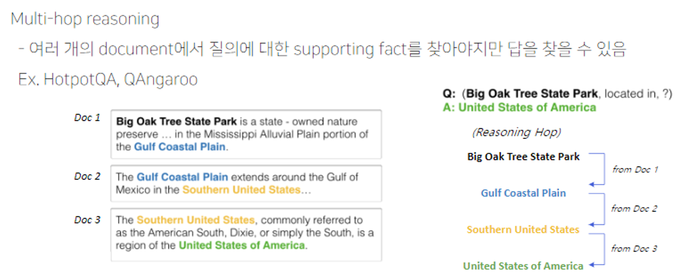

### MRC의 평가 방법

#### 1) Exact Match / F1 Score
- For extractive answer and multiple-choice answer datasets

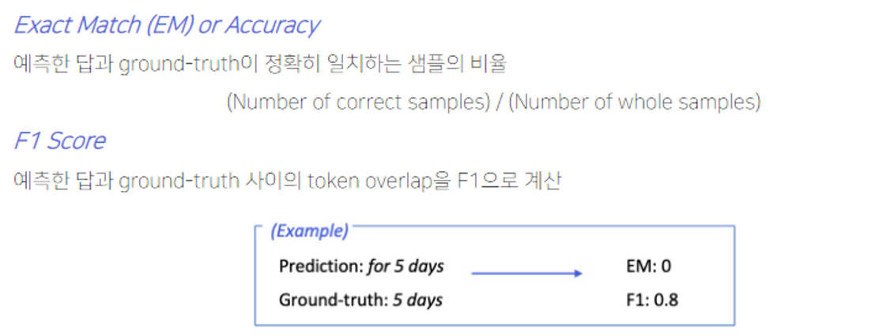

#### 2) ROUGE-L / BLEU
- For descriptive answer datasets
- Ground-truth와 예측한 답 사이의 overlap을 계산

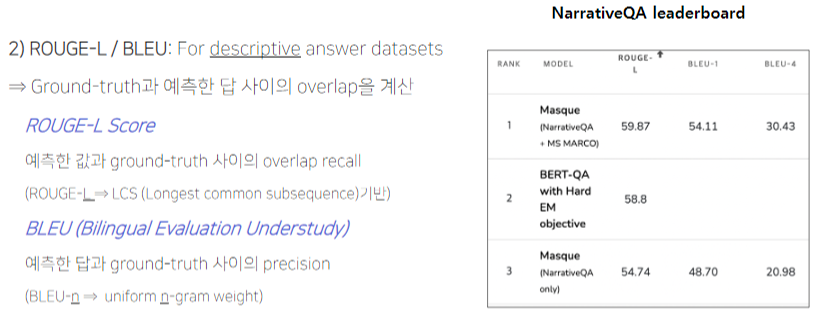

## 2. Unicode & Tokenization

### Unicode란?
- 전 세계의 모든 문자를 일관되게 표현하고 다룰 수 있도록 만들어진 문자셋
- 각 문자마다 숫자 하나에 매핑한다

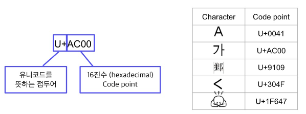

### 인코딩 & UTF-8
- **인코딩이란?** 문자를 컴퓨터에서 저장 및 처리할 수 있게 이진수로 바꾸는 것
- **UTF-8 (Unicode Transformation Format)**
    - 현재 가장 많이 쓰는 인코딩 방식
    - 문자 타입에 따라 다른 길이의 바이트를 할당한다
    - 1 bytes: Standard ASCII
    - 2 bytes: Arabic, Hebrew, most European scripts
    - 3 bytes: BMP(Basic Multilingual Piane) - 대부분의 현대 글자 (한글 포함)
    - 4 bytes: All Unicode characters - 이모지 등

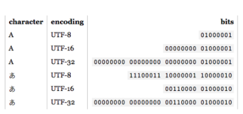

### Python에서 Unicode 다루기
- Python3부터는 string 타입을 유니코드 표준을 사용

```python
>>> ord("A")
65
>>> hex(ord("A"))
'0x41'
>>> chr(44032)
'가'
>>> chr(0xAC00)
'가'
>>> ord("가")
44032
>>> hex(ord("가"))
'0xac00'
>>> chr(65)
'A'
>>> chr(0x41)
'A'
```

### Unicode와 한국어
- 한국어는 한자 다음으로 유니코드에서 많은 코드를 차지하고 있는 문자

#### 완성형
- 현대 한국어의 자모 조합으로 나타낼 수 있는 모든 완성형 한글 11,172자 (가, 각, ...)
- `U+AC00` ~ `U+D7A3`

#### 조합형
- 조합하여 글자를 만들 수 있는 초,중,종성
- `U+1100` ~ `U+11FF`, `U+A960` ~ `U+A97F`, `U+D7B0` ~ `U+D7FF`

#### 코드 예시

```python
>>> chr(0x1100)
'ㄱ'
>>> chr(0x1161)
'ㅏ'
>>> chr(0x1100) + chr(0x1161)
'가'
>>> len('가') # 조합형
2
>>> len('가') # 완성형
1
```

### 토크나이징
- 텍스트를 토큰 단위로 나누는 것
- 단어(띄어쓰기 기준), 형태소, subword 등 여러 토큰 기준이 사용된다

#### Subword Tokenizing
- 자주 쓰이는 글자 조합은 한 단위로 취급
- 자주 쓰이지 않는 조합은 subword로 쪼갬
- `##`은 디코딩 (토크나이징의 반대 과정)을 할 때 해당 토큰을 앞 토큰에 띄어쓰기 없이 붙인다는 것을 의미

```python
from transformers import BertTokenizer

tokenizer = BertTokenizer.from_pretrained("bert-base-multilingual-cased")
tokenizer.tokenize("아버지 가방에 들어가신다")
```
```
['아버지', '가', '##방', '##에', '들어', '##가', '##신', '##다']
```

#### BPE (Byte-Pair Encoding)
- 데이터 압축용으로 제안된 알고리즘
- NLP에서 토크나이징용으로 활발하게 사용
- 어떻게 동작하는가?
    1. 가장 자주 나오는 글자 단위 Bigram (or Byte pair)
    2. 치환된 글자를 저장
    3. 1~2번을 반복

## 3. Looking into the Dataset

### KorQuAD 훑어보기

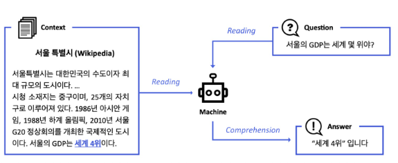

- LG CNS가 AI 언어지능 연구를 위해 공개한 질의응답/기계독해 한국어 데이터셋
- 인공지능이 한국어 질문에 대한 답변을 하도록 필요한 학습 데이터셋
- 1,550개의 위키피디아 문서에 대해서 10,649 건의 하위 문서들과 크라우드 소싱을 통해 제작한 63,952개의 질의응답 쌍으로 구성
    - TRAIN 60,407 / DEV 5,774 / TEST 3,898
- 누구나 데이터를 내려받고, 학습한 모델을 제출하고 공개된 리더보드에 평가를 받을 수 있음
    - 객관적인 기준을 가진 연구 결과 공유가 가능해짐
- 현재 v1.0, v2.0 공개
    - 2.0은 보다 긴 분량의 문서가 포함되어 있다
    - 단순 자연어 문장 뿐 아니라 복잡한 표와 리스트 등을 포함하는 HTML 형태로 표현
    - 즉, 문장 전체 구조에 대한 이해가 필요

### KorQuAD


### KorQuAD 데이터 수집 과정
- SQuAD v1.0의 데이터 수집 방식을 벤치마크하여 표준성을 확보

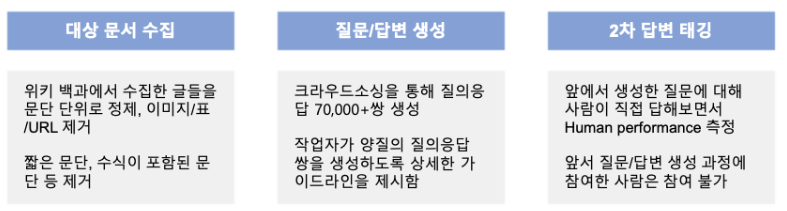

### Huggingface datasets 라이브러리 소개
- Huggingface에서 만든 datasets는 자연어처리에 사용되는 대부분의 데이터셋과 평가 지표를 접근하고 공유할 수 있게끔 만든 라이브러리
- Numpy, Pandas, PyTorch, Tensorflow2와 호환
- 접근가능한 모든 데이터셋이 memory-mapped, cached되어있어 데이터를 로드하면서 생기는 메모리 공간 부족이나 전처리 과정 반복의 번거로움 등을 피할 수 있음

```python
from datasets import load_dataset
dataset = load_dataset("squad_kor_v1", split="train")
```

### KorQuAD 예시

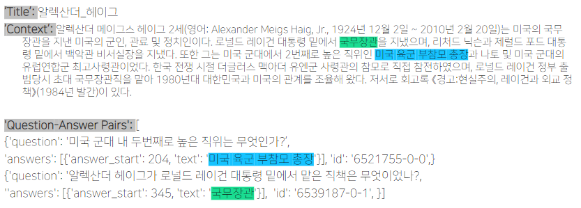

- 실제 데이터 출력 형태

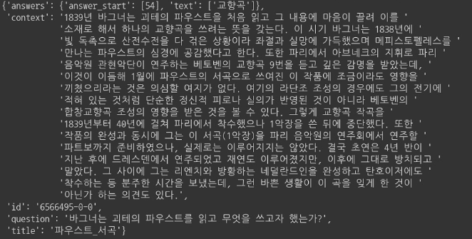

### KorQuAD 통계치
- 질문 유형

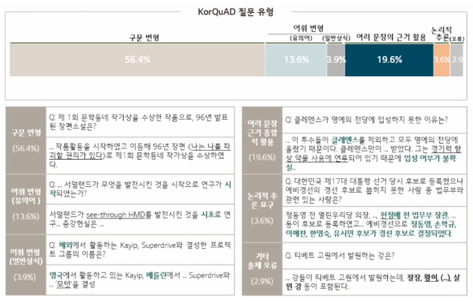

- 답변 유형

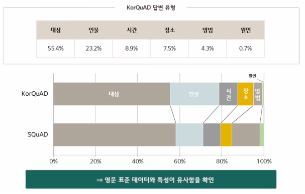

## 4. Practice 1 - Looking into KorQuAD

```python
!pip install datasets==1.4.1
!pip install transformers==4.4.1
```

- 데이터셋 호출
```python
from datasets import load_dataset

dataset = load_dataset("squad_kor_v1")
dataset
```
```
DatasetDict({
    train: Dataset({
        features: ['id', 'title', 'context', 'question', 'answers'],
        num_rows: 60407
    })
    validation: Dataset({
        features: ['id', 'title', 'context', 'question', 'answers'],
        num_rows: 5774
    })
})
```

- Get example

```python
import random
pick = random.randint(0, len(dataset['train'])-1)
example = dataset['train'][pick]
example
```
```
{'answers': {'answer_start': [323], 'text': ['2억 3556만 달러']},
 'context': '한편 그가 베트남 전쟁에 한국군을 파병하여 벌어들인 돈이 1970년대의 경제 개발의 배경이 됐다는 견해도 있다. 그에 의하면 1961년, 5.16 군사정변으로 집권한 박정희 국가재건최고회의 의장을 케네디 대통령은 별로 달가워하지 않았으나 한국 정부가 베트남 파병을 3200명으로 확대하면서 이에 베트남에 한국군을 파병하겠다는 제안을 받아들여 베트남전 파병이 이루어졌다. 이후 1964년부터 파견된 베트남전쟁 파병으로 향후 한국경제 발전의 원동력에 가속화가 되었다. 1965년부터 1973년까지 한국군의 베트남전 참전 기간에 파병 국군장병이 해외근무 수당으로 벌어들인 수입은 총 2억 3556만 달러였다. 이 중 82.8%에 달하는 1억 9511만 달러가 국내로 송금되었고, 이 돈으로 경부고속도로 건설 등에 기여되었다. 전쟁에 조달할 군수물자 납품과 용역사업 투입 등으로 한국 기업들은 베트남전 특수(特需)를 톡톡히 누렸다. 국군의 파병 대가로 들어온 외화 송금에 힘입어 당시 내수산업과 수출이 성장하여 호황을 누리게 되었다. 전투병 파병 직전인 1964년 한국의 1인당 국민총생산(GNP)은 103달러에서 한국군 철수가 끝난 1974년엔 5배가 넘는 541달러로 국민 소득을 향상시켰다. 베트남 파병은 한국 경제의 활로를 트고 군을 현대화하는 데 기여하였다는 긍정적인 평가와 함께 베트남 파병이 국군의 목숨을 담보로 한 미국의 용병일 뿐이었다는 비판도 있다.',
 'id': '6530241-44-1',
 'question': '한국군이 베트남전에 참전해 파병 국군장병이 해외근무 수당으로 벌어들인 총 수입은?',
 'title': '박정희'}
```
- `answer start`는 context에서 answer가 시작하는 부분을 가리킴

```python
context = example['context']
answer_text = example['answers']['text'][0]
answer_start = example['answers']['answer_start'][0]
answer_end = answer_start + len(answer_text)
print('Answer from context', context[answer_start:answer_end])
```
```
Answer from context 2억 3556만 달러
```

- 토크나이징
    - `map`으로 적용

```python
def prepare_train_features(examples):
    # 주어진 텍스트를 토크나이징 한다. 이 때 텍스트의 길이가 max_seq_length를 넘으면 stride만큼 슬라이딩하며 여러 개로 쪼갬.
    # 즉, 하나의 example에서 일부분이 겹치는 여러 sequence(feature)가 생길 수 있음.
    tokenized_examples = tokenizer(
        examples["question"],
        examples["context"],
        truncation="only_second",  # max_seq_length까지 truncate한다. pair의 두번째 파트(context)만 잘라냄.
        max_length=max_seq_length,
        stride=doc_stride,
        return_overflowing_tokens=True, # 길이를 넘어가는 토큰들을 반환할 것인지
        return_offsets_mapping=True,  # 각 토큰에 대해 (char_start, char_end) 정보를 반환한 것인지
        padding="max_length",
    )

    # example 하나가 여러 sequence에 대응하는 경우를 위해 매핑이 필요함.
    overflow_to_sample_mapping = tokenized_examples.pop("overflow_to_sample_mapping")
    # offset_mappings으로 토큰이 원본 context 내 몇번째 글자부터 몇번째 글자까지 해당하는지 알 수 있음.
    offset_mapping = tokenized_examples.pop("offset_mapping")

    # 정답지를 만들기 위한 리스트
    tokenized_examples["start_positions"] = []
    tokenized_examples["end_positions"] = []

    for i, offsets in enumerate(offset_mapping):
        input_ids = tokenized_examples["input_ids"][i]
        cls_index = input_ids.index(tokenizer.cls_token_id)

        # 해당 example에 해당하는 sequence를 찾음.
        sequence_ids = tokenized_examples.sequence_ids(i)

        # sequence가 속하는 example을 찾는다.
        example_index = overflow_to_sample_mapping[i]
        answers = examples["answers"][example_index]

        # 텍스트에서 answer의 시작점, 끝점
        answer_start_offset = answers["answer_start"][0]
        answer_end_offset = answer_start_offset + len(answers["text"][0])

        # 텍스트에서 현재 span의 시작 토큰 인덱스
        token_start_index = 0
        while sequence_ids[token_start_index] != 1:
            token_start_index += 1

        # 텍스트에서 현재 span 끝 토큰 인덱스
        token_end_index = len(input_ids) - 1
        while sequence_ids[token_end_index] != 1:
            token_end_index -= 1

        # answer가 현재 span을 벗어났는지 체크
        if not (offsets[token_start_index][0] <= answer_start_offset and offsets[token_end_index][1] >= answer_end_offset):
            tokenized_examples["start_positions"].append(cls_index)
            tokenized_examples["end_positions"].append(cls_index)
        else:
            # token_start_index와 token_end_index를 answer의 시작점과 끝점으로 옮김
            while token_start_index < len(offsets) and offsets[token_start_index][0] <= answer_start_offset:
                token_start_index += 1
            tokenized_examples["start_positions"].append(token_start_index - 1)
            while offsets[token_end_index][1] >= answer_end_offset:
                token_end_index -= 1
            tokenized_examples["end_positions"].append(token_end_index + 1)

    return tokenized_examples
```

- 평가지표 계산하기

```python
from datasets import load_metric

metric = load_metric("squad")
metric
```
```
Metric(name: "squad", features: {'predictions': {'id': Value(dtype='string', id=None), 'prediction_text': Value(dtype='string', id=None)}, 'references': {'id': Value(dtype='string', id=None), 'answers': Sequence(feature={'text': Value(dtype='string', id=None), 'answer_start': Value(dtype='int32', id=None)}, length=-1, id=None)}}, usage: """
Computes SQuAD scores (F1 and EM).
Args:
    predictions: List of question-answers dictionaries with the following key-values:
        - 'id': id of the question-answer pair as given in the references (see below)
        - 'prediction_text': the text of the answer
    references: List of question-answers dictionaries with the following key-values:
        - 'id': id of the question-answer pair (see above),
        - 'answers': a Dict in the SQuAD dataset format
            {
                'text': list of possible texts for the answer, as a list of strings
                'answer_start': list of start positions for the answer, as a list of ints
            }
            Note that answer_start values are not taken into account to compute the metric.
Returns:
    'exact_match': Exact match (the normalized answer exactly match the gold answer)
    'f1': The F-score of predicted tokens versus the gold answer
Examples:

    >>> predictions = [{'prediction_text': '1976', 'id': '56e10a3be3433e1400422b22'}]
    >>> references = [{'answers': {'answer_start': [97], 'text': ['1976']}, 'id': '56e10a3be3433e1400422b22'}]
    >>> squad_metric = datasets.load_metric("squad")
    >>> results = squad_metric.compute(predictions=predictions, references=references)
    >>> print(results)
    {'exact_match': 100.0, 'f1': 100.0}
""", stored examples: 0)
```

```python
metric.compute(
    references=[
        {"id": example0["id"],
        "answers": example0["answers"]}
    ],
    predictions=[
        {"id": example0["id"],
        "prediction_text": "교향곡"}
    ]
)
```
```
{'exact_match': 100.0, 'f1': 100.0}
```
```python
metric.compute(
    references=[
        {"id": example0["id"],
        "answers": example0["answers"]}
    ],
    predictions=[
        {"id": example0["id"],
        "prediction_text": "교향곡 9번"}
    ]
)
```
```
{'exact_match': 0.0, 'f1': 66.66666666666666}
```
```python
metric.compute(
    references=[
        {"id": e["id"],
        "answers": e["answers"]}
        for e in [example0, example1]
    ],
    predictions=[
        {"id": example0["id"],
        "prediction_text": "교향곡"},
        {"id": example1["id"],
        "prediction_text": "1악장"},
    ]
)
```
```
{'exact_match': 50.0, 'f1': 83.33333333333333}
```


## Reference
- https://www.slideshare.net/SeungyoungLim/korquad-introduction:KorQuADintroduction (LGCNS)
- Neural Machine Reading Comprehension: Methods and Trends (Liuetal., Applied Science, 2019)
- MS MARCO: A Human Generated MAchine Reading COmprehension Dataset (Bajaj et al. NIPS2016)
- MCTest: A Challenge Dataset for the Open-Domain Machine Comprehension of Text (Richardson, EMNLP2013)
- Know What You Don’t Know: Unanswerable Questions for SQuAD (Rajpurkar et al., ACL2018)
- HOTPOTQA: A Dataset for Diverse, Explainable Multi-hop Question Answering (Yangetal., EMNLP 2018)
- Multi-hop Question Answering via Reasoning Chains (Chenetal., 2019)
- https://paperswithcode.com/sota/question-answering-on-narrativeqa
- DuoRC: Towards Complex Language Understanding with Paraphrased Reading Comprehension (Sahaetal., ACl2018)
- KorQuAD 2.0: 웹문서 기계독해를 위한 한국어 질의응답 데이터셋(Kimetal.,2019)
- 한국어 MRC연구를 위한 표준 데이터셋(KorQuAD)소개및 B2B를위한 MRC연구 사례, https://tv.naver.com/v/5564630
- What Every Programmer Absolutely, Positively Needs To Know About Encodings And Character Sets To Work With Text, https://kunststube.net/encoding/
- Byte pair encoding, https://en.wikipedia.org/wiki/Byte_pair_encoding


## Further Reading
- [문자열 type에 관련된 정리글](https://kunststube.net/encoding/)
- [KorQuAD 데이터 소개 슬라이드](https://www.slideshare.net/SeungyoungLim/korquad-introduction)
- [Naver Engineering: KorQuAD 소개 및 MRC 연구 사례 영상](https://tv.naver.com/v/5564630)
