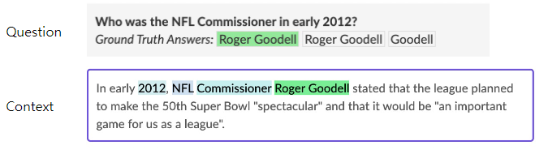
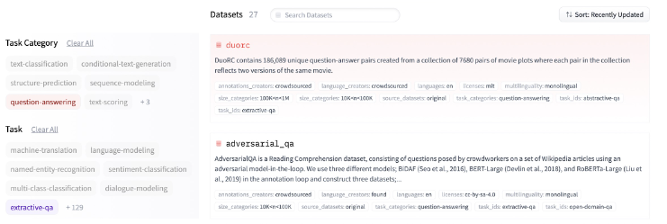
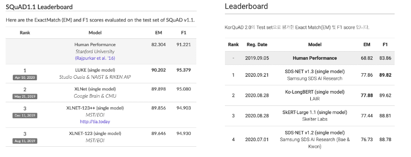
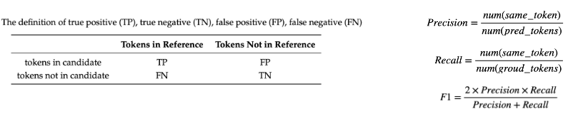
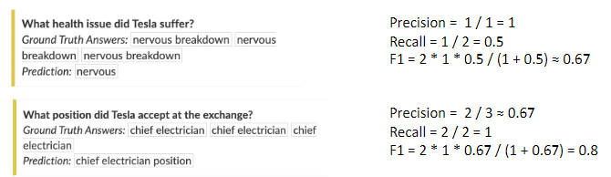
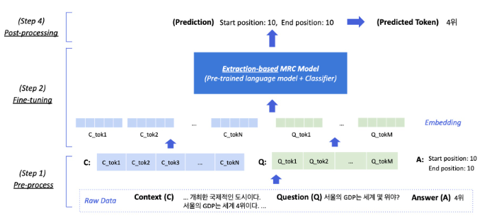
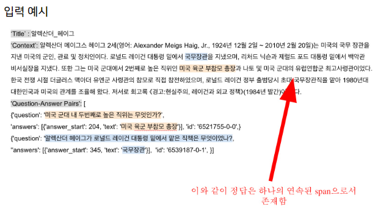
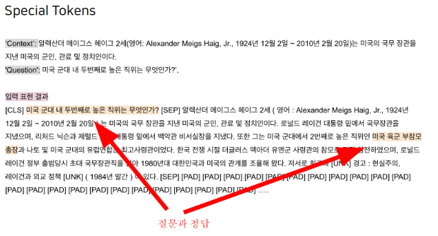
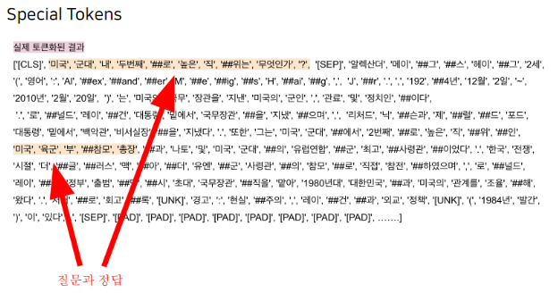
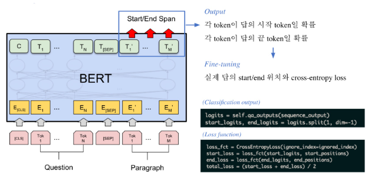

# 2강 Extraction-based MRC
2강에서는 추출기반으로 기계독해를 푸는 방법에 대해 알아보겠습니다. 추출기반으로 기계독해 문제에 접근한다는 것의 의미를 이해하고, 실제 추출기반 기계독해를 어떻게 풀 수 있을지에 대해 배워볼 예정입니다. 학습 전 준비해야할 단계와 모델 학습 단계, 그리고 추출기반으로 얻어낸 답을 원하는 텍스트의 형태로 변형하는 방법에 대해 이번 강의에서 자세히 알아보겠습니다.

[back to super](https://github.com/jinmang2/boostcamp_ai_tech_2/tree/main/p-stage/mrc)

## 1. Extraction-based MRC

### Extraction-based MRC 문제 정의
- 질문(question)의 답변(answer)이 항상 주어진 지문(context)내에 span으로 존재
- e.g., SQuAD, KorQuAD, NewsQA, Natural Questions, etc.



- huggingface의 datasets에서 다운로드


### Extraction-based MRC 평가 방법
- Exact Match와 F1 Score



#### Exact Matct (EM) Score
- 예측값과 정답이 캐릭터 단위로 완전히 똑같을 경우에만 1점 부여


#### F1 Score
- 예측값과 정답의 overlap을 비율로 계산
- 0점과 1점 사이의 부분 점수를 받을 수 있음
- precision: 예측값에서 일치하는 토큰 갯수
    - 쓸데없이 예측값이 길어지면 점수가 낮아짐
- recall: 실젯값에서 일치하는 토큰 갯수
    - 둘이 겹치는 단어가 적어지는 것에 더욱 민감하게 반영




### Extraction-based MRC Overview


## 2. Pre-processing



### Tokenization
텍스트를 작은 단위(Token)으로 나누는 것
- 띄어쓰기 기준, 형태소, subword 등 여러 단위 토큰 기준이 사용됨
- 최근엔 Out-Of-Vocabulary(OOV) 문제를 해결해주고 정보학적으로 이점을 가진 BPE를 주로 사용
- 본강에서는 BPE 방법론 중 하나인 WordPiece Tokenizer를 사용



- 위를 토크나이징하면 아래처럼 나옴



#### Attention Mask
- 입력 시퀀스 중에서 attention을 연산할 때 무시할 토큰을 표시
- 0은 무시, 1은 연산에 포함
- 보통 [PAD]와 같은 의미가 없는 특수토큰을 무시하기 위해 사용

#### Token Type IDs
- 입력이 두 개 이상의 시퀀스일 때 (e.g., 질문 & 지문), 각각에게 ID를 부여하여 모델이 구분해서 해석하도록 유도

#### 모델 출력값
- 정답은 문서 내에 존재하는 연속된 단어 토큰(Span)
- 즉, span의 시작과 끝 위치를 알면 정답을 맞출 수 있음
- Extraction-based에선 답안을 생성하기 보다 시작위치와 끝위치를 예측하도록 학습
- 즉, Token Classification 문제로 치환

## 3. Fine-tuning

### Fine-tuning BERT



## 4. Post-processing

### 불가능한 답 제거하기
아래의 경우 candidate list에서 제거
- End position이 Start position보다 앞에 있는 경우 (e.g., start=90, end=80)
- 예측한 위치가 context를 벗어난 경우 (e.g., question 위치쪽에 답이 나온 경우)
- 미리 설정한 max_answer_length보다 길이가 더 긴 경우

### 최적의 답안 찾기
1. Start/end position prediction에서 score(logits)가 가장 높은 N개를 각각 찾는다
2. 불가능한 start/end 조합을 제거한다
3. 가능한 조합들을 score의 합이 큰 순서대로 정렬한다
4. Score가 가장 큰 조합을 최종 예측으로 선정한다
5. Top-k가 필요한 경우 차례대로 내보낸다

## 5. Practice
- huggingface의 qa examples 실습
- 코드 공개 가능

### 데이터 및 평가지표 불러오기

```python
from datasets import load_dataset
from datasets import load_metric

datasets = load_dataset("squad_kor_v1")
metric = load_metric('squad')
```

### 토크나이저 및 모델 호출
```python
from transformers import (
    AutoConfig,
    AutoModelForQuestionAnswering,
    AutoTokenizer
)

model_name = "bert-base-multilingual-cased"

config = AutoConfig.from_pretrained(
    model_name
)
tokenizer = AutoTokenizer.from_pretrained(
    model_name,
    use_fast=True
)
model = AutoModelForQuestionAnswering.from_pretrained(
    model_name,
    config=config
)
```

### 설정값

```python
max_seq_length = 384 # 질문과 컨텍스트, special token을 합한 문자열의 최대 길이
pad_to_max_length = True
doc_stride = 128 # 컨텍스트가 너무 길어서 나눴을 때 오버랩되는 시퀀스 길이
max_train_samples = 16
max_val_samples = 16
preprocessing_num_workers = 4
batch_size = 4
num_train_epochs = 2
n_best_size = 20
max_answer_length = 30
```

### 전처리하하기

```python
# select sample
# randint로 random sampling도 가능
train_dataset = train_dataset.select(range(max_train_samples))
# 기존에 있던 column은 제거
column_names = datasets["train"].column_names
train_dataset = train_dataset.map(
    prepare_train_features,
    batched=True,
    num_proc=preprocessing_num_workers,
    remove_columns=column_names,
    load_from_cache_file=True,
)
```

예를 들어 아래와 같은 sample이 있다고 가정하자.

```python
question = "수학의 세부분야로는 무엇이 있는가?"
context = """수학(數學, 영어: mathematics,줄여서 math)은 수, 양, 구조, 공간, 변화 등의 개념을 다루는 학문이다.[1] 널리 받아들여지는 명확한 정의는 없으나[2] 현대 수학은 일반적으로 엄밀한 논리에 근거하여 추상적 대상을 탐구하며, 이는 규칙의 발견과 문제의 제시 및 해결의 과정으로 이루어진다.[3] 수학은 그 발전 과정에 있어서 철학, 과학과 깊은 연관을 맺고 있으며, 다만 엄밀한 논리와 특유의 추상성, 보편성에 의해 다른 학문들과 구별된다. 특히 수학은 과학의 여느 분야들과는 달리 자연계에서 관측되지 않는 개념들에 대해서까지 이론을 추상화시키는 특징을 보이는데, 수학자들은 그러한 개념들에 대한 추측을 제시하고 적절하게 선택된 정의와 공리로부터 엄밀한 연역을 거쳐 그 진위를 파악한다. 수학의 개념들은 기원전 600년 경에 활동하며 최초의 수학자로도 여겨지는 탈레스의 기록은 물론, 다른 고대 문명들에서도 찾아볼 수 있으며 인류의 문명과 함께 발전해왔다. 오늘날 수학은 자연과학, 사회과학, 공학, 의학 등 다른 여러 학문에서도 핵심적인 역할을 하며 다양한 방식으로 응용된다. 수학을 의미하는 매스매틱스(mathematics)라는 단어는 '아는 모든 것', '배우는 모든 것'이라는 뜻의 고대 그리스어 'máthēma'(μάθημα) 및 그 활용형 mathēmatikós(μαθηματικός)에서 유래되었다. 역사적으로 고대부터 현대에 이르기까지 문명에 필수적인 건축, 천문학, 정치, 상업 등에 수학적 개념들이 응용되어 왔다. 교역·분배·과세 등 인류의 사회 생활에 필요한 모든 계산에 수학이 관여해 왔고, 농경 생활에 필수적인 천문 관측과 달력의 제정, 토지의 측량 또한 수학이 직접적으로 사용된 분야이다. 고대 수학을 크게 발전시킨 문명으로는 이집트, 인도, 중국, 그리스 등이 있다. 특히 고대 그리스 문명에서는 처음으로 방정식에서 변수를 문자로 쓰는 등 추상화가 발전하였고 유클리드의 원론에서는 최초로 엄밀한 논증에 근거한 수학이 나타난다. 수학의 발전은 이후로도 계속되어 16세기의 르네상스에 이르러서는 과학적 방법과의 상호 작용을 통해 수학과 자연과학에 있어서 혁명적인 연구들이 진척되었고, 이는 인류 문명 발달에 큰 영향을 미치게 되었다. 수학의 각 분야들은 상업에 필요한 계산을 하기 위해, 숫자들의 관계를 이해하기 위해, 토지를 측량하기 위해, 그리고 천문학적 사건들을 예견하기 위해 발전되어왔다. 이 네 가지 목적은 대략적으로 수학이 다루는 대상인 양, 구조, 공간 및 변화에 대응되며, 이들을 다루는 수학의 분야를 각각 산술, 대수학, 기하학, 해석학이라 한다. 또한 이 밖에도 근대 이후에 나타난 수학기초론과 이산수학 및 응용수학 등이 있다. 산술은 자연수와 정수 및 이에 대한 사칙연산에 대한 연구로서 시작했다. 수론은 이런 주제들을 보다 깊게 다루는 학문으로, 그 결과로는 페르마의 마지막 정리 등이 유명하다. 또한 쌍둥이 소수 추측과 골드바흐 추측 등을 비롯해 오랜 세월 동안 해결되지 않고 남아있는 문제들도 여럿 있다. 수의 체계가 보다 발전하면서, 정수의 집합을 유리수의 집합의 부분집합으로 여기게 되었다. 또한 유리수의 집합은 실수의 집합의 부분집합이며, 이는 또다시 복소수 집합의 일부분으로 볼 수 있다. 여기에서 더 나아가면 사원수와 팔원수 등의 개념을 생각할 수도 있다. 이와는 약간 다른 방향으로, 자연수를 무한대까지 세어나간다는 개념을 형식화하여 순서수의 개념을 얻으며, 집합의 크기 비교를 이용하여 무한대를 다루기 위한 또다른 방법으로는 기수의 개념도 있다. 수 대신 문자를 써서 문제해결을 쉽게 하는 것과, 마찬가지로 수학적 법칙을 일반적이고 간명하게 나타내는 것을 포함한다. 고전대수학은 대수방정식 및 연립방정식의 해법에서 시작하여 군, 환, 체 등의 추상대수학을 거쳐 현대에 와서는 대수계의 구조를 보는 것을 중심으로 하는 선형대수학으로 전개되었다. 수의 집합이나 함수와 같은 많은 수학적 대상들은 내재적인 구조를 보인다. 이러한 대상들의 구조적 특성들이 군론, 환론, 체론 그리고 그 외의 수많은 대수적 구조들을 연구하면서 다루어지며, 그것들 하나하나가 내재적 구조를 지닌 수학적 대상이다. 이 분야에서 중요한 개념은 벡터, 벡터 공간으로의 일반화, 그리고 선형대수학에서의 지식들이다. 벡터의 연구에는 산술, 대수, 기하라는 수학의 중요한 세개의 분야가 조합되어 있다. 벡터 미적분학은 여기에 해석학의 영역이 추가된다. 텐서 미적분학은 대칭성과 회전축의 영향 아래에서 벡터의 움직임을 연구한다. 눈금없는 자와 컴퍼스와 관련된 많은 고대의 미해결 문제들이 갈루아 이론을 사용하여 비로소 해결되었다. 공간에 대한 연구는 기하학에서 시작되었고, 특히 유클리드 기하학에서 비롯되었다. 삼각법은 공간과 수들을 결합하였고, 잘 알려진 피타고라스의 정리를 포함한다. 현대에 와서 공간에 대한 연구는, 이러한 개념들은 더 높은 차원의 기하학을 다루기 위해 비유클리드 기하학(상대성이론에서 핵심적인 역할을 함)과 위상수학으로 일반화되었다. 수론과 공간에 대한 이해는 모두 해석 기하학, 미분기하학, 대수기하학에 중요한 역할을 한다. 리 군도 공간과 구조, 변화를 다루는데 사용된다. 위상수학은 20세기 수학의 다양한 지류속에서 괄목할만한 성장을 한 분야이며, 푸앵카레 추측과 인간에 의해서 증명되지 못하고 오직 컴퓨터로만 증명된 4색정리를 포함한다. 변화에 대한 이해와 묘사는 자연과학에 있어서 일반적인 주제이며, 미적분학은 변화를 탐구하는 강력한 도구로서 발전되었다. 함수는 변화하는 양을 묘사함에 있어서 중추적인 개념으로써 떠오르게 된다. 실수와 실변수로 구성된 함수의 엄밀한 탐구가 실해석학이라는 분야로 알려지게 되었고, 복소수에 대한 이와 같은 탐구 분야는 복소해석학이라고 한다. 함수해석학은 함수의 공간(특히 무한차원)의 탐구에 주목한다. 함수해석학의 많은 응용분야 중 하나가 양자역학이다. 많은 문제들이 자연스럽게 양과 그 양의 변화율의 관계로 귀착되고, 이러한 문제들이 미분방정식으로 다루어진다. 자연의 많은 현상들이 동역학계로 기술될 수 있다. 혼돈 이론은 이러한 예측 불가능한 현상을 탐구하는 데 상당한 기여를 한다. 수학의 기초를 확실히 세우기 위해, 수리논리학과 집합론이 발전하였고, 이와 더불어 범주론이 최근에도 발전되고 있다. “근본 위기”라는 말은 대략 1900년에서 1930년 사이에 일어난, 수학의 엄밀한 기초에 대한 탐구를 상징적으로 보여주는 말이다. 수학의 엄밀한 기초에 대한 몇 가지 의견 불일치는 오늘날에도 계속되고 있다. 수학의 기초에 대한 위기는 그 당시 수많은 논쟁에 의해 촉발되었으며, 그 논쟁에는 칸토어의 집합론과 브라우어-힐베르트 논쟁이 포함되었다. 오늘날 수학은 자연과학, 공학뿐만 아니라, 경제학 등의 사회과학에서도 중요한 도구로 사용된다. 예를 들어, 정도의 차이는 있으나, 미적분학과 선형대수학은 자연과학과 공학, 경제학을 하는데에 필수적 과목으로 여겨지며, 확률론은 계량경제학에 응용된다. 통계학은 사회과학 이론에 근거를 마련하는데 필수적이다. 16세기에 갈릴레오 갈릴레이가 "자연이라는 책은 수학이라는 언어로 기록되어 있다."는 주장과 함께 물리학에 수학적 방법을 도입하였고, 17세기에 아이작 뉴턴이 고전 역학의 기본 물리학 법칙들을 수학적으로 기술하고 정립하여 물리학 이론에서 수학적 모델링은 필수적 요소가 되었다. 또한 이 시기는 과학적 방법이 정립되는 시기이기도 한데, 많은 과학적 현상들이 수학적 관계가 있음이 드러나면서 과학적 방법에도 수학은 중요한 역할을 하고 있다. 노벨 물리학상 수상자 유진 위그너는 그의 에세이 "The unreasonable effectiveness of mathematics in natural sciences"에서 인간 세상과 동떨어져있고 현실과 아무 관련이 없다고 여겨지던 수학 중 극히 일부는 뜻밖에도 자연과학과 연관성이 드러나고 과학이론에 효과적인 토대를 마련해 주는데에 대한 놀라움을 표현하였다.[4] 예를 들어, 비유클리드 기하학과 3차원 이상의 임의의 차원에서 기하학을 탐구했던 미분 기하학은 당시에는 현실과 연관성을 가지지 않았으나 먼 훗날 일반상대성이론이 4차원 기하학을 필요로 함에 따라, 물리적 세상과 연관이 있음이 밝혀졌다. 또한 게이지이론, 양자장론 등에도 미분 기하학은 필수적이다. 또한 수학은 음악이나 미술 등 예술과도 관련이 있다. 피타고라스는 두 정수의 비율이 듣기 좋은 소리가 난다는 점을 가지고 피타고라스 음계를 만들었다. 중세시대에도 음악과 수학을 밀접하게 연관시켰으며 성 빅토르의 후고는 “음악은 조화다”라고 했고, 성 트론드의 루돌프는 “음악은 조화의 토대(ratio)다”라고 쓴 바 있다. 조화가 반드시 소리로 표현될 필요는 없고 소리의 음악은 음악의 형식 중 하나에 불과했다. 소리에 대해 다루었던 중세의 저술가들이 있는가 하면, 조화와 비례의 추상적 이론만을 다루고 소리에는 거의 관심을 보이지 않았던 저술가들도 있었다. 청각적인 면과 추상적인 면이라는 음악의 이런 이중적 측면은 고대의 음악이론보다는 중세의 음악이론에서 큰 특징이 되었다.[5] 또한 현대 음악을 군(群,group)같은 수학적 대상을 이용해 분석하기도 한다. 원근법은 사영 기하학에 해당한다. 미술 사조 중 하나인 입체파도 기하학의 영향을 받았다."""
print(tokenizer.tokenize(question), tokenizer.tokenize(context))
```
```
(14, 2765)
```

이를 토크나이징하면

```python
tokenized_examples = tokenizer(
    question,
    context,
    truncation="only_second",  # max_seq_length까지 truncate한다. pair의 두번째 파트(context)만 잘라냄.
    max_length=510,
    stride=128,
    return_overflowing_tokens=True, # 길이를 넘어가는 토큰들을 반환할 것인지
    return_offsets_mapping=True,  # 각 토큰에 대해 (char_start, char_end) 정보를 반환한 것인지
    padding="max_length",
)

for key, value in tokenized_examples.items():
    print(key, len(value))
```
```
input_ids 8
token_type_ids 8
attention_mask 8
offset_mapping 8
overflow_to_sample_mapping 8
```

#### truncation?
- max_seq_length까지 자름
- only_second 옵션일 경우 pair의 두번째 파트(본 예시에선 context)만 잘라냄

#### overflow_to_sample_mapping?
- example 하나가 여러 sequence에 대응하는 경우를 위해 매핑이 필요
- https://www.ohsuz.dev/mrc-cookbook/1st-daily-mission
- 위의 예시에서 보면

```python
tokenized_examples["overflow_to_sample_mapping"]
# [0, 0, 0, 0, 0, 0, 0, 0]
```

- 왜 0만 있을까?
- 구현을 보자
    - https://huggingface.co/transformers/_modules/transformers/tokenization_utils_fast.html

```python
# Convert the output to have dict[list] from list[dict] and remove the additional overflows dimension
# From (variable) shape (batch, overflows, sequence length) to ~ (batch * overflows, sequence length)
# (we say ~ because the number of overflow varies with the example in the batch)
#
# To match each overflowing sample with the original sample in the batch
# we add an overflow_to_sample_mapping array (see below)
sanitized_tokens = {}
for key in tokens_and_encodings[0][0].keys():
    stack = [e for item, _ in tokens_and_encodings for e in item[key]]
    sanitized_tokens[key] = stack
sanitized_encodings = [e for _, item in tokens_and_encodings for e in item]

# If returning overflowing tokens, we need to return a mapping
# from the batch idx to the original sample
if return_overflowing_tokens:
    overflow_to_sample_mapping = []
    for i, (toks, _) in enumerate(tokens_and_encodings):
        overflow_to_sample_mapping += [i] * len(toks["input_ids"])
    sanitized_tokens["overflow_to_sample_mapping"] = overflow_to_sample_mapping
```

- 아하! list로 계속 더해가는 형태구나
- 이해를 돕기 위해 아래처럼 다시 토크나이징

```python
question0 = "수학의 세부분야로는 무엇이 있는가?"
question1 = "수학은 어떤 개념을 다루는 학문인가?"
question2 ="바그너는 1839년 어떤 책은 처음 읽었는가?"
context2 = "1839년 바그너는 괴테의 파우스트을 처음 읽고 그 내용에 마음이 끌려 이를 소재로 해서 하나의 교향곡을 쓰려는 뜻을 갖는다. 이 시기 바그너는 1838년에 빛 독촉으로 산전수전을 다 걲은 상황이라 좌절과 실망에 가득했으며 메피스토펠레스를 만나는 파우스트의 심경에 공감했다고 한다. 또한 파리에서 아브네크의 지휘로 파리 음악원 관현악단이 연주하는 베토벤의 교향곡 9번을 듣고 깊은 감명을 받았는데, 이것이 이듬해 1월에 파우스트의 서곡으로 쓰여진 이 작품에 조금이라도 영향을 끼쳤으리라는 것은 의심할 여지가 없다. 여기의 라단조 조성의 경우에도 그의 전기에 적혀 있는 것처럼 단순한 정신적 피로나 실의가 반영된 것이 아니라 베토벤의 합창교향곡 조성의 영향을 받은 것을 볼 수 있다. 그렇게 교향곡 작곡을 1839년부터 40년에 걸쳐 파리에서 착수했으나 1악장을 쓴 뒤에 중단했다. 또한 작품의 완성과 동시에 그는 이 서곡(1악장)을 파리 음악원의 연주회에서 연주할 파트보까지 준비하였으나, 실제로는 이루어지지는 않았다. 결국 초연은 4년 반이 지난 후에 드레스덴에서 연주되었고 재연도 이루어졌지만, 이후에 그대로 방치되고 말았다. 그 사이에 그는 리엔치와 방황하는 네덜란드인을 완성하고 탄호이저에도 착수하는 등 분주한 시간을 보냈는데, 그런 바쁜 생활이 이 곡을 잊게 한 것이 아닌가 하는 의견도 있다."

tokenized_examples = tokenizer(
    [question0, question1, question2],
    [context, context, context2],
    truncation="only_second",  # max_seq_length까지 truncate한다. pair의 두번째 파트(context)만 잘라냄.
    max_length=510,
    stride=128,
    return_overflowing_tokens=True, # 길이를 넘어가는 토큰들을 반환할 것인지
    return_offsets_mapping=True,  # 각 토큰에 대해 (char_start, char_end) 정보를 반환한 것인지
    padding="max_length",
)
tokenized_examples["overflow_to_sample_mapping"]
```
```
[0, 0, 0, 0, 0, 0, 0, 0, 1, 1, 1, 1, 1, 1, 1, 1, 2]
```

- 완벽하게 이해 성공

#### sequence_ids?
- https://huggingface.co/transformers/main_classes/tokenizer.html#transformers.BatchEncoding.sequence_ids
- Return a list mapping the tokens to the Id of their original sentences
    - `None` for special tokens added around or between sequneces
    - `0` for tokens corresponding to words in the first sequence
    - `1` for tokens corresponding to words in the second sequence when a pair of sequences was jointly encoded
- 요약하자면, special token과 pair1, pair2를 `None`, `0`, `1`로 구분지을 수 있는 sequence id를 출력
- 인자로는 `batch_idx`가 들어가고 default는 0
- 위의 예시로 보면

```python
# 첫 번째 batch의 첫 번째 truncation
print(tokenized_examples.sequence_ids(0))
[None, 0, 0, 0, 0, 0, 0, 0, 0, 0, 0, 0, 0, 0, 0, None, 1, 1, 1, 1, 1, 1, 1, 1, 1, 1, 1, 1, 1, 1, 1, 1, 1, 1, 1, 1, 1, 1, 1, 1, 1, 1, 1, 1, 1, 1, 1, 1, 1, 1, 1, 1, 1, 1, 1, 1, 1, 1, 1, 1, 1, 1, 1, 1, 1, 1, 1, 1, 1, 1, 1, 1, 1, 1, 1, 1, 1, 1, 1, 1, 1, 1, 1, 1, 1, 1, 1, 1, 1, 1, 1, 1, 1, 1, 1, 1, 1, 1, 1, 1, 1, 1, 1, 1, 1, 1, 1, 1, 1, 1, 1, 1, 1, 1, 1, 1, 1, 1, 1, 1, 1, 1, 1, 1, 1, 1, 1, 1, 1, 1, 1, 1, 1, 1, 1, 1, 1, 1, 1, 1, 1, 1, 1, 1, 1, 1, 1, 1, 1, 1, 1, 1, 1, 1, 1, 1, 1, 1, 1, 1, 1, 1, 1, 1, 1, 1, 1, 1, 1, 1, 1, 1, 1, 1, 1, 1, 1, 1, 1, 1, 1, 1, 1, 1, 1, 1, 1, 1, 1, 1, 1, 1, 1, 1, 1, 1, 1, 1, 1, 1, 1, 1, 1, 1, 1, 1, 1, 1, 1, 1, 1, 1, 1, 1, 1, 1, 1, 1, 1, 1, 1, 1, 1, 1, 1, 1, 1, 1, 1, 1, 1, 1, 1, 1, 1, 1, 1, 1, 1, 1, 1, 1, 1, 1, 1, 1, 1, 1, 1, 1, 1, 1, 1, 1, 1, 1, 1, 1, 1, 1, 1, 1, 1, 1, 1, 1, 1, 1, 1, 1, 1, 1, 1, 1, 1, 1, 1, 1, 1, 1, 1, 1, 1, 1, 1, 1, 1, 1, 1, 1, 1, 1, 1, 1, 1, 1, 1, 1, 1, 1, 1, 1, 1, 1, 1, 1, 1, 1, 1, 1, 1, 1, 1, 1, 1, 1, 1, 1, 1, 1, 1, 1, 1, 1, 1, 1, 1, 1, 1, 1, 1, 1, 1, 1, 1, 1, 1, 1, 1, 1, 1, 1, 1, 1, 1, 1, 1, 1, 1, 1, 1, 1, 1, 1, 1, 1, 1, 1, 1, 1, 1, 1, 1, 1, 1, 1, 1, 1, 1, 1, 1, 1, 1, 1, 1, 1, 1, 1, 1, 1, 1, 1, 1, 1, 1, 1, 1, 1, 1, 1, 1, 1, 1, 1, 1, 1, 1, 1, 1, 1, 1, 1, 1, 1, 1, 1, 1, 1, 1, 1, 1, 1, 1, 1, 1, 1, 1, 1, 1, 1, 1, 1, 1, 1, 1, 1, 1, 1, 1, 1, 1, 1, 1, 1, 1, 1, 1, 1, 1, 1, 1, 1, 1, 1, 1, 1, 1, 1, 1, 1, 1, 1, 1, 1, 1, 1, 1, 1, 1, 1, 1, 1, 1, 1, 1, 1, 1, 1, 1, 1, 1, 1, 1, 1, 1, 1, 1, 1, 1, 1, 1, 1, 1, 1, 1, 1, 1, 1, 1, 1, 1, 1, 1, 1, 1, 1, 1, 1, 1, 1, 1, 1, 1, 1, 1, 1, 1, 1, 1, None]
```

```python
# 첫 번째 배치의 마지막 truncation
print(tokenized_examples.sequence_ids(7))
[None, 0, 0, 0, 0, 0, 0, 0, 0, 0, 0, 0, 0, 0, 0, None, 1, 1, 1, 1, 1, 1, 1, 1, 1, 1, 1, 1, 1, 1, 1, 1, 1, 1, 1, 1, 1, 1, 1, 1, 1, 1, 1, 1, 1, 1, 1, 1, 1, 1, 1, 1, 1, 1, 1, 1, 1, 1, 1, 1, 1, 1, 1, 1, 1, 1, 1, 1, 1, 1, 1, 1, 1, 1, 1, 1, 1, 1, 1, 1, 1, 1, 1, 1, 1, 1, 1, 1, 1, 1, 1, 1, 1, 1, 1, 1, 1, 1, 1, 1, 1, 1, 1, 1, 1, 1, 1, 1, 1, 1, 1, 1, 1, 1, 1, 1, 1, 1, 1, 1, 1, 1, 1, 1, 1, 1, 1, 1, 1, 1, 1, 1, 1, 1, 1, 1, 1, 1, 1, 1, 1, 1, 1, 1, 1, 1, 1, 1, 1, 1, 1, 1, 1, 1, 1, 1, 1, 1, 1, 1, 1, 1, 1, 1, 1, 1, 1, 1, 1, 1, 1, 1, 1, 1, 1, 1, 1, 1, 1, 1, 1, 1, 1, 1, 1, 1, 1, 1, 1, 1, 1, 1, 1, 1, 1, 1, 1, 1, 1, 1, 1, 1, 1, 1, 1, 1, 1, 1, 1, 1, 1, 1, 1, 1, 1, 1, 1, 1, 1, 1, 1, 1, 1, 1, 1, 1, 1, None, None, None, None, None, None, None, None, None, None, None, None, None, None, None, None, None, None, None, None, None, None, None, None, None, None, None, None, None, None, None, None, None, None, None, None, None, None, None, None, None, None, None, None, None, None, None, None, None, None, None, None, None, None, None, None, None, None, None, None, None, None, None, None, None, None, None, None, None, None, None, None, None, None, None, None, None, None, None, None, None, None, None, None, None, None, None, None, None, None, None, None, None, None, None, None, None, None, None, None, None, None, None, None, None, None, None, None, None, None, None, None, None, None, None, None, None, None, None, None, None, None, None, None, None, None, None, None, None, None, None, None, None, None, None, None, None, None, None, None, None, None, None, None, None, None, None, None, None, None, None, None, None, None, None, None, None, None, None, None, None, None, None, None, None, None, None, None, None, None, None, None, None, None, None, None, None, None, None, None, None, None, None, None, None, None, None, None, None, None, None, None, None, None, None, None, None, None, None, None, None, None, None, None, None, None, None, None, None, None, None, None, None, None, None, None, None, None, None, None, None, None, None, None, None, None, None, None, None, None, None, None, None, None, None, None, None, None, None, None, None, None, None, None, None, None, None, None, None, None, None, None, None, None, None, None, None, None, None, None, None, None, None, None, None, None, None, None, None, None, None, None, None, None, None, None, None, None, None, None, None, None, None]
```

```python
# 두 번째 배치는 의도적으로 같게 만듦
# 세 번째 배치의 처음이자 마지막 truncation
print(tokenized_examples.sequence_ids(16))
[None, 0, 0, 0, 0, 0, 0, 0, 0, 0, 0, 0, 0, 0, 0, 0, None, 1, 1, 1, 1, 1, 1, 1, 1, 1, 1, 1, 1, 1, 1, 1, 1, 1, 1, 1, 1, 1, 1, 1, 1, 1, 1, 1, 1, 1, 1, 1, 1, 1, 1, 1, 1, 1, 1, 1, 1, 1, 1, 1, 1, 1, 1, 1, 1, 1, 1, 1, 1, 1, 1, 1, 1, 1, 1, 1, 1, 1, 1, 1, 1, 1, 1, 1, 1, 1, 1, 1, 1, 1, 1, 1, 1, 1, 1, 1, 1, 1, 1, 1, 1, 1, 1, 1, 1, 1, 1, 1, 1, 1, 1, 1, 1, 1, 1, 1, 1, 1, 1, 1, 1, 1, 1, 1, 1, 1, 1, 1, 1, 1, 1, 1, 1, 1, 1, 1, 1, 1, 1, 1, 1, 1, 1, 1, 1, 1, 1, 1, 1, 1, 1, 1, 1, 1, 1, 1, 1, 1, 1, 1, 1, 1, 1, 1, 1, 1, 1, 1, 1, 1, 1, 1, 1, 1, 1, 1, 1, 1, 1, 1, 1, 1, 1, 1, 1, 1, 1, 1, 1, 1, 1, 1, 1, 1, 1, 1, 1, 1, 1, 1, 1, 1, 1, 1, 1, 1, 1, 1, 1, 1, 1, 1, 1, 1, 1, 1, 1, 1, 1, 1, 1, 1, 1, 1, 1, 1, 1, 1, 1, 1, 1, 1, 1, 1, 1, 1, 1, 1, 1, 1, 1, 1, 1, 1, 1, 1, 1, 1, 1, 1, 1, 1, 1, 1, 1, 1, 1, 1, 1, 1, 1, 1, 1, 1, 1, 1, 1, 1, 1, 1, 1, 1, 1, 1, 1, 1, 1, 1, 1, 1, 1, 1, 1, 1, 1, 1, 1, 1, 1, 1, 1, 1, 1, 1, 1, 1, 1, 1, 1, 1, 1, 1, 1, 1, 1, 1, 1, 1, 1, 1, 1, 1, 1, 1, 1, 1, 1, 1, 1, 1, 1, 1, 1, 1, 1, 1, 1, 1, 1, 1, 1, 1, 1, 1, 1, 1, 1, 1, 1, 1, 1, 1, 1, 1, 1, 1, 1, 1, 1, 1, 1, 1, 1, 1, 1, 1, 1, 1, 1, 1, 1, 1, 1, 1, 1, 1, 1, 1, 1, 1, 1, 1, 1, 1, 1, 1, 1, 1, 1, 1, 1, 1, 1, 1, 1, 1, 1, 1, 1, 1, 1, 1, 1, 1, 1, 1, 1, 1, 1, 1, 1, 1, 1, 1, 1, 1, 1, 1, 1, 1, 1, 1, 1, 1, 1, 1, 1, 1, 1, 1, 1, None, None, None, None, None, None, None, None, None, None, None, None, None, None, None, None, None, None, None, None, None, None, None, None, None, None, None, None, None, None, None, None, None, None, None, None, None, None, None, None, None, None, None, None, None, None, None, None, None, None, None, None, None, None, None, None, None, None, None, None, None, None, None, None, None, None, None, None, None, None, None, None, None, None, None, None, None, None, None, None, None, None, None, None, None, None, None, None, None]
```
```python
# batch index를 넘어가면 에러 반환
print(tokenized_examples.sequence_ids(17))
```
```
---------------------------------------------------------------------------
IndexError                                Traceback (most recent call last)
<ipython-input-88-b4ca9e85ceaa> in <module>()
----> 1 print(tokenized_examples.sequence_ids(17))

/usr/local/lib/python3.7/dist-packages/transformers/tokenization_utils_base.py in sequence_ids(self, batch_index)
    308         if not self._encodings:
    309             raise ValueError("sequence_ids() is not available when using Python-based tokenizers")
--> 310         return self._encodings[batch_index].sequence_ids
    311
    312     def words(self, batch_index: int = 0) -> List[Optional[int]]:

IndexError: list index out of range
```

- 8 + 8 + 1, 즉 batch index 16까진 error없이 접근 가능

#### Offset mapping?
- 나머진 전부 뜯어봐서 파악함
- 그러나 offset mapping? loop을 이걸로 도네
- 분석하자

```python
# 우선 length는 total truncation임
len(tokenized_examples["offset_mapping"]) # 17
# max_seq_length==510으로 짤랐기 때문에 전부 510
for offsets in tokenized_examples["offset_mapping"]:
    print(len(offsets))
```
```
510
510
510
510
510
510
510
510
510
510
510
510
510
510
510
510
510
```

#### prepare_train_features for loop 상세한 이해

```python
# 정답지를 만들기 위한 리스트
tokenized_examples["start_positions"] = []
tokenized_examples["end_positions"] = []

for i, offsets in enumerate(offset_mapping):
    input_ids = tokenized_examples["input_ids"][i]
    cls_index = input_ids.index(tokenizer.cls_token_id)

    # 해당 example에 해당하는 sequence를 찾음.
    # offset_mapping의 index와 동일한 truncated sequence ids를 가져온다
    sequence_ids = tokenized_examples.sequence_ids(i)

    # sequence가 속하는 example을 찾는다.
    # overflow_to_sample_mapping는 위에서 기술한 바와 같이 아래처럼 생김
    # [0,0,0,0,0,0,0,0,1,1,1,1,1,1,1,1,2]
    # batch별 몇 개의 trunc로 나뉘어 졌는지를 추가함
    example_index = overflow_to_sample_mapping[i]
    answers = examples["answers"][example_index]

    # 텍스트에서 answer의 시작점, 끝점
    answer_start_offset = answers["answer_start"][0]
    answer_end_offset = answer_start_offset + len(answers["text"][0])

    # 텍스트에서 현재 span의 시작 토큰 인덱스
    token_start_index = 0
    while sequence_ids[token_start_index] != 1:
        token_start_index += 1

    # 텍스트에서 현재 span 끝 토큰 인덱스
    token_end_index = len(input_ids) - 1
    while sequence_ids[token_end_index] != 1:
        token_end_index -= 1

    # answer가 현재 span을 벗어났는지 체크
    # 벗어났으면 (cls_index, cls_index)
    if not (offsets[token_start_index][0] <= answer_start_offset and offsets[token_end_index][1] >= answer_end_offset):
        tokenized_examples["start_positions"].append(cls_index)
        tokenized_examples["end_positions"].append(cls_index)
    else:
        # token_start_index와 token_end_index를 answer의 시작점과 끝점으로 옮김
        while token_start_index < len(offsets) and offsets[token_start_index][0] <= answer_start_offset:
            token_start_index += 1
        tokenized_examples["start_positions"].append(token_start_index - 1)
        while offsets[token_end_index][1] >= answer_end_offset:
            token_end_index -= 1
        tokenized_examples["end_positions"].append(token_end_index + 1)
```

### Fine-tuning 하기

```python
from transformers import default_data_collator, TrainingArguments, EvalPrediction
from trainer_qa import QuestionAnsweringTrainer
from utils_qa import postprocess_qa_predictions
```

#### QuestionAnsweringTrainer

- initializer

```python
class QuestionAnsweringTrainer(Trainer):

    def __init__(self, *args, eval_examples=None, post_process_function=None, **kwargs):
        super().__init__(*args, **kwargs)
        self.eval_examples = eval_examples
        self.post_process_function = post_process_function
```

- evaluate

```python
def evaluate(
    self,
    eval_dataset: Optional[Dataset] = None,
    eval_examples=None, # 추가된 부분
    ignore_keys: Optional[List[str]] = None,
    metric_key_prefix: str = "eval",
) -> Dict[str, float]:
    """
    Run evaluation and returns metrics.
    The calling script will be responsible for providing a method to compute metrics, as they are task-dependent
    (pass it to the init :obj:`compute_metrics` argument).
    You can also subclass and override this method to inject custom behavior.
    Args:
        eval_dataset (:obj:`Dataset`, `optional`):
            Pass a dataset if you wish to override :obj:`self.eval_dataset`. If it is an :obj:`datasets.Dataset`,
            columns not accepted by the ``model.forward()`` method are automatically removed. It must implement the
            :obj:`__len__` method.
        ignore_keys (:obj:`Lst[str]`, `optional`):
            A list of keys in the output of your model (if it is a dictionary) that should be ignored when
            gathering predictions.
        metric_key_prefix (:obj:`str`, `optional`, defaults to :obj:`"eval"`):
            An optional prefix to be used as the metrics key prefix. For example the metrics "bleu" will be named
            "eval_bleu" if the prefix is "eval" (default)
    Returns:
        A dictionary containing the evaluation loss and the potential metrics computed from the predictions. The
        dictionary also contains the epoch number which comes from the training state.
    """
    # 최신 버전에는 아래에 다른 코드가 있음
    # self._memory_tracker.start()

    # 최신 버전에는 self.eval_dataset받는 부분이 없음
    eval_dataset = self.eval_dataset if eval_dataset is None else eval_dataset
    eval_dataloader = self.get_eval_dataloader(eval_dataset)
    # 추가된 부분!!
    eval_examples = self.eval_examples if eval_examples is None else eval_examples

    # 원본과 동일한 코드
    # 다른 점이 있다면, self의 compute_metrics를 eval_loop 동안 끄는 점!
    # Temporarily disable metric computation, we will do it in the loop here.
    compute_metrics = self.compute_metrics
    self.compute_metrics = None
    eval_loop = self.prediction_loop if self.args.use_legacy_prediction_loop else self.evaluation_loop
    try:
        output = eval_loop(
            eval_dataloader,
            description="Evaluation",
            # No point gathering the predictions if there are no metrics, otherwise we defer to
            # self.args.prediction_loss_only
            prediction_loss_only=True if compute_metrics is None else None,
            ignore_keys=ignore_keys,
        )
    finally:
        self.compute_metrics = compute_metrics

    # 이 부분이 또 다르다
    # 만일 compute_metrics가 None이 아니고 post_process_function이 있으면
    # 여기서 후처리를 해주고 metric을 계산한다
    if self.post_process_function is not None and self.compute_metrics is not None:
        eval_preds = self.post_process_function(eval_examples, eval_dataset, output.predictions)
        metrics = self.compute_metrics(eval_preds)

        # Prefix all keys with metric_key_prefix + '_'
        for key in list(metrics.keys()):
            if not key.startswith(f"{metric_key_prefix}_"):
                metrics[f"{metric_key_prefix}_{key}"] = metrics.pop(key)
        # logging도 빼먹지 않고 해줌
        self.log(metrics)
    else:
        metrics = {}

    # 최신 버전에선 아래처럼 바뀌었다
    # if DebugOption.TPU_METRICS_DEBUG in self.args.debug:
    if self.args.tpu_metrics_debug or self.args.debug:
        # tpu-comment: Logging debug metrics for PyTorch/XLA (compile, execute times, ops, etc.)
        xm.master_print(met.metrics_report())

    # 여기는 동일
    self.control = self.callback_handler.on_evaluate(self.args, self.state, self.control, metrics)
    # 최신 버전에는 memory tracker 파트가 있음
    self._memory_tracker.stop_and_update_metrics(output.metrics)
    return metrics
```

- predict

```python
def predict(
    self,
    predict_dataset: Dataset, # 최신 버전에선 이름 바뀜
    predict_examples, # 추가된 부분
    ignore_keys: Optional[List[str]] = None
    metric_key_prefix: str = "test"
) -> PredictionOutput:
    """
    Run prediction and returns predictions and potential metrics.
    Depending on the dataset and your use case, your test dataset may contain labels. In that case, this method
    will also return metrics, like in :obj:`evaluate()`.
    Args:
        test_dataset (:obj:`Dataset`):
            Dataset to run the predictions on. If it is an :obj:`datasets.Dataset`, columns not accepted by the
            ``model.forward()`` method are automatically removed. Has to implement the method :obj:`__len__`
        ignore_keys (:obj:`Lst[str]`, `optional`):
            A list of keys in the output of your model (if it is a dictionary) that should be ignored when
            gathering predictions.
        metric_key_prefix (:obj:`str`, `optional`, defaults to :obj:`"test"`):
            An optional prefix to be used as the metrics key prefix. For example the metrics "bleu" will be named
            "test_bleu" if the prefix is "test" (default)
    .. note::
        If your predictions or labels have different sequence length (for instance because you're doing dynamic
        padding in a token classification task) the predictions will be padded (on the right) to allow for
        concatenation into one array. The padding index is -100.
    Returns: `NamedTuple` A namedtuple with the following keys:
        - predictions (:obj:`np.ndarray`): The predictions on :obj:`test_dataset`.
        - label_ids (:obj:`np.ndarray`, `optional`): The labels (if the dataset contained some).
        - metrics (:obj:`Dict[str, float]`, `optional`): The potential dictionary of metrics (if the dataset
          contained labels).
    """
    # 최신 버전에서는 memory tracker 부분 생김
    predict_dataloader = self.get_test_dataloader(predict_dataset)

    # 왠지 모르겠는데 최신 버전엔 start_time = time.time()이 생김

    # Temporarily disable metric computation, we will do it in the loop here.
    compute_metrics = self.compute_metrics
    self.compute_metrics = None
    eval_loop = self.prediction_loop if self.args.use_legacy_prediction_loop else self.evaluation_loop
    try:
        output = eval_loop(
            predict_dataloader,
            description="Prediction",
            # No point gathering the predictions if there are no metrics, otherwise we defer to
            # self.args.prediction_loss_only
            prediction_loss_only=True if compute_metrics is None else None,
            ignore_keys=ignore_keys,
        )
    finally:
        self.compute_metrics = compute_metrics

    # 후처리 함수가 없거나 metric 계산 process가 없으면 output 반환
    if self.post_process_function is None or self.compute_metrics is None:
        return output

    # 있다면 후처리 및 metric 계산 수행
    predictions = self.post_process_function(predict_examples, predict_dataset, output.predictions, "predict")
    metrics = self.compute_metrics(predictions)

    # 최신 버전에서는 아래 코드로 바뀜
    # output.metrics.update(
    #     speed_metrics(
    #         metric_key_prefix,
    #         start_time,
    #         num_samples=output.num_samples,
    #         num_steps=math.ceil(output.num_samples / total_batch_size),
    #     )
    # )
    # Prefix all keys with metric_key_prefix + '_'
    for key in list(metrics.keys()):
        if not key.startswith(f"{metric_key_prefix}_"):
            metrics[f"{metric_key_prefix}_{key}"] = metrics.pop(key)

    return PredictionOutput(predictions=predictions.predictions, label_ids=predictions.label_ids, metrics=metrics)
```

#### postprocess_qa_predictions
- 아래 코드를 이해하기 위해 정말 좋은 포스팅이 있다
- [Evaluating QA: Metrics, Predictions, and the Null Response](https://qa.fastforwardlabs.com/no%20answer/null%20threshold/bert/distilbert/exact%20match/f1/robust%20predictions/2020/06/09/Evaluating_BERT_on_SQuAD.html)
- **When the tokenized question+context is passed to the model, the output consists of two sets of logits: one for the start of the answer span, the other for the end of the answer span. These logits represent the likelihood of any given token being the start or end of the answer. Every token passed to the model is assigned a logit, including special tokens (e.g., [CLS], [SEP]), and tokens corresponding to the question itself.**
- BERT paper에서 possible answer to the question의 조합으로 sensible start + end를 제시했다고 한다
    - 그런 부분이 있었어?
- **A possible (candidate) answer is scored as the sum of tis start and end logits**
    - 왜 그런지 포스팅의 저자는 note로 설명한다
    - Span Extraction Classifier의 동작 원리 때문이라고 한다
    - P(S&E) = P(S)P(E) (왜냐, 각각 시작과 끝을 독립적으로 예측하기 때문)
    - 즉, start logits + end logits = prob(s) * prob(e) = p(s&e)

- `postprocess_qa_predictions`는 baseline에 있는 함수이기도 함.
- 코드 분석으로 가자

```python
def post_processing_function(examples, features, predictions):
    # Post-processing: we match the start logits and end logits to answers in the original context.
    predictions = postprocess_qa_predictions(
        examples=examples,
        features=features,
        predictions=predictions,
        version_2_with_negative=False,
        n_best_size=n_best_size,
        max_answer_length=max_answer_length,
        null_score_diff_threshold=0.0,
        output_dir=training_args.output_dir,
        is_world_process_zero=trainer.is_world_process_zero(),
    )

    # Format the result to the format the metric expects.
    formatted_predictions = [{"id": k, "prediction_text": v} for k, v in predictions.items()]
    references = [{"id": ex["id"], "answers": ex["answers"]} for ex in datasets["validation"]]
    return EvalPrediction(predictions=formatted_predictions, label_ids=references)
```


## Further Reading
- [SQuAD 데이터셋 둘러보기](https://rajpurkar.github.io/SQuAD-explorer/)
- [BERT: Pre-training of Deep Bidirectional Transformers for Language Understanding](https://arxiv.org/abs/1810.04805)
- [The Illustrated BERT, ELMo, and co. (How NLP Cracked Transfer Learning)](http://jalammar.github.io/illustrated-bert/)
- [Huggingface datasets](https://huggingface.co/datasets)
