# 3강 Generation-based MRC

3강에서는 생성기반 기계독해에 대해 배워보겠습니다. 생성기반으로 기계독해를 푼다는 것의 의미를 이해하고, 어떻게 생성기반 기계독해를 풀 수 있을지 알아보겠습니다. 2강에서와 마찬가지로 모델 학습에 필요한 전처리 단계, 생성기반 모델 학습 단계, 그리고 최종적으로 답을 얻어내는 세 단계로 나눠 생성기반 기계독해를 푸는 방법에 대해 배워볼 예정입니다.

[back to super](https://github.com/jinmang2/boostcamp_ai_tech_2/tree/main/p-stage/mrc)

## 1. Generation-based MRC

### Generation-based MRC 문제 정의
- MRC를 어떻게 풀까?
- **Extraction-based MRC**: 지문(context) 내 답의 위치를 예측
    - 분류 문제

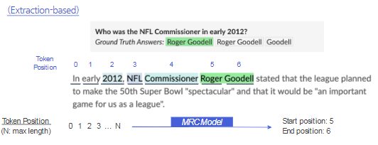

- **Generation-based MRC**: 주어진 지문과 질의 (question)를 보고 답변을 생성
    - 생성 문제

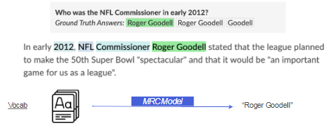

### Generation-based MRC Overview
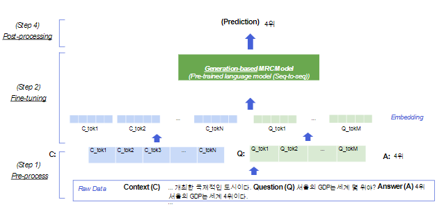

### Generation vs Extraction
- Seq2Seq PLM vs PLM + Classifier
- Free-form text vs Extraction

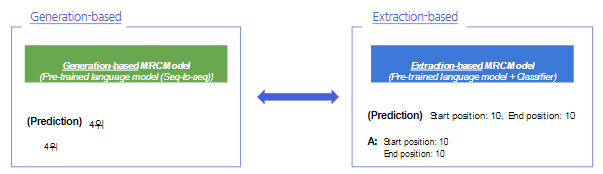

## 2. Pre-processing

### Input representation

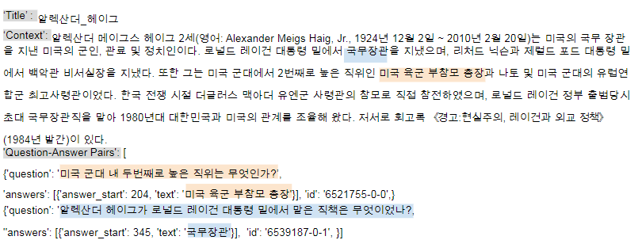

### Tokenization
- WordPiece Tokenizer를 동일하게 사용
- Question: 미국 군대 내 두번째로 높은 직위는 무엇인가?
- Tokenized: ['미국', '군대', '내', '두번째', '##로', '높은', '직', '##위는', '무엇인가', '?']
- Encoded: [101,23545,8910,14423,8996,9102,48506,11261,55600,9707,19855,11018,9294,119137,12030,11287,136,102]

### Special Token
- 학습 시에만 사용되며 단어 자체의 의미는 가지지 않는 특별한 토큰

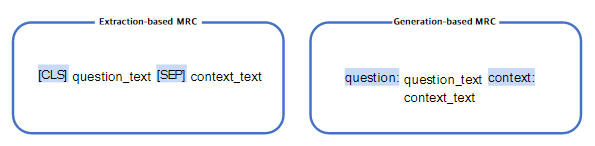

### Additional Information
- Attention Mask
    - Extractive와 동일함
- Token type ids
    - BERT와 달리 BART에서는 token_type_ids가 X
    - 나중되니 굳이...? 라는 연구가 진행되었다고 함

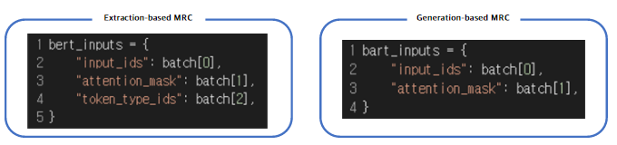

### Additional information
- 실제 text를 생성하는 과제를 수행
- 전체 sequence의 각 위치마다 모델이 아는 모든 단어들 중 하나의 단어를 맞추는 classification 문제

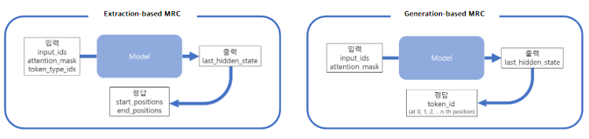

### Output Representation

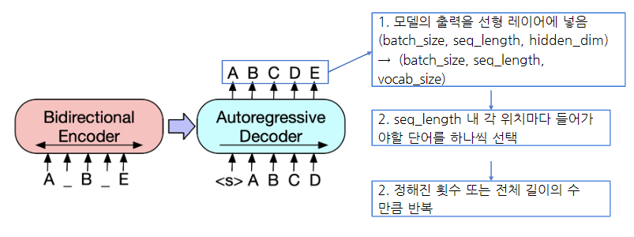

## 3. Model

### BART
- 기계 독해, 기계 번역, 요약, 대화 등 Seq2Seq 문제의 PLM을 위한 denoising autoencoder

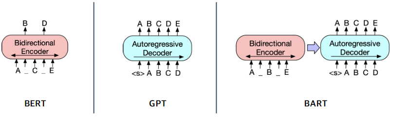

### BART Encoder & Decoder
- Encoder: BERT처럼 bi-directional
- Decoder: GPT처럼 uni-directional (autoregressive)

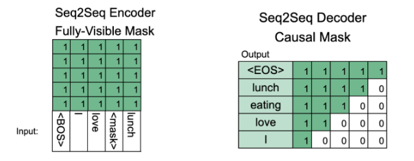

### Pre-training BART

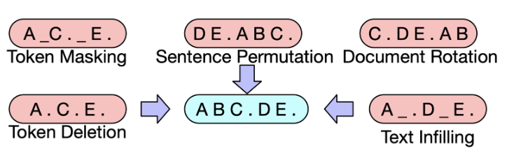

## 4. Post-processing

### Decoding
- 디코더에서 이전 스텝에서 나온 출력이 다음 스텝의 입력으로 들어감 (autoregressive)
- 맨 처음 입력은 문장 시작을 뜻하는 special token


### Searching

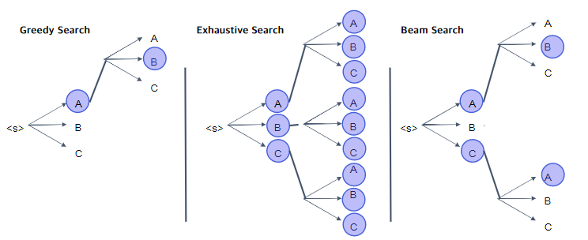

## 5. Practice
Generation-based MRC 문제 풀기!

### Model
- mt5-small 사용

```python
from transformers import (
    AutoConfig,
    AutoModelForSeq2SeqLM,
    AutoTokenizer
)

model_name = "google/mt5-small"

config = AutoConfig.from_pretrained(
    model_name,
    cache_dir=None,
)
tokenizer = AutoTokenizer.from_pretrained(
    model_name,
    cache_dir=None,
    use_fast=True,
)
model = AutoModelForSeq2SeqLM.from_pretrained(
    model_name,
    config=config,
    cache_dir=None,
)
```

### 설정 값

```python
max_source_length = 1024
max_target_length = 128
padding = False
preprocessing_num_workers=12
num_beams = 2
max_train_samples = 16
max_val_samples = 16
num_train_epochs = 3
```

### Preprocessing

```python
def preprocess_function(examples):
    # prompt를 아래처럼 준다
    inputs = [f'question: {q}  context: {c} </s>' for q, c in zip(examples['question'], examples['context'])]
    # target은 [1:]이다.
    targets = [f'{a["text"][0]} </s>' for a in examples['answers']]
    model_inputs = tokenizer(inputs, max_length=max_source_length, padding=padding, truncation=True)

    # Setup the tokenizer for targets
    # 데코레이터가 있는 이유는 뭐... special token 때문인데
    # 현재 버전에선 크게 다르지 않다
    with tokenizer.as_target_tokenizer():
        labels = tokenizer(targets, max_length=max_target_length, padding=padding, truncation=True)

    model_inputs["labels"] = labels["input_ids"]
    model_inputs["example_id"] = []
    for i in range(len(model_inputs["labels"])):
        model_inputs["example_id"].append(examples["id"][i])
    return model_inputs
```

### Fine-tuning하기

```python
def postprocess_text(preds, labels):
    preds = [pred.strip() for pred in preds]
    labels = [label.strip() for label in labels]

    preds = ["\n".join(nltk.sent_tokenize(pred)) for pred in preds]
    labels = ["\n".join(nltk.sent_tokenize(label)) for label in labels]

    return preds, labels

def compute_metrics(eval_preds):
    preds, labels = eval_preds
    if isinstance(preds, tuple):
        preds = preds[0]

    decoded_preds = tokenizer.batch_decode(preds, skip_special_tokens=True)
    # decoded_labels is for rouge metric, not used for f1/em metric
    decoded_labels = tokenizer.batch_decode(labels, skip_special_tokens=True)

    # Some simple post-processing
    decoded_preds, decoded_labels = postprocess_text(decoded_preds, decoded_labels)

    formatted_predictions = [{"id": ex['id'], "prediction_text": decoded_preds[i]} for i, ex in enumerate(datasets["validation"].select(range(max_val_samples)))]
    references = [{"id": ex["id"], "answers": ex["answers"]} for ex in datasets["validation"].select(range(max_val_samples))]

    result = metric.compute(predictions=formatted_predictions, references=references)
    return result
```

## Reference
- https://sshleifer.github.io/blog_v2/jupyter/2020/03/12/bart.html

## Further Reading
- [Introducing BART](https://sshleifer.github.io/blog_v2/jupyter/2020/03/12/bart.html)
- [BART: Denoising Sequence-to-Sequence Pre-training for Natural Language Generation, Translation, and Comprehension](https://arxiv.org/abs/1910.13461)
- [Exploring the Limits of Transfer Learning with a Unified Text-to-Text Transformer (T5) ](https://arxiv.org/abs/1910.10683)
