# 4강 Passage Retrieval - Sparse Embedding
4강에서는 단어기반 문서 검색에 대해 배워보겠습니다. 먼저 문서 검색 (Passage retrieval)이란 어떤 문제인지에 대해 알아본 후, 문서 검색을 하는 방법에 대해 알아보겠습니다. 문서 검색을 하기 위해서는 문서를 embedding의 형태로 변환해 줘야 하는데, 이를 passage embedding 이라고 합니다. 이번 강의에서는 passage embedding이 무엇인지 알아보는 동시에, 단어 기반으로 만들어진 passage embedding인 sparse embedding, 그 중에서도 자주 쓰이는 TF-IDF에 대해 알아볼 예정입니다.

[back to super](https://github.com/jinmang2/boostcamp_ai_tech_2/tree/main/p-stage/mrc)

## 1. Introduction to Passage Retrieval

### Passage Retrieval
- 질문(Query)에 맞는 문서(Passage)를 찾는 것

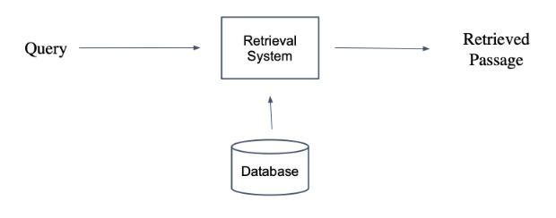

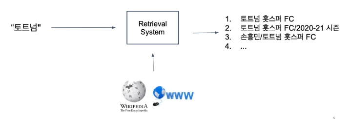

### Passage Retrieval with MRC
- Open-domain Question Answering: 대규모의 문서 중에서 질문에 대한 답을 찾기
    - Passage Retrieval과 MRC를 이어서 2-Stage로 만들 수 있음

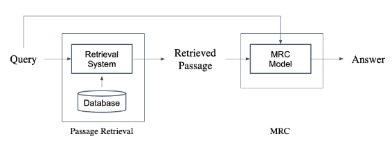

### Overview of Passage Retrieval
- Query와 Passage를 임베딩한 뒤 유사도로 랭킹을 매기고, 유사도가 가장 높은 Passage를 선택함

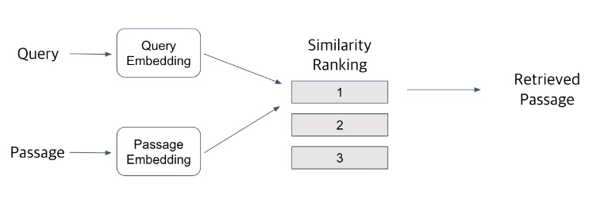

## 2. Passage Embedding and Sparse Embedding

### Passage Embedding Space
- Passage Embedding의 벡터 공간
- 벡터화된 Passage를 이용하여 Passage 간 유사도 등을 알고리즘으로 계산할 수 있음

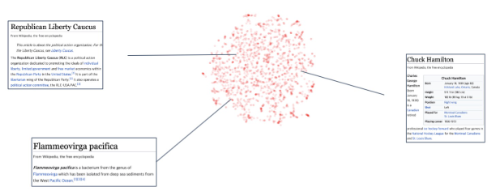

### Sparse Embedding 소개

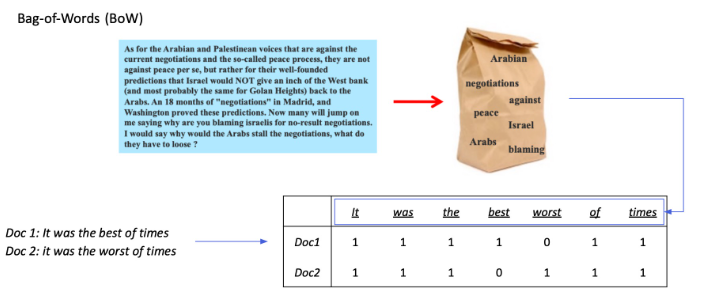

- BoW를 구성하는 방법? n-gram!
    - unigram (1-gram) vs bigram (2-gram)
- Term value를 결정하는 방법
    - Term이 document에 등장하는지 (binary)
    - Term이 몇 번 등장하는지 (term frequency)

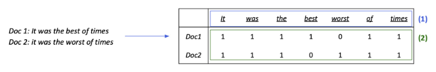

### Sparse Embedding의 특징
1. Dimension of embedding vector == number of terms
    - 등장하는 단어가 많아질수록 증가
    - N-gram의 n이 커질수록 증가

    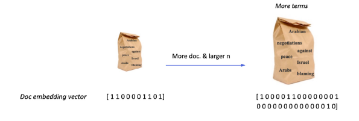

2. Term overlap을 정확하게 잡아내야할 때 유용
3. 반면, 의미(semantic)가 비슷하지만 다른 단어인 경우 비교가 불가

    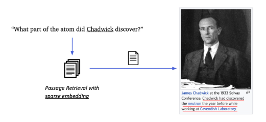

## 3. TF-IDF

### TF-IDF (Term Frequency - Inverse Document Frequency) 소개
- Term Frequency (TF): 단어의 등장빈도
- Inverse Document Frequency (IDF): 단어가 제공하는 정보의 양

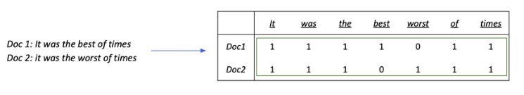

### Term Frequency (TF)
해당 문서 내 단어의 등장 빈도를 센다
1. Raw count
2. Adjusted for doc length: raw count / num words (TF)
3. Other variants: binary, log normalization, etc

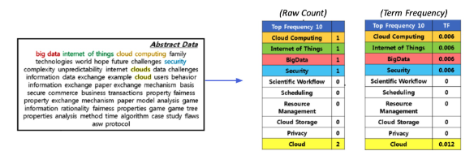

### Inverse Document Frequency (IDF)
- 단어가 제공하는 정보의 양

$$IDF(t)=\log\cfrac{N}{DF(t)}$$

- where Document Frequency(DF): Term t가 등장한 document의 개수, N: 총 document의 수

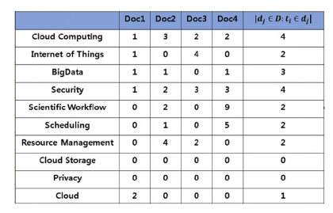

### Combine TF & IDF
- TF-IDF(t, d): TF-IDF for term t in document d,

    $$TF(t,d)\times IDF(t)$$

- 'a', 'the' 등의 관사는 low TF-IDF
    - TF는 높지만 IDF가 0에 가까울 것
    - 거의 모든 document에 등장함!
    - N=DF(t)=log(N/DF)=0
- 자주 등장하지 않는 고유 명사(ex. 사람 이름, 지명 등)는 high TF-IDF
    - IDF가 커지면서 전체적인 TF-IDF 값이 증가

### TF-IDF 계산하기
- 실험할 데이터

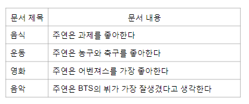

- 토크나이징

```python
def tokenize(x):
    return x.split(" ")

tokenize(data[3][1])
```
```
["주연은", "BTS의", "뷔가", "가장", "잘생겼다고", "생각한다"]
```

- Term Frequency 계산하기

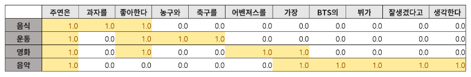

- Inverse Document Frequency (IDF) 계산하기

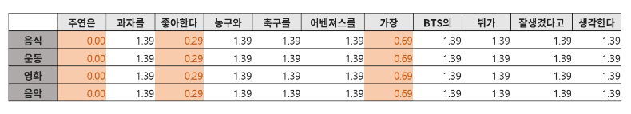

- TF-IDF 계산하기

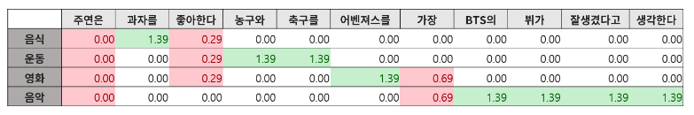

### TF-IDF를 이용해 유사도 구해보기
- 목표: 계산한 문서 TF-IDF를 가지고 질의 TF-IDF를 계산한 후 가장 관련있는 문서를 찾기

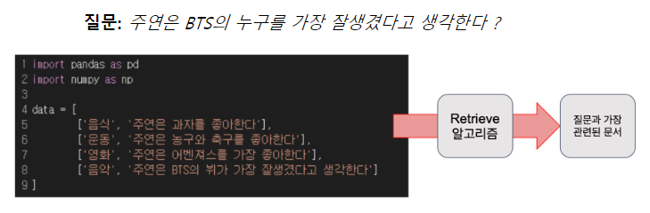

1. 사용자가 입력한 질의를 토큰화
2. 기존의 단어 사전에 없는 토큰들은 제외
3. 질의를 하나의 문서로 생각하고 이에 대한 TF-IDF를 계산
4. 질의 TF-IDF 값과 각 문서별 TF-IDF 값을 곱하여 유사도 점수 계산
5. 가장 높은 점수를 가지는 문서 선택

### BM25란?
- TF-IDF의 개념을 바탕으로, 문서의 길이까지 고려하여 점수를 매김
- TF 값에 한계를 지정해두어 일정한 범위를 유지하도록 함
- 평균적인 문서의 길이보다 더 작은 문서에서 단어가 매칭된 경우 그 문서에 대해 가중치를 부여
- 실제 검색엔진, 추천 시스템 등에서 아직까지도 많이 사용되는 알고리즘

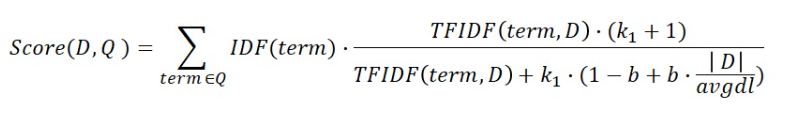

## 4. Practice

### 데이터셋 준비

```python
from datasets import load_dataset

dataset = load_dataset("squad_kor_v1")
# Context만 추출
corpus = list(set([example['context'] for example in dataset['train']]))
len(corpus) # 9606

```

### 토크나이저 준비
- Word Level tokenizer

```python
toknizer_func = lambda x: x.split(' ')
tokenizer_func(corpus[0])[:10]
```
```
['호이안의', '초기', '역사는', '참', '족의', '역사이다.', '말레이계인', '참', '족은', '기원전']
```

### TF-IDF embedding 만들기

```python
from sklearn.feature_extraction.text import TfidfVectorizer

vectorizer = TfidfVectorizer(tokenizer=tokenizer_func, ngram_range=(1,2))
vectorizer.fit(corpus)
sp_matrix = vectorizer.transform(corpus)
sp_matrix.shape # (9606, 1272768)
```

```python
import pandas as pd

df = pd.DataFrame(sp_matrix[0].T.todense(), index=vectorizer.get_feature_names(), columns=["TF-IDF"])
df = df.sort_values('TF-IDF', ascending=False)
print(df.head(10))
```
```
            TF-IDF
일본인      0.117667
드나들었고  0.111396
참파        0.111396
항구가      0.103249
일본인이    0.095102
무역이      0.093717
참          0.084331
마을        0.079565
규모가      0.076184
그래서      0.060111
```

### TF-IDF embedding을 활용하여 passage retrieval 실습해보기

```python
import random
import numpy as np

random.seed(1)
sample_idx = random.choice(range(len(dataset['train'])))

query = dataset['train'][sample_idx]['question']
ground_truth = dataset['train'][sample_idx]['context']

print(query)
print(ground_truth)
```
```
호메로스 찬가를 신통기에 비해 간결한 서사로 간주한 사람은 누구인가?
고전 시대 신화에서는 티탄들의 패배 이후, 신들의 새로운 판테온이 세워졌다고 설명한다. 주요한 그리스 신들 중에서 올림피안은 올림포스 산 정상에서 제우스의 통치 아래 살아가는 신들을 말한다. 이들의 인원이 열두 명으로 제한된 것은 비교적 최근에 도입된 개념으로 보인다. 올림피안 이외에도 그리스인들은 염소 신 판, 강의 정령 님프, 샘에 사는 나이아드, 나무의 정령 드라이어드, 바다에 사는 네레이드, 강의 신, 사티로스를 비롯한 그 지역의 다양한 신들을 숭배하였다. 여기에는 에리니에스(또는 푸리아이)처럼 혈연 관계에게 범죄를 저지른 죄인을 뒤쫓는 저승의 암흑 세력도 있었다. 시인들은 그리스 판테온의 영광을 기리고자 호메로스 찬가를 지었다.(33편의 노래). 그레고리 나지는 호메로스 찬가를 "각 노래마다 신에 대한 기원을 노래하는(《신통기》에 비해) 간결한 서가"로 간주하였다.
```
```python
query_vec = vectorizer.transform([query])
query_vec.shape # (1, 1272768)
```

- 변환된 query vector를 document들의 vector와 dot product 수행
    - Documents들의 similarity ranking을 구함

```python
result = query_vec * sp_matrix.T
sorted_result = np.argsort(-result.data)
doc_scores = result.data[sorted_result]
doc_ids = result.indices[sorted_result]
```

- Top-3개의 passage를 retrieve하고 실제 ground truth와 비교

```python
k = 3
doc_scores[:k], doc_ids[:k]
# (array([0.18985967, 0.03625019, 0.03371167]),
#  array([ 616, 7968, 9548], dtype=int32))
```

```python
print("[Search query]\n", query, "\n")

print("[Ground truth passage]")
print(ground_truth, "\n")

for i in range(k):
  print("Top-%d passage with score %.4f" % (i + 1, doc_scores[i]))
  doc_id = doc_ids[i]
  print(corpus[doc_id], "\n")
```
```
[Search query]
 호메로스 찬가를 신통기에 비해 간결한 서사로 간주한 사람은 누구인가?

[Ground truth passage]
고전 시대 신화에서는 티탄들의 패배 이후, 신들의 새로운 판테온이 세워졌다고 설명한다. 주요한 그리스 신들 중에서 올림피안은 올림포스 산 정상에서 제우스의 통치 아래 살아가는 신들을 말한다. 이들의 인원이 열두 명으로 제한된 것은 비교적 최근에 도입된 개념으로 보인다. 올림피안 이외에도 그리스인들은 염소 신 판, 강의 정령 님프, 샘에 사는 나이아드, 나무의 정령 드라이어드, 바다에 사는 네레이드, 강의 신, 사티로스를 비롯한 그 지역의 다양한 신들을 숭배하였다. 여기에는 에리니에스(또는 푸리아이)처럼 혈연 관계에게 범죄를 저지른 죄인을 뒤쫓는 저승의 암흑 세력도 있었다. 시인들은 그리스 판테온의 영광을 기리고자 호메로스 찬가를 지었다.(33편의 노래). 그레고리 나지는 호메로스 찬가를 "각 노래마다 신에 대한 기원을 노래하는(《신통기》에 비해) 간결한 서가"로 간주하였다.

Top-1 passage with score 0.1899
고전 시대 신화에서는 티탄들의 패배 이후, 신들의 새로운 판테온이 세워졌다고 설명한다. 주요한 그리스 신들 중에서 올림피안은 올림포스 산 정상에서 제우스의 통치 아래 살아가는 신들을 말한다. 이들의 인원이 열두 명으로 제한된 것은 비교적 최근에 도입된 개념으로 보인다. 올림피안 이외에도 그리스인들은 염소 신 판, 강의 정령 님프, 샘에 사는 나이아드, 나무의 정령 드라이어드, 바다에 사는 네레이드, 강의 신, 사티로스를 비롯한 그 지역의 다양한 신들을 숭배하였다. 여기에는 에리니에스(또는 푸리아이)처럼 혈연 관계에게 범죄를 저지른 죄인을 뒤쫓는 저승의 암흑 세력도 있었다. 시인들은 그리스 판테온의 영광을 기리고자 호메로스 찬가를 지었다.(33편의 노래). 그레고리 나지는 호메로스 찬가를 "각 노래마다 신에 대한 기원을 노래하는(《신통기》에 비해) 간결한 서가"로 간주하였다.

Top-2 passage with score 0.0363
두 사람은 낙담하고, 밴 하우튼의 집을 떠난다. 리더비히는 대신 사과하며 두 사람과 같이 여행을 한다. 세 사람은 안네 프랑크의 집을 방문한다. 집에 계단이 많기 때문에 헤이즐은 힘들게 올라간다. 안네 프랑크의 집 꼭대기에서 헤이즐은 사랑을 느끼고 어거스터스와 로맨틱한 키스를 한다. 두 사람은 호텔로 돌아와 처음으로 밤을 같이 보낸다. 다음날, 어거스터스는 헤이즐에게 자신의 암이 재발했다고 말한다. 인디애나폴리스에 돌아와서 어거스터스의 상태가 더욱 악화되어 갔다. 어거스터스는 중환자실로 보내지며 죽음이 가까운 것을 깨달았다. 어거스터스는 자신의 생전 장례식에 눈 먼 친구 아이작과 헤이즐을 불러 두 사람은 사전에 적은 추도사를 낭독한다. 헤이즐은 밴 하우튼의 소설을 인용하며, 어거스터스와 함께하는 짧은 시간은 무엇과도 바꿀 수 없는 것이라고 말한다.

Top-3 passage with score 0.0337
고대 그리스에서 신화는 일상의 중심이었다. 그리스인들은 신화를 그들의 역사의 일부로 보았다. 그들은 자연 현상과 문화적 변화, 인습적인 증오와 친교를 설명하는데 신화를 사용하였다. 한 지도자가 신화적 영웅, 또는 신의 후손이라는 증거로 사용할 수 있는 자부심의 원천이기도 했다. 《일리아스》와 《오디세이아》에서 설명하는 트로이아 전쟁의 진실에 대해서 의문을 갖는 사람은 거의 없었다. 군사 역사가, 칼럼니스트, 정치 수필가이자 전 고전학 교수인 빅터 데이비스 핸슨과 고전학 부교수 존 히스에 따르면, 그리스인들에게 호메로스 서사시의 심오한 지식은 그들의 문화 변용의 기저로 간주되었다. 호메로스는 "그리스의 학문"(Ἑλλάδος παίδευσις)이었고, 그의 시는 한 권의 "책"이었다.
```


## Further Reading
- [Pyserini BM25 MSmarco documnet retrieval 코드](https://github.com/castorini/pyserini/blob/master/docs/experiments-msmarco-doc.md)
- [Sklearn feature extractor ⇒ text feature extractor 부분 참고](https://scikit-learn.org/stable/modules/feature_extraction.html#text-feature-extraction)
