# 5강 Passage Retrieval - Dense Embedding

앞선 4강에서는 sparse embedding 기반 문서 검색에 대해 배워보았습니다. 이번 5강에서는 앞서 배운 sparse embedding이 가지는 한계점들에 대해 알아보고, 이를 해결할 수 있는 dense embedding에 대해 배워보겠습니다. Dense embedding의 개념을 알아보고, 어떻게 dense embedding을 학습하고 문서 검색을 수행할 수 있을지에 대해 실습과 함께 자세히 알아보겠습니다.

[back to super](https://github.com/jinmang2/boostcamp_ai_tech_2/tree/main/p-stage/mrc)

## 1. Introduction to Dense Embedding

### Passage Embedding
- 구절(Passage)를 벡터로 변환하는 것

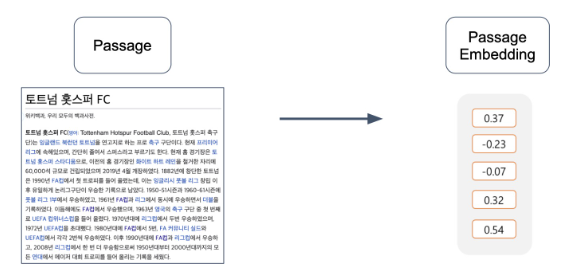

### Sparse Embedding
- TF-IDF는 Sparse함

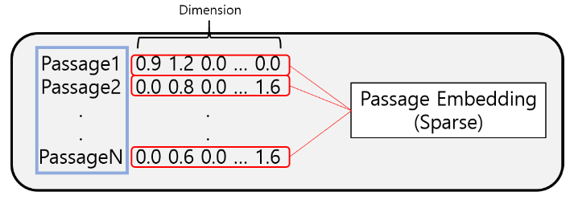

### Limitations of sparse embedding
1. 차원의 수가 매우 큼
    - csr format 등으로 극복 가능하긴 함
2. 유사성을 고려하지 못함

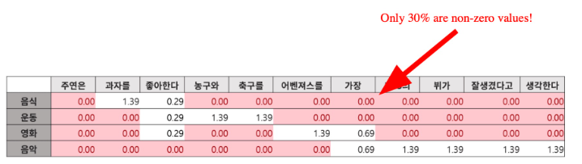

### Dense Embedding이란?

Complementary to sparse representations by design
- 더 작은 차원의 고밀도 벡터 (length = 50-1000)
- 각 차원이 특정 term에 대응되지 않음
- 대부분의 요소가 non-zero값

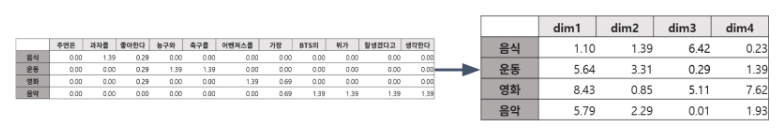

### Retrieval: Sparse vs Dense

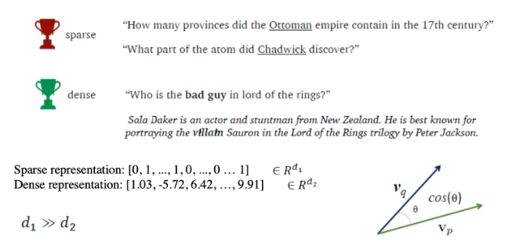

- 최근 사전학습 모델의 등장, 검색 기술의 발전 등으로 Dense Embedding을 활발히 이용

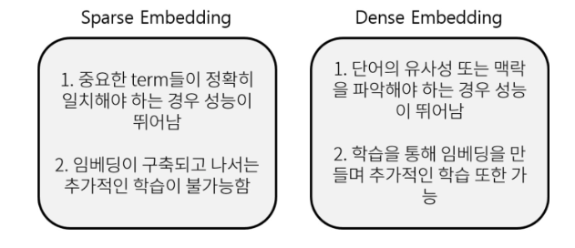

### Overview of Passage Retrieval with Dense Embedding

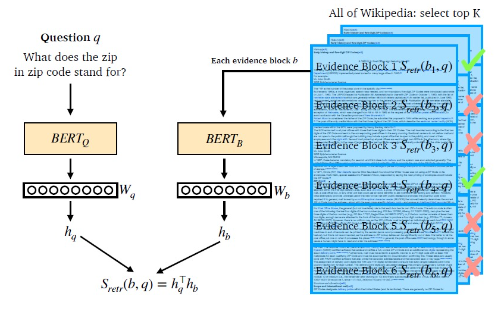

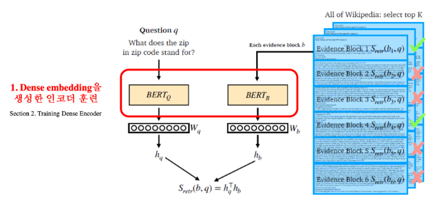


## 2. Training Dense Encoder

### What can be Dense Encoder?
- BERT와 같은 PLM 사용
- MRC와 유사하지만 조금 다름
    - Passage와 Question을 동시에 input으로 넣어줌
    - Cross Encoder
- Passage와 Question을 독립적으로 넣어줌
    - Bi Encoder

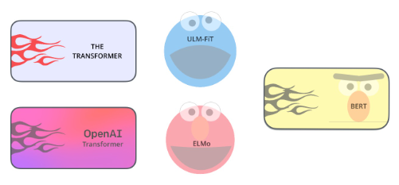

- Token Classification보단 CLS token의 dense output을 사용

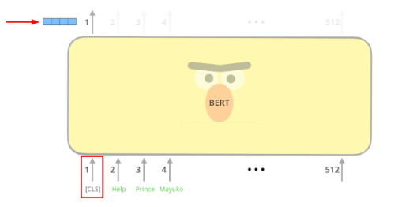

### Dense Encoder의 구조

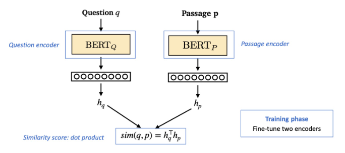

### Dense Encoder 학습 목표와 학습 데이터
- 학습목표: 연관된 question과 passage dense embedding 간의 거리를 좁히는 것
    - 또는 inner product 값을 높이는 것
    - higer similarity
- Challenge: 연관된 question / passage를 어떻게 찾을 것인가?
    - 기존 MRC 데이터셋을 활용

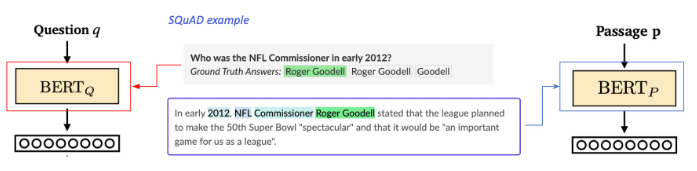

#### Negative Sampling
- Positive: 연관된 question과 passage 간의 dense embedding 거리를 좁히는 것
- Negative: 연관되지 않는 question과 passage 간의 embedding 거리는 멀어야 함

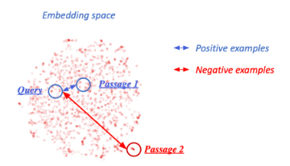

#### Choose negative examples
1. Corpus 내에서 랜덤하게 뽑기
2. 좀 더 헷갈리는 negative sample뽑기
    - ex. 높은 ID-IDF 스코어를 가지지만 답을 포함하지 않는 샘플

### Objective function
- Positive passage에 대한 negative log likelihood(NLL) loss 사용

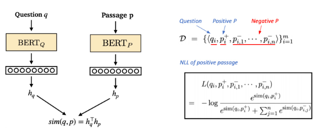

### Evaluation Metric for Dense Encoder
- Top-k retrieval accuracy: retrieve된 passage 중에 답을 포함하는 passage의 비율

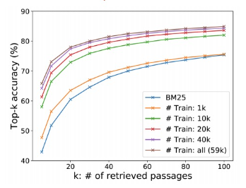

## 3. Passage Retrieval with Dense Encoder

### From dense encoding to retrieval
- Inference: Passage와 query를 각각 embedding한 후, query로부터 가까운 순서대로 passage의 순위를 매김

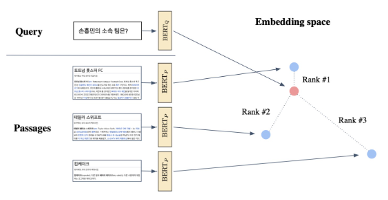

### From retrieval to open-domain question answering
- Retriever를 통해 찾아낸 passage를 황용
- MRC 모델로 답을 찾음

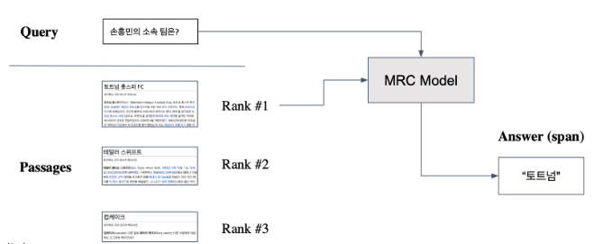

### How to make better dense encoding
- 학습 방법 개선 (e.g., DPR)
- 인코더 모델 개선 (BERT보다 큰, 정확한 Pretrained 모델)
- 데이터 개선 (더 많은 데이터, 전처리 등)

## 4. Practice

```python
print(corpus[0], end="\n\n")
tokenized_input = tokenizer(corpus[0], padding="max_length", truncation=True)
print(tokenizer.decode(tokenized_input['input_ids']))
```
```
남조선국방경비대가 창설되면서 경비사관의 양성을 목적으로 태릉에 설치되었고, 초대교장은 이형근(李亨根) 참령(參領：지금의 소령)이 맡았다. 군사교육 초기에는 일본식이 많이 혼재해 있었는데 점점 미 군사고문단의 교육 프로그램에 따라 미국식으로 바뀌었다. 1~9기까지는 군경력자들이 입교하여 단기 교육으로 임관했다. 1949년 10기(생도 1기)부터 정규과정으로 2년제 교육실시 방침을 세웠으나, 장교수급 문제로 1년으로 단축되었고, 그나마 한국전쟁의 발발로 많은 동기생을 전쟁터에서 잃은채 1950년 7월 10일 대전에서 소위(少尉)로 임관했다. 1950년 6월 1일 첫 정규 4년제 사관생도들을 모집하여, 333명의 생도들이 입교했으나, 입교 24일만인 1950년 6월 25일 한국전쟁이 발발하자, 임관전인 생도1기생들과 포천방면의 북한군을 방어하다가, 많은 동기생을 잃었다, 이후, 사관학교가 일시폐교함에 따라 육군종합학교에서 훈련을 받고 단기 소위로 임관하였다.

[CLS] 남조선국방경비대가 창설되면서 경비사관의 양성을 목적으로 태릉에 설치되었고, 초대교장은 이형근 ( 李 亨 根 ) 참령 ( 參 領 ： 지금의 소령 ) 이 맡았다. 군사교육 초기에는 일본식이 많이 혼재해 있었는데 점점 미 군사고문단의 교육 프로그램에 따라 미국식으로 바뀌었다. 1 ~ 9기까지는 군경력자들이 입교하여 단기 교육으로 임관했다. 1949년 10기 ( 생도 1기 ) 부터 정규과정으로 2년제 교육실시 방침을 세웠으나, 장교수급 문제로 1년으로 단축되었고, 그나마 한국전쟁의 발발로 많은 동기생을 전쟁터에서 잃은채 1950년 7월 10일 대전에서 소위 ( 少 尉 ) 로 임관했다. 1950년 6월 1일 첫 정규 4년제 사관생도들을 모집하여, 333명의 생도들이 입교했으나, 입교 24일만인 1950년 6월 25일 한국전쟁이 발발하자, 임관전인 생도1기생들과 포천방면의 북한군을 방어하다가, 많은 동기생을 잃었다, 이후, 사관학교가 일시폐교함에 따라 육군종합학교에서 훈련을 받고 단기 소위로 임관하였다. [SEP] [PAD] [PAD] [PAD] [PAD] [PAD] [PAD] [PAD] [PAD] [PAD] [PAD] [PAD] [PAD] [PAD] [PAD] [PAD] [PAD] [PAD] [PAD] [PAD] [PAD] [PAD] [PAD] [PAD] [PAD] [PAD] [PAD] [PAD] [PAD] [PAD] [PAD] [PAD] [PAD] [PAD] [PAD] [PAD] [PAD] [PAD] [PAD] [PAD] [PAD] [PAD] [PAD] [PAD] [PAD] [PAD] [PAD] [PAD] [PAD] [PAD] [PAD] [PAD] [PAD] [PAD] [PAD] [PAD] [PAD] [PAD] [PAD] [PAD] [PAD] [PAD] [PAD] [PAD] [PAD] [PAD] [PAD] [PAD] [PAD] [PAD] [PAD] [PAD] [PAD] [PAD] [PAD] [PAD] [PAD] [PAD] [PAD] [PAD] [PAD] [PAD] [PAD] [PAD] [PAD] [PAD] [PAD] [PAD] [PAD] [PAD] [PAD] [PAD] [PAD] [PAD] [PAD] [PAD] [PAD] [PAD] [PAD] [PAD] [PAD] [PAD] [PAD] [PAD] [PAD] [PAD] [PAD] [PAD] [PAD] [PAD] [PAD] [PAD] [PAD] [PAD] [PAD] [PAD] [PAD] [PAD] [PAD] [PAD] [PAD] [PAD] [PAD] [PAD] [PAD] [PAD] [PAD] [PAD] [PAD] [PAD] [PAD] [PAD] [PAD] [PAD] [PAD] [PAD] [PAD] [PAD] [PAD] [PAD] [PAD] [PAD] [PAD] [PAD] [PAD] [PAD] [PAD] [PAD] [PAD] [PAD] [PAD] [PAD] [PAD] [PAD] [PAD] [PAD] [PAD] [PAD] [PAD] [PAD] [PAD] [PAD] [PAD] [PAD] [PAD] [PAD] [PAD] [PAD] [PAD] [PAD] [PAD] [PAD] [PAD] [PAD] [PAD] [PAD] [PAD] [PAD] [PAD] [PAD] [PAD] [PAD] [PAD] [PAD] [PAD] [PAD] [PAD] [PAD] [PAD] [PAD] [PAD] [PAD] [PAD] [PAD] [PAD] [PAD] [PAD] [PAD] [PAD] [PAD] [PAD] [PAD] [PAD] [PAD] [PAD] [PAD] [PAD] [PAD] [PAD] [PAD] [PAD] [PAD]
```

### Negative Sampling
- in batch negative에선 미리 해줄 필요 X

```python
# set number of neagative sample
num_neg = 3

# corpus는 context들의 array!
# (9606,)
corpus = np.array(corpus)
p_with_neg = []

# 학습 데이터의 context! 임의로 몇 개 sampling함
for c in training_dataset['context']:
    while True:
        # Random하게 negative sampling`
        neg_idxs = np.random.randint(len(corpus), size=num_neg)

        # 학습 데이터의 context가 negative sampling된 말뭉치에 없으면 추가
        if not c in corpus[neg_idxs]:
          p_neg = corpus[neg_idxs]

          p_with_neg.append(c)
          p_with_neg.extend(p_neg)
          break

print('[Positive context]')
print(p_with_neg[0], '\n')
print('[Negative context]')
print(p_with_neg[1], '\n', p_with_neg[2])
```
```
[Positive context]
하지만 지속적으로 문제되었던 이른바 '줬다 뺏는 기초연금' 문제는 여전히 시정되지 못했다. 이는 노인 단독가구의 소득이 하위 70%에 속하지만 생계급여를 받는 경우에는 그 차이만큼 삭감되기 때문에 나온 말인데, 생계급여를 받지 못하는 차상위계층의 노인들만 사실상 기초연금을 받아가는 문제가 발생하는 것이다. 보건복지부는 생계급여를 받는 노인이 기초연금까지 받으면 기초생활보장 수급자에서 탈락한 노인들보다 오히려 소득이 높아질 수 있기 때문이라며, 현행 제도를 고수하겠다는 뜻을 나타냈지만 시민단체에서는 정부가 보충성의 원리를 너무 경직되게 적용한다고 주장하고 있다. 하지만 재정 부담이 크게 늘어날 것이라는 우려도 있다. 정부 계획대로 기초연금이 인상된다면 국민 1인당 추가 조세 부담액은 2018년 3만 원, 2030년 15만 원으로 급증할 것으로 분석됐다. 필요한 예산액도 내년 12조 7536억 원, 2030년 43조 6000억 원이 되어 마찬가지로 급증하게 된다.

[Negative context]
엑소(EXO)는 SM 엔터테인먼트 소속의 대한민국 9인조 보이 그룹이다. EXO의 데뷔 미니앨범 《MAMA》는 2012년 4월 8일에 발매 되었고, EXO-M의 버전은 출시 하루만에 중국의 음악 차트 정상을 차지했고, EXO-K의 «MAMA» 뮤직비디오는 유튜브의 글로벌 차트에서 7위를 기록했다. 2012년 데뷔 EP 《MAMA》와 2013년 정규 앨범 《XOXO》는 전 세계적으로 총 150만장의 판매량을 기록, 상업적으로 크게 성공했다. EXO는 또한, 《XOXO》로 데뷔 이후 단기간에 엠넷 아시안 뮤직 어워드에서 올해의 앨범상을 수상한 음악 그룹이며, 12년 만에 가장 빠른 속도로 높은 판매량을 기록한 K-POP 아티스트이다. EXO는 한 번 하기도 힘든 밀리언셀러를 4회 연속으로 달성하여 보이그룹 최초로 쿼드러플 밀리언셀러라는 대기록을 세웠으며, 각종 시상식에서 대상을 석권하여 경력을 통틀어 한국 가요계 역사상 최초 5년 연속 대상 수상에 성공하는 등 아시아 대중음악계에 전무후무한 업적을 남긴 아이돌이다. EXO는 정규 1집의 타이틀곡 «늑대와 미녀»로 첫 음악방송 1위에 성공하였고, 정규 1집 리패키지 앨범 타이틀곡 «으르렁»이 큰 인기를 얻으며 국내외에서 신드롬을 일으켰다. 이후 «중독», «CALL ME BABY», «LOVE ME RIGHT», «-», «Monster», «Lucky one», «kokobop», «power»등 매년 꾸준한 히트곡을 발표하며 각종 신기록을 수립하였고, 명실상부 국내 최정상 아이돌 그룹으로 거듭났다. 그 중 «Power»라는 곡은 2018년 세계 3대 분수쇼로 꼽히는 두바이 분수쇼에서 한국 가수의 음악으로는 최초로 선정돼 뜨거운 화제를 불러일으키기도 했다.
 시티즈: 스카이라인 스팀 워크샵의 경우, 맥시스 해체후 EA에서 해고된 심시티 건물 디자이너가 건물을 제작한게 화제가 되기도 하였다. 당사자인 Bryan Shannon은 플로리다의 링링대학교에서 게임 디자인을 전공하였으며, 2013년 맥시스에서 심시티를 작업하면서 풀타임으로 근무하게 되었다. 그러나, 심시티는 몰락의 길로 접어들었으며, 이에 EA가 맥시스를 해체하면서 그는 직장에서 해고되었으며, 여러 개인사적 혼란속에서 시티즈: 스카이라인 모드를 만드는 것을 위안으로 삼았다. Bryan Shannon은 모딩툴이 나오고 거의 처음으로 건물 에셋을 올렸으며, 그는 Patreon에다가 자신의 계정을 만들어서 자기가 올린 게임 내 자산당 8달러를 후원받았다. 그후 자신에 대해 관심을 가진 Kotaku 측으로부터 인터뷰 제의를 받았으며, 이 인터뷰로 인해서 그는 그가 올린 게임 내 자산당 575 달러를 후원받게 된다. 이후 그는 번지 스튜디오와 Hi Rez 스튜디오측으로부터 입사 제안을 받았으며, 결과적으로 아케인 스튜디오에 들어가게 되어 디스아너드 2의 3D 그래픽을 맡게 된다.
```

### Build Dataset

```python
from torch.utils.data import (DataLoader, RandomSampler, TensorDataset)

q_seqs = tokenizer(
    training_dataset['question'],
    padding="max_length",
    truncation=True,
    return_tensors='pt'
)
p_seqs = tokenizer(
    training_dataset['context'] if in_batch_negative else p_with_neg,
    padding="max_length",
    truncation=True,
    return_tensors='pt'
)
```

### BERT Encoder 모델

```python
class BertEncoder(BertPreTrainedModel):
  def __init__(self, config):
    super(BertEncoder, self).__init__(config)

    self.bert = BertModel(config)
    self.init_weights()

  def forward(self, input_ids,
              attention_mask=None, token_type_ids=None):

      outputs = self.bert(input_ids,
                          attention_mask=attention_mask,
                          token_type_ids=token_type_ids)

      pooled_output = outputs[1]

      return pooled_output


# load pre-trained model on cuda (if available)
p_encoder = BertEncoder.from_pretrained(model_checkpoint)
q_encoder = BertEncoder.from_pretrained(model_checkpoint)

if torch.cuda.is_available():
    p_encoder.cuda()
    q_encoder.cuda()
```

### Train
- 길어서 역할만 기술


```python
def train(args, num_neg, dataset, p_model, q_model):
    # get dataloader
    # set optimizer and scheduler
    # zero_grad and empty_cache()
    # Start for loop
    # ===> query / passage input 받아옴
    bsz = args.per_device_train_batch_size
    if not in_batch_negative:
        target = torch.zeros(bsz).long().cuda()
        p_inputs = {'input_ids': batch[0].view(
                                      args.per_device_train_batch_size*(num_neg+1), -1),
                    'attention_mask': batch[1].view(
                                      args.per_device_train_batch_size*(num_neg+1), -1),
                    'token_type_ids': batch[2].view(
                                      args.per_device_train_batch_size*(num_neg+1), -1)
                    }
    else:
        p_inputs = {'input_ids': batch[0],
                    'attention_mask': batch[1],
                    'token_type_ids': batch[2]
                    }
    q_inputs = {'input_ids': batch[3],
                'attention_mask': batch[4],
                'token_type_ids': batch[5]}
    # ===> query / passage model에 각각 태움
    p_outputs = p_model(**p_inputs) # (bsz, emb_dim) if in_batch_negative
                                    # (bsz*(num_neg+1), emb_dim) o.w
    q_outputs = q_model(**q_inputs) # (bsz, emb_dim)
    # ===> batch multiplication으로 sim(p, q) 계산
    if not in_batch_negative:
        # Calculate similarity score & loss
        p_outputs = p_outputs.view(bsz, -1, num_neg+1) # (bsz, emb_dim, num_neg+1)
        q_outputs = q_outputs.view(bsz, 1, -1) # (bsz, 1, emb_dim)

        sim_scores = torch.bmm(q_outputs, p_outputs).squeeze()  #(bsz, num_neg+1)
        sim_scores = sim_scores.view(bsz, -1) # (bsz*num_neg+1)
    else:
        sim_scores = torch.matmul(
            q_outputs, # (bsz, emb_dim)
            torch.transpose(p_outputs, 0, 1) # (emb_dim, bsz)
        ) # (bsz, bsz)
        # target: position of positive samples = diagonal element
        targets = torch.arange(0, bsz).long().cuda()
    # ===> similarity score와 target간 nll loss 계산
    sim_scores = F.log_softmax(sim_scores, dim=1)
    loss = F.nll_loss(sim_scores, targets)
    # loss backward and update parameters
```

### Dense Embedding을 활용하여 passage retrieval 실습

```python
valid_corpus = list(set([example['context'] for example in dataset['validation']]))[:10]
sample_idx = random.choice(range(len(dataset['validation'])))
query = dataset['validation'][sample_idx]['question']
ground_truth = dataset['validation'][sample_idx]['context']

if not ground_truth in valid_corpus:
  valid_corpus.append(ground_truth)

print(query)
print(ground_truth, '\n\n')
```
```
유아인에게 타고난 배우라고 말한 드라마 밀회의 감독은?
화보 촬영을 위해 미국에 있을 때, 김희애의 연락을 통해 JTBC 드라마 《밀회》의 캐스팅을 제안받았다. 당시 영화 《베테랑》에 이미 캐스팅된 상태였으나, 유아인은 류승완 감독과 제작사의 양해를 얻어 《밀회》에 출연한다. 천재 피아니스트 ‘이선재’ 역할을 위해 피아니스트들의 영상을 보고 곡의 스피드와 건반 위치 등을 외워 실제 타건을 하며 촬영했다. 피아노 울림판을 수건으로 막고 타건을 하면, 그 후 대역 피아니스트의 소리를 덧입히는 방식이었다. 《밀회》는 작품성을 인정받고 숱한 화제를 낳으며 당시 종편으로서는 높은 시청률을 기록했다. 유아인은 섬세한 연기력을 선보여 순수함으로 시청자들을 매료시켰다는 호평을 얻었고, 특히 피아노 연주에 있어서 클래식 종사자들에게 인정을 받았다. 연출을 맡은 안판석 감독은 유아인에 대해 “느낌으로만 연기를 하는 게 아니고 감성을 지적으로 통제해 가면서 연기한다. 그 나이에”라며 “타고난 배우”라고 말했다. 유아인은 《밀회》를 통해 예술적인 면모를 구체화할 수 있어서 만족감을 느꼈다고 밝혔으며, 종영 후 자신의 페이스북 계정에 긴 소감글을 남겼다. 특히 ‘이선재’ 캐릭터를 배우 유아인이 가진 소년성의 엑기스로 생각하며, 2015년 10월 부산국제영화제 오픈토크에서는 본인이 가장 좋아하는 캐릭터로 꼽았다.
```

- 앞서 학습한 passage encoder, question encoder를 이용해 dense embedding 생성

```python
with torch.no_grad():
    p_encoder.eval()
    q_encoder.eval()

    q_seqs_val = tokenizer([query], padding="max_length", truncation=True, return_tensors='pt').to('cuda')
    q_emb = q_encoder(**q_seqs_val).to('cpu')  #(num_query, emb_dim)

    p_embs = []
    for p in valid_corpus:
        p = tokenizer(p, padding="max_length", truncation=True, return_tensors='pt').to('cuda')
        p_emb = p_encoder(**p).to('cpu').numpy()
        p_embs.append(p_emb)

p_embs = torch.Tensor(p_embs).squeeze()  # (num_passage, emb_dim)

print(p_embs.size(), q_emb.size())
```
```
torch.Size([11, 768]) torch.Size([1, 768])
```

- 생성된 embedding에 dot product를 수행 => document들의 similarity ranking을 구함

```python
dot_prod_scores = torch.matmul(q_emb, torch.transpose(p_embs, 0, 1))
print(dot_prod_scores.size())

rank = torch.argsort(dot_prod_scores, dim=1, descending=True).squeeze()
print(dot_prod_scores)
print(rank)
```
```
torch.Size([1, 11])
tensor([[22.0175, 22.0863, 21.9051, 21.7622, 22.2768, 22.1047, 21.9458, 22.1937,
         22.1052, 22.4834, 22.4642]])
tensor([ 9, 10,  4,  7,  8,  5,  1,  0,  6,  2,  3])
```

- Top 5개의 Passage를 retrieve하고 ground truth와 비교

```python
k = 5
print("[Search query]\n", query, "\n")
print("[Ground truth passage]")
print(ground_truth, "\n")

for i in range(k):
    print("Top-%d passage with score %.4f" % (i+1, dot_prod_scores.squeeze()[rank[i]]))
    print(valid_corpus[rank[i]])
```
```
[Search query]
 유아인에게 타고난 배우라고 말한 드라마 밀회의 감독은?

[Ground truth passage]
화보 촬영을 위해 미국에 있을 때, 김희애의 연락을 통해 JTBC 드라마 《밀회》의 캐스팅을 제안받았다. 당시 영화 《베테랑》에 이미 캐스팅된 상태였으나, 유아인은 류승완 감독과 제작사의 양해를 얻어 《밀회》에 출연한다. 천재 피아니스트 ‘이선재’ 역할을 위해 피아니스트들의 영상을 보고 곡의 스피드와 건반 위치 등을 외워 실제 타건을 하며 촬영했다. 피아노 울림판을 수건으로 막고 타건을 하면, 그 후 대역 피아니스트의 소리를 덧입히는 방식이었다. 《밀회》는 작품성을 인정받고 숱한 화제를 낳으며 당시 종편으로서는 높은 시청률을 기록했다. 유아인은 섬세한 연기력을 선보여 순수함으로 시청자들을 매료시켰다는 호평을 얻었고, 특히 피아노 연주에 있어서 클래식 종사자들에게 인정을 받았다. 연출을 맡은 안판석 감독은 유아인에 대해 “느낌으로만 연기를 하는 게 아니고 감성을 지적으로 통제해 가면서 연기한다. 그 나이에”라며 “타고난 배우”라고 말했다. 유아인은 《밀회》를 통해 예술적인 면모를 구체화할 수 있어서 만족감을 느꼈다고 밝혔으며, 종영 후 자신의 페이스북 계정에 긴 소감글을 남겼다. 특히 ‘이선재’ 캐릭터를 배우 유아인이 가진 소년성의 엑기스로 생각하며, 2015년 10월 부산국제영화제 오픈토크에서는 본인이 가장 좋아하는 캐릭터로 꼽았다.

Top-1 passage with score 22.4834
2010년 4월에는 유럽발 재정위기가 발생하면서 또 한 번 세계경제는 대침체에 빠졌다. 또한 2011년 8월에는 S&P에 의해 미국의 국가신용등급이 강등되면서 세계 경제는 또 한 번의 충격에 빠졌다. 이에 중국, 일본과 맺은 통화스와프를 확대하고 균형재정을 선언하는 등 위기극복에 나섰다. 그 결과 한국은 2012년 8월 무디스, 피치, S&P등 3대 신용평가사로부터 사상 최고의 국가신용등급을 받았고, 특히 피치로부터 받은 국가신용등급은 사상 처음으로 중국과 일본을 앞섰다. 가장 논란이 된 것은 4대강 살리기 사업으로 반대 진영은 경제효과 의문, 녹조 등 환경파괴, 부실공사, 공기업, 부실재정, 유지보수비용, 기업의 입찰담합 등을 주장하며 대대적인 비난에 나섰다. 그러나 2015년에 대법원은 한강, 낙동강, 금강 영산강에서 진행된 4대강 사업 모두 적법 판결을 내렸다. 또한 2015년에는 4대강 보의 물을 가뭄지역에 공급하는 사업이 추진되기도 하였다. 대북 정책에 있어서는 금강산 관광객 피격 사망 사건, 천안함·연평도 포격 사건 및 북핵 문제 등과 같은 북한의 도발에 대해 금강산 관광 중단, 5.24조치 실시 등 강력한 대북경제제재를 취하며 국제사회에 공조 하여 대북압박에 나섰다. 또한 다른 한편으로 북한이 대북지원을 요구하며 수차례 집요하게 남북 정상회담 개최를 요구해 왔지만 원칙 있는 대북 정책을 위해 이를 거부했다.
Top-2 passage with score 22.4642
화보 촬영을 위해 미국에 있을 때, 김희애의 연락을 통해 JTBC 드라마 《밀회》의 캐스팅을 제안받았다. 당시 영화 《베테랑》에 이미 캐스팅된 상태였으나, 유아인은 류승완 감독과 제작사의 양해를 얻어 《밀회》에 출연한다. 천재 피아니스트 ‘이선재’ 역할을 위해 피아니스트들의 영상을 보고 곡의 스피드와 건반 위치 등을 외워 실제 타건을 하며 촬영했다. 피아노 울림판을 수건으로 막고 타건을 하면, 그 후 대역 피아니스트의 소리를 덧입히는 방식이었다. 《밀회》는 작품성을 인정받고 숱한 화제를 낳으며 당시 종편으로서는 높은 시청률을 기록했다. 유아인은 섬세한 연기력을 선보여 순수함으로 시청자들을 매료시켰다는 호평을 얻었고, 특히 피아노 연주에 있어서 클래식 종사자들에게 인정을 받았다. 연출을 맡은 안판석 감독은 유아인에 대해 “느낌으로만 연기를 하는 게 아니고 감성을 지적으로 통제해 가면서 연기한다. 그 나이에”라며 “타고난 배우”라고 말했다. 유아인은 《밀회》를 통해 예술적인 면모를 구체화할 수 있어서 만족감을 느꼈다고 밝혔으며, 종영 후 자신의 페이스북 계정에 긴 소감글을 남겼다. 특히 ‘이선재’ 캐릭터를 배우 유아인이 가진 소년성의 엑기스로 생각하며, 2015년 10월 부산국제영화제 오픈토크에서는 본인이 가장 좋아하는 캐릭터로 꼽았다.
Top-3 passage with score 22.2768
일본 제국의 패망 이후, 일본 안에서도 천황이 전범으로 재판을 받아야 하며 쇼와 천황이 물러나야 한다는 여론이 진보계 지식인들 사이에서 퍼지기 시작했다. 1946년 12월 도쿄 대학 총장 난바라 시게루는 의회에 출석해 천황제의 폐지를 주장했으며 시인인 미요시 다쓰지는 국민을 퇴폐로부터 헤어나오게 하기 위해서는 전쟁의 최고 책임자인 쇼와 천황이 물러나는 것이 최선이라는 글을 발표했다. 시데하라 기주로 내각에서 문부대신을 지낸 철학자 아베 요시시게는 “국민에게 복종을 강요하는 천황 스스로가 책임이 없다고 하는 것은 모순”이라고 비판했으며, 쇼와 천황의 측근이었던 기도 고이치도 샌프란시스코 강화조약의 체결을 앞두고 “황실의 안녕을 위해 쇼와 천황이 물러나는 게 좋을 것 같다”는 말을 했다.
Top-4 passage with score 22.1937
이어 10월 15일 부산대학교 학생들에 의해 민주선언문이 배포되고, 다음 날인 10월 16일에는 다른 대학교의 학생들과 시민들이 가담하여 대규모 독재타도, 반정부시위가 시작됐다. 10월 16일과 10월 17일 부산에서는 김영삼에 대한 정치탄압 중단과 유신정권 타도 등을 외쳤고 10월 18일과 10월 19일에는 경상남도 마산시 및 창원시 지역으로 시위가 확산되었다. 10월 16일 오후 김영삼은 상도동 자택에서 부산에서 걸려온 전화를 받고 부마 사태 소식을 접하였다. 김영삼의 제명은 부마 항쟁을 촉발했고, 이는 유신 정권 종식의 계기가 되었다. 한편 유신 후반기에 그는 '닭의 모가지를 비틀어도 새벽은 반드시 온다.'고 했는데, 10.26 사태 이후 그의 이 발언이 널리 회자화되기도 했다.
Top-5 passage with score 22.1052
1991년 변호사를 개업했고, 얼마 되지 않아 인천 산곡동 경남아파트 주민집단소송 사건을 수임하였다. 건설사가 아파트의 간격을 기준보다 가깝게 지어 햇볕이 들지 않아 정상적 생활이 불가능한 상황이 발생하였다. 건설사와 보상 협의를 시도했으나 결렬되었고, 구청에도 요청했으나 소용이 없었다. 이에 주민들은 서울 남부지법에 공동으로 민사소송을 제기하게 된다. 당시 헌법35조에 명시된 환경권은 그저 조문일 뿐 형사·민사상 판례는 전무하였다. 이에 오세훈 변호사는 같은 대륙법계 국가인 옆나라 일본의 건축기본법과 판례를 연구해 변론자료로 사용하였고, 한국감정원의 감정촉탁의뢰, 그리고 서울대 건축공학과 김광우 교수를 감정인으로 선임하여 과학적인 피해보상액을 산정하였다. 결국 2년 6개월에 걸친 법정싸움 끝에 1심에서 재판부는 주민들의 손을 들어 주고 건설사가 주민들에게 총 13억원을 배상하라는 판결을 내렸다. 이에 건설사는 대표변호사로 오성환 전 대법관을 수임하여 서울 고등법원에 항소하였으나, 2년 후 서울고등법원 항소심에서도 주민들의 손을 들어주었다. 이는 헌법 조문상으로만 존재했던 환경권이 실질적 권리로 인정받은 대한민국 최초의 사건이었고, 법원은 구체적인 일조권 침해의 기준을 마련하게 되었다. 당시 건축법시행령 제86조 제2호 (나) 목에 의하면 연속하여 일조를 확보하는 기준을 건축조례에 위임한다고 되어 있었지만, 당시 지방자치단체에는 관련 조례가 전무하였다. 그리하여 일조권을 침해받아도 행정기관으로부터 '법적 하자가 없다'고 반문하면 아무것도 할 수 없었지만, 이 판결을 계기로 '동지일을 기준으로 9시부터 15시까지 6시간동안 일조시간이 2시간 이상 연속으로 확보되어야 한다'는 구체적인 기준이 마련됨에 따라 피해보상을 받을 수 있는 길이 열리게 되었다. 이러한 경험을 바탕으로 한국토지공법학회 학술저널에 '일조권에 대한 사법적 검토'라는 제목의 학술논문을 게재하였다. 본격적으로 오세훈은 환경 변호사로 이름을 알리기 시작했다. 1997년 서울시 구로구 재건축현장에서 고층 아파트에 가려 주변 단독주택 거주자들의 일조권이 침해당한 사건이 발생하였을 때도 1심에선 이미 패소한 상황에서 오세훈 변호사는 2심에서 공사중지 판결을 이끌어냈다.
```


## Reference
- https://github.com/danqi/acl2020-openqa-tutorial/tree/master/slides
- http://jalammar.github.io/illustrated-bert/
- https://github.com/danqi/acl2020-openqa-tutorial
- http://www.cs.umd.edu/class/fall2018/cmsc470/slides/slides_12.pdf


## Further Reading
- [Dense Passage Retrieval for Open-Domain Question Answering](https://arxiv.org/abs/2004.04906)
- [Open domain QA tutorial: Dense retrieval](https://github.com/danqi/acl2020-openqa-tutorial/blob/master/slides/part5-dense-retriever-e2e-training.pdf)
