# 6강 Scaling up with FAISS
앞선 4, 5강에서 sparse / dense embedding을 활용해 문서 검색을 하는 방법에 대해 실습해보았습니다. 실습에서는 수만개 단위의 데이터였지만, 실제 문서 검색이 이루어지길 원하는 실제 상황에서는 그 문서의 수가 기하급수적으로 늘어나게 됩니다. 위키피디아 문서에서 검색하는 상황을 가정하더라도 5백만개 이상의 문서에서 검색을 수행해야 하고, 실제로는 수천만 ~ 억개의 문서가 존재할 수 있습니다. 이런 상황에서는 앞선 강의에서 배운 모든 문서들에 대해 검색을 수행하는 방법이 굉장히 오랜 시간과 많은 자원을 요구하게 됩니다.

이번 6강에서는 이렇게 scale이 커진 상황에서 어떻게 효율적으로 검색을 수행할 수 있을지에 대해 배워볼 예정입니다. 먼저 similarity search의 개념에 대해 간략하게 복습해본 후, 보다 효율적인 approximate search가 무엇인지 알아보겠습니다. 그리고 approximate search를 편리하게 사용할 수 있도록 도와주는 FAISS를 활용하는 방법에 대해 알아보고 실습해보겠습니다.

[back to super](https://github.com/jinmang2/boostcamp_ai_tech_2/tree/main/p-stage/mrc)

## 1. Passage Retrieval and Similarity Search

- Question과 Passage 둘 다 Encoder가 존재
- Q-Encoder의 경우, 질문이 들어올 때 마다 값을 통과시켜야 함
- P-Encoder의 경우 미리 준비 가능

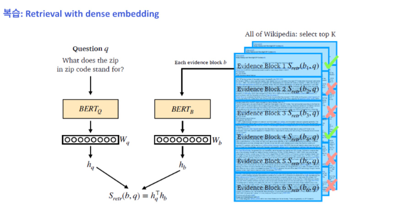

- Embedding Space상에서 질문이 들어오면 질문에 가장 가까운 passage를 vector space에서 봄
- Vector Space에서 NN-Search와 Embedding Space에서 High Score를 보는 것은 다르긴 하지만 비슷함

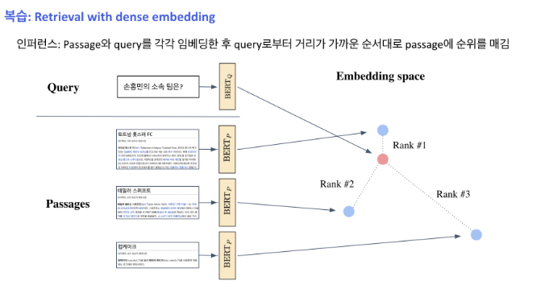

- 기본적으로 가깝다라는 것은 Similarity!
- Dot Product도 dimension이 커지면 부담스러운 연산임
- 어떻게 Real Time으로 가장 연관도가 높은 passage를 찾아낼 수 있을까?

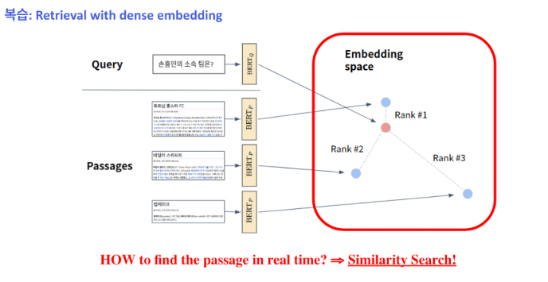

### MIPS(Maximum Inner Product Search)
- 주어진 질문 벡터 q에 대해 passage 벡터 v들 중 가장 질문과 관련된 벡터를 찾아야함
    - 여기서 관련성이란 내적이 가장 큰 것

$$\argmax_{v_i\in V}{q^Tv_i}$$

- q^Tv_i: Indexing
    - 방대한 양의 passage vector를 저장
- argmax: Search
    - 인덱싱된 벡터들 중 질문 벡터와 가장 내적값이 큰 상위 k개의 벡터를 찾는 과정

- 4~5강에서 사용한 검색 방법? **brute-force(exhaustive) search**
    - 저장해둔 모든 Sparse/Dense 임베딩에 대해 일일히 내적값을 계산하여 가장 값이 큰 Passage를 추출

### MIPS in Passage Retrieval

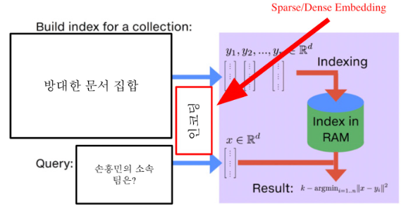

- 실제로 검색해야할 데이터는 훨씬 방대함
    - 5백만 개 (위키피디아)
    - 수십 억, 조 단위까지 커질 수 있음
    - 따라서, 더 이상 모든 문서 임베딩을 일일히 보면서 검색할 수 없음

### Tradeoffs of similarity search

#### 1) Search Speed
- 쿼리 당 유사한 벡터 k개를 찾는데 얼마나 걸리는지?
- 가지고 있는 벡터량이 클 수록 더 오래 걸림

#### 2) Memory Usage
- 벡터를 사용할 때, 어디에서 가져올 것 인지?
- RAM에 모두 올려둘 수 있으면 빠르지만 많은 RAM 용량을 요구함
- 디스크에서 계속 불러와야한다면 속도가 느려짐

#### 3) Accuracy
- brute-force 검색 결과와 얼마나 비슷한지?
- 속도를 증가시키려면 정확도를 희생해야하는 경우가 많음


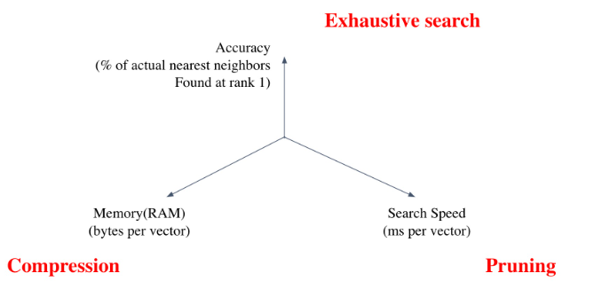

### Tradeoff of search speed and accuracy

- 속도(search time)와 재현율(recall)의 관계
- 더 정확한 검색을 하려면 더 오랜 시간이 소모됨

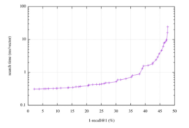

### Increasing search space by bigger corpus
코퍼스(corpus)의 크기가 커질 수록
- 탐색 공간이 커지고 검색이 어려워짐
- 저장해 둘 Memory space 또한 많이 요구됨
- Sparse Embedding의 경우 이러한 문제가 훨씬 심함
    - 1M docs, 500k distinct terms = 2TB

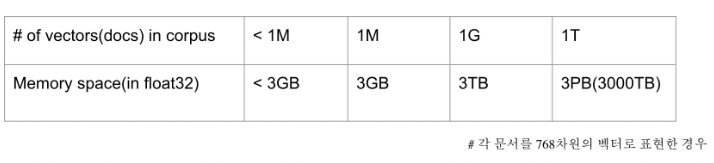

## 2. Approximating Similarity Search

### Compression - Scalar Quantization (SQ)
- vector를 압축하여, 하나의 vector가 적은 용량을 차지
    - 압축량 증가 ==> 메모리 차지 하락 및 정보 손실 증가
    - 4 btye fp를 1 byte unsigned integer로 압축

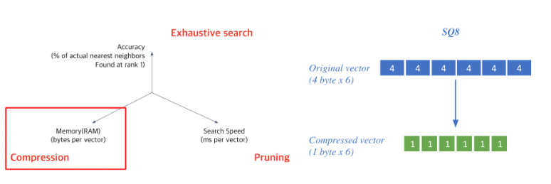

### Pruning - Inverted File (IVF)
- Search space를 줄여 search 속도 개선 (dataset의 subset만 방문)
    - Clustering + Inverted file을 활용한 search

#### 1) Clustering
- 전체 vector space를 k개의 cluster로 나눔

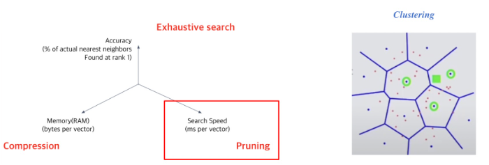

#### 2) Inverted File (IVF)
- Vector의 index = inverted list structure
- 각 cluster의 centroid id와 해당 cluster의 vector들이 연결되어있는 형태

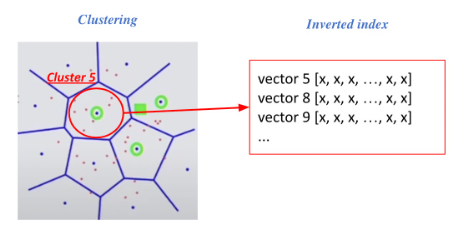

#### How to?
- 주어진 query vector에 대해 근접한 centroid vector를 찾음
- 찾은 cluster의 inverted list 내 vector들에 대해 서치 수행

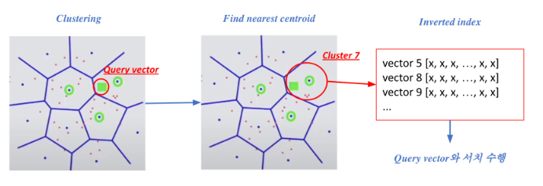

## 3. Introduction to FAISS

### What is FAISS?

- FAISS는 효율적인 유사도 검색을 위한 라이브러리

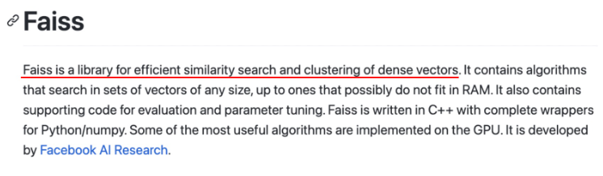

- Encoding이 아니라 Indexing쪽에 도움을 줌

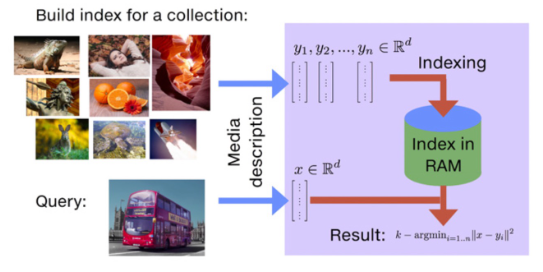

### Passage Retrieval with FAISS

#### 1) Train index and map vectors

- vector들을 확보
- 적절한 cluster 지정을 위해 학습 수행
    - scale-up quantization 비율 측정을 위해서도 필요한 작업
- 데이터가 너무 커지는 경우 40분의 1로 줄이는 경우도 있음

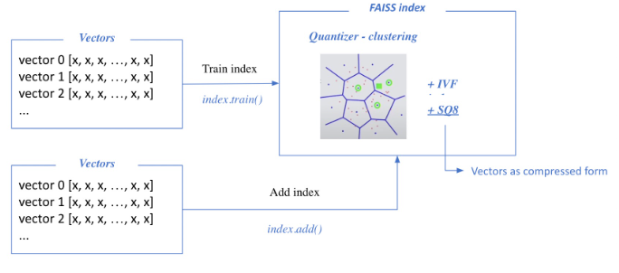

#### 2) Search based on FAISS index
- nprobe: 몇 개의 가장 가까운 cluster를 방문하여 search를 할 것인지?
- TOP-k 문서 벡터를 추출
    - FAISS는 Indexing 지원
    - 어떠한 도메인의 벡터든지 활용 가능함

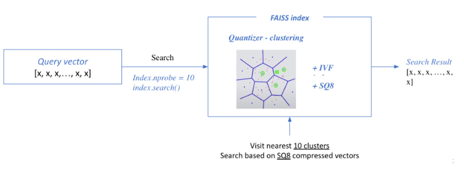

## 4. Scaling up with FAISS

### FAISS Basics
- bruth-force로 모든 벡터와 쿼리를 비교하는 가장 단순한 인덱스 만들기
    - 왜 여기서는 학습을 하지 않는가?
    - Quantization 필요가 없기 때문에!

- 준비하기

```python
d = 64 # 벡터의 차원
nb = 100000 # 데이터 베이스의 크기
nq = 10000 # 쿼리 개수
xb = np.random.random((nb, d)).astype('float32') # 데이터베이스 예시
xq = np.random.random((nq, d)).astype('float32') # 쿼리 예시
```

- 인덱스 만들기

```python
index = faiss.InderFlatL2(d) # 인덱스 빌드하기
index.add(xb) # 인덱스에 벡터 추가하기
```

- 검색하기

```python
k = 4 # 가장 가까운 벡터 4개를 찾고 싶음
D, I = index.search(xq, k) # 검색하기
# D: 쿼리와의 거리
# I: 검색된 벡터의 인덱스
```

### IVF with FAISS
- IVF 인덱스 만들기
- 클러스터링을 통해서 가까운 클러스터 내 벡터들만 비교함
- 빠른 검색 가능
- 클러스터 내에서는 여전히 전체 벡터와 거리 비교
 (Flat)

- IVF 인덱스

```python
nlist = 100 # 클러스터 개수
quantizer = faiss.IndexFlatL2(d)
index = faiss.IndexIVFFlat(quantizer, d, nlist) # Inverted File 만들기
index.train(xb) # 클러슽어 학습하기

index.add(bx) # 클러스터에 벡터 추가하기
D, I = index.search(xq, k) # 검색하기
```

### IVF-PQ with FAISS
- 벡터 압축 기법 (PQ) 활용하기
- 전체 벡터를 저장하지 않고 압축된 벡터만을 저ㅏㅇ
- 메모리 사용량을 줄일 수 있음
- IVF-PQ 인덱스

```python
nlist = 100
m = 8
quantizer = faiss.IndexFlatL2(d)
# 각각의 sub-vector가 8 bits로 인코딩 됨
index = faiss.IndexIVFPQ(quantizer, d, nlist, m, 8)

index.train(xb)
index.add(xb)
D, I = index.search(xq, k)
```

### Using GPU with FAISS
- GPU의 빠른 연산 속도를 활용할 수 있음
    - 거리 계산을 위한 행렬곱 등에서 유리
- 다만, GPU 메모리 제한이나 메모리 random access 시간이 느린 것 등이 단점
- 단일 GPU 인덱스

```python
res = faiss.StandardGpuResources() # 단일 GPU 사용하기

index_flat = faiss.IndexFlatL2(d) # 인덱스 (CPU) 빌드하기

# GPU 인덱스로 옮기기
gpu_index_flat = faiss.index_cpu_to_gpu(res, 0, index_flat)

gpu_index_flat.add(xb)
D, I = gpu_index_flat.search(xq, k) # 검색하기
```

- 여러 GPU를 활용하여 연산 혹도를 한츨 더 높일 수 있음

```python
cpu_index = faiss.IndexFlatL2(d)

# GPU 인덱스로 옮기기
gpu_index = faiss.index_cpu_to_gpus(cpu_index)

gpu_index.add(xb)
D, I = gpu_index.search(xq, k) # 검색하기
```

## 5. Practice

### 기본 세팅

- 5강의 Dense Retrieval 모델의 학습이 끝났다고 가정!
    - Passage / Question Encoder 학습

### Passage Retrieval 준비하기

- search corpus: KorQuAD validation context

```python
search_corpus = list(set([example['context'] for example in dataset['validation']]))
len(search_corpus) # 960
```

- Passage encoder를 활용하여 passage dense embedding 생성

```python
eval_batch_size = 8

# Construt dataloader
valid_p_seqs = tokenizer(search_corpus, padding="max_length", truncation=True, return_tensors='pt')
valid_dataset = TensorDataset(valid_p_seqs['input_ids'], valid_p_seqs['attention_mask'], valid_p_seqs['token_type_ids'])
valid_sampler = SequentialSampler(valid_dataset)
valid_dataloader = DataLoader(valid_dataset, sampler=valid_sampler, batch_size=eval_batch_size)

# Inference using the passage encoder to get dense embeddeings
p_embs = []

with torch.no_grad():

    epoch_iterator = tqdm(valid_dataloader, desc="Iteration", position=0, leave=True)
    p_encoder.eval()

    for _, batch in enumerate(epoch_iterator):
        batch = tuple(t.cuda() for t in batch)

        p_inputs = {'input_ids': batch[0],
                    'attention_mask': batch[1],
                    'token_type_ids': batch[2]
                    }

        outputs = p_encoder(**p_inputs).to('cpu').numpy()
        p_embs.extend(outputs)

p_embs = np.array(p_embs)
p_embs.shape  # (num_passage, emb_dim)
```
```
Iteration: 100%|██████████| 120/120 [01:01<00:00,  1.94it/s]
(960, 768)
```

- Question Encoder를 활용하여 question dense embedding 생성

```python
np.random.seed(1)

sample_idx = np.random.choice(range(len(dataset['validation'])), 5)
query = dataset['validation'][sample_idx]['question']
ground_truth = dataset['validation'][sample_idx]['context']

query
```
```
['대한민국 제14대 대통령으로 향년 89세를 일기로 서거한 김영삼 대통령의 묘소가 있는 곳은?',
 '금강산의 겨울 이름은?',
 '유관순 열사는 당시 어떤 종교를 믿고 있었는가?',
 '1997년 10월 23일, 국회 본회의 대표 연설에서 전두환, 노태우 전 대통령에 대한 사면을 촉구한 새정치 국민회의 의원은?',
 '셰르징거가 찾아왔다가 우연히 푸시캣 돌스에 영입된 곳은?']
```

```python
valid_q_seqs = tokenizer(query, padding="max_length", truncation=True, return_tensors='pt').to('cuda')

with torch.no_grad():
    q_encoder.eval()
    q_embs = q_encoder(**valid_q_seqs).to('cpu').numpy()

torch.cuda.empty_cache()

q_embs.shape  # (num_query, emb_dim)
```
```
(5, 768)
```

### FAISS를 활용하여 CPU에서 passage retrieval 수행하기
- FAISS SQ8, IVF를 활용해서 cpu에서 passage retrieval 실습해보기

```python
import faiss

num_clusters = 16
niter = 5
k = 5

# 1. Clustering
emb_dim = p_embs.shape[-1]
index_flat = faiss.IndexFlatL2(emb_dim)

clus = faiss.Clustering(emb_dim, num_clusters)
clus.verbose = True
clus.niter = niter
clus.train(p_embs, index_flat)
centroids = faiss.vector_float_to_array(clus.centroids)
centroids = centroids.reshape(num_clusters, emb_dim)

quantizer = faiss.IndexFlatL2(emb_dim)
quantizer.add(centroids)

# 2. SQ8 + IVF indexer (IndexIVFScalarQuantizer)
indexer = faiss.IndexIVFScalarQuantizer(quantizer, quantizer.d, quantizer.ntotal, faiss.METRIC_L2)
indexer.train(p_embs)
indexer.add(p_embs)

# 3. Search using indexer

start_time = time.time()
D, I = indexer.search(q_embs, k)
print("--- %s seconds ---" % (time.time() - start_time))
print('=======[Distance]=======')
print(D)
print('\n')
print('=======[Index of Top-5 Passages]=======')
print(I, end="\n\n")

for i, q in enumerate(query[:1]):
    print("[Search query]\n", q, "\n")
    print("[Ground truth passage]")
    print(ground_truth[i], "\n")

    d = D[i]
    i = I[i]
    for j in range(k):
        print("Top-%d passage with distance %.4f" % (j+1, d[j]))
        print(search_corpus[i[j]])
    print('\n')
```
```
--- 0.00140380859375 seconds ---
=======[Distance]=======
[[57.439045 58.385754 60.529934 61.90809  63.25846 ]
 [38.218754 39.08241  41.046246 42.26924  43.01647 ]
 [45.563046 46.48353  48.66442  49.910362 50.65218 ]
 [62.89034  63.627995 66.254654 68.08976  69.14655 ]
 [41.902367 43.233517 44.787    45.748085 46.92005 ]]


=======[Index of Top-5 Passages]=======
[[910 588 444 680 503]
 [910 588 444 680 503]
 [910 588 444 680 503]
 [910 588 444 680 503]
 [910 588 444 680 503]]

[Search query]
대한민국 제14대 대통령으로 향년 89세를 일기로 서거한 김영삼 대통령의 묘소가 있는 곳은?

[Ground truth passage]
2015년 11월 10일 건강검진 차 서울대학교 병원을 찾아 17일까지 입원한 뒤 퇴원했다. 그러다, 이틀 뒤인 19일 고열과 혈액감염 의심 증세로 서울대학교 병원에 다시 입원한 후, 11월 21일 오후에 증세가 급격히 악화됨에 따라 중환자실로 옮겨졌다. 상태가 전혀 호전되지 않던 김영삼은 결국 2015년 11월 22일 오전 0시 21분 32초에 병마를 물리치지 못하고 혈액 감염 의심으로 치료를 받던 중 향년 89세의 일기로 서거하였다. 사망에 이른 직접적인 원인은 허약한 전신 상태에 패혈증과 급성 심부전이 겹쳐 일어난 것으로 판단되었다. 장례는 대한민국 최초로 5일간 국가장으로 치뤄졌다. 이는 국장과 국민장이 통합된 이후 처음 치뤄지는 국가장이다. 이어 11월 26일 국회의사당에서 영결식이 있었고 국립서울현충원에 안장되었다. 묘소의 정확한 위치는 제3장군묘역 우측능선에 위치하고 있으며 단독 묘역이다.

Top-1 passage with distance 57.4390
커맨드 앤 컨커 3: 타이베리움 워(Command & Conquer 3: Tiberium Wars)는 윈도와 엑스박스 360에서 돌아가는 EA 로스앤젤레스에서 개발한 실시간 전략 시뮬레이션 게임이다. 이 게임은 웨스트우드 스튜디오에서 1999년 개발한 커맨드 앤 컨커: 타이베리안 선과, 타이베리안 선의 확장팩 파이어스톰의 후편이다. 이 게임에서는 노드 형제단(Brotherhood of Nod)이 전 세계적으로 지구 방위 기구(GDI, Global Defence Initiative)에 대항하여 일으킨 전쟁의 모든 것을 담고 있다. 이 게임에는 커맨드 앤 컨커 시리즈 중 커맨드 앤 컨커: 타이베리안 시리즈에 새로운 세 번째 종족 스크린(Scrin)을 소개하고 있다.
Top-2 passage with distance 58.3858
윤정훈 (1974년 ~ )은 대한민국의 목회자이다. 총신대학교 신학과 학사(B.A.), 총신대학교 신학대학원 (M.Div.)을 졸업하였고 총신대학교 목회신학전문대학원 설교학과(Th.M)를 구약학 전공으로 수료하였다. 경기도 남양주 소재 주평강교회, 서울시 역삼동 소재 충현교회, 미국 시카고 소재 갈보리교회, 서울시 둔촌동 소재 오륜교회 등에서 교육전도사, 강도사, 교육목사, 협동목사, 부목사로 사역했다. 2013년 현재 밝은인터넷만들기운동본부 공동대표, 그린콘텐츠무브먼트 대표, idisciple(한국교회인터넷선교전략본부) 대표, 한국시민단체협의회 SNS위원장, 기독교싱크탱크 사무총장, 탈북난민구출네트워크 미디어팀장 등을 맡고 있고 또 소셜미디어커뮤니케이션 CEO를 맡고 있다.
Top-3 passage with distance 60.5299
《라라랜드》(영어: La La Land)는 2016년 공개 된 미국의 뮤지컬 로맨스 코미디 드라마 영화이다. 데이미언 셔젤이 감독과 각본을 맡았다. 라이언 고슬링, 엠마 스톤이 뮤지션이자 로스 앤젤레스에서 만나 사랑에 빠지는 열망있는 배우 역할을 맡아 출연한다. 이 영화의 제목인 "라 라 랜드"는 로스앤젤레스의 별명이자, '현실과 동떨어진 상태'를 의미하는 어구이기도 하다. 셔젤은 2009년 3월에 각본을 완성했지만 그의 디자인을 바꾸지 않고 제작 자금을 기꺼이 빌려줄 수 있는 제작사를 찾지 못했다. 하지만 그의 영화 《위플래쉬》(2014)의 성공에 힘입어 이 프로젝트는 서밋 엔터테인먼트에 의해 제작을 실행하게 되었다. 촬영은 2015년 8월부터 9월까지 로스 앤젤레스에서 이뤄졌다. 영화는 2016년 8월 31일 베네치아 국제 영화제에서 영화제 개막작으로 초연되었고, 2016년 12월 9일 미국에서 개봉되었다. 3000만 달러의 제작비를 들여 전 세계에서 4억 4,500만 달러의 수익을 벌어 들였다.
Top-4 passage with distance 61.9081
미스터 허드슨(Mr Hudson)은 영국의 R&B/팝 아티스트이자 싱어송라이터, 프로듀서이다. 그의 본명은 벤자민 허드슨 맥길도위(Benjamin Hudson McIldowie)이며, 잉글랜드 버밍엄에서 1979년에 태어났다. 미스터 허드슨은 음악 프로듀서 카니예 웨스트(Kanye West)의 G.O.O.D. Music에 소속되어 있다. 그는 자신의 음악에 영향을 준 다양한 장르의 아티스트를 언급했는데, 대표적으로는 쳇 베이커(Chet Baker), 데이빗 보위(David Bowie), 더 폴리스(The Police), 안드레 3000(Andre 3000), 마빈 게이(Marvin Gaye), 피닉스(Phoenix), 더 스페셜스(The Specials), 빌리 홀리데이(Billie Holiday), 엘라 피츠제럴드(Ella Fitzgerald)와 디지 라스칼(Dizzee Rascal)이 있다.
Top-5 passage with distance 63.2585
모션 그래픽스(영어: motion graphics)는 비디오 영상 혹은 애니메이션 기술을 이용하여 영상속에 다양한 움직임이나 회전의 환영을 만들어내는 그래픽이다. 단순한 기술이 아닌 영상 장르 중 하나의 개념으로 자리 잡았으며 예술의 한 분야로 모션 그래픽 아티스트가 존재한다. 또한 대부분 멀티미디어 프로젝트에 사용되기 위해 음향과 결합되기도 한다. 모션 그래픽스는 통상 electronic media기술로 표출되기도 하지만 수동적인 기술로도 표출된다. (e.g. thaumatrope, phenakistoscope, stroboscope, zoetrope, praxinoscope, flip book) 모션 그래픽스란 개념은 움직이지 않는 그래픽과 시간의 경과에 따라 그 형태가 구체적으로 표현되지 않더라도 형상이 변화하는 그래픽을 구분하기에 유용하다.
```

### GPU를 활용해서 passage retrieval 수행하기

- GPU에서 exhaustive search 수행

```python
if torch.cuda.is_available():
    p_embs_cuda = torch.Tensor(p_embs).to('cuda')
    q_embs_cuda = torch.Tensor(q_embs).to('cuda')

import time
start_time = time.time()

dot_prod_scores = torch.matmul(q_embs_cuda, torch.transpose(p_embs_cuda, 0, 1))

rank = torch.argsort(dot_prod_scores, dim=1, descending=True).squeeze()
print(rank)

print("--- %s seconds ---" % (time.time() - start_time))

k = 5

for i, q in enumerate(query[:1]):
  print("[Search query]\n", q, "\n")
  print("[Ground truth passage]")
  print(ground_truth[i], "\n")

  r = rank[i]
  for j in range(k):
    print("Top-%d passage with score %.4f" % (j+1, dot_prod_scores[i][r[j]]))
    print(search_corpus[r[j]])
  print('\n')
```
```
tensor([[588, 910, 129,  ..., 410, 147, 394],
        [810, 242, 226,  ..., 292, 156, 887],
        [588, 129, 503,  ..., 231, 440, 152],
        [588, 910, 129,  ..., 231, 593, 394],
        [583, 805, 803,  ..., 552, 444, 887]], device='cuda:0')
--- 0.0035772323608398438 seconds ---
[Search query]
 대한민국 제14대 대통령으로 향년 89세를 일기로 서거한 김영삼 대통령의 묘소가 있는 곳은?

[Ground truth passage]
2015년 11월 10일 건강검진 차 서울대학교 병원을 찾아 17일까지 입원한 뒤 퇴원했다. 그러다, 이틀 뒤인 19일 고열과 혈액감염 의심 증세로 서울대학교 병원에 다시 입원한 후, 11월 21일 오후에 증세가 급격히 악화됨에 따라 중환자실로 옮겨졌다. 상태가 전혀 호전되지 않던 김영삼은 결국 2015년 11월 22일 오전 0시 21분 32초에 병마를 물리치지 못하고 혈액 감염 의심으로 치료를 받던 중 향년 89세의 일기로 서거하였다. 사망에 이른 직접적인 원인은 허약한 전신 상태에 패혈증과 급성 심부전이 겹쳐 일어난 것으로 판단되었다. 장례는 대한민국 최초로 5일간 국가장으로 치뤄졌다. 이는 국장과 국민장이 통합된 이후 처음 치뤄지는 국가장이다. 이어 11월 26일 국회의사당에서 영결식이 있었고 국립서울현충원에 안장되었다. 묘소의 정확한 위치는 제3장군묘역 우측능선에 위치하고 있으며 단독 묘역이다.

Top-1 passage with score 11.3559
윤정훈 (1974년 ~ )은 대한민국의 목회자이다. 총신대학교 신학과 학사(B.A.), 총신대학교 신학대학원 (M.Div.)을 졸업하였고 총신대학교 목회신학전문대학원 설교학과(Th.M)를 구약학 전공으로 수료하였다. 경기도 남양주 소재 주평강교회, 서울시 역삼동 소재 충현교회, 미국 시카고 소재 갈보리교회, 서울시 둔촌동 소재 오륜교회 등에서 교육전도사, 강도사, 교육목사, 협동목사, 부목사로 사역했다. 2013년 현재 밝은인터넷만들기운동본부 공동대표, 그린콘텐츠무브먼트 대표, idisciple(한국교회인터넷선교전략본부) 대표, 한국시민단체협의회 SNS위원장, 기독교싱크탱크 사무총장, 탈북난민구출네트워크 미디어팀장 등을 맡고 있고 또 소셜미디어커뮤니케이션 CEO를 맡고 있다.
Top-2 passage with score 11.1501
커맨드 앤 컨커 3: 타이베리움 워(Command & Conquer 3: Tiberium Wars)는 윈도와 엑스박스 360에서 돌아가는 EA 로스앤젤레스에서 개발한 실시간 전략 시뮬레이션 게임이다. 이 게임은 웨스트우드 스튜디오에서 1999년 개발한 커맨드 앤 컨커: 타이베리안 선과, 타이베리안 선의 확장팩 파이어스톰의 후편이다. 이 게임에서는 노드 형제단(Brotherhood of Nod)이 전 세계적으로 지구 방위 기구(GDI, Global Defence Initiative)에 대항하여 일으킨 전쟁의 모든 것을 담고 있다. 이 게임에는 커맨드 앤 컨커 시리즈 중 커맨드 앤 컨커: 타이베리안 시리즈에 새로운 세 번째 종족 스크린(Scrin)을 소개하고 있다.
Top-3 passage with score 10.9315
책임무능력자(제753조, 제754조)가 제3자에게 가해행위를 한 때에는 이들을 감독할 법정의무가 있는 자 또는 감독의무자에 갈음하여 무능력자를 감독하는 자가 손해배상책임을 부담한다(제755조). 이는 감독의무자의 감독의무 위반을 요건으로 하는 점에서 과실책임이고, 입증책임이 감독의무자에게 전환된 점에서 중간책임이다. 미성년자가 책임능력이 있어 그 스스로 불법행위책임을 지는 경우에도 그 손해가 당해 미성년자의 감독의무자의 의무위반과 상당인과관계가 있으면 감독의무자는 일반불법행위자로서 손해배상책임이 있다 할 것이지만, 이 경우에 그러한 감독의무의반사실 및 손해발생과의 상당인과관계의 존재는 이를 주장하는 자가 입증하여야 한다.
Top-4 passage with score 10.9252
2010년 한나라당 당내경선에서 나경원, 김충환 등의 경쟁자를 물리치고, 민선 5기 지방선거에서 서울시장 재선에 도전했다. 6월 2일에 치뤄진 지방선거에서 개표 초반에 한명숙 후보에게 뒤지다가, 후반 강남 3구의 개표가 시작되면서 역전하여 민선 5기 제34대 서울특별시장으로 재선되었다. 구체적으로 강남구(+59,206, +25.68%), 서초구(+43,820, +23.66%), 송파구(+23,814, +8.19%), 강동구(+11,097, +5.33%), 용산구(+8,579, +8.24%), 양천구(+1,078, +0.51%), 영등포구(+1,017, +0.57%), 중구(+238, +0.39%) 등에서 오세훈 후보가 한명숙 후보에게 앞섰다.
Top-5 passage with score 10.8880
사(捨, 내려놓음, 버림, 평등 · 정직 · 무공용, 고요, 평정, 평정심, 평온, 균형, 평형, 산스크리트어: upeksā, 팔리어: upekkhā, upekhā, 영어: serenity, equilibrium, equanimity, stability, composure, indifference)에 대해 말하자면, 무탐 · 무진 · 무치 · 정진의 마음작용들이 모두 이 사(捨)의 마음작용을 의지처로 함으로써 그 결과 마음은 심평등성(心平等性)과 심정직성(心正直性)과 심무발오성(心無發悟性)을 획득하고 소유하게 된다. 또한, 이 사(捨)의 마음작용을 의지처로 함으로써 마음은 이미 제거하고 떨쳐버린 염오법(染污法) 가운데서 오염됨이 없이 안주(安住)할 수 있다.
```


## Further Reading
- [FAISS blog](https://engineering.fb.com/2017/03/29/data-infrastructure/faiss-a-library-for-efficient-similarity-search/)
- [FAISS github](https://github.com/facebookresearch/faiss)
- [FAISS tutorial](https://github.com/facebookresearch/faiss/tree/main/tutorial/python)
- [Getting started with Faiss](https://www.pinecone.io/learn/faiss-tutorial/)
