# 7강 Linking MRC and Retrieval

6강에서는 기계독해와 문서 검색을 연결해 Open-domain question answering (ODQA)를 푸는 방법에 대해 배워보겠습니다. 먼저 이번 기계독해 강의의 대회에서도 풀어야 할 ODQA가 무엇인지에 대해 알아보겠습니다. ODQA를 풀기 위한 접근법 중 하나는 1~3강에서 배운 기계독해 (reader) 방법과 4~6강에서 배운 문서검색 (retriever)을 붙이는 방법입니다. 이번 강의에서는 이런 retriever-reader approach에 대해 배워보고 실습해보겠습니다.

[back to super](https://github.com/jinmang2/boostcamp_ai_tech_2/tree/main/p-stage/mrc)

## 1. Inrtoduction to Open-Domain Question Answering (ODQA)

- MRC: 지문이 주어진 상황에서 질의응답

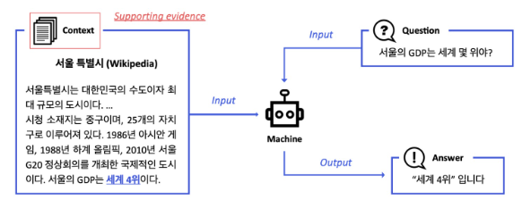

- ODQA: 지문이 따로 주어지지 않음. 방대한 World Knowledge에 기반해서 질의응답
    - e.g., Modern search engines: 연관 문서 뿐만 아니라 질문의 답을 같이 제공

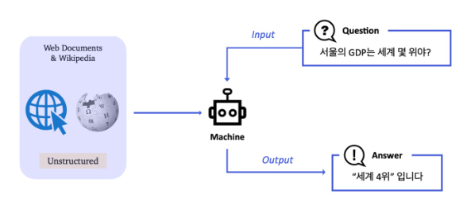

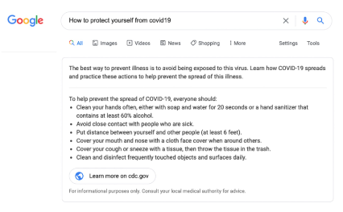

### History of ODQA
- Text retrieval conference (TREC) - QA Tracks (1999-2007): 연관문서만 반환하는 information retrieval (IR)에서 더 나아가 short answer with support 형태가 목표!
- 아의 세 가지로 구성

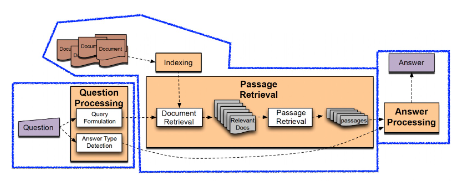

#### 1) Question Processing
- Query formulation: 질문으로부터 키워드를 선택 / Answer type selection (ex. LOCATION: country)

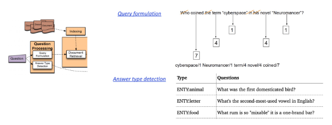

#### 2) Passage retrieval
- 기존의 IR 방법을 활용해서 연관된 document를 뽑고, passage 단위로 자른 후 선별 (Named entity / Passage 내 question 단어의 개수 등과 같은 hand-crafted features 활용)

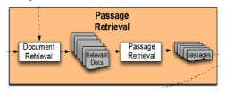

#### 3) Answer processing
- Hand-crafted features와 heuristic을 활용한 classifier
- 주어진 question와 선별된 passage들 내에서 답을 선택

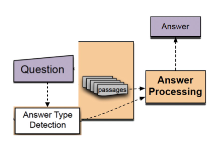

### History of ODQA
- pipeline은 이전과 지금 매우 유사함

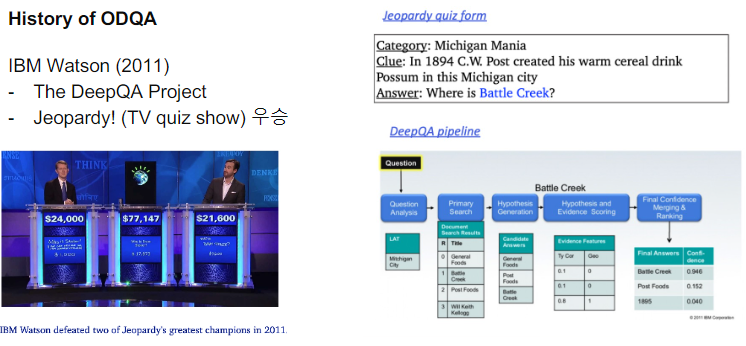

### Recent ODQA Research

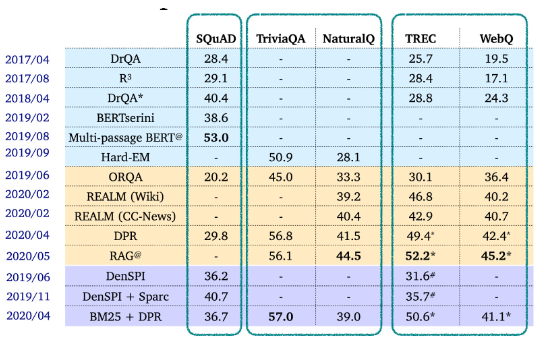

## 2. Retriever-Reader Approach

### Retriever-Reader 접근 방식
- Retriever: 데이터베이스에서 관련있는 문서를 검색(search)
    - 입력: document corpus and query
    - 출력: 관련성 높은 문서 (document)
    - TF-IDF, BM25: 학습 X
    - Dense: 학습 O
- Reader: 검색된 문서에서 질문에 해당하는 답을 찾아냄
    - 입력: Retrieved된 문서 (document)와 질문 (query)
    - 출력: 답변 (answer)
    - SQuAD와 같은 MRC 데이터셋으로 학습
    - 학습 데이터를 추가하기 위해서 Distant supervision 활용

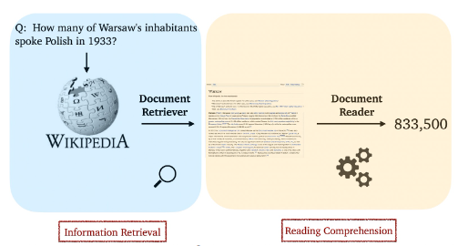

### Distant supervision
- 질문-답변만 있는 데이터셋 (CuratedTREC, WebQuestions, WikiMovies)에서 MRC 학습 데이터 만들기
    - supporting document 필요함
    - http://deepdive.stanford.edu/distant_supervision
    - Relation Extraction에 활용될 https://puture.tistory.com/387

#### How to?
1. 위키피디아에서 Retriever를 이용해 관련성 높은 문서를 검색
2. 너무 짧거나 긴 문서, 질문의 고유명사를 포함하지 않는 등 부적합한 문서 제거
3. answer가 exact match로 들어있지 않은 문서 제거
4. 남은 문서 중에 질문과 (사용 단어 기준) 연관성이 가장 높은 단락을 supporting evidence로 사용

- 아래는 Dataset 별 distant supervision을 적용한 예시

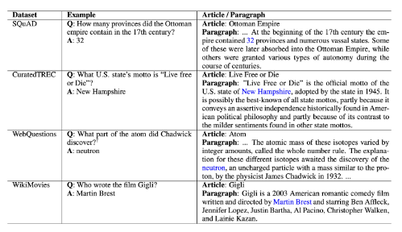

### Inference
- Retriever가 질문과 가장 관련성 높은 5개 문서 출력
- Reader는 5개의 문서를 읽고 답변 예측
- Reader가 예측한 답변 중 가장 score가 높은 것을 최종 답으로 사용


## 3. Issues and Recent Approaches

### Different granularities of text at indexing time
- 위키피디아에서 각 Passage의 단위를 문서, 단락, 또는 문장으로 정의할 지 정해야 함
    - Article: 5.08 million
    - Paragraph: 29.5 million
    - Sentence: 75.9 million

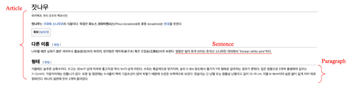

- Retriever 단계에서 몇 개(top-k)의 문서를 넘길지 정해야 함
- Granularity에 따라 k가 다를 수 밖에 없음
    - e.g., article: 5, paragraph: 29, sentence: 78

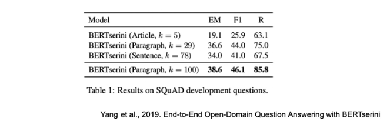


### Single-passage training vs Multi-passage training
- Single-passage: 현재 우리는 k개의 passages들을 reader가 각각 확인하고 특정 answer span에 대한 예측 점수를 나타냄. 그리고 이 중 가장 높은 점수를 가진 answer span을 고르도록 함
    - 이 경우 retrieved passages들에 대한 직접적인 비교라고 볼 수 없음
    - 따로 reader 모델이 보는 게 아니라 전체를 안 번에 보면 어떨까?
- Multi-passages 전체를 하나의 passage로 취급하고 reader 모델이 그 안에서 answer span 하나를 찾도록 함
- Cons: 문서가 너무 길어지므로 GPU에 더 많은 메모리를 할당해야 함 & 처리해야하는 연산량이 많아짐

### Importance of each passage
- Retriever 모델에서 추출된 top-k passage들의 retrieval score를 reader 모델에 전달

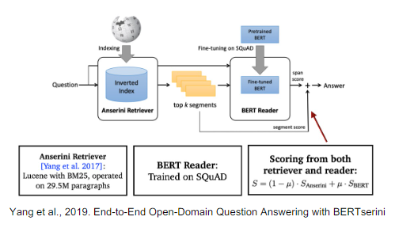

## 4. Practice
- 지금까지 배운 내용을 토대로 ODQA 시스템 구축!

```python
!pip install datasets==1.4.1 > /dev/null 2>&1 # execute command in silence
!pip install transformers==4.4.1 > /dev/null 2>&1
!pip install tqdm==4.41.1 > /dev/null 2>&1

import random
import numpy as np
from pprint import pprint

from datasets import load_dataset, load_metric
from sklearn.feature_extraction.text import TfidfVectorizer

dataset = load_dataset("squad_kor_v1")
# metric = load_metric('squad')

corpus = list(set([example['context'] for example in dataset['train']]))
corpus.extend(list(set([example['context'] for example in dataset['validation']])))
tokenizer_func = lambda x: x.split(' ')

vectorizer = TfidfVectorizer(tokenizer=tokenizer_func, ngram_range=(1,2))
sp_matrix = vectorizer.fit_transform(corpus)


def get_relevant_doc(vectorizer, query, k=1):
    """
    참고: vocab 에 없는 이상한 단어로 query 하는 경우 assertion 발생 (예) 뙣뙇?
    """
    query_vec = vectorizer.transform([query])
    assert np.sum(query_vec) != 0, "오류가 발생했습니다. 이 오류는 보통 query에 vectorizer의 vocab에 없는 단어만 존재하는 경우 발생합니다."
    result = query_vec * sp_matrix.T
    sorted_result = np.argsort(-result.data)
    doc_scores = result.data[sorted_result]
    doc_ids = result.indices[sorted_result]
    return doc_scores[:k], doc_ids[:k]


""" 1. 정답이 있는 데이터셋으로 검색해보기 """
# random.seed(1)
# sample_idx = random.choice(range(len(dataset['train'])))
# query = dataset['train'][sample_idx]['question']
# ground_truth = dataset['train'][sample_idx]['context']
# answer = dataset['train'][sample_idx]['answers']

""" 2. 원하는 질문을 입력해보기 """
query = input("Enter any question: ") # "미국의 대통령은 누구인가?"
# query = "미국의 대통령은 누구인가?"
_, doc_id = get_relevant_doc(vectorizer, query, k=1)

""" 결과 확인 """
print("{} {} {}".format('*'*20, 'Result','*'*20))
print("[Search query]\n", query, "\n")
print(f"[Relevant Doc ID(Top 1 passage)]: {doc_id.item()}")
print(corpus[doc_id.item()])
# print(answer)
```
```
Enter any question: 미국의 대통령은 누구인가?
******************** Result ********************
[Search query]
 미국의 대통령은 누구인가?

[Relevant Doc ID(Top 1 passage)]: 7959
영국과 미국의 관계는 대략 400년 정도 소급된다. 1607년 영국은 "제임스타운"이라고 명명된 북미 대륙 최초의 상주 식민지를 세우기 시작하였고, 오늘날 영국과 미국은 가까운 군사적 동맹체다. 양국은 문화적으로 유사할 뿐만 아니라 군사적 연구와 정보 기구를 공유한다. 영국은 미국으로부터 토마호크 미사일이나 트라이던트 미사일과 같은 무기를 구입했고 미국은 영국으로부터 해리어(Harrier)와 같은 장비를 구매했다. 또한 영국에 대규모 군대를 주둔하고 있다. 최근 영국의 총리와 미국의 대통령은 매우 친밀한 모습을 보여주었다. 가령 토니 블레어와 빌 클린턴 및 이후 조지 W. 부시 대통령 간의 관계, 1980년대 마거릿 대처와 로널드 레이건 등의 관계가 그러하다. 현재 영국의 정책은 혈맹 미국과의 관계는 영국의 "가장 중요한 2자간 관계"임을 표명한다.
```

- 훈련된 MRC 모델 호출

```python
import torch
from transformers import (
    AutoConfig,
    AutoModelForQuestionAnswering,
    AutoTokenizer
)

model_name = 'sangrimlee/bert-base-multilingual-cased-korquad'
mrc_model = AutoModelForQuestionAnswering.from_pretrained(model_name)
tokenizer = AutoTokenizer.from_pretrained(
    model_name,
    use_fast=True
)
mrc_model = mrc_model.eval()

def get_answer_from_context(context, question, model, tokenizer):
    encoded_dict = tokenizer.encode_plus(  
        question,
        context,
        truncation=True,
        padding="max_length",
        max_length=512,
    )
    non_padded_ids = encoded_dict["input_ids"][: encoded_dict["input_ids"].index(tokenizer.pad_token_id)]
    full_text = tokenizer.decode(non_padded_ids)
    inputs = {
    'input_ids': torch.tensor([encoded_dict['input_ids']], dtype=torch.long),
    'attention_mask': torch.tensor([encoded_dict['attention_mask']], dtype=torch.long),
    'token_type_ids': torch.tensor([encoded_dict['token_type_ids']], dtype=torch.long)
    }

    outputs = model(**inputs)
    start, end = torch.max(outputs.start_logits, axis=1).indices.item(), torch.max(outputs.end_logits, axis=1).indices.item()
    answer = tokenizer.decode(encoded_dict['input_ids'][start:end+1])
    return answer

context = corpus[doc_id.item()]
answer = get_answer_from_context(context, query, mrc_model, tokenizer)
print("{} {} {}".format('*'*20, 'Result','*'*20))
print("[Search query]\n", query, "\n")
print(f"[Relevant Doc ID(Top 1 passage)]: {doc_id.item()}")
pprint(corpus[doc_id.item()], compact=True)
print(f"[Answer Prediction from the model]: {answer}")
```
```
******************** Result ********************
[Search query]
 미국의 대통령은 누구인가?

[Relevant Doc ID(Top 1 passage)]: 7959
('영국과 미국의 관계는 대략 400년 정도 소급된다. 1607년 영국은 "제임스타운"이라고 명명된 북미 대륙 최초의 상주 식민지를 세우기 '
 '시작하였고, 오늘날 영국과 미국은 가까운 군사적 동맹체다. 양국은 문화적으로 유사할 뿐만 아니라 군사적 연구와 정보 기구를 공유한다. '
 '영국은 미국으로부터 토마호크 미사일이나 트라이던트 미사일과 같은 무기를 구입했고 미국은 영국으로부터 해리어(Harrier)와 같은 장비를 '
 '구매했다. 또한 영국에 대규모 군대를 주둔하고 있다. 최근 영국의 총리와 미국의 대통령은 매우 친밀한 모습을 보여주었다. 가령 토니 '
 '블레어와 빌 클린턴 및 이후 조지 W. 부시 대통령 간의 관계, 1980년대 마거릿 대처와 로널드 레이건 등의 관계가 그러하다. 현재 '
 '영국의 정책은 혈맹 미국과의 관계는 영국의 "가장 중요한 2자간 관계"임을 표명한다.')
[Answer Prediction from the model]: 조지 W. 부시
```

- 통합하여 ODQA 시스템 구축

```python
def open_domain_qa(query, corpus, vectorizer, model, tokenizer, k=1):
    # 1. Retrieve k relevant docs by usign sparse matrix
    _, doc_id = get_relevant_doc(vectorizer, query, k=1)
    context = corpus[doc_id.item()]

    # 2. Predict answer from given doc by using MRC model
    answer = get_answer_from_context(context, query, mrc_model, tokenizer)
    print("{} {} {}".format('*'*20, 'Result','*'*20))
    print("[Search query]\n", query, "\n")
    print(f"[Relevant Doc ID(Top 1 passage)]: {doc_id.item()}")
    pprint(corpus[doc_id.item()], compact=True)
    print(f"[Answer Prediction from the model]: {answer}")

query = input("Enter any question: ") # "미국의 대통령은 누구인가?"
open_domain_qa(query, corpus, vectorizer, mrc_model, tokenizer, k=1)
```
```
Enter any question: 미국의 대통령은 누구인가?
******************** Result ********************
[Search query]
 미국의 대통령은 누구인가?

[Relevant Doc ID(Top 1 passage)]: 1489
('영국과 미국의 관계는 대략 400년 정도 소급된다. 1607년 영국은 "제임스타운"이라고 명명된 북미 대륙 최초의 상주 식민지를 세우기 '
 '시작하였고, 오늘날 영국과 미국은 가까운 군사적 동맹체다. 양국은 문화적으로 유사할 뿐만 아니라 군사적 연구와 정보 기구를 공유한다. '
 '영국은 미국으로부터 토마호크 미사일이나 트라이던트 미사일과 같은 무기를 구입했고 미국은 영국으로부터 해리어(Harrier)와 같은 장비를 '
 '구매했다. 또한 영국에 대규모 군대를 주둔하고 있다. 최근 영국의 총리와 미국의 대통령은 매우 친밀한 모습을 보여주었다. 가령 토니 '
 '블레어와 빌 클린턴 및 이후 조지 W. 부시 대통령 간의 관계, 1980년대 마거릿 대처와 로널드 레이건 등의 관계가 그러하다. 현재 '
 '영국의 정책은 혈맹 미국과의 관계는 영국의 "가장 중요한 2자간 관계"임을 표명한다.')
[Answer Prediction from the model]: 조지 W. 부시

```

## Further Reading
- [Reading Wikipedia to Answer Open-domain Questions](https://arxiv.org/abs/1704.00051)
- [A survey on Machine Reading Comprehension](https://arxiv.org/abs/2006.11880)
- [ACL 2020 ODQA tutorial](https://slideslive.com/38931668/t8-opendomain-question-answering)
