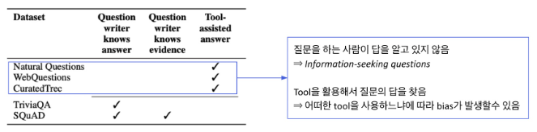
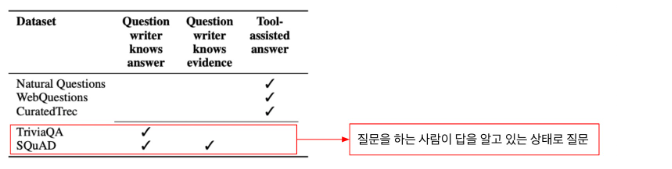
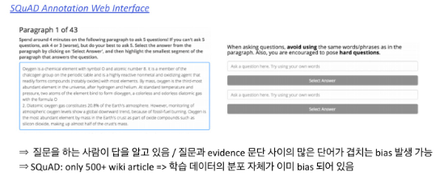
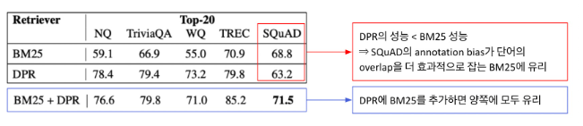
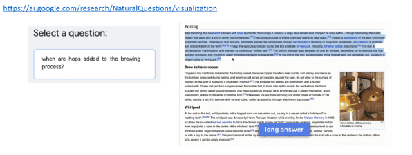

# 8강 Reducing Training Bias

8강에서는 Open-domain QA 문제를 풀 때 발생할 수 있는 bias에 대해 배워보겠습니다. Bias는 무엇인지, 어떤 상황에서 발생할 수 있는지 전반적인 내용들에 대해 알아본 후 ODQA를 풀 때 생길 수 있는 여러 측면의 bias에 대해 알아보겠습니다. 마지막으로 각각의 bias를 해결하기 위한 노력들에는 어떤 것이 있는지 알아보는 시간을 가지겠습니다.

[back to super](https://github.com/jinmang2/boostcamp_ai_tech_2/tree/main/p-stage/mrc)

## 1. Definition of Bias

### Bias in learning
- **Inductive Bias**: 학습할 때 과적합을 막거나 사전 지식을 주입하기 위해 특정 형태의 함수를 선호하는 것

### A biased World
- **Historical Bias**: 현실 세계가 편향되어 있기 때문에 모델이 원치 않는 속성이 학습되는 것
- **Co-occurrence Bias**: 성별과 직업 간 관계 등 표면적인 상관관계 때문에 원치 않는 속성이 학습되는 것
    - Gender Bias

### Bias in Data Generation
- **Specification Bias**: 입력과 출력을 정의한 방식 때문에 생기는 편향
- **Sampling Bias**: 데이터를 샘플링한 방식 때문에 생기는 편향
    - 리터러시 다이제스트 여론조사 (1936년)
- **Annotator Bias**: 어노테이터의 특성 때문에 생기는 편향

## 2. Bias in Open-domain Question Answering

### Training bias in reader model
만약 reader 모델이 한정된 데이터셋 내에서만 학습이 된다면?
- Reader는 항상 정답이 문서 내에 포함도니 데이터쌍만 보게 됨
- e.g., SQuAD와 같은 (Context, Query, Answer)이 모두 포함된 데이터는 positive가 완전히 고정되어있음
- inference 시 데이터 내에서 찾아볼 수 없었던 새로운 문서를 문다면?
- Reader 모델은 문서에 대한 독해 능력이 매우 떨어질 것
- 결과적으로 정답을 내지 못함

### How to migrate training bias?
1. Train negative examples
- 훈련할 때 잘못된 예시를 보여줘야 retriever이 negative한 내용들은 먼 곳에 배치할 수 있음
- Negative sample도 완전히 다른 negative와 비슷한 negative에 대한 차이 고려 필요

2. Add no answer bias
- 입력 시퀀스가 N일 시 시퀀스의 길이 외 1개의 토큰이 더 있다고 생각하기
- 훈련 모델의 마지막 레이어 weight에 훈련 가능한 bias를 하나 더 추가
- Softmax로 answer prediction을 최종적으로 수행할 때, start end 확률이 해당 bias 위치에 있는 경우가 가장 확률이 높으면 이는 "대답할 수 없다"라고 취급

### 어떻게 좋은 Negative Sample을 만들 수 있을까?
- Corpus 내에서 랜덤하게 뽑기
- 좀 더 헷갈리는 negative sample뽑기


## 3. Annotation Bias from Datasets

### What is annotation bias?
- ODQA 학습 시 기존의 MRC 데이터셋 활용
- ODQA 세팅에는 적합하지 않은 bias가 데이터 제작 (annotation) 단계에서 발생할 수 있음







### Effect of annotation bias
- 데이터셋 별 성능 차이가 발생할 수 있음



### Dealing with annotation bias
Annotation 단계에서 발생할 수 있는 bias를 인지하고, 이를 고려하여 데이터를 모아야 함
- ODQA와 유사한 데이터 수집 방법
- Natural Questions: Supporing evidence가 주어지지 않은, 실제 유저의 question들을 모아서 dataset을 구성



### Another bias in MRC dataset
- SQuAD: Passage가 주어지고, 주어진 passage 내에서 질문과 답을 생성
- ODQA에 applicable하지 않은 질문들이 존재

## 4. Practice

### Dense Embedding을 활용하여 passage retrieval 실습해보기

```python
def get_relevant_doc(q_encoder, p_encoder, query, k=1):
    with torch.no_grad():
        p_encoder.eval()
        q_encoder.eval()

        q_seqs_val = tokenizer([query], padding="max_length", truncation=True, return_tensors='pt').to('cuda')
        q_emb = q_encoder(**q_seqs_val).to('cpu')  #(num_query, emb_dim)

        p_embs = []
        for p in valid_corpus:
            p = tokenizer(p, padding="max_length", truncation=True, return_tensors='pt').to('cuda')
            p_emb = p_encoder(**p).to('cpu').numpy()
            p_embs.append(p_emb)

    p_embs = torch.Tensor(p_embs).squeeze()  # (num_passage, emb_dim)
    dot_prod_scores = torch.matmul(q_emb, torch.transpose(p_embs, 0, 1))

    rank = torch.argsort(dot_prod_scores, dim=1, descending=True).squeeze()

    return dot_prod_scores.squeeze(), rank[:k]
```

### 훈련된 MRC 모델로 예측

```python
def get_answer_from_context(context, question, model, tokenizer):
    encoded_dict = tokenizer.encode_plus(  
        question,
        context,
        truncation=True,
        padding="max_length",
        max_length=512,
    )
    non_padded_ids = encoded_dict["input_ids"][: encoded_dict["input_ids"].index(tokenizer.pad_token_id)]
    full_text = tokenizer.decode(non_padded_ids)
    inputs = {
    'input_ids': torch.tensor([encoded_dict['input_ids']], dtype=torch.long),
    'attention_mask': torch.tensor([encoded_dict['attention_mask']], dtype=torch.long),
    'token_type_ids': torch.tensor([encoded_dict['token_type_ids']], dtype=torch.long)
    }

    outputs = model(**inputs)
    start, end = torch.max(outputs.start_logits, axis=1).indices.item(), torch.max(outputs.end_logits, axis=1).indices.item()
    if start == 0 and end == 0:
        answer = "This is not answerable"
    else:
        answer = tokenizer.decode(encoded_dict['input_ids'][start:end+1])
    return answer
```

### 통합해서 ODQA 시스템 구축

```python
def open_domain_qa(query, corpus, p_encoder, q_encoder, mrc_model, tokenizer, k=1):
    # 1. Retrieve k relevant docs by usign sparse matrix
    _, doc_id = get_relevant_doc(p_encoder, q_encoder, query, k=1)
    context = corpus[doc_id.item()]

    # 2. Predict answer from given doc by using MRC model
    answer = get_answer_from_context(context, query, mrc_model, tokenizer)
    print("{} {} {}".format('*'*20, 'Result','*'*20))
    print("[Search query]\n", query, "\n")
    print(f"[Relevant Doc ID(Top 1 passage)]: {doc_id.item()}")
    pprint(corpus[doc_id.item()], compact=True)
    print(f"[Answer Prediction from the model]: {answer}")
```

## Reference
- Seo et al., 2019. Real-Time Open-Domain Question Answering with Dense-Sparse Phrase Index
- Karpukhin et al., 2020. Dense Passage Retrieval for Open-Domain Question Answering
- Lee et al., 2019. Latent Retrieval for Weakly Supervised Open Domain Question Answering
- Rajpurkaret al., 2016. SQuAD: 100,000+ Questions for Machine Comprehension of Text
- https://rajpurkar.github.io/SQuAD-explorer/explore/1.1/dev/Nikola_Tesla.html

## Further Reading
- [Latent Retrieval for Weakly Supervised Open Domain Question Answering](https://arxiv.org/abs/1906.00300)
- [Dense Passage Retrieval for Open-Domain Question Answering](https://arxiv.org/abs/2004.04906)
