# 9강 Closed-book QA with T5

9강과 10강에서는 retriever-reader 방법론 외의 ODQA를 푸는 다양한 방법들에 대해 알아보겠습니다. 9강에서는 최근 등장한 T5 모델을 활용한 closed-book QA에 대해 배워보겠습니다. T5의 핵심은 text-to-text format을 활용한다는 것인데, text-to-text format이 무엇인지, 그리고 이것을 QA에는 어떻게 활용할 수 있을지에 대해 이번 강의에서 중점적으로 다뤄보겠습니다.

[back to super](https://github.com/jinmang2/boostcamp_ai_tech_2/tree/main/p-stage/mrc)

## 1. Closed-book Question Qnswering

- QA 시스템을 구성하는 현재의 접근
- Open-Domain과 Open-book은 다름!

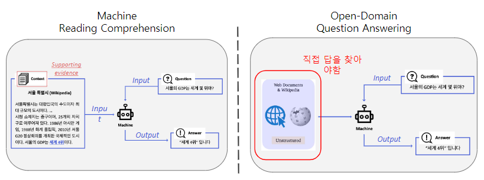

### Idea of Closed-book Question Answering
- 모델이 이미 PLM으로 대량의 지식을 학습했다면, PLM 자체가 이미 하나의 knowledge storage가 아닌가?

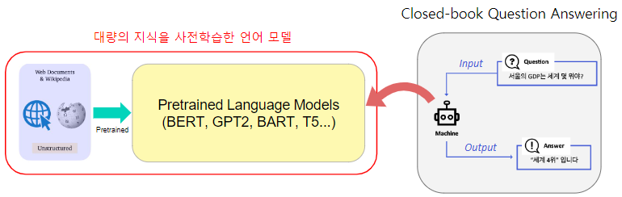

### Zero-shot QA performance of GPT-2
- 사전학습 시 전혀 본 적이 없는 Natural Questions 데이터셋에도 어느 정도 대답이 가능

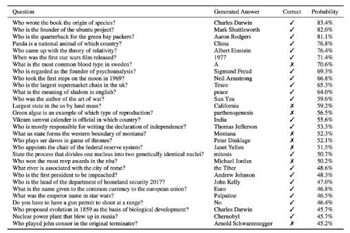

### Open-book QA vs. Closed-book QA

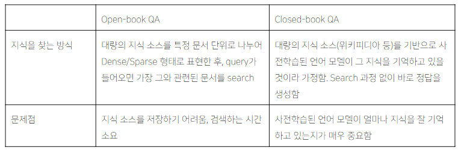

## 2. Text-to-Text Format

### Closed-book QA as Text-to-Text Format
- Generation-based MRC와 유사
- 단, 입력에 지문(Context)가 없이 질문만 들어간다는 것이 차이점
- 사전학습된 언어 모델은 BART와 같은 seq-to-seq 형태의 Transformer 모델을 사용함
- Text-to-Text format에서는 각 입력값(질문)과 출력값(답변)에 대한 설명을 맨 앞에 추가

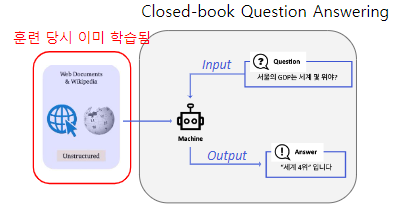

### Text-to-Text Format
- input으로 text를 받아서 output으로 새로운 text를 생성하는 문제
- 다양한 text processing problem을 Text-to-Text 문제로 변형

#### Ex) Machine Translation
- prefix: translate A to B

#### Ex) Text Classification (MNLI)
- input: hypothesis <sent 1> premise <sent 2>

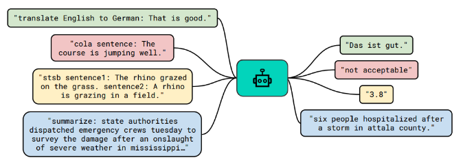

### Model Overview

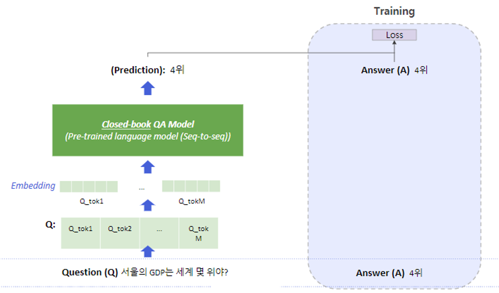

### T5
- Text-to-Text format이라는 형태로 데이터의 입출력을 만들어 거의 모든 자연어처리 문제를 해결하도록 학습된 seq-to-seq 형태의 transformer 모델

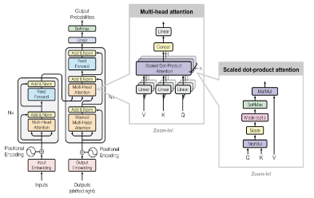

### Pre-training T5
- 다양한 모델 구조, 사전학습 목표, 사전학습용 데이터, Fine-tuning 방법 등을 체계적으로 실험
- 가장 성능이 좋은 방식들을 선택하여 방대한 규모의 모델을 학습

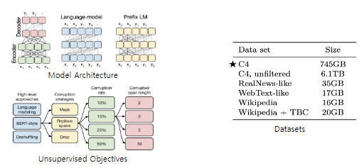

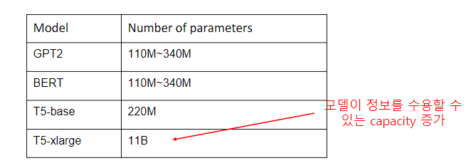

### Using T5 for Closed-book QA
- MRC 데이터셋 (TriviaQA, WebQuestions, Natural Questions)의 QA pair를 활용
- MRC 데이터셋에 제공되는 supporting document는 무시
- input: task-specific prefix 추가 `trivia question: <question>`
- Natural Questions와 같이 답이 여러 개인 경우 target? `answer: <answer 1> answer <answer2>`

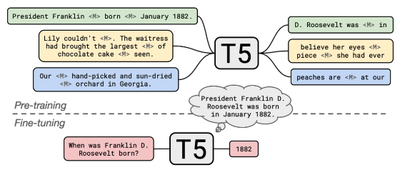

## 3. Experiment Results & Analysis

### Experiment Setting
- `Dataset`: ODQA 데이터셋 또는 MRC 데이터셋에서 지문을 제거하고 질문과 답변만 남긴 데이터 셋을 활용
- `Salient Span Masking`: 고유 명사, 날짜 등 의미를 갖는 단위에 속하는 토큰 범위를 마스킹한 뒤 학습
- `Fine-uning`: PLM T5 체크포인트롤 ODQA로 추가 학습

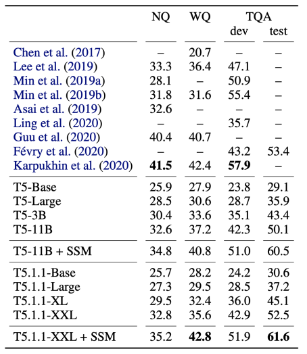

- 대부분의 Open-book 스타일 모델보다 뛰어난 성능을 보임
- 모델 크기가 커질수록 성능이 증가
- Salient Span Masking이 성능을 크게 끌어올림

### False negatives
- Exact Match 기준으로 오답으로 채점된 결과를 사람이 평가한 결과 오답이 아닌 경우
    1. `Phrasing Mismatch`: 정답에 대한 표현이 다른 경우
    2. `Incomplete Annotation`: 정답이 여러 개일 수 있으나 하나만 정답으로 처리되는 경우
    3. `Unanswerable`: 질문을 한 시간이나 문맥에 따라서 정답이 달라지는 경우

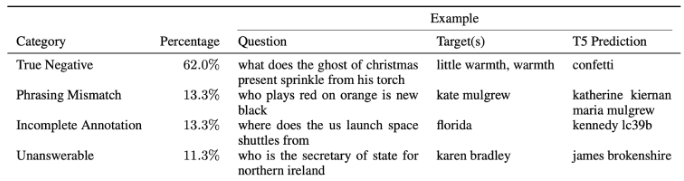

### Limitations
Closed-book QA의 한계점 및 앞으로의 개선 방향

1. 모델의 크기가 커서 계산량이 많고 속도가 느림
2. 모델이 어떤 데이터로 답을 내는지 알 수 없음
3. 모델이 참조하는 지식을 추가하거나 제거하기 어려움

## 4. Practice

### Text-to-Text format

```python
import re
def nq_preprocessor(ex):
  def normalize_text(text):
    """Lowercase and remove quotes from a string."""
    text = text.lower()
    text = re.sub("'(.*)'", r"\1", text)
    return text

  def to_inputs_and_targets(ex):
    """Map {"question": ..., "answer": ...}->{"inputs": ..., "targets": ...}."""
    return {
        "inputs":
             "".join(
                 ["natural question: ", normalize_text(ex["question"])]),
        "targets": normalize_text(ex["answer"])
    }
  return to_inputs_and_targets(ex)
```

##  Further Reading
- [Exploring the limits of transfer learning with a unified text-to-text transformer(T5)](https://arxiv.org/abs/1910.10683)
- [How much knowledge can you pack into the parameters of language model?](https://arxiv.org/abs/2002.08910)
- [UNIFIEDQA: Crossing Format Boundaries with a Single QA System](https://arxiv.org/abs/2005.00700)
