# 10강 QA with Phrase Retrieval

10강에서는 phrase retrieval을 활용한 real-time oepn-domain question answering에 대해 배워보겠습니다. Phrase 단위로 retrieval한다는 것이 무엇인지 알아보고, phrase retrieval을 수행하는 방법에 대해 알아보겠습니다. 마지막으로, 기존 retrievar-reader 구조와 비교해 어떤 장점과 단점을 가지고 있는지 짚어볼 예정입니다.

[back to super](https://github.com/jinmang2/boostcamp_ai_tech_2/tree/main/p-stage/mrc)

## 1. Phrase Retrieval in Open-Domain Question Answering

### Current limitation of Retriever-Reader approach
1. Error Propagation: 5-10개의 문서만 reader에게 전달
2. Query-dependent encoding: query에 따라 정답이 되는 answer span에 대한 encoding이 달라짐

### How does document search work?
- Nearest Neighbor Search
- MIPS 등으로 찾았었음

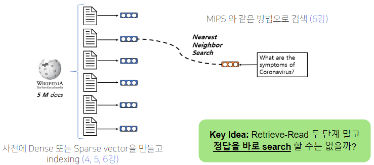

### Phrase Indexing
- 전부 phrase화 시킴
- 이를 vector화
- 질문과 가장 유사한 phrase를 검색

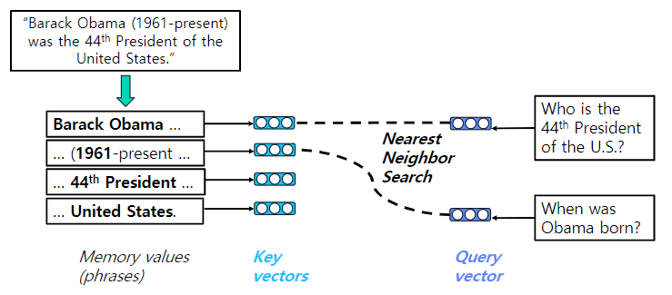

### Query-Agnostic Decomposition
- 어떻게 각 phrase를 vector space 상에 잘 매핑할 수  있을까?
- F를 다시 nono, 새로운 Encoder를 도입!
- Dense와 Sparse 임베딩 둘 다 사용해보자!
- 물론, Decomposite가능하다는 보장은 없음...
- 그리고 최근에 Dense만으로도 잘하는 모델 있음

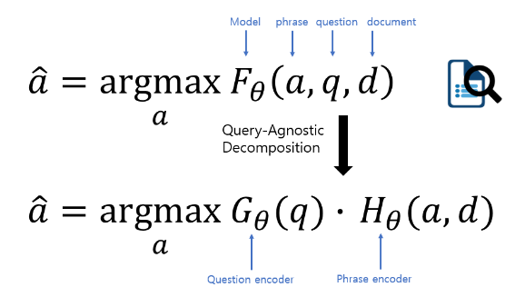

## 2. Dense-sparse Representation for Phrases

### Dense vectors vs Sparse vectors
- Dense: 통사적, 의미적 정보를 담는데 효과적
- Sparse: 어휘적 정보를 담는데 효과적

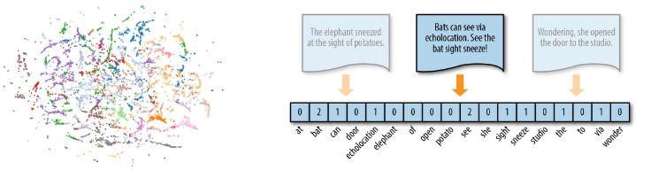

### Phrase and Question Embedding
- phrase embedding도 사용
- concat!

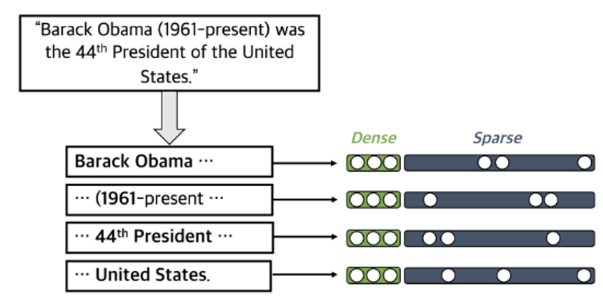

### Dense representation
- PLM을 사용해서 만든다
- Start vector와 End vector를 재사용해서 메모리 사용량을 줄임

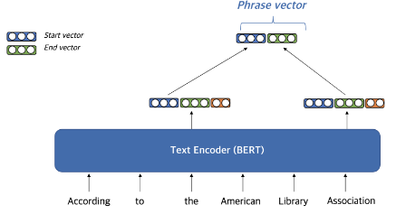

#### Coherency vector
- phrase가 한 단위의 문장 구성 요소에 해당하는지를 나타냄
- 구를 형성하지 않는 phrase를 걸러내기 위해 사용

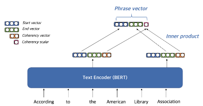

#### Question Embedding

### Sparse representation
- 문맥화된 임베딩을 활용하여 가장 관련성이 높은 n-gram으로 sparse vector 구성

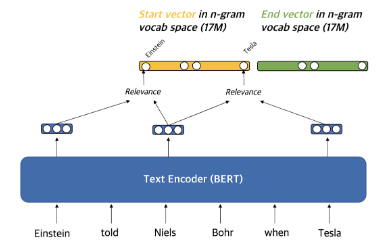

### Scalability Challenge
- Storage: pointer, filter, scalar quantization 활용 (240T -> 1.4T)
- Search: FAISS를 활용해 Dense vector에 대한 search를 먼저 수행 후 sparse vector로 reranking

## 3. Experiment Results & Analysis
- SQuAD-open (Open-domain QA)
    - s/Q: seconds per query on CPU
    - #D/Q: number of documents visited per query
    - DrQA (Retriever-reader)보다 +3.6% 성능
    - 68배 빠른 inference 속도

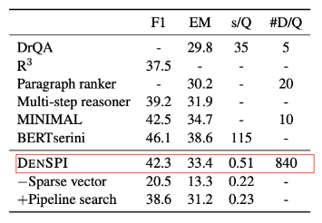

### Experiment Results

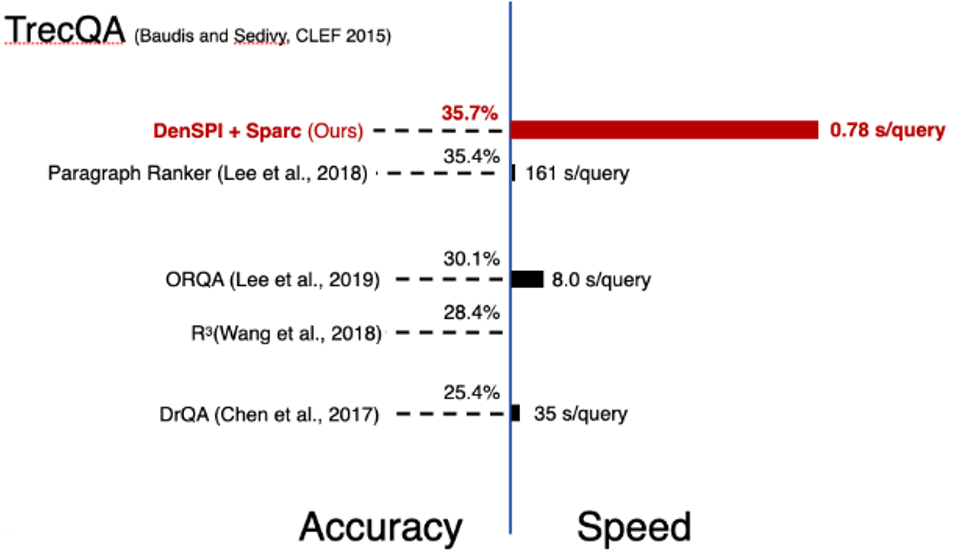

### Limitation in Phrase Retrieval Approach

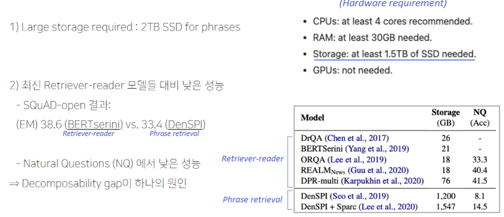

### Decomposability gap

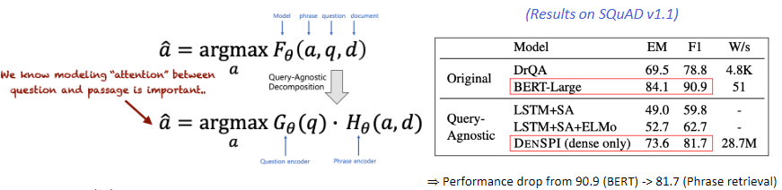

## Further Reading
- [Real-Time Open-Domain Question Answering with Dense-Sparse Phrase Index](https://arxiv.org/abs/1906.05807)
- [Contextualized Sparse Representations for Real-Time Open-Domain Question Answering](https://arxiv.org/abs/1911.02896)
