# Survey of MRC
- https://arxiv.org/pdf/2006.11880.pdf
- https://mrc-datasets.github.io/

## 1. Introduction
- Teaching computers to read the text and understand the meaning of the text is a major research goal that has not been fully realized.
    - In order to accumplish this task, `MRC` was conducted
    - large-scale datasets, higher computing power, deep learning techniques (ref 1-3)
- The concept of MRC comes from the human understanding of text
- MRC has received extensive attention in recent years (ref 4-8)
- The goal of a typical MRC task is to require a machine to read a (set of) text passage(s) and then answers questions about the passage(s), which is very challenging (ref 9)
- Application: `Search Engine` and `Dialogue Systems`

### History
- As early as 1977, Lehnert et al [10] has built a QA program called the `QUALM` which was used by two story understanding systems.
- In 1999, Hirschman et al. [11] constructed a reading comprehension system witha corpus of 60 development and 60 test stories of 3rd to 6th-grade material.
    - Accuracy of baseline system: 30~40% on 11 sub tasks
- Most of MRC systems in the same period were rule-basedor statistical models [12,13]
    - However, due to the lack of high quality MRC datasets, this research field hasbeen neglected for a long time [14]
- In 2013, Richardson et al. [15] created the `MCTest` [15] dataset which contained 500 stories and 2000 questions
    - The original baseline of MCText is a rule-based model
        - and number of training samples is not large...
    - Many researchers began to apply ML models on MCTest
- In 2015 [15] is turning point!
- In order to resolve these bottlenecks, Hermann et al. [19] defined a new dataset generation method that provides large-scale supervised reading comprehension datasets in 2015.
- Hermann et al. [19] also developed a class of attention based deep neural networks!
    - Learn to read real documents and answer complex questions with minimal prior konwledge of language structure
- Since 2015, with the emergence of various large-scale supervised datasets and neural network models, the field of MRC has entered a period of rapid development

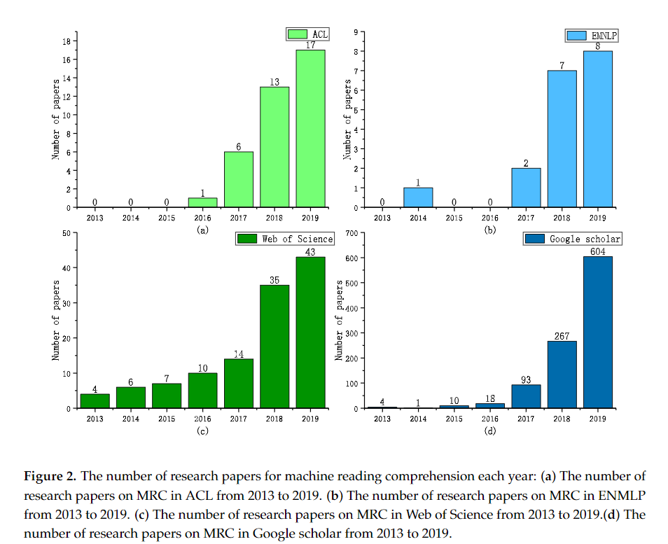

### Motivations
- The performance of the SOTA models have already exceeded human performance over the related MRC benchmark datasets

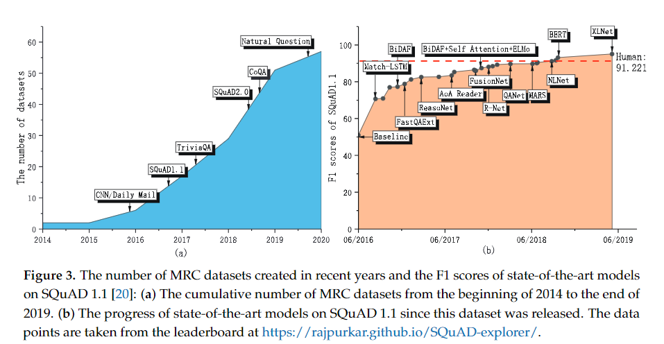

- Despite the critical importance of MRC datasets, most of the existing MRC reviews have forcused on MRC algorithms for improving system performance [26, 27], performance comparisons [7], or general review that has limited coverage of dastasets [6].
- There is a need for systematic categorization/classification of task types.
- Usually, MRC tasks are divided into four categories: (in [14, 27, 28])
    - Cloze style
    - Multiple-choice
    - Span Prediction
    - Free form
- But this classification method is not precise!
    - e.g., CBT task in the Facebook bAbi project, MRC task could belong to both cloze style and multiple-choice style at the same time
- Most researchers focus on few popular MRC datasets!
- **To address these gaps, a comprehensive survey of existing MRC benchmark datasets,evaluation metrics and tasks is strongly needed**
- By [31], there is a still a giant gap between existing MRC and real human comprehension.
- This shows the need of improving existing MRC datasets in terms of both question and answer challenges and related evaluation criteria. - In order to build more challenging MRC datasets, we need to understand existing MRC tasks, evaluation metrics and datasets better

## 2. Tasks
Description in the order below

1. Define typical MRC task
2. Compare multi-modal MRCs with textual MRCs
3. Discuss the differences between QA tasks and MRC tasks
4. Analyze the existing classification method of MRC tasks which is widely used by the community
    - Cloze, Multiple-choice, Span prediction, Free form
5. Argue that the existing classification method is inadequate and has potential problems
6. Summarize 4 different attributes of MRC tasks
7. Give a detailed definition of each category with examples
8. Explain why the new classification method is more adequate
9. Collect totally 57 different MRC tasks and Categorize them according to the new classification method
10. Analyze MRC tasks and Make statistical tables and charts of them

### 2.1 Definition of Typical MRC Tasks
- MRC: special research field which includes some specific tasks
    - such as Multi-modal MRC, Textual MRC
- Most of the existing MRC tasks are in the form of QA
    - textual QA-based MRC is considered to be the typical MRC task
- According to previous review papers on MRC [14, 28], the definition of typical MRC task is:

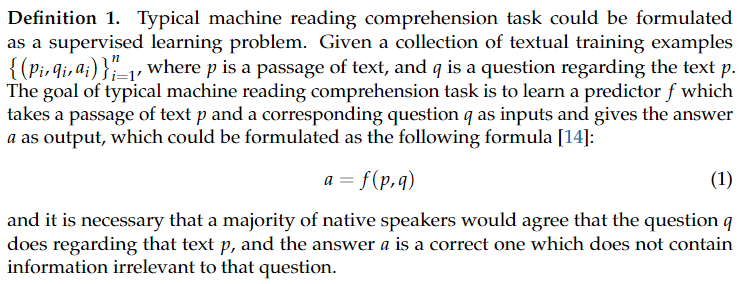

- **Typical Machine Reading Comprehension task**
- supervised learning problem
- p: passages
- q: question regarding the text p
- a: answer which is output of f(p, q)

### 2.2 Discussion on MRC Tasks

#### Multi-modal MRC vs. Textual MRC

Multi-modal MRC: New challenge task!

- NLP + CV
- Requires a deeper unserstanding of the text and visual information such as images and videos
- **When human reads, illustrations can help to understand the text.** [4]
- TQA [32], MovieQA [33], COMICS [34], RecipeQA [35].

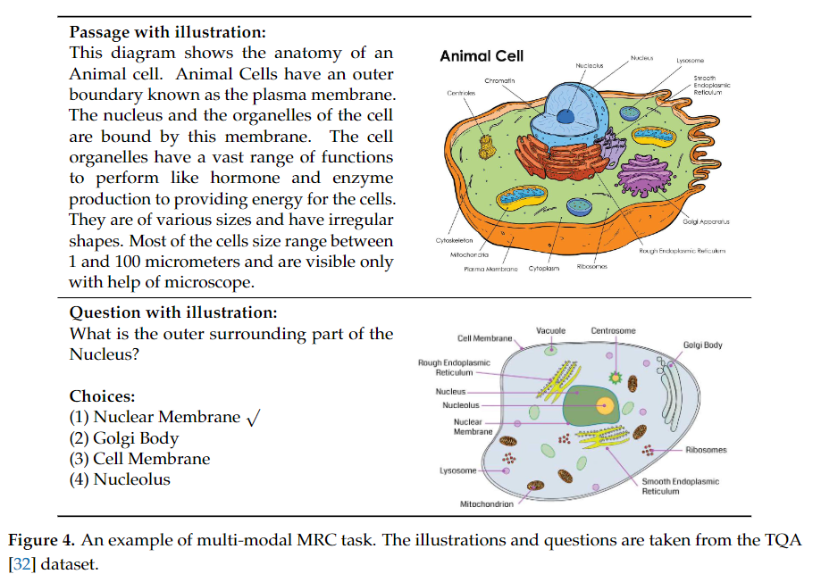

#### MRC vs. QA
- The relationship between QA and MRC is very close
- Some researchers consider MRC as a kind of specific QA task [14, 28]
    - Compared with other QA tasks such as open-domain QA, **MRC** is characterized by that **the computer is required to answer questions according to the  specified text**
- Other researchers regard the MRC as a kind of method to solve QA tasks.
    - By Chen et al. [36], first adopted `document retrieval` to find the relevant articles from Wikipedia, then used `MRC` to identify the answer spans from those articles
    - Similarly Hu [37] regarded machine reading as one of the four methods to solve QA tasks
        - Other three methods are `rule-based method`, `information retrieval method` and `knowledge-based method`
- Typical MRC task is usually in the form of textual QA, but the form of MRC tasks are usually diverse
- By Lucy Vanderwende [38] argued that machine reading could be defined as an automatic understanding of text.
    - ShARC [39]: Conversational MRC dataset which requires background knowledge that is not in the context to get the correct answer
    - RecipeQA [35]: multi-modal comprehension of illustrated recipes (has 4 sub-tasks)
        - e.g., Ordering task tests the ability of a model in finding a correctly ordered sequence given a jumbled set of representative images of a recipe [35]
        - Context: recipe's title and explanation
        - The model needs to understand the temporal occurrence of a sequence of recipe steps and infer temporal relations between candidates
    - MS MARCO [40] also includes ordering tasks
- In summary, **although most machine reading comprehension tasks are in the form of question answering, it does not mean that MRC tasks belong to the QA**
- QA includes a lot of tasks that do not emphasize that the system must read a specific context to get an answer
    - such as rule-based QA system and knowledge-based QA systems(KBQA)

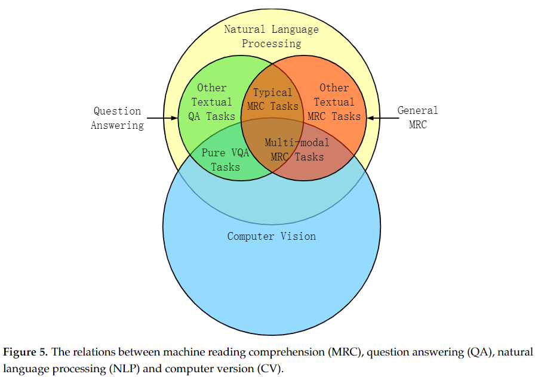

#### MRC vs. Other NLP tasks

Close and Extensive relationship!

- MRC to NLP
    - Stochastic Answer Network (SAN) [41, 42]
        - SOTA on many MRC tasks such as the SQuAD and the MS MARCO
        - SAN can be used in NLP benchmarks [44] such as SNLI, MultiNLO, SciTail, Quora Question Pairs datasets
    - Yin et al., (2017) [45]
        - Document-level multi-aspect sentiment classification task
        - Regards as machine understanding task
        - Propose hierarchical iterative attention model
        - TripAdvisor, BeerAdvocate datasets
- NLP to MRC
    - Asai et al., (2018) [46]
        - Solved the task of non-English reading comprehension through a NMT based on attention mechanism
        - Translate(non-English)=English paragraph
        - Then, apply English reading comprehension model
    - Extra knowledge can be introduced into MRC tasks
        - In SG-Net [47] used syntax information to constrain attention in the MRC task. They used syntactic dependency of interest (SDOI) and have achieved SOTA results on SQuAD 2.0
    - Minaee et al., (2020) [48]
        - Summarize 150>= DL text classification methods and performance on 40>= populer datasets
        - Many of methods mentioned in this articel have beem applied to MRC tasks
- MRC can be used as a step or component in the pipeline of some complex NLP tasks
    - MRC can be used as a step in open domain QA [36]
    - In many dialogue tasks, MRC can also be regarded as a part of pipeline [8, 39, 49]

### 2.3 Classification of MRC Tasks
In order to have a better understanding of MRC tasks, authors analyze existing classification methods of tasks and identify potential limitations of these methods.

#### Existing Classification Methods of MRC tasks
By [14, 27, 28], MRC tasks are divided into four categories

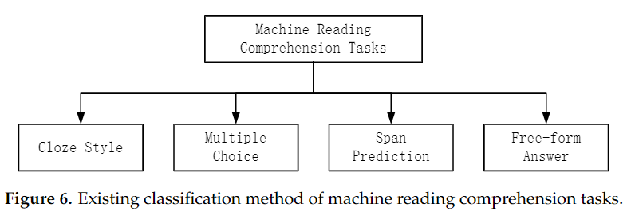

- **Cloze style**
    - There are some placeholders in the question
    - The MRC system needs to find the most suitable words or phrases which can be filled in these placeholders according to the context content
- **Multiple-choice**
    - The MRC system needs to select a correct answer from a set of candidate answers according to the provided context
- **Span Prediction**
    - The answer is a span of text in the context.
    - That is, the MRC system needs to select the correct beginning and end of the answer text from the context
- **Free-form answer**
    - This kind of tasks allows the answer to be any free-text forms
    - The answer is not restricted to a single word or a span in the passage [14]

#### Limitations of Existing Classification Method

1. Existing classification method is a bit ambiguous or indistinct
    - MRC task may belong to multiple task types
    - A sample in the "Who did What" task [50] are both in the form "Cloze style" and "Multiple-choice"
    - The answer is a span of a text in the context. so, "Span prediction"

    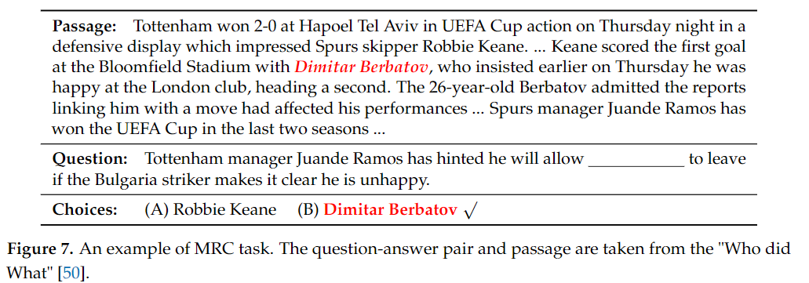

2. Multi-modal tasks are ignored by the existing classification method
    - MovieQA [33], COMICS [34], TQA [32] and RecipeQA [35]
    - A fundamental characteristic of human language understanding is multimodality
    - In essence, real world information is multi-modal and widely exists in texts, voices, and images

Authors list several tasks that belong to the fuzzy classification mentioned above, such as ReviewQA, Qangaroo, Who-did-What, MultiRC, LAMBADA, ReCoRD. According to paper statistics, among the 57 tasks they collected, 29 tasks fall into fuzzy classification.

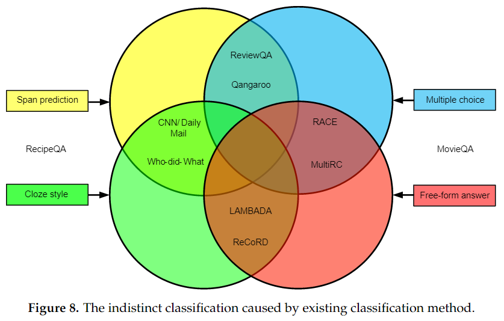

#### A new Classification Method

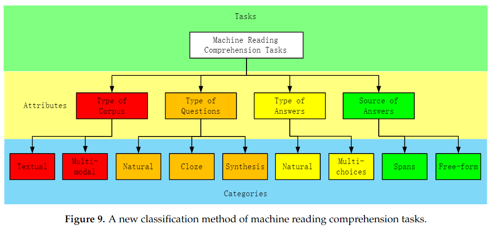

- Sunrise statistical chart for the MRC task classification
- Textual tasks still account for the vast majority of tasks (89.47%)
- Currently, the proportion of MRC tasks is still very small, about 10.53%
- It may be suffer from the lack of future generalization     

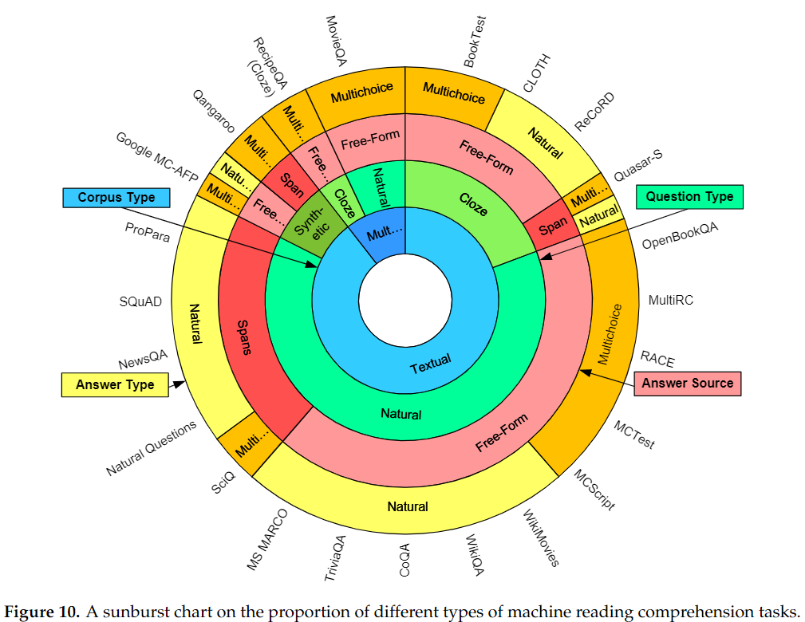

### 2.4 Definition of each category in the new classification method

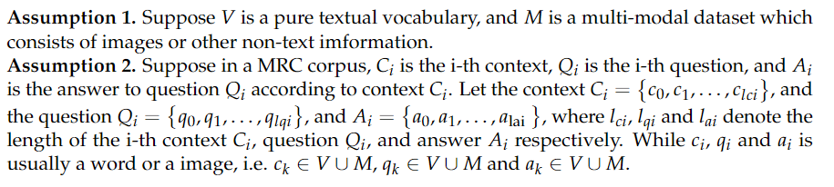

- $l_{c_i}$ is length of i-th context
- $l_{q_i}$ is length of i-th question
- $l_{a_i}$ is length of i-th answer

#### Type of Corpus

- **Multi-modal**

    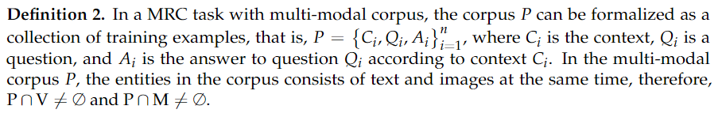

    - e.g., multi-modal MRC tasks and VQA tasks
    - multi-modal MRC tasks focus more on NLU, and their context contains more text that needs to be read
    - VQA task usually does not have much context and gives the image directly

- **Textual**
    - Context, Questions, Answers are all plain texts

    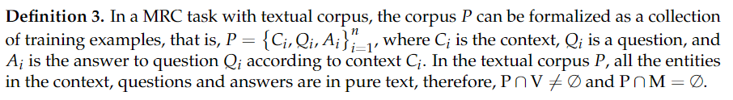

    - Example of textual corpus

    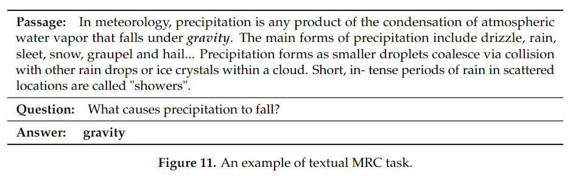

#### Type of Questions

- **Cloze style**
    - The cloze question is usually a sentence with a placeholder
    - Sentence pattern: declarative sentence, imperative sentence
        - Not necessarily an interrogative sentence
    - Require to find a correct word, phrase or image that is suitable to be filled in the placeholder so that the sentence is complete

    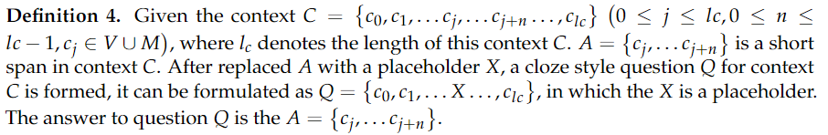

    - Why n is smaller than l_c?
        - In my opinion, notation miss
        - n is span length and j is start token index
        - $0\leq n \leq l_c - j$
    - According to the type of corpus, cloze questions also can be divided into textual and multi-modal
        - A textual cloze question is usually a sentence with a placeholder which is filled with suitable word or phrase

        

        - A multi-modal cloze question is natural sentence with visual information such as images, but some parts of these images are missing
            - So, MRC system is required to fill in the missing images

        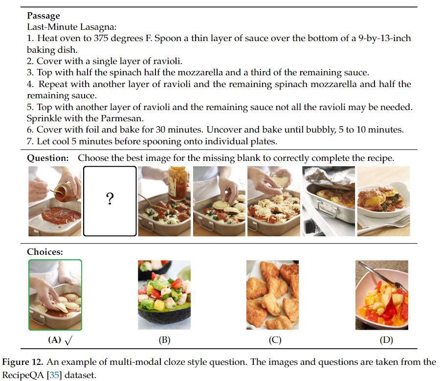

- **Natrual form**
    - A question in natural form is natural question that conforms to the grammar of natural language
    - A natural form question is a complete sentence
        - Different from the cloze question which contains placeholder
    - A question that conforms to the grammatical rules

    

    - In most cases, a 'Natural' question ! is an interrogative sentence that asks a direct question and is punctuated at the end with a question mark
    - However, in some cases, Q may not be an interrogative sentence but an imperative sentence
        - e.g., "please find the correct statement from the following options."
    - According to the type of corpus, natural form questions can be divided into textual and multi-modal
        - Textual natural question is usually a natural question or imperative sentence

        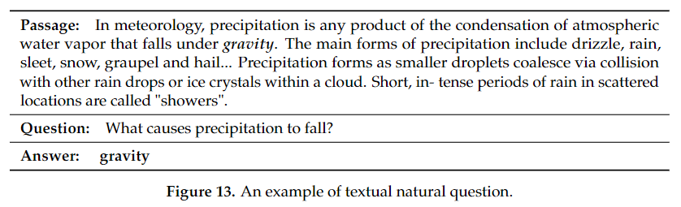

        - Multi-modal natural question is also a natural question or imperative

- **Synthetic style**
    - The synthetic form of the question is just a list of words and do not necessarily conform to normal grammatical rules
    - Common datasets with synthetic from questions are Qangaroo, WikiReading , and so on
    - The 'question' here is not a complete sentence that fully conforms to the natural language grammar, but a combination of words

    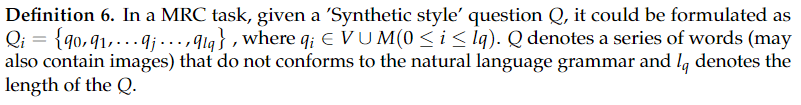

    - The example of synthetic style question

    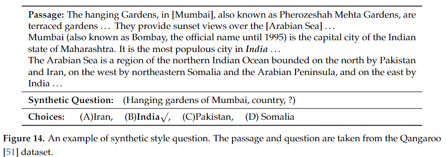

#### Type of Answers
- **Multiple-choice answer**
    - There is a series of candidate answers for each question

    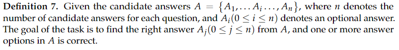

    - Examples above Figure 7, 14, and 12 (multi-modal)

- **Natural form of answers**
    - The answer is a natural word, phrase, sentence or image but it doesn't have to be in the form the multiple options

    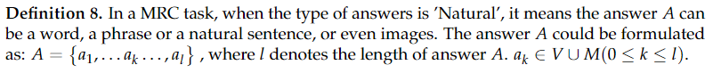

    - Textual example Table 13, multi-modal example has not been found

#### Source of Answers
- **Span answer**
    - The answers are spans of context (so that, the answers come from context)

    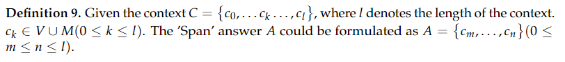

    - Textual example: Figure 7
    - Multi-modal example: do not provide

- **Free-form answer**
    - A free-form answer may be any phrase, word, or even image (not necessarily from the context)
    - The answers can be any free-text or images, and there is no limit to where the answer comes from

    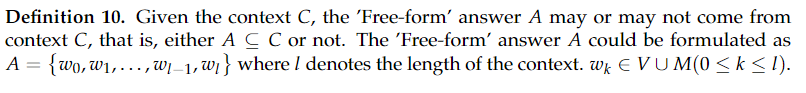

    - multi-modal free-form answer: Figure 12
    - textual free-form answer: below

    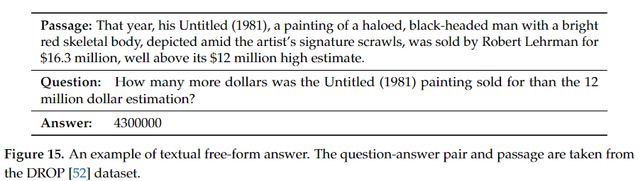

### 2.5 Statisticals of MRC tasks

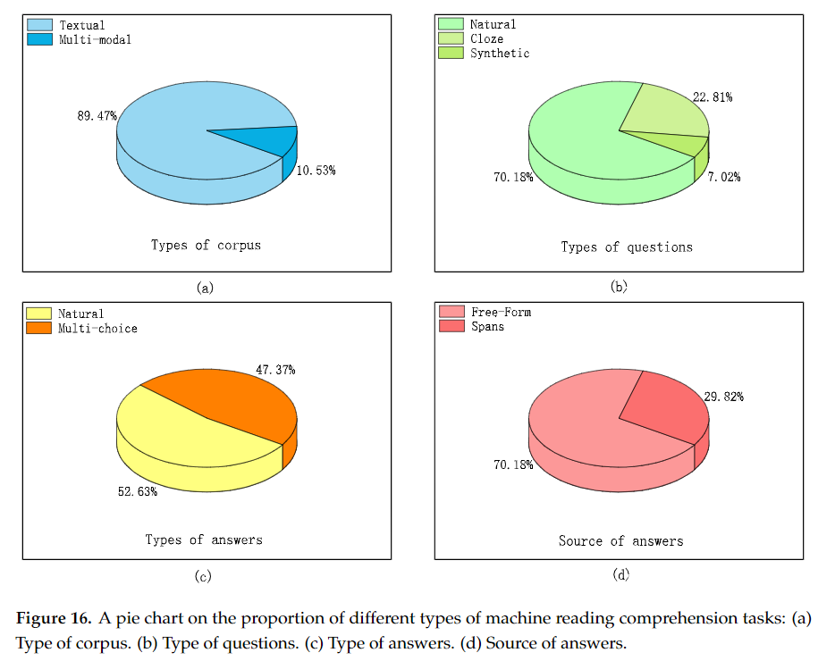

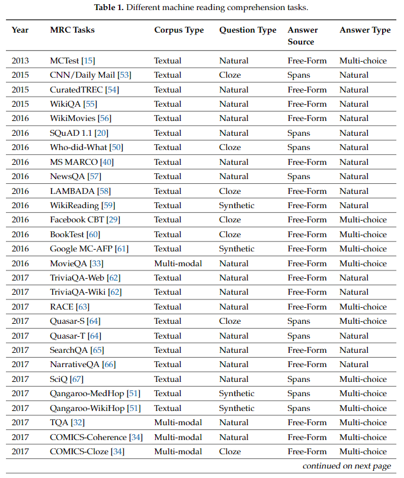

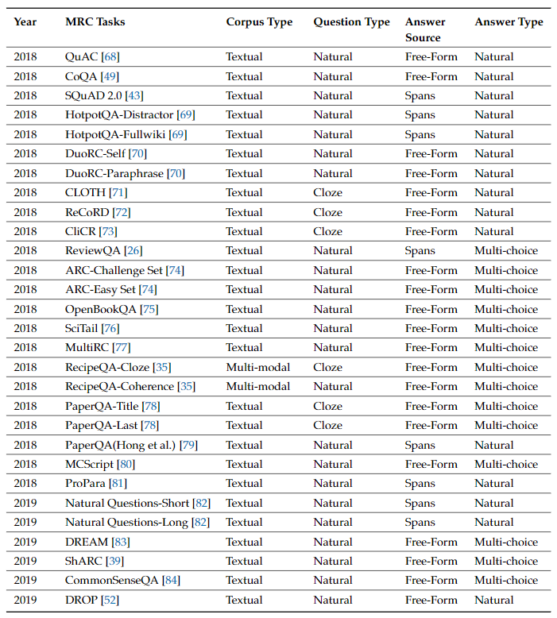

#### Form of Task vs. Content of Task
- The discussion above is mainly about the form of MRC tasks.
- However,it should be noted that,besides the form of the MRC task, the content of the context/passage and the question also determine thetype of a task.
- But because classifying tasks basedon the content is a very subjective matter without established standards, herein, we mainly analyze theforms of tasks rather than the content.

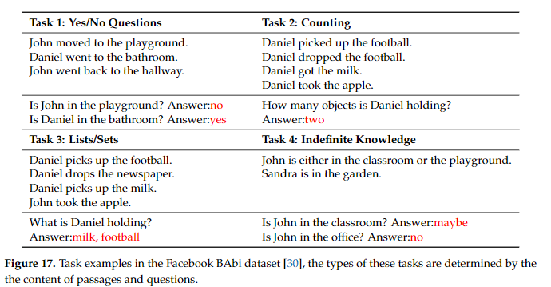

## 3. Evaluation Metrics
Description in the order below

1. Discuss the 9 MRC evaluation metrics
2. Discuss the computing methods of each evaluation metric
    - including several sub-metrics such as token-level F1 and question-level F1
3. Analyze the usage of each evaluation metric in different MRC tasks
4. Make statistics on the usages of different evaluation metrics in the 57 MRC tasks
5. Analyze the relationship between the MRC task types and the evaluation metrics they used

## 4. Benchmark Dataset
Description in the order below

1. Present the family of MRC datasets
2. Analyze the size of each MRC datasets
3. Discuss the generation method of datasets which can be roughly described as several categories:
    - Crowdsourcing, Expert, Automated
4. Conduct an in-depth analysis of the source of corpus and the type of context of MRC datasets, all of which have been published on our website
5. Present a statistical analysis of prerequisite skills and citations of the papers in which each datasets was proposed
6. Summarize 10 characteristics of MRC datasets
7. Give a detailed description of each MRC dataset

## 5. Open Issues
Description in the order below

1. Discuss several open issues that remain unsolved in this field
    - multi-model MRC, commonsense, world knowledge, complex reasoning, robustness, interpretability, evaluation of the quality of MRC datasets
2. Talk about understanding from the perspective of cognitive neuroscience
3. Share some of the latest research results of cognitive neuroscience and the inspiration of these results for NLP research

## 6. Conclusions
