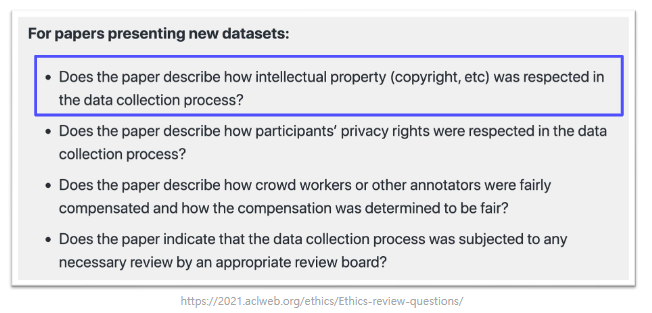
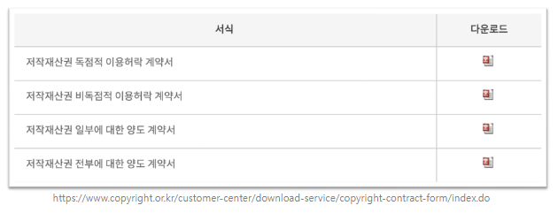
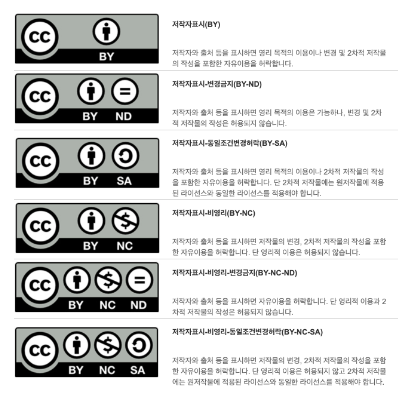
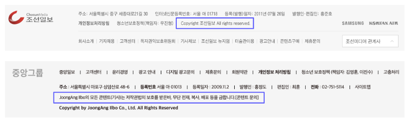
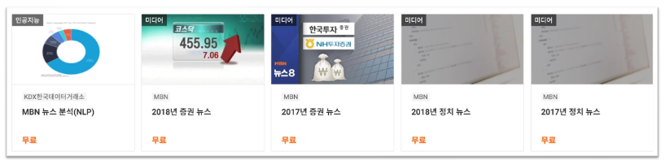
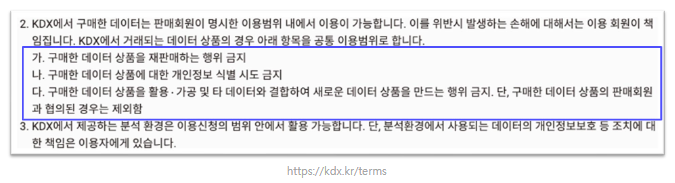
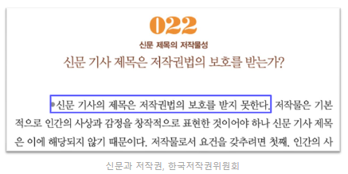

# 내가 만든 AI 모델은 합법일까? 불법일까?

[back to super](https://github.com/jinmang2/boostcamp_ai_tech_2/tree/main/s-stage/ai_engineer_seminar)

## 저작권법, 우리가 왜 알아야 할까?
- 그냥 웹에 있는 데이터 크롤링해서 학습에 쓰면 되는거 아니야?
    - _큰일난다_

**좋은 AI 모델은 좋은 데이터로부터 나온다**
- 내가 풀고 싶은 문제를 푸는 모델을 만들기 위해서는 적절한 데이터가 있어야 한다.
- 대부분의 경우 풀고 싶은 문제에 적합한 데이터가 없다
- 새롭게 데이터를 제작할 때 저작권을 고려하지 않으면 합법적으로 사용할 수 없게 된다
- 합법적이지 않은 데이터로 학습한 모델 또한 완전한 합법의 영역에 있다고 보기 어렵다

**학계에서도 점점 저작권과 라이센스에 대해 주목하고 있다**

**아직 저작권법은 AI 모델 개발을 고려하지 않은 부분이 많다.**

- 저작권법 제 1조 (목적)
    - 이 법은 저작자의 권리와 이에 인접하는 권리를 보호하고 저작물의 공정한 이용을 도모함으로써 문화 및 관련 산업의 향상 발전에 이바지함을 목적으로 한다
- 하지만 현재의 저작권법은 아직 "AI 산업"을 고려하지 않고 있다
    - [AI 분야 저작권 면책조항이 신설된 저작권 법 개정안이 추진되고 있는 상황](https://m.etnews.com/20200701000166?obj=Tzo4OiJzdGRDbGFzcyI6Mjp7czo3OiJyZWZlcmVyIjtOO3M6NzoiZm9yd2FyZCI7czoxMzoid2ViIHRvIG1vYmlsZSI7fQ%3D%3D)
    - AI와 창장자 모두를 고려한 좋은 방향의 법 개정을 위해 관심을 가질 필요가 있다.

## 그래서 저작권 법이 뭔데?

### 용어 정의

**저작권**
- 사람의 생각이나 감정을 표현한 결과물(저작물)에 대하여 창작자에게 주는 권리
- "창작성"이 있다면 별도의 등록절차없이 자연히 발생
    - 예: 이 특강에 사용된 발표자료의 저작권은 저작자인 "문지형"에게 자연히 귀속된다

**저작물**
사람의 생각이나 감정을 표현한 결과물

1. 소설, 시, 논문, 강연, 연설, 각본 그 밖의 어문저작물
2. 음악저작물
3. 연극 및 무용, 무언극 그 밖의 연극저작물
4. 회화, 서예, 조각, 판화, 공예, 응용미술저작물 그 밖의 미술저작물
5. 건축물, 건축을 위한 모형 및 설계도서 그 밖의 건축저작물
6. 사진저작물(이와 유사한 방법으로 제작된 것을 포함)
7. 영상저작물
8. 지도, 도표, 설계도, 약도, 모형 그 밖의 도형저작물
9. 컴퓨터 프로그램 저작물

**저작권법에 의해 보호받지 못하는 저작물**
1. 헌법, 법률, 조약, 명령, 조례 및 규칙
2. 국가 또는 지방자치단체의 고시, 공고, 훈령 그 밖에 이와 유사한 것
3. 법원의 판결, 결정, 명령 및 심판이나 행정심판절차 그 밖에 이와 유사한 절차에 의한 의결, 결정 등
4. 국가 또는 지방자치단체가 작성한 것으로서 제 1호 내지 제 3호에 규정된 것의 편집물 또는 번역물
5. 사실의 전달에 불과한 시사보도

### Questions

Q. 판례 검색 서비스를 제공하는 모델을 만들어서 배포하려고 해요. 괜찮을까요?
A. 네!

Q. 부캠 특강을 보고 너무 인상깊어서 AI Stage에 댓글을 남겼어요. 이 댓글의 저작권은 저에게 있나요?
A. 댓글의 내용에 따라 다릅니다. 요지는 창작성입니다.

Q. 창작성이 인정되는 저작물에 저작권이 자연발생한다면 어떻게 데이터를 합법적으로 쓸 수 있나요?
A. 지금부터 알아봐요!

## 합법적으로 데이터 사용하기

### 1. 저작자와 협의한다
- 저작권자를 아는 경우, 그 사람과 교섭해서 이용 방식에 대해 협의
- 크게 저작물 이용의 허락을 받는 것, 저작재산권을 양수받는 것 등의 방법이 있음

**저작재산권 독점적/비독점적 이용허락**
- 독점적 이용허락
- 비독점적 이용허락

**저작재산권 전부/일부에 대한 양도**
- 저작재산권을 양도할 수 있는 권리
- 일정한 기간을 정하여 양수받을 수 있음

### 2. 라이센스
- 저작자에게 이용 허가 요청을 하지 않아도 저작자가 제안한 특정 조건을 만족하면 이용이 가능하도록 만든 저작물에 대한 이용허락 규약
- 라이센스를 발행하는 단체는 다양할 수 있음
    - 가장 유명한 것은 Creative Commons라는 비영리 단체에서 제공하는 `CCL`이 있음
    - 국내에는 문체부에서 제공하는 `공공누리`가 있음

**CCL**

`BY: Attribution` 저작자 표시
- 적절한 출처와 해당 라이센스 링크를 표시, 변경이 있는 경우 공지

`ND: NoDerivatives` 변경 금지
- 이 저작물을 리믹스, 변형하거나 2차적 저작물을 작성하였을 경우 그 결과물을 공유할 수 없음

`NC: Noncommercial` 비영리
- 이 저작물은 영리 목적으로 이용될 수 없음
- 교육과 연구 등이 비영리 목적 활용에 포함

`SA: ShareAlike` 동일조건 변경허락
- 이 저작물을 리믹스, 변형하거나 2차적 저작물을 작성하고 그 결과물을 공유할 경우에는 원 저작물과 동일한 조건의 CCL을 적용

#### 구체적인 사례

`CC-BY-NC-SA`, BY + NC + SA
- 저작자 표시 + 비영리 + 동일조건 변경 허락
- e.g., 나무위키

`CC-BY-ND`, BY + ND
- 저작자 표시 + 변경 금지
- e.g., KorQuAD

## AI를 하다보면 자주 마주칠 수 있는 사례

### 뉴스 데이터의 이용
- 뉴스 기사의 저작권은 언론사에 있음
    - 한국언론진흥재단에서 대부분 언론사의 저작권을 위탁해서 관리

- 뉴스 기사를 합법적으로 사용하기 위해서는?
    - 원하는 기사를 제공하는 언론사가 한국언론진흥재단에 저작권 위탁을 맡겼다면, 한국언론진흥재단에 문의
    - 아니라면 직접 언론사에 컨텐츠 사용 범위와 계약 조건에 대해 문의
    - 혹은 아주 드물게 CCL이 적용된 언론사의 뉴스 기사를 사용

- [0원에 구매한 데이터](https://kdx.kr/data/list?search=%EB%89%B4%EC%8A%A4&price=0&price_end=0&page_num=1)는 내 마음대로 이용할 수 있을까?
    - 데이터 판매회원이 정한 이용약관에 따라 다름
    - KDX의 경우 기본적으로 아래의 가, 나, 다 조항의 공통 이용 범위 내에서만 가능
    - 추가 조건을 더 걸었다면 다른 이용이 불가능할 수도 있다

- 뉴스 기사의 제목은 저작물로서의 가치를 인정받지 못한다

### 공정 이용 (Fair-use)
아래의 경우에 대해서는 저작권자의 허락을 받지 않고도 저작물을 이용할 수 있다.

- 재판절차 등에서의 복제
- 정치적 연설 등의 이용
- 학교 교육 목적 등에의 이용
- 시사 보도를 위한 이용
- 공표된 저작물의 이용
- 영리를 목적으로 하지 않은 공연ㆍ방송
- 사적 이용을 위한 복제
- 도서관 등에서의 복제
- 시험 문제로서의 복제
- 시각장애인 등을 위한 복제
- 방송사업가의 일시적 녹음ㆍ녹화
- 미술ㆍ사진ㆍ건축저작물의 전시 또는 복제
- 번역 등에 의한 이용
- 시사적인 기사 및 논설의 복제
- 정당한 이용자에 의한 보존을 위한 프로그램 복제
- 프로그램 코드 역분석

## 마무리
- 저작권법의 취지는 **저작자의 권리와 이에 인접하는 권리를 보호하고 저작물의 공정한 이용을 도모함으로써 문화 및 관련 산업의 향상발전에 이바지함을** 목적으로 한다.
- 하지만 AI 산업에 대해서는 아직도 회색지대에 놓인 것들이 많다
- 저작물의 저작권이 있으면서 라이센스가 부착된 경우, 해당 라이센스의 이용 범위 내에서 이용 가능
    - NOTE: CCL 라이센스가 아닌 다른 종류의 라이센스도 많다
- 저작물의 저작권이 있으면서 라이센스가 없는 경우, 직접 저작권자와 협의

## Reference
- [법령/저작권법](https://www.law.go.kr/%EB%B2%95%EB%A0%B9/%EC%A0%80%EC%9E%91%EA%B6%8C%EB%B2%95)
- 알기쉬운 저작권 계약, 한국저작권위원회, 2014
- 신문과 저작권, 한국저작권위원회, 2009
- [저작권등록-FAQ](https://www.cros.or.kr/psnsys/cmmn/infoPage.do?w2xPath=/ui/twc/sercen/faq/faq.xml)
- [문체부-콘텐츠,저작권,미디어](https://www.mcst.go.kr/kor/s_policy/copyright/knowledge/know01.jsp)
