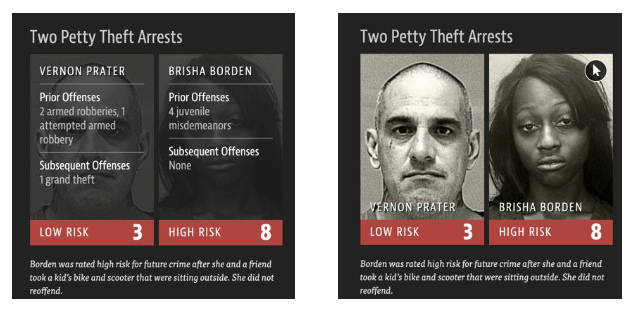
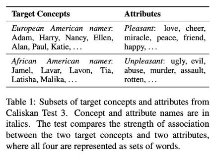
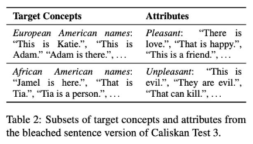
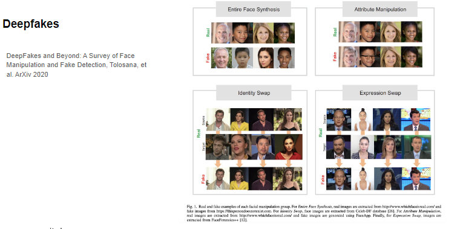
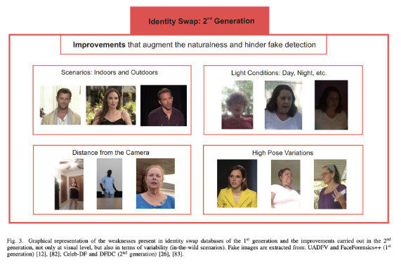

# AI Ethics

[back to super](https://github.com/jinmang2/boostcamp_ai_tech_2/tree/main/s-stage/ai_engineer_seminar)

## AI & Individuals

### Bias
COMPAS Tool
- 인종 차별 툴? 내재된 Bias
- 어디서 왔을까?

### [Big Data's Disparate Impact](https://www.californialawreview.org/wp-content/uploads/2016/06/2Barocas-Selbst.pdf)
- 어떠한 solution을 낼 수 있는 것이 아니라 어려운 문제임
- Bias는 도대체 어디서 온 것일까?

1. `Target Variable`과 `Class Labels`을 정의 (이것부터 bias가 들어갈 수 있다)
    - `Target Variable`: 우리가 예측하고자 하는 바
        - Not obvious
        - Example: fraud, spam
    - `Class labels`: target variable에 이산적인 값을 할당 (때로 실수값)
        - Fraud or spam: yes/no
    - Good Employee의 정의를 과연 어떻게?

2. Training Data: `Labeling examples`
    - 라벨링을 누가 어떻게 하는가?
3. Training Data: `Collection`
    - 데이터를 어떻게 모으는가?
    - `Underrepresentation` and `Overrepresentation`
4. `Feature Selection`
    - e.g., Hiring Decision
    - 지역, 학벌 등이 main feature?
    - coarse granularity
5. Proxies (`Unintentional` or `Intentional` discrimination)
    - 의도하지 않은 패턴
    - 혹은 의도한 패턴 (e.g., 종교)

즉, ML Pipeline 군데군데에서 Bias는 항시 발생할 수 있다!

### Bias Metrics
- [On Measuring Social Biases in Sentence Encoders](https://aclanthology.org/N19-1063/)

이름에 따라 Pleasant, Unpleasant attribute 중 어떤 속성에 확률이 높은가?

Sentence-Level Embedding bias
- BERT에도 있음

### Privacy
- [Contact Tracing Mobile Apps for COVID-19:Privacy Considerations and Related Trade-offs](https://arxiv.org/pdf/2003.11511.pdf)
- 싱가폴 앱에서 중앙 서버에 token을 time-varying random string으로 저장 (다 가지고는 있음. 판별 불가)
- 그치만 개별 사용자가 COVID-19에 걸리면 개인 정보를 수집해간다? 고 함
- Privacy from snoopers
    - privacy 있음
- Privacy from contacts
    - 서로에 대해서는 privacy가 있음
- **Privacy from the authorities**
    - 정부에 대해서는 privacy가 없음
- 여러 technical report를 제시하긴 했음
- Public Disclosure (한국 동선 공개)

## AI & Society

### Social Inequality
- [The AI Now Report](https://ainowinstitute.org/AI_Now_2016_Report.pdf)
- AI가 사회적으로 어떤 영향을 미칠 것인가?
- AI used in important decision making
    - Housing
    - Health insurance
    - Credit rating
    - Employment
    - Legal decisions
- Amplified bias
    - Racial
    - Gender
    - Education
    - Regions
- AI의 보급은 누구에게 좋은가?
    - 지식, 스킬, 접근 가능 및 거대 resource를 가진 회사
- 누구에게 좋지 않은가?
    - 소수자, 약자, 지식이 없는 자

#### Social Inequality: Labor
- 자동화 시스템이 도와줄 수 있는 부분이 있지만
- 직업이 없어질 수도 있다
- Uber, no contract
- https://tinkeredthinking.com/?id=836
- 언어모델이 글을 얼마나 잘 쓰는지?
- Labor 관점에선... ㄷㄷ
- 하지만 가짜 뉴스도 쓸 수 있지 않을까?

### Misinformation

**Deepfakes**
- Entire face synthesis
    - `StyleGAN`
    - `ProGAN`
- Identity swap
    - `FaceSwa`
- Attribute manipulation
    - `StarGAN`
- Expression swap
    - `Face2Face`

1세대의 Identity Swap은 조금 어색

그러나 2세대에선 진짜같음

[Demo of Celeb-DF](https://www.youtube.com/watch?v=vLTiluewGQY)

Deepfake를 판별하는 모델, Identity를 예측하는 문제도 있음!
- https://www.pnas.org/content/110/15/5802
- [Detecting Contract Cheaters in Online Programming Classes with Keystroke Dynamics](https://dl.acm.org/doi/abs/10.1145/3386527.3406726) 오혜연 교수님 paper

Q. 나쁜 의도를 갖고 사용하는 것을 어떻게 잘 판별할 수 있을지?

## AI & Humanity

### AI for Health
- [AI for Health](https://www.microsoft.com/en-us/ai/ai-for-health)
- [암 early detection](https://www.youtube.com/watch?v=Mur70YjInmI)
- [HIV 지속적 관리](https://www.path.org/articles/improving-hiv-care-for-teens-in-kenya-with-virtual-friendships/)
- [Artificial intelligence–enabled rapid diagnosis of patients with COVID-19](https://www.nature.com/articles/s41591-020-0931-3)

### AI for Climate Change
- Big Model의 학습에 탄소 배출량이 엄청 많다
    - [On the Dangers of Stochastic Parrots. Can Language Models Be Too big](https://dl.acm.org/doi/10.1145/3442188.3445922)
    - [위 논문 YouTube 자료](https://www.youtube.com/watch?v=N5c2X8vhfBE)
- 기후 변화에 AI가 도움이 될 수 있다
    - [Tackling Climate Change with Machine Learning](https://arxiv.org/pdf/1906.05433.pdf)
    - [Forecasting of photovoltaic power generation and model optimization: A review](https://www.sciencedirect.com/science/article/abs/pii/S1364032117311620)
    - AI Solution? low carbon source를 어떻게 쓸지? 공장 탄소배출 어떻게 줄일지?
- 전기차, Transportation에서의 AI CO2 emissions 줄이기
- 온수 최적 조절
    - [Deep Reinforcement Learning based Optimal Control of Hot Water Systems](https://www.sciencedirect.com/science/article/abs/pii/S0360544217320388)
- 동선을 짧게 줄여주는 AI (Urban Computing)
    - [Sequences of purchases in credit card data reveal lifestyles in urban popula](https://www.nature.com/articles/s41467-018-05690-8)
- In industry, DeepMind!
    - Google Data Center Cooling
    - https://deepmind.com/blog/article/deepmind-ai-reduces-google-data-centre-cooling-bill-40
- Farms & Forest
- Climate Prediction

많은 곳에서 도움이 될 수 있다!
