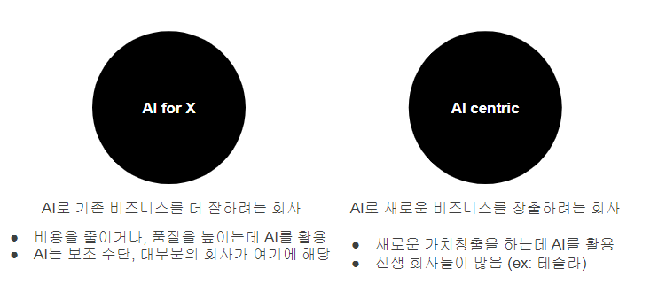
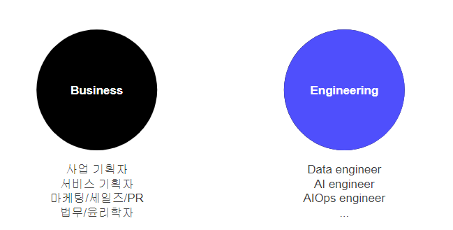
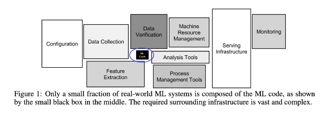
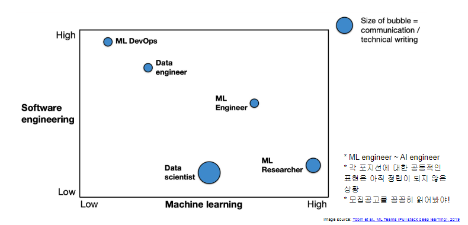
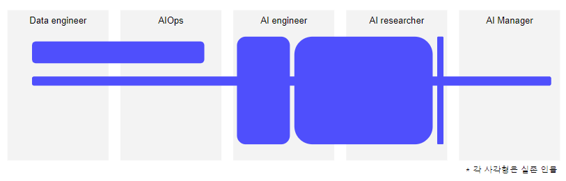
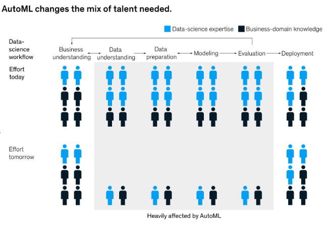
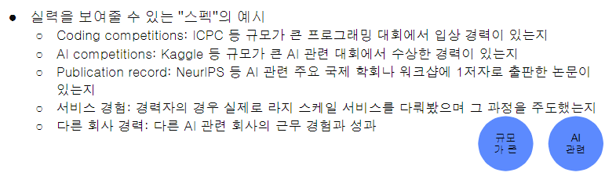

# AI Ethics

[back to super](https://github.com/jinmang2/boostcamp_ai_tech_2/tree/main/s-stage/ai_engineer_seminar)

## 강사 소개
- 박은정(Lucy Park) https://www.lucypark.kr/
- 현) Upstage CSO (Chief scientific officer)
- 전) NAVER PAPAGO 소속 ML Engineer 및 NMT Modeling Team Leader
- 기술 및 걸쳐 인터뷰어 100회 이상

## Prerequisites & Caveat
- "나"에 대해 알기, 커리어 패스를 정하는데 가장 중요한 부분!
- 모든 사람의 경험, 성장, 가치관은 다름.
- AI 분야에 종사하고 싶은 사람들을 위한 Talk
- AI로 인한 직업 소멸, 생성에 대한 내용은 다루지 않음

## Careers in AI

### 학교를 가야하나요? 회사를 가야하나요?
- 두 조직은 목표부터가 다름
    - 학교는 논문을 써서 연구 성과를 만드는 것이 목표
    - 회사는 서비스/상품을 만들어서 돈을 많이 버는 것이 목표
- 논문을 쓰고 싶어요! **학교**
    - 회사는 논문을 쓸 시간적 여력이 부족할 수 있음
    - 학교는 논문을 쓰는 방식을 지도받을 수 있음
- 상품/서비스를 만들고 싶어요! **회사**
    - 회사는 상대적으로 데이터, 계산 자원이 풍부
    - Toy Data가 아니라 어마어마한 양의 트래픽을 통해 발생되는 대규모의 리얼 데이터를 만질 수 있음
    - 즉, 궂은 일도 기꺼이 마다할 수 있어야 함
        - 너무너무 원하는 바!

오늘의 Talk은 `회사`

### AI를 다루는 회사의 종류

- 전자: 업무 자동화, 품질 개선 등
- 후자: 신생 회사들이 많음. 기존에는 없던 새로운 가치창출을 위해 존재

### AI를 다루는 팀의 구성

### Careers in AI: Engineering
- [Hidden Technical Debt in Machine Learning Systems, 2015](https://proceedings.neurips.cc/paper/2015/file/86df7dcfd896fcaf2674f757a2463eba-Paper.pdf)

- AI/ML 모델링은 팀 전체 업무의 일부임!
- 다양한 업무가 있는 만큼 팀 내에는 다양한 역할이 있음

- [Full stack deep learning](https://fall2019.fullstackdeeplearning.com/course-content/ml-teams)

**현실에서는 정말 다양한 역할이 있고 100% 하나의 포지션의 역할을 수행하는 경우는 드묾!**

현실에서 각 포지션은 세분화가 되어 있고, 사이 사이를 메꾸는 일들이 굉장히 많습니다 ㅠㅠ

1. 전xx씨의 일과
    - 가운데 AI engineer 안의 작은 사각형
    - 모델 학습, 모델 실행 컨테이너 작성 후 모델 서빙팀에 전달
    - 논문을 읽고 새 아이디어를 얻어서 모델 개선
        - Data Augmentation, Optimizer 변경 등
    - 데이터 전처리 및 오류 수정
2. 정xx씨의 일과
    - AI engineer과 AI researcher 사이에 걸쳐있는 큰 사각형
    - 고객 문의/컴플레인이 들어오면 데이터/모델 개선 및 배포
    - 어떻게 평가를 해야 고객 만족도를 가장 잘 측정할 수 있을지?
    - 풀어내는 문제를 학계에서 관심있는 형태로 포장하여 논문화
3. 이xx씨의 일과
    - AI Research Deep~한 사각형
    - 논문 읽기, 세미나 하기, 프로토 타이핑
    - [Example: 걸어다니는 도서관을 찾습니다](https://www.facebook.com/yudkowsky/posts/10155717921624228)
    - 아주 큰 회사가 아니면 드묾
4. 김xx씨의 일과
    - Data engineer와 AIOps에 걸쳐있는 사각형
    - 고객은 AI모델링팀
    - Kubenetes 및 Kubeflow 등을 활용한 ML Workflow, Intra-structure 관리
    - 다양한 소스로부터 들어오는 데이터의 통합 및 버저닝, 파이프라인 자동화, 관리 등
5. 하xx씨의 일과
    - 전반에 걸친 사각형! Full stack
    - Firefighting
    - 온종일 내외부 미팅 많음
    - 원래 이런 역할이라기보단 다른 분야를 깊게 파시다 매니저가 되면 이런 유형으로 바뀜
    - Hoxy... x정우 마스터님/../.?!?!
6. 서xx씨의 일과
    - 1과 동일한 사각형! 다른 유형
    - 모바일 CPU 아키텍쳐를 살펴보며 어셈블리 레벨에서의 최적화에 대한 고민
    - 경량 모델 동향 조사를 위한 논문 읽기

**회사들은 보통 비어있거나 보강하고 싶은 곳이 생기면 공고를 내거나 추천을 받아 사람을 뽑는다!**

### Trends in AI engineering positions
- AI modeling 외에도 다양한 포지션이 많음!
- AI modeling에 대한 수요는 점차 줄어들 가능성이 있음
- AI + {Backend, Frontend, Research}
- [McKinsey & Company AutoML 트렌드 변화](https://www.mckinsey.com/business-functions/mckinsey-analytics/our-insights/rethinking-ai-talent-strategy-as-automated-machine-learning-comes-of-age?cid=-soc-twi-mip-mck-oth---&sid=3602376371&linkId=97505373)

## How to start my AI engineering career

### Step one
**너 자신을 알라!**
- Fundamental한 학문을 좋아하는가? 그리고 잘하는가?
- 결과가 나오지 않아도 꾸준히 팔 수 있는 인내심이 있는가?
- AI/ML 모델링 뿐 아니라 그 과정에서 발생하는 모든 일 (웹프, 데이터 전처리)를 기꺼이 할 수 있는가?

위를 만족하면 연구자! (오... 난데...)

- 나는 비즈니스에 관심이 있는가?
- 내가 만든 모델을 사람들이 쓰면서 실생활에 변화가 있길 바라는가?
- AI/ML 모델링 뿐 아니라 그 과정에서 발생하는 모든 일 (웹프, 데이터 전처리)를 기꺼이 할 수 있는가?

위를 만족하면 엔지니어!

**중요한 것은 AI/ML 모델링 뿐만 아니라 그 안의 과정에 관심이 있는가이다!!**

### Step two
**최대한 빨리 시작할 것!**
- 인턴쉽
- AI Competition
- 최신 논문 재현

### Questions

#### 석/박사 학위는 꼭 필요한가요?
- 갈 수는 있다
- 내가 성장할 수 있는 환경을 택할 것
    - 배울 수 있는 사람
    - 풍부한 데이터/계산 자원
    - 집중할 수 있는 문화 등

#### 꼭 컴공과여야 하나요?
- Nope
- In Upstage,
    - 컴공, 산공, 화공, 영문, 심리

#### X를 꼭 배워야하나요?
- 필요하면 그 때 그 때 찾을 것

#### 어떤 역량을 쌓아야 하나요?
- 질문을 역으로 할게요, 어떤 사람과 같이 일하고 싶나요?
- 소통 잘되고 일머리있고 공부 꾸준히해서 자기발전하는 사람이요
- 그렇게 되시면 됩니다.
- 네!

#### 공통적인 기술적/학문적 역량 및 Soft-skills
- Computer Science + SoftWare Engineering
- English
- Grift: 끈기있는 자세
- Humility: 스스로의 능력에 만족하지 않고 끊임없이 공부
- Passion: 빠른 속도로 발전하는 기술을 즐길 수 있는 열정
- Teamwork: 협업
- Kindness: 화합

#### 역량은 어떻게 보여줘요?
강력한 한 방이 있으면 좋습니다.

