# Full Stack ML Engineer

[back to super](https://github.com/jinmang2/boostcamp_ai_tech_2/tree/main/s-stage/ai_engineer_seminar)

## 강사 소개
- 이준엽 마스터
- NCSoft AI NLP Lab Engineer
- NAVER Clova AI OCR팀 leader
- Upstage ML Research Engineer (Co-founder member)

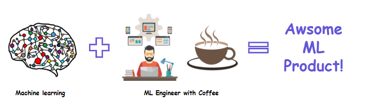

Machine Learning 기술이 어떤 과정을 거쳐 product가 될까?

## Full stack ML Engineer?
Full stack ML Engineer란 무엇일까요?

### ML Engineer란?
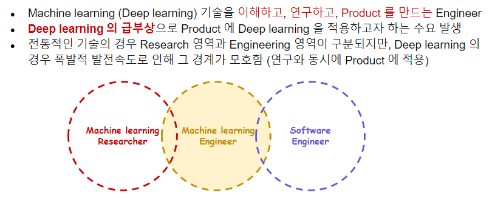

### Full stack engineer란?

By `w3school`, client/server software를 개발할 수 있는 사람 (in web application)

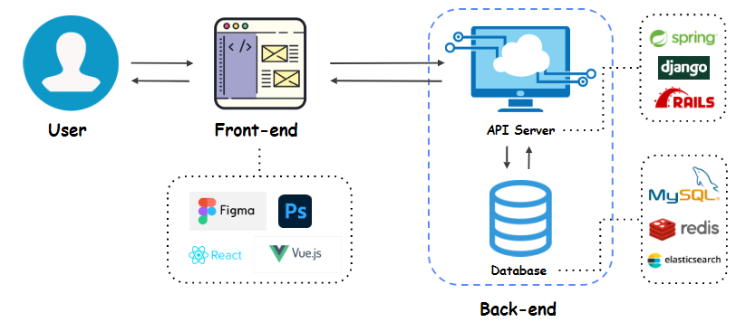

By `Apple`, 코딩 잘하고 창의적이고 다양한 조직의 사람과 협업할 수 있고 새로운 기술을 배우는 것을 즐기는 개발자!

By 마스터님,
- Full stack engineer란 표현은 각 포지션 개발자들에게 달갑지 않은 표현일 수 있음
- 상태가 아니라 **방향**
- 모든 Stack을 잘 다루려는 방향으로 가고 있으면 Full stack engineer
- **내가 만들고 싶은 product를 시간만 있다면 모두 혼자 만들 수 있는 개발자**

즉, Full stack ML Engineer란

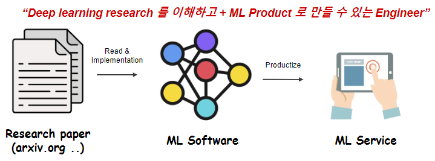

ML Service의 다양한 형태!

- API 서버가 ML 모델의 결과를 받아서 어떠한 서비스를 제공
- PyTorch, TensorFlow, TensorRT
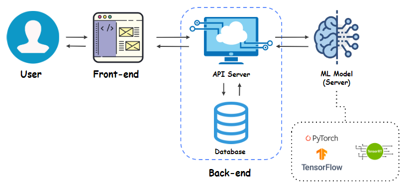

- Edge device service!
- 얼굴 인식, 주민 등록증은 개인 정보 민감함!
- 바로 처리해주는 서비스
- TensorRT, TensorFlow.,js
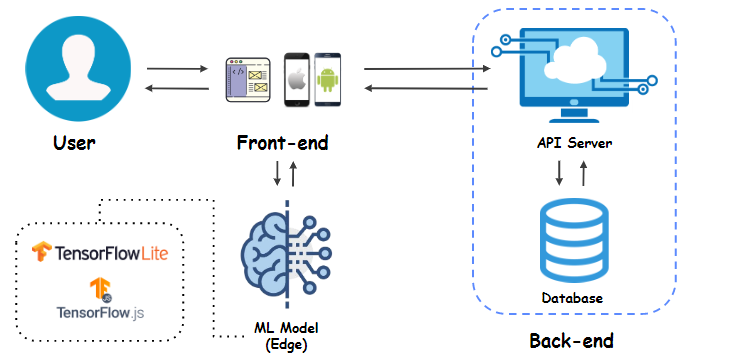

- Data collection
- Data를 어떻게 모을 것인가?
- Data collecting tool을 만들어야 한다.
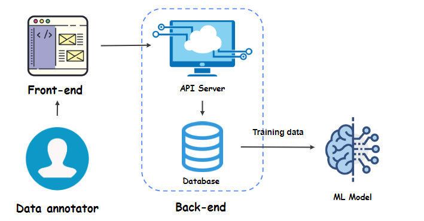

## Pros, cons of Full stack ML engineer
Full stack ML engineer의 장단점은?

### Pros
1. 재미있다! (인정)
2. 빠른 프로토타이핑
    - 프로토타이핑을 협업하기는 곤란한 경우가 많음
    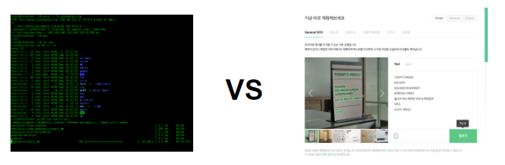
3. 기술 간 시너지
    - 연결되는 Stack에 대한 이해가 각 Stack의 깊은 이해에도 도움을 줌
    - 연결에 대한 고려가 들어간 개발 결과물은 팀의 불필요한 로스를 줄여줌
4. 팀플레이
    - 다른 포지션 엔지니어링에 대한 이해도 증가!
    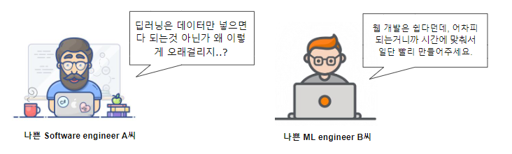
5. 성장의 다각화
    - 연구자 + 개발자 + 기획자가 모인 회의에서 모든 내용이 성장의 밑거름이 됨

위 장점들이 반드시 Full stack engineer가 되어야만 갖출 수 있는 것은 X!

### Cons
1. 깊이가 없어질 수 있다
    - 하나의 Stack에 집중한 개발자보다 해당 Stack에 대한 깊이가 없어질 수 있음
    - 없어질 수 있다? 없어진다가 아니라?
    [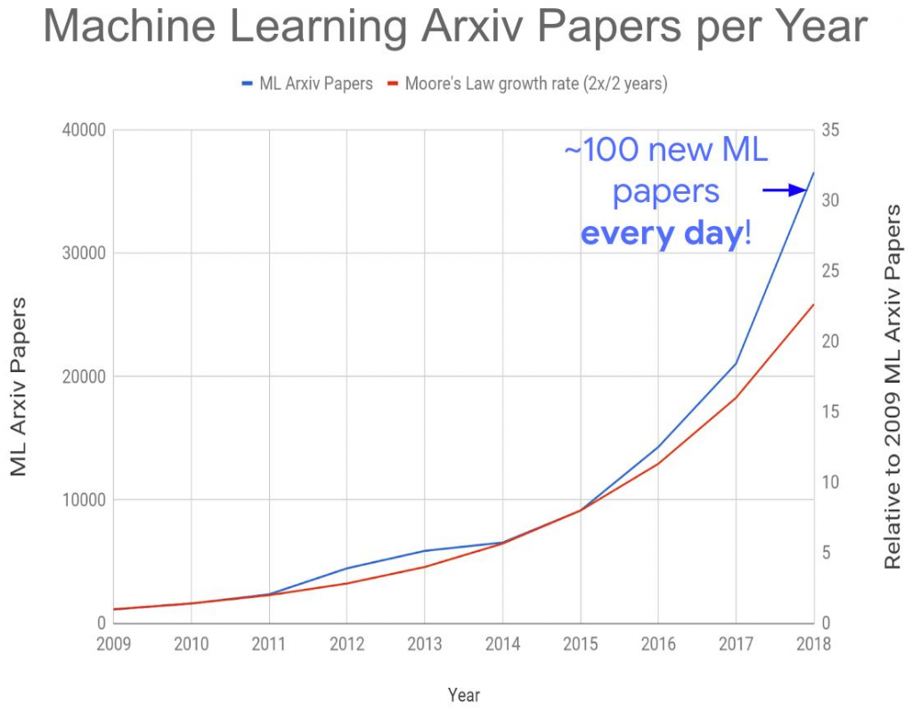](https://data-mining.philippe-fournier-viger.com/too-many-machine-learning-papers/)
2. 시간이 많이 들어간다
    - 공부할 분야가 많다보니 절대적으로 시간이 많이 들어감
    - 연봉이 linear하진 않다 ㅎ


## ML Product, ML Team, ML Engineer
회사에서 ML Product는 어떻게 만들어지고, ML팀은 어떻게 구성되며 팀에서 Full stack ML 엔지니어의 역할은 무엇일까요?

### ML Product
보통 ML Project는 이런 과정을 통해 만들어 집니다.

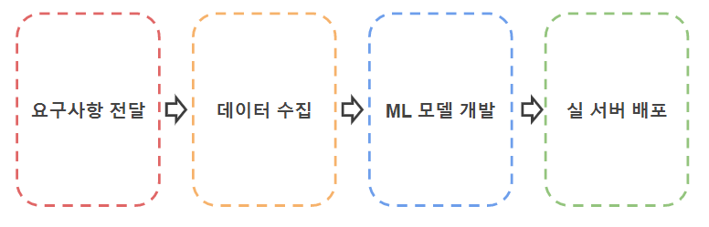

#### 1. 요구사항 전달
- 고객사 미팅(B2B) or 서비스 기획(B2C)
    - 제품에 대한 요구사항 전달
    - 추상적인 단계
- 요구사항 + 제약사항 정리
    - 기능 상세 요구 사항 정리
    - 제약 사항 정리
    - 일정 정리
- ML Problem으로 회귀
    - 요구사항은 실 생활의 문제
    - ML이 풀 수 있는 형태의 문제로 회귀하는 작업

#### 2. 데이터 수집
- Raw 데이터 수집
    - 요구사항에 맞는 데이터 수집
    - Bias 없도록 분포 주의
    - 저작권 주의
- Annotation Tool 기획 및 개발
    - 데이터에 대한 정답 입력 툴
    - 모델 input/output 고려
    - 작업속도/정확도 극대화
- Annotation Guide 작성 및 운용
    - QnA에 대한 대처
    - 간단하고 명확한 Guide 문서를 작성

#### 3. ML 모델 개발
- 기존 연구 Research 및 내재화
    - 논문을 찾아보고 이해하는 단계
    - 적절한 연구를 재현하여 내재화
- 실 데이터 적용 실험 + 평가 및 피드백
    - 수집된 데이터 적용
    - 평가 및 모델 수정
- 모델 차원 경량화 작업
    - 모델 단계의 경량화
    - Distillation
    - Network Surgery

#### 4. 실 서버 배포
- 엔지니어링 경량화 작업
    - TensorRT
    - Quantization
- 연구용 코드 수정 작업
    - 연구용 코드 정리
    - 배포용 코드와 Interface 맞추는 작업
- 모델 버전 관리 및 배포 자동화
    - 모델 버전 관리 시스템
    - 모델 배포 주기 결정 & 업데이트 배포 자동화 작업

### ML Team

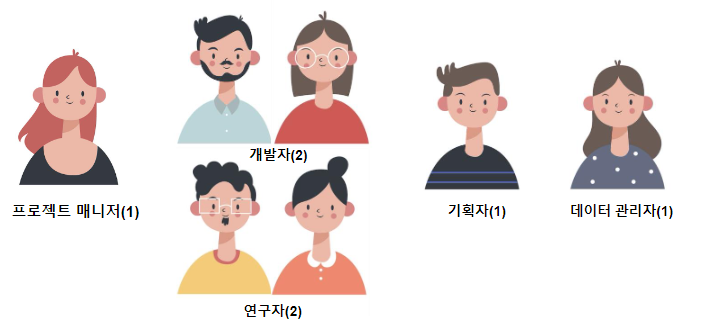


### Full stack ML Engineer in ML Team

#### Job 1. 실 생활 문제를 ML 문제로 Formulation
- 실 생활 문제를 ML이 해결 가능한 형태로 문제를 쪼개는 작업
- 혹은 가능한지 판단하는 작업

#### Job 2. Raw Data 수집
- 웹에서 학습 데이터를 모아야 하는 경우 존재
- Web Crawler 개발해서 데이터 수집 (저작권 주의!)
- Web -> Web Crawler -> Database / File system

#### Job 3. Annotation Tool 개발
- 수집/제공받은 데이터의 정답을 입력하는 작업을 수행하는 Web application 개발
- 작업 속도와 정확성을 고려한 UI 디자인이 필요
- 다수의 Annotator들이 Client를 통해 동시에 서버로 접속, Annotation 작업을 수행
- 새로운 Task에 대한 Annotation Tool 기획 시 모델에 대한 이해가 필요할 수 있음

```
Vue.js | django | MySQL | docker
```
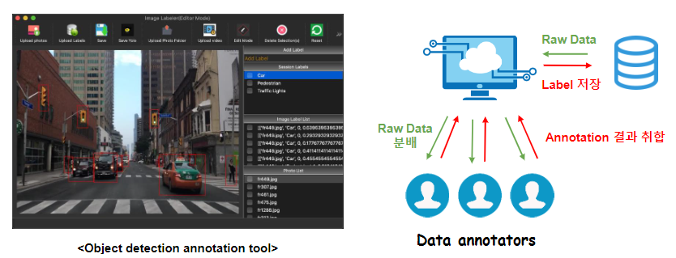

#### Job 4. Data Version 관리 및 Loader 개발
- 쌓인 데이터의 Version 관리
- Database에 있는 데이터를 Model로 Load하기 위한 Loader package 개발

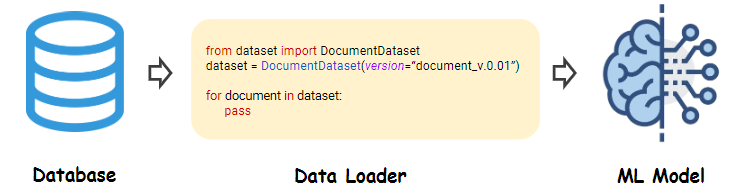

#### Job 5. Model 개발 및 논문 작성
- 기존 연구 조사 및 재현 (재현 성능은 Public Benchmark 데이터로 검증)
- 수집된 서비스 데이터 적용
- 모델 개선 작업 + 아이디어 적용, Then 논문 작성

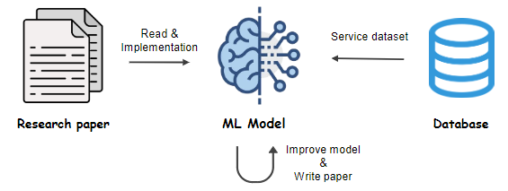

#### Job 6. Evaluation tool 혹은 Demo 개발
- 모델의 Prediction 결과를 채점하는 Web application 개발
- OCR 프로젝트 중 혼자 사용하려고 개발 (정/오답 케이스 분석)
    - 이후 팀에서 모두 사용
- 모두 사용하다보니 모델 특성 파악을 위한 요구사항 발생
    - 반영하다보니 모델 발전의 경쟁력이 됨

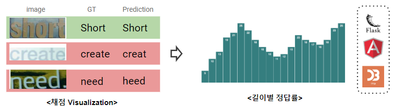

#### Job 7. 모델 실 서버 배포
- 연구용 코드를 Production server에서 사용 가능하도록 정리하는 작업
- File server에 코드 + weight 파일 압축해서 Version 관리
- Produciton server에서는 Python worker에게 MQ(Message Queue)를 통해 job을 전달

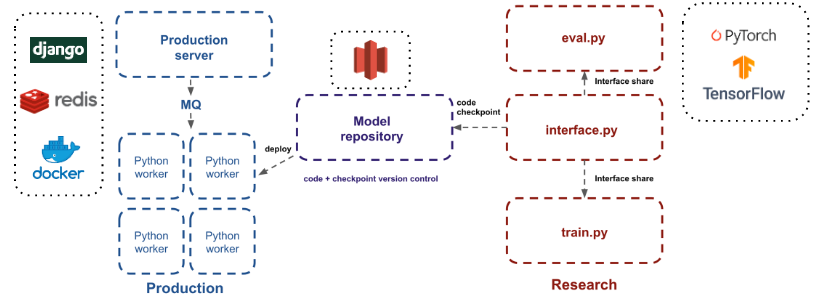

## Roadmap
어떻게 Full stack ML engineer가 될까요?

### Stackshare
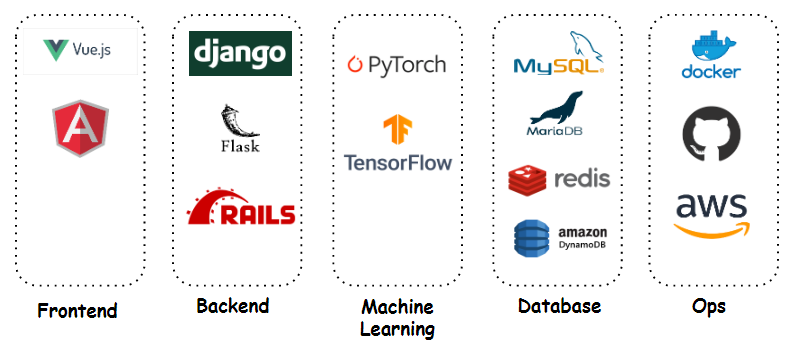

### Full stack ML Engineer가 되기 어려울까요?
- 어렵지만 점점 더 많아질 거에요. 방향성!
- 각 stack에서 framework의 발전이 점점 interface가 쉬워지는 쪽으로 가고있어요!

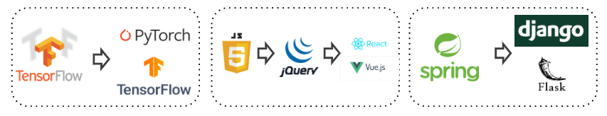

- 시작이 반이에요 ㅎㅎ
- 익숙한 언어 + 가장 적은 기능 + 가장 쉬운 Framework로 시작하세요!
- Google + Stackoverflow로 벽을 넘고
- 시작의 허들을 넘은 뒤에는 필요에 의해 원론을 공부
- 처음부터 너무 잘 X. 최대한 빨리 완성!
- 모든 stack의 안티 패턴을 신경써서 개발하다가 포기하기보단 완성에 집중!
- 전문 분야를 정하세요! (NLP?)
- 모든 Stack에서 초~중급 개발 수준을 계속 유지하는 것은 좋지 않은 선택
- https://medium.com/@karpathy/yes-you-should-understand-backprop-e2f06eab496b

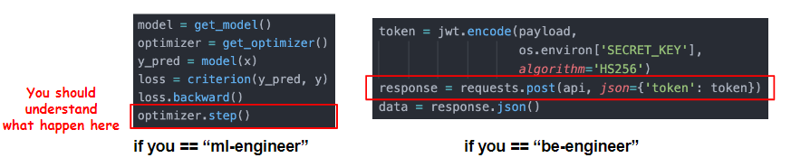

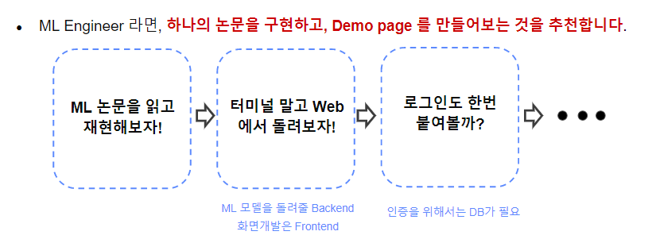
