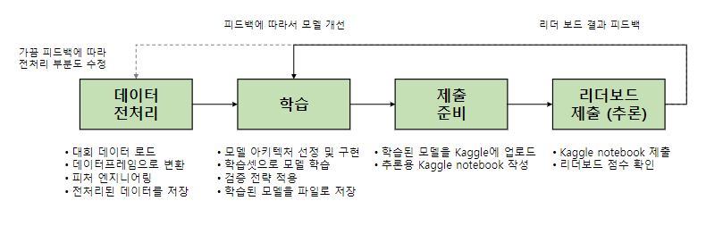

# 캐글 그랜드 마스터의 노하우 방출

[back to super](https://github.com/jinmang2/boostcamp_ai_tech_2/tree/main/s-stage/ai_engineer_seminar)

## 강사 소개
- 김상훈
- Upstage Data Scientist
- Kaggle 그랜드마스터
- 얼굴 인식 전공

## 캐글 소개
- 2010년 설립된 세계에서 가장 유명한 AI 대회 플랫폼
- 2017년 3월 구글에 인수됨
- 194개국 600만명 이상의 회원 보유

### 국내 유명 경진대회 플랫폼
- 카카오 아레나
    - 비공개 플랫폼
    - 3개의 대회 진행
- 데이콘
    - 타 기업/기관에 공개된 플랫폼
    - 총 51개 대회 진행
    - 캐글 스타일 빠르게 적용 중

### Why Kaggle?
- 취업 목적
- 개인 성장

### 캐글에서 실력을 인정 받으려면?
- 랭킹 시스템 활용
- 티어 시스템 활용
- 혼자 경진대회에서 높은 등수를 획득하면 상위 랭커
- 5개의 금메달, 이 중 1개는 솔로 금메달이면 그랜드 마스터

## 캐글 시작해보기

1. 회원 가입
2. 참여할 대회 선택
    - **Featured**: 상업적 목적의 예측 대회. 실제 기업에서 우승한 모델을 현업에 적용하기도 함
    - **Research**: 연구 목적의 대회. 연구 목적이라 상금이 낮은 편
    - **Getting Started & Playground**: 초심자를 위한 학습 목적의 대회. 예: 타이타닉 생존자 예측 대회. 랭킹용 포인트나 메달 획득 불가능
    - **Analytics**: 데이터 분석 목적의 대회. 데이터 탐색과 이를 시각화한 노트북을 제출하는 대회
    - **Recruitment**: 리크루팅 목적의 대회
    - **General Competition (리소스 제약 없음)**: submission.csv 파일만 Submit Predictions 메뉴에서 제출
    - **Code Competition (리소스 제약 없음)**: 캐글 노트북에서 코드를 실행시켜 submission.csv 파일을 생성해야 함. submission.csv을 생성할 때 리소스제한(GPU, CPU, RAM, 실행시간)이 있음. 캐글러들이 쓸모 있는 모델을 만들도록 강제함
3. 데이터 다운로드
4. 대회를 위한 파이프라인 구축

5. 캐글로 파이프라인 빠르게 경험해보기

## 캐글 노하우 대방출

### 우승하기 위해 필요한 것
1. 파이프라인의 빠른/효율적 반복
    - GPU장비, 시간 투자, 본인만의 기본 코드
    - 추천 장비1
        - CPU: AMD 라이젠 3세대 3700 이상(8코어)
        - RAM: 64GB 이상
        - SSD: 1TB 이상
        - GPU: RTX 2080Ti x 2대 (블로워 타입 중고로 구입)
    - 추천 장비2
        - CPU: AMD 라이젠 3세대 3700 이상(8코어)
        - RAM: 64GB 이상
        - SSD: 1TB 이상
        - GPU: RTX 3090 1대 (or RTX 3080 1대)
    - 추천 장비3
        - CPU: AMD 라이젠 스레드리퍼
        - RAM: 128GB 이상
        - SSD: 1TB 이상
        - GPU: RTX 3090 2대 (or RTX 3080 2대 or RTX 2080Ti 4대)
    - 평일 하루 평균 4시간 이상 투자
    - 주말 하루 평균 8시간 이상 투자
    - 다른 사람의 코드를 참고하여 본인 것으로 소화한 코드를 만드는 것이 필요
        - https://github.com/lime-robot/categories-prediction
2. 점수 개선 아이디어
    - Kaggle Notebooks, Discussion 탭 참고
    - Best Score, Most Votes 정렬 기능 사용 추천
    - 다른 경쟁자들의 글을 참고, 대회 마지막 제출 때까지 점수 개선 아이디어 고민
    - 추신: 마지막까지 방심하면 안 됨
3. (올바른 방향인지) 탄탄한 검증 전략
    - Public LB 1등 -> Private LB 70등 (Shake-up)
    - 리더보드 제출 횟수 제한: 보통 하루에 5회 제공
    - 좋은 모델이란? Training set에서 얻은 점수가 Test set에서도 비슷하게 나오는 모델
    - 검증 전략: Test set에서 얻은 점수와 Training set에서 얻어진 점수 갭을 줄이는 평가 방법
    - Stratified K-fold
    - 아무리 검증 전략을 잘 세워도 오버 피팅의 위험은 존재
        - Local CV와 public LB가 함께 올라가는 방법을 선택
        - CV: Cross Validation
        - LB: LeaderBoard
4. 기타 꿀팁
    - Stratified k-fold
    - 다양한 모델 앙상블
        - 정형: LightGBM, XGBoost, Neural Networks
        - 이미지: resnet, efficientnet, resnext
        - 텍스트: LSTM, BERT, GPT2, RoBERTa
    - 싱글 모델의 점수를 몇 점까지 / 언제까지 개선해야 할까?
        - 상위 랭커들이 discussion에 언급한 자신의 싱글 모델 점수 참고
        - 대회 종료가 1~2주 정도 남았을 때 싱글 모델 점수로만 50등 내에 들면 좋음
    - 팀을 맺으면 해체가 불가능... 동료 후보가 현재 대회에서 높은 순위에 있는지 확인 필요
    - 코드 관리: v1, v2, v3 순서로 개별 폴더를 만들어 코드 관리
    - 주피터에서 터미널 열 수 있음! (no_hub 개념)
