# 서비스 향 AI 모델 개발하기
- 이활석 (현) Upstage CTO (전) 네이버 클로바 임원

[back to super](https://github.com/jinmang2/boostcamp_ai_tech_2/tree/main/s-stage/ai_engineer_seminar)

## Who Am I?
- 비디오 코덱으로 Ph.D 취득
- CV를 CCTV에 적용하시다 DeepMind의 DQN을 읽고 거금을 들여 GPU를 구매 후 공부 시작
- NCSOFT에 이직 후 일대일 대전을 위한 봇 개발을 시작으로 게임 개발 효율성을 위한 생성 모델 연구
- Style Transfer
- [Autoencoder의 모든 것 강의](https://www.slideshare.net/NaverEngineering/ss-96581209) 제작
- [생성 모델 전체를 TF로 구현한 레포](https://github.com/hwalsuklee/tensorflow-generative-model-collections)가 주목을 많이 받으심
- Reddit 1등 ㄷㄷ
- Google과 콜라보 ㄷㄷ compare_gan
- NAVER로 이직
- Clova OCR 분야를 밑바닥부터 기술을 끌어 올려서 논문 11편, 세계 대회 우승, 국내외 수십 여 서비스 개발까지!
- 더 큰 도전을 위해 Upstage 창업

## 서비스 향 AI 모델 개발 VS 수업/학교/연구 AI 모델 개발

### 연구 관점에서 AI 개발이란?

보통 수업/학교/연구에서는 정해진 데이터셋/평가 방식에서 더 좋은 모델을 찾는 일을 한다!

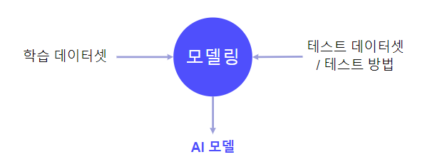

### 서비스 관점에서 AI 개발이란?

서비스 개발 시에는
- 학습 데이터? 없다
- 테스트 데이터셋과 테스트 방법도 없다

서비스 개발 시에는 **서비스 요구 사항** 만이 존재한다.

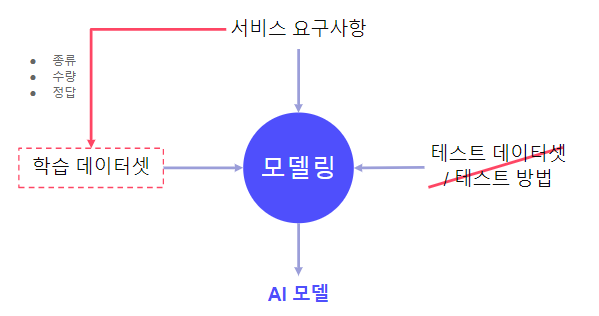

### 학습 데이터셋 준비!

그래서 처음으로 해야할 일은 **학습 데이터셋** 을 준비하는 것이고, 정확히는 training dataset의 종류/수량/정답을 정해야 한다.

e.g., 수식을 사진으로 찍어서 인식하는 기술 개발
- 종류: 초중고 수식, 손글씨/인쇄, 그림자, 형광펜, 수식 잘림, 화이트, 종이 구겨짐, 회전, ...
- 정답: Latex String

종류가 다양함! 즉, 어떻게 어디까지 '종류'로 정의해서 각각 몇 장을 수집할 것인지 정해야 한다!
- 굉장히 중요한 part!

즉, 아래와 같은 요구 사항을 들어온 것이다.


#### 학습 데이터셋 준비: 기술 모듈 설계
데이터를 모으다 보면 미리 생각치 못한 경우를 많이 발견하게 된다. (e.g., 한 수식만 찍기 어려움)

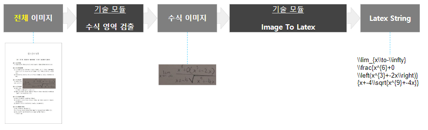

#### 학습 데이터셋 준비: 정답
두 개 모듈에 대한 정답 쌍 필요

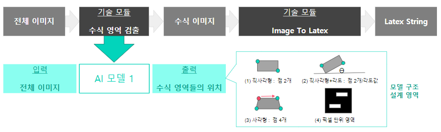


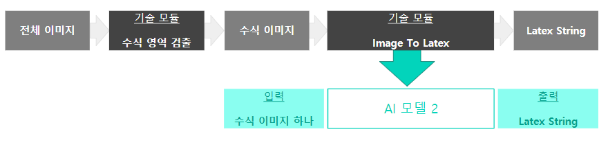
그러나 위에 Image To Latex가 한 모델로 가능할지? 나름 성능이 검증된 4가지 모델 조합은 어떨지?

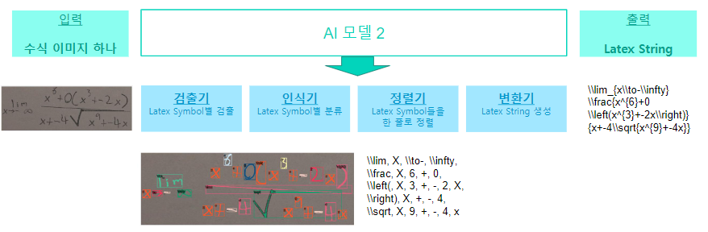

이 경우 각 모델 별로 입출력(정답) 정의가 필요함. 결국 training data를 준비하려면 model pipeline 설계가 되어있어야 함.

그런데, 모델 파이프 라인 설계를 하려면 어느 정도는 데이터가 있어야 한다!

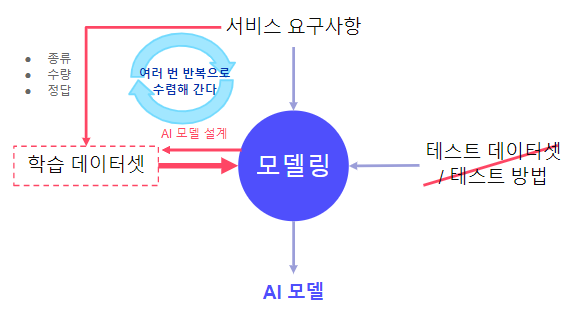

만일 본인이 training data 준비 담당자일 때, 어떤 일을 겪게 될까?

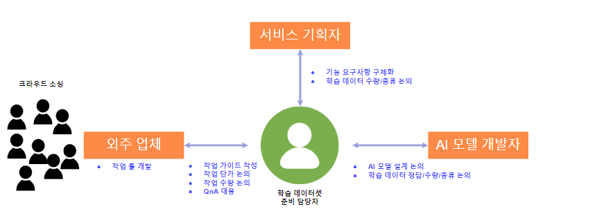
- 외주 업체에 일을 드리자면 작업 툴이 필요함
    - 대부분 가지고 있는 경우가 많음
- 작업 가이드가 진짜 중요함!!
- 서비스기 때문에 당연히 예산에 관련된 작업 단가와 수량도 중요
- 작업을 시작하게 되면 case by case가 당연히 많이 생김...
- QnA 대응을 어떻게 할지?

#### 학습 데이터셋 준비: 정리하면?

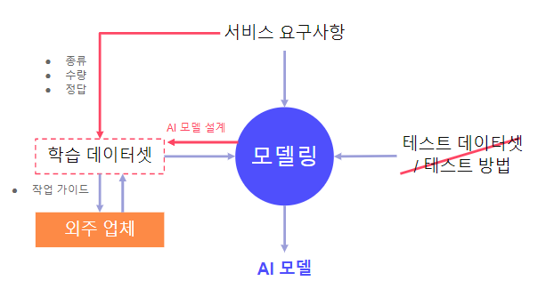

### 테스트 데이터셋 / 테스트 방법 준비

Assume: test dataset은 training dataset에서 일부 사용한다. (이것도 Issue가 많음)

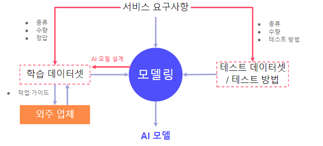

e.g., 1 vs 1 대전 게임을 위한 AI 모델을 만든다고 가정

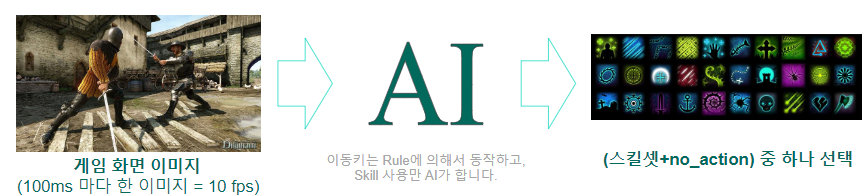

위 분류 문제를 프로게이머들의 로그를 받아서 학습시켰더니 모델의 분류 정확도가 99%에 달함!! 대박이다 무조건 이기겠지?

Nope... 어떠한 스킬도 사용하지 않았음. why? 프로그래머의 로그를 보자!

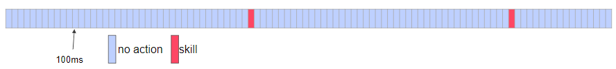
- 고수일 수록 스킬을 남발하지 않고 적재적소에 사용
    - 로그의 대부분이 no_action
- 그래서 모델이 항상 no_action을 예측하게 학습이 됨
    - 실제 승률을 0%

위처럼 `OFFLINE` VS `ONLINE의` 정량 평가의 이질감이 굉장히 클 수 있음. 이를 잘 alignment시키는 것이 중요함.

#### 테스트 방법: 정리

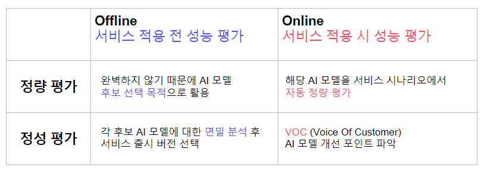
- 서비스 전/후의 평가의 두 종류가 존재
- Voice Of Customer

### 모델 요구사항 도출

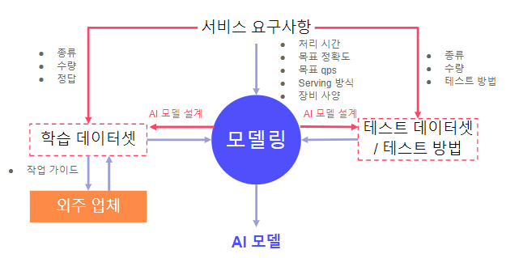

#### 처리 시간 / 목표 정확도
- 처리 시간은 하나의 입력이 처리되어 출력이 나올 때까지의 시간
    - e.g., 수식 영역 검출의 경우
    - `OFFLINE TEST`: 이미지 입력 후 수식 영역 정보가 출력될 때까지의 시간
    - `ONLINE TEST`: 이미지 촬영 후 이미지에서 수식 영역 정보가 화면 상에 표현되기까지의 시간
- 목표 정확도는 해당 기술 모듈의 정량적인 정확도
    - e.g., 신용카드 인식의 경우
    - `OFFLINE TEST`: 입력된 이미지 내 카드 번호/유효기간에 대한 EDIT DISTANCE
    - `ONLINE TEST`: 사용자가 AI 모델의 결과값을 수정할 확률

#### 목표 qps
QPS: Queries Per Second, 초당 처리 가능한 요청 수

향상 방법?
- 장비를 늘린다.
    - N대를 늘리면 QPS가 N배 올라간다.
- 처리 시간을 줄인다.
    - AI 모델의 처리 속도가 N배 올라가면 QPS도 N배 올라간다.
- 모델 크기를 줄인다.
    - 한 GPU에 올라가는 모델 수가 N배가 되면 QPS도 N배 올라간다.

만약, GPU 메모리가 10GB이고 모델 크기가 8GB일 때 5GB로 올려야 2개 이상 올릴 수 있기 때문에 6, 7GB로 줄이는 것은 QPS 관점에서 의미가 없다!

#### Serving 방식 / 장비 사양

Serving 방식
- 기술 모듈이 Mobile에서 동작하기를 원하는지?
- Local CPU/GPU Server에서 동작하기 원하는지?
- Cloud CPU/GPU Server에서 동작하기 원하는지?

장비 사양
- 가끔은 Serving 장비조차 없어서 장비 구축까지 요구하는 경우가 존재
- 이땐 예산/QPS에 맞춰서 장비 사양도 정해야 함

## Service AI 모델 개발 기술팀의 조직 구성

### AI 모델팀

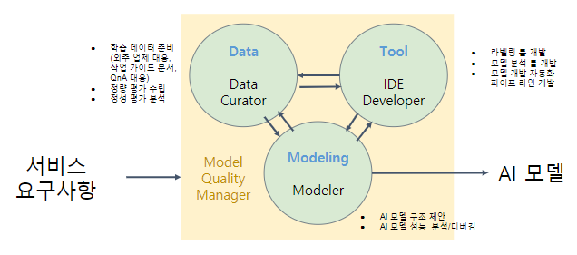

- AI 모델 개발 인력 필요
- 데이터 준비 및 품질 관리 인력 필요
- 데이터/모델 관련 업무 효율성을 위한 툴을 개발하는 인력 필요
- 이를 총괄하여 모델 품질 관리하는 사람이 필요

### AI 모델 서빙팀

그러나 기술팀에 AI 모델 Serving까지 요구되면 필요 인력이 늘어남.

- Serving HW향으로 모델 최적화하는 인력 필요
    ```
    e.g.,
    - Mobile에서 구동하기 위해
        - Pytorch -> Tensorflow -> TFLite로 변환
    - GPU Server에서 구동하기 위해
        - Pytorch -> Tensorflow -> TensorRT로 변환
    - 각 Toolkit에서 (TFLite, TensorRT) 지원하는 operation으로만 모델 구조를 변경하여 재학습하거나 Custom Layer 구현
    - 메모리를 줄이기 위한 LightWeight (경량화) 작업
        - Distillation, Quantization
    - GPU 고속 처리를 위해 CUDA programming
    - 아예 모든 연산을 C++/C로 변환
    ```
- 모델을 실제 서빙하기 위한 추가 작업들이 End Device에 맞춰 더 있음

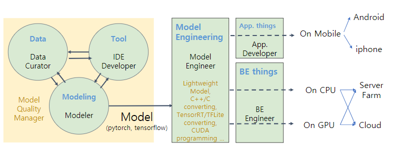
