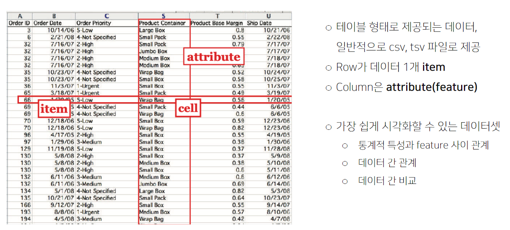
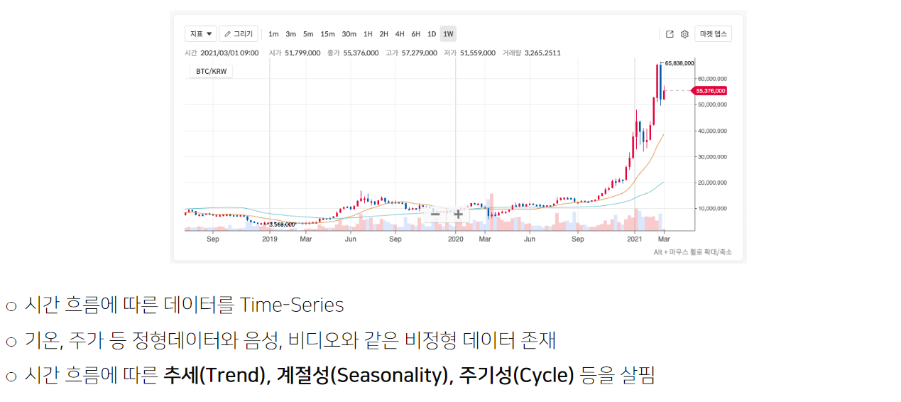
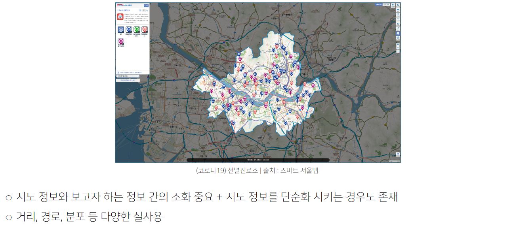
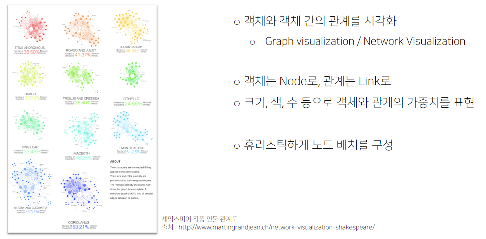
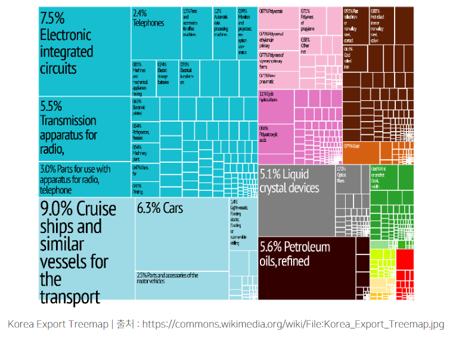
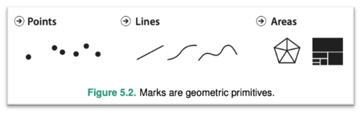
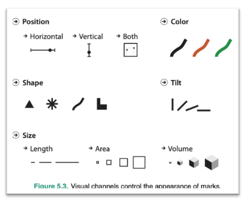
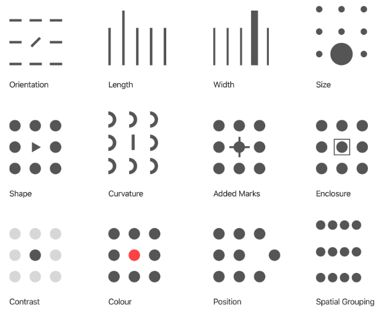

# 1강 Introduction to Visualization

## 1.1 OT
데이터 시각화가 무엇이고 앞으로 무엇을 배울 것인지 알아보자!

### 데이터 시각화란 무엇인가?
- 데이터를 그래픽 요소로 매핑하여 시각적으로 표현하는 것

  
- 시각화는 정량적으로 평가할 수 없음
    - 연구 != 개발
    - 이론 != 독자 & 소비자
- 하지만 지금까지 연구되고 사용된 시각화 모범 사례를 통해 **좋은 시각화**를 만들 수 있음!
    - 목표1: 목적에 따라 시각화를 선택하고 사용할 수 있다
    - 목표2: 시각화 결과를 효과적으로 수용

## 1.2 시각화의 요소
아래 내용에 대해서 학습
- 세상에는 어떤 종류의 데이터셋이 있는가
- 각 데이터셋은 어떻게 생겼는가
- 데이터의 종류는 어떻게 구분하는가
- 시각화의 점, 선, 면

### 데이터 이해하기
당연히 데이터가 있어야 시각화도 하지! 데이터의 종류는?

- `정형 데이터`

    

- `시계열 데이터`

    

- `지리/지도 데이터`

    

- `관계 데이터`

    

- `계층적 데이터`
    - 관계 중에서도 포함관계가 분명한 데이터
    - Tree, Treemap, Sunburst 등

    

- 데이터의 종류는 크게 아래 네 개로 분류
    - 수치형(Numrical)
        - 연속형(Continuous) / 이산형(Discrete)
    - 범주형(Categorical)
        - 명목형(Norminal) / 순서형(Ordinal)

### 시각화 이해하기

- `Mark`: 이미지에서 기본적인 graphical element

    

- `Channel`: 각 mark를 변경할 수 있는 요소들!

    

- `Pre-attentive Attribute`: 주의를 주지 않아도 인지하게 되는 요소
    - 시각적으로 다양한 pre-attentive attribute가 존재함
    - 동시에 사용하면 인지하기 어려움
        - 적절하게 사용할 때, 시각적 분리 (Visual popout)
        - 강사님께선 colour를 좋아하신다고 한다!

    

- 위 내용으로 데이터와 시각화를 모두 커버? 절대 X
    - 가볍게만 훝어본 것이라는 점 명시할 것!


## 1.3 Python과 Matplotlib
python의 가장 대표적인 시각화 패키지인 matplotlib을 통해 간단한 시각화 실습을 실시!

- 안수빈 강사님께서 제공해주신 ipynb 파일로 실습 진행해볼 것!

### Import Library
- `matploblib`은 줄여서 `mpl`로 코드 상에서 사용
- 자주사용하는 `pyplot`도 보통 아래처럼 불러온다.

```python
import matplotlib as mpl
import matplotlib.pyplot as plt
```

- 나머지 팁들은 강의에 첨부된 실습 내용을 보고 직접 실시
    - 여기에 정리해봤자 눈에 들어오지도 않는다.
