# 2강 기본적인 차트의 사용
가장 대표적인 3가지 차트를 통해 matplotlib의 문법을 익히고 시각화의 오용과 해결책에 대해 다룬다.

[back to super](https://github.com/jinmang2/boostcamp_ai_tech_2/tree/main/s-stage/data_viz)

  
Table of Contents

  <ul>
    <li>
      <a href="#21-bar-plot-사용하기">2.1 Bar Plot 사용하기</a>
    </li>
    <ul>
      <li><a href="#211-bar-plot이란">2.1.1. Bar Plot이란?</a></li>
      <li><a href="#212-다양한-bar-plot">2.1.2. 다양한 Bar Plot</a></li>
      <li><a href="#213-정확한-bar-plot">2.1.3. 정확한 Bar Plot</a></li>
    </ul>
    <li>
      <a href="#22-line-plot-사용하기">2.2 Line Plot 사용하기</a>
    </li>
    <ul>
      <li><a href="#221-basic-line-plot">2.2.1 Basic Line Plot</a></li>
      <li><a href="#222-정확한-line-plot">2.2.2 정확한 Line Plot</a></li>
    </ul>
    <li>
      <a href="#23-scatter-plot-사용하기">2.3 Scatter Plot 사용하기</a>
    </li>
    <ul>
      <li><a href="#231-basic-scatter-plot">2.3.1 Basic Scatter Plot</a></li>
      <li><a href="#232-정확한-scatter-plot">2.3.2 정확한 Scatter Plot</a></li>
    </ul>
  </ul>

## 2.1 Bar Plot 사용하기
1반과 2반의 성적 비교 등과 같이 범주에 따른 수치값을 비교하고 싶은 상황에서 어떤 그래프를 사용할 수 있을까요? 바로바로 Bar Plot! (넝담크)

### 2.1.1. Bar Plot이란?
- 직사각형의 막대를 사용하여 데이터의 값을 표현하는 차트/그래프
- 범주에 따른 수치 값을 비교하기에 적합
- `.bar()` vertical bar
- `.barh()` horizontal bar (범주가 많을 때 적합)

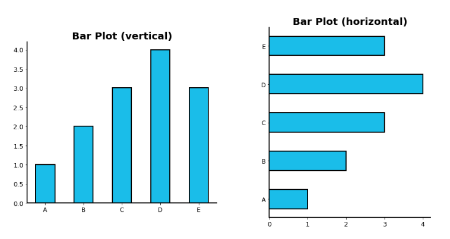

 

    <b><a href="#2강-기본적인-차트의-사용">↥ back to top</a></b>

 

### 2.1.2. 다양한 Bar Plot
- 임의의 그룹 데이터를 시각화해보자!
    - A,B,C,D,E 데이터가 2그룹에 존재
    - Group Sky: [1,2,3,4,3]
    - Group Pink: [4,3,2,5,1]

#### 2.1.2.1 Multiplie Bar Plot

- plot을 여러 개 그리는 방법

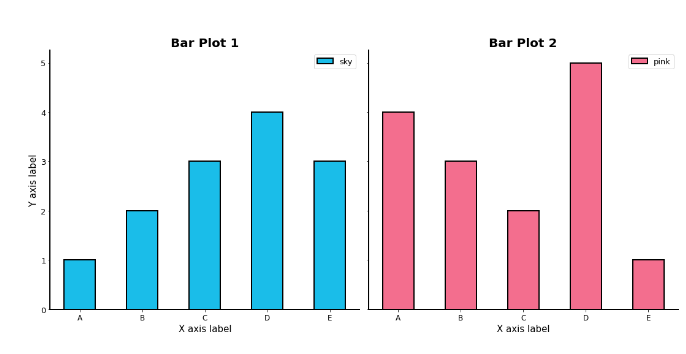

- 여러 feature를 한 plot에 어떻게 나타낼까?

#### 2.1.2.2 Stacked Bar Plot

- 2개 이상의 그룹을 쌓아서 표현
- 맨 밑은 분포 파악이 쉽지만 그 외엔 파악이 힘듦
- `.bar()`에선 `bottom`,
- `barh()`에선 `left` 사용
- 수치를 주석으로 다는 것을 추천!

#### 2.1.2.3 Percentage Stacked Bar Plot
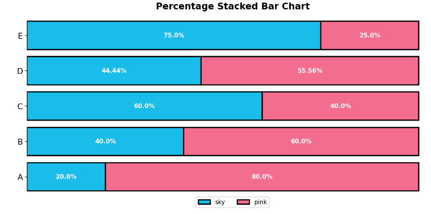
- 위를 응용, percentage화
- 조건부 확률 등 표현도 편함
- 위 주석은 강사님이 따로 다신 것

#### 2.1.2.4 Overlapped Bar Plot
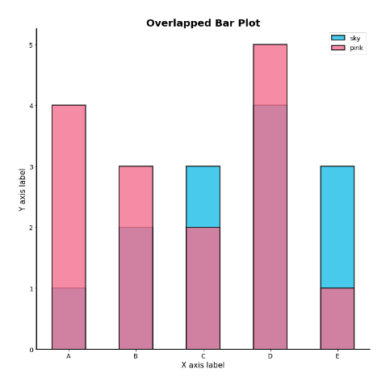
- 2개 그룹만 비교한다면 겹쳐서 만드는 것도 선택지
- 같은 축을 사용하여 비교가 쉬움
    - 투명도(`alpha`)를 조정해서 겹치는 부분 파악 용이
- Bar보단 Area plot에서 효과적 (후에 seaborn에서 다룸)

#### 2.1.2.5 Grouped Bar Plot
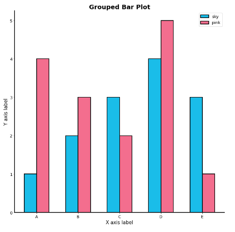
- 그룹별 범주에 따른 bar를 이웃되게 배치하는 방법
- Matplotlib에선 구현이 비교적 까다로움
    - 적당한 technique(`.set_xticks()`, `.set_xticklabels()`)
- 앞서 소개한 내용 모두 그룹이 5~7개 일 때 효과적
- 그룹이 많다면 ETC로 나머지 처리

 

    <b><a href="#2강-기본적인-차트의-사용">↥ back to top</a></b>

 

### 2.1.3. 정확한 Bar Plot
Bar plot의 오용을 막아봅시다

#### 2.1.3.1 Principle of Proportion lnk
- 실제 값과 그에 표현되는 그래픽으로 표현되는 잉크 양은 비례
    - 1과 5를 표현하려면 잉크의 값이 이에 비례해야함!
- 즉, 반드시 x축의 시작은 zero(0)!
- 막대그래프에만 한정되는 원칙은 아님!
    - Area plot, Donut Chart 등 다수의 시각화에 적용

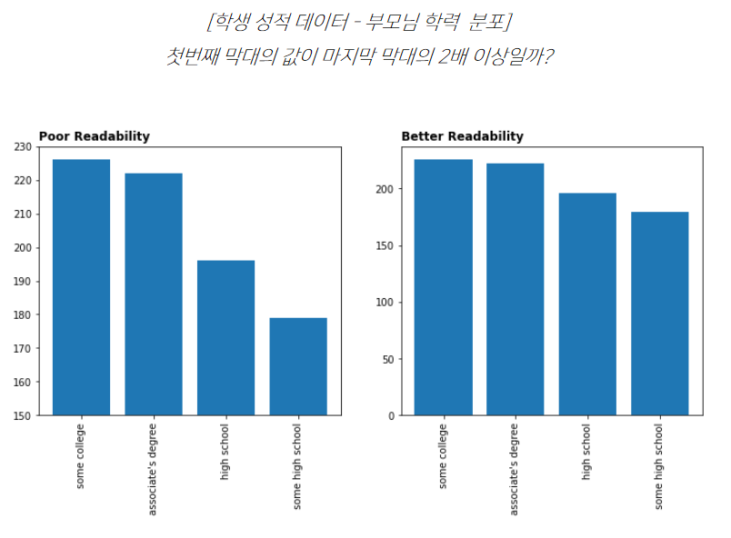
- 당연히 아님! 0에서 시작하는게 아니잖아...

#### 2.1.3.2 데이터 정렬하기
- 더 정확한 정보를 전달하기 위해선 정렬이 필수
    - `Pandas`에서는 `sort_values()`, `sort_index()`로 정렬
- 데이터의 종류에 따라 다음 기준으로 정렬
    1. 시계열 | 시간순
    2. 수치형 | 크기순
    3. 순서형 | 범주의 순서대로
    4. 명목형 | 범주의 값에 따라 정렬
- 여러 가지 기준으로 정렬을 하여 패턴을 발견
- 대시보드에서는 Interactive로 제공하는 것이 유용

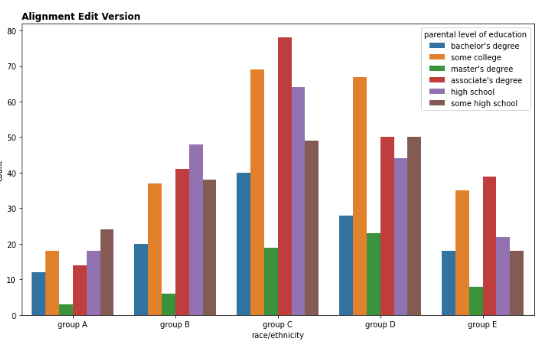

#### 2.1.3.3 적절한 공간 활용
- 여백과 공간만 조정해도 가독성이 높아진다!
- matplotlib의 bar plot은 ax에 꽉 차서 살짝 답답함
- Matplotlib Techniques
    - X/Y axis Limit (`.set_xlim()`, `.set_ylim()`)
    - Spines (`.spines[spine].set_visible()`)
    - Gap (`width`)
    - Legend (`.legend()`)
    - Margins (`.margins()`)

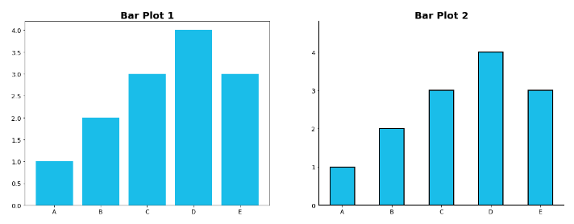

#### 2.1.3.4 복잡함과 단순함

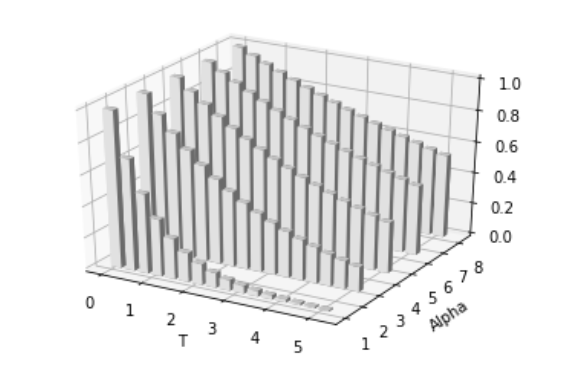
- 위 그림이 멋져보이는가? 필요없는 복잡함은 NAVER...
    - 직사각형이 아닌 다른형태의 bar는 지양
    - infographic에선 좋을 수 있으나
    - 데이터 분석에선 무조건 지양할 것
- 무엇을 보고싶은가?
    - 정확한 차이 (EDA)
    - 큰 틀에서 비교 및 추세 파악 (Dashboard)
- 축과 디테일 등의 복합함
    - Grid (`.grid()`)
    - Ticklabels (`.set_ticklabels()`)
        - Major & Minor
    - Text를 어디에 어떻게 추가할 것인가 (`.text()` or `.annotate()`)
        - Bar의 middle / upper

#### 2.1.3.5 ETC
- 오차 막대를 추가하여 Uncertainty 정보를 추가 가능 (`errorbar`)
- Bar 사이의 Gap이 0이라면 `Histogram`
    - `.hist()`로
    - 연속된 느낌!
- 다양한 Text 정보 활용하기
    - 제목 (`.set_title()`)
    - 라벨 (`.set_xlabel()`, `.set_ylabel()`)

### 실습
- 여기엔 제공 X

 

    <b><a href="#2강-기본적인-차트의-사용">↥ back to top</a></b>

 

## 2.2 Line Plot 사용하기
주가 데이터는 매 순간마다 변하는데, 우리는 이런 연속적인 데이터에 어떤 그래프를 사용할 수 있을까요? 라라라라 Line Plot!

### 2.2.1 Basic Line Plot

#### 2.2.1.1 Line Plot이란?
- Line plot은 연속적으로 변화하는 값을 순서대로 점으로 나타내고 이를 선으로 연결한 그래프
- 시간/순서에 대한 변화에 적합
- `.plot()`

#### 2.2.1.1 Line Plot의 요소
- 5개 이하의 선을 추천
- `color`, `marker`, `linestyle`, `linewidth` 등으로 구성

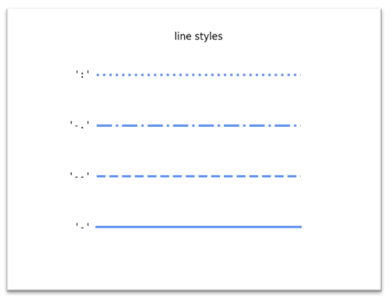

#### 2.2.1.3 Line Plot을 위한 전처리
- noise로 인해 추세 파악이 힘듦
- Noise의 인지적인 방해를 줄이기 위해 smoothing을 사용

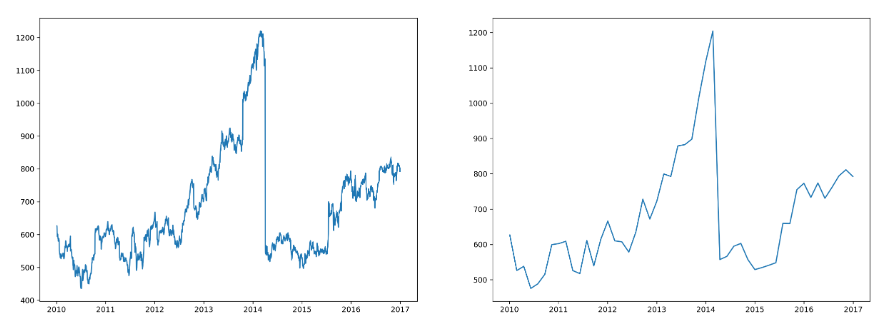

 

    <b><a href="#2강-기본적인-차트의-사용">↥ back to top</a></b>

 

### 2.2.2 정확한 Line Plot
Line plot의 오용을 막아봅시다

#### 2.2.2.1 추세에 집중
- ink principle에선 조금 자유로움
    - 꼭 축을 0에 초점을 둘 이유가 없음
- 너무 구체적인 line보단 생략된 line이 더 나을수도?
    - Grid, Annotate 등 모두 제거
    - 디테일한 정보는 표로 제공하는 것을 추천
- 생략되지 않는 선에서 범위를 조정하여 변화율을 관찰 (`.set_ylim()`)

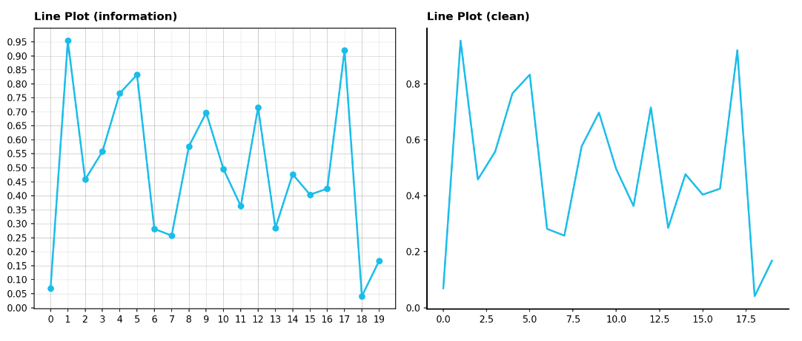

#### 2.2.2.2 간격
- 규칙적인 간격이 아니면 오해를 줄 수도?
- 규칙적이 아니라면 각 관측 값에 점을 표시하여 오해를 줄이자

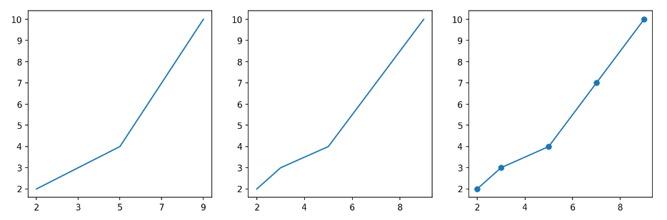

#### 2.2.2.3 보간
- line은 점을 이어만든 요소
    - 중간이 비어있다면? 연결하는 방법 사용! (보간)
- 데이터의 error나 noise가 포함되어 있는 경우, 데이터의 이해를 돕는 방법
    - Moving Average
    - Smooth Curve with Scipy
        - `scipy.interpolate.make_interp_spline()`
        - `scipy.interpolate.interp1d()`
        - `scipy.ndimage.gaussian_filter1d()`
- Presentation에는 좋은 방법일 수 있으나
    - 없는 데이터를 있다고 생각하게 할 수 있고
    - 작은 차이를 없앨 수 있음
    - 일반적인 분석에선 지양할 것!

#### 2.2.2.4 이중 축 사용
- 한 plot에 대해 2개의 축 (dual axis)
- 같은 시간 축에 대해 서로 다른 종류의 데이터를 표현하려면? `.twinx()`
- 한 데이터에 대해 다른 단위
    - `.secondary_xaxis()`
    - `.secondary_yaxis()`

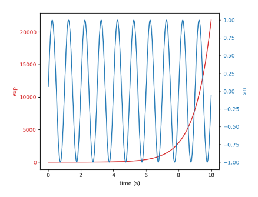

- 2개의 plot을 그리는 것 >>>> 이중 축 사용
    - 이중 축은 지양
    - 인과관계와 상관관계의 혼동을 야기할 수도 있음

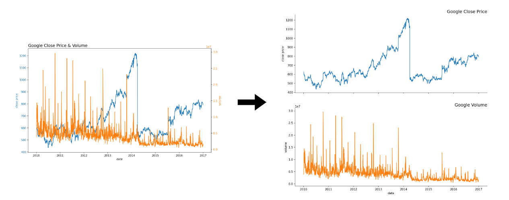

#### 2.2.2.5 ETC
- 라인 끝 단에 레이블을 추가하면 식별에 도움

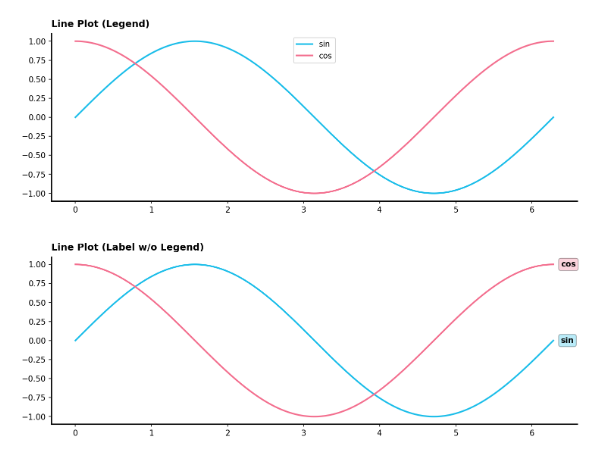

- Min/Max 정보(또는 원하는 포인트)는 추가해주면 도움이 될 수 있음

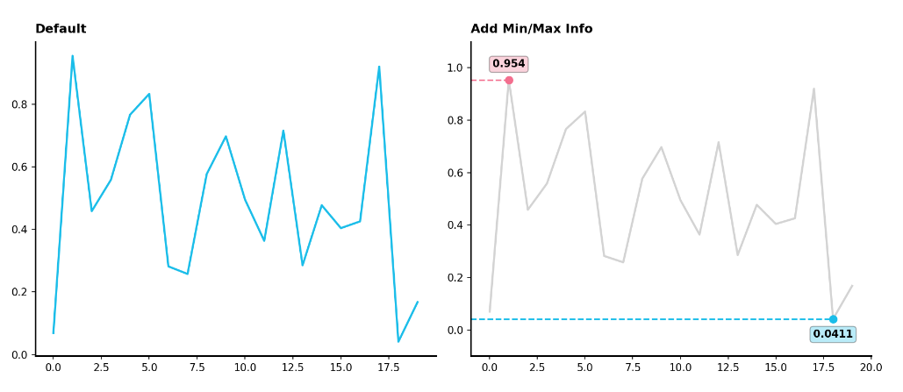

- 보다 연한 색을 사용하여 uncertainty 표현 가능 (신뢰구간, 분산 등)

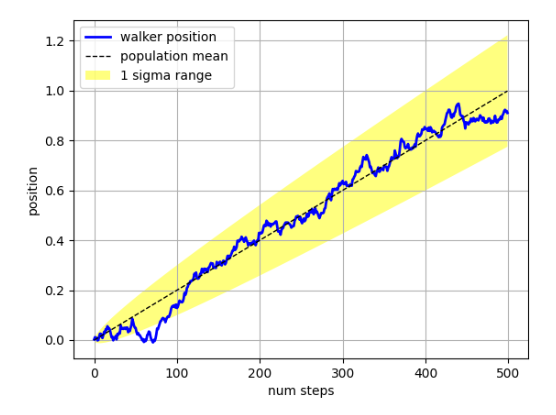

### 실습
- 여기엔 제공 X

 

    <b><a href="#2강-기본적인-차트의-사용">↥ back to top</a></b>

 

## 2.3 Scatter Plot 사용하기
두 변수 사이에 어떤 관계가 있는지 알고 싶은 상황! 어떤 그래프를 사용할 수 있을까요? (산점도)

### 2.3.1 Basic Scatter Plot

#### 2.3.1.1 Scatter Plot이란?
- 점을 사용하여 두 feature 사이의 관계를 알기 위해 사용하는 그래프
- `.scatter()`

#### 2.3.1.2 Components
- `color`, `marker`, `size`
- 2차원 적인 데이터 표현 + 위의 요소로 3차원 추가
    - 5차원까진 표현 가능

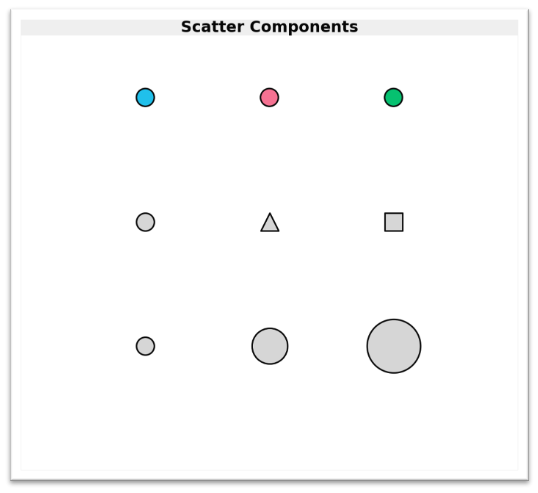

#### 2.3.1.3 Purpose
- **상관 관계 확인**

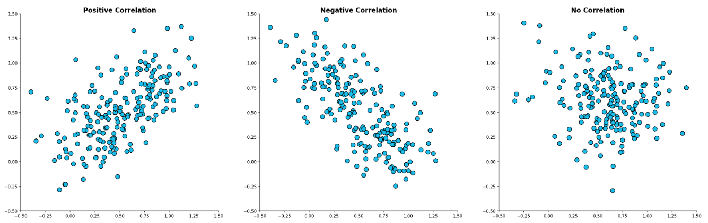

- **데이터 셋의 특징 확인**

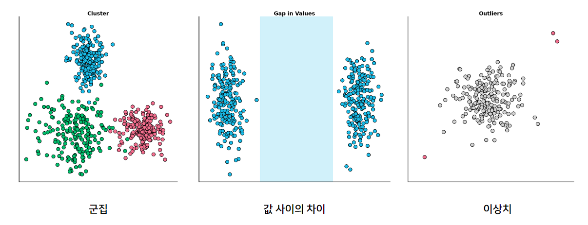

 

    <b><a href="#2강-기본적인-차트의-사용">↥ back to top</a></b>

 

### 2.3.2 정확한 Scatter Plot
Scatter plot의 오용을 막아봅시다

#### 2.3.2.1 Overplotting
- 점이 많아질수록 점의 분포 파악은 힘들어짐...
    - `투명도 조정`: 점간의 밀도 확인 가능
    - `지터링(Jitering)`: 점의 위치를 약간씩 변경
        - 다른 방식에 비해 효과가 크진 않음
    - `2차원 히스토그램`: 히트맵을 사용하여 깔끔한 시각화
    - `Contour plot`: 분포를 등고선을 사용하여 표현

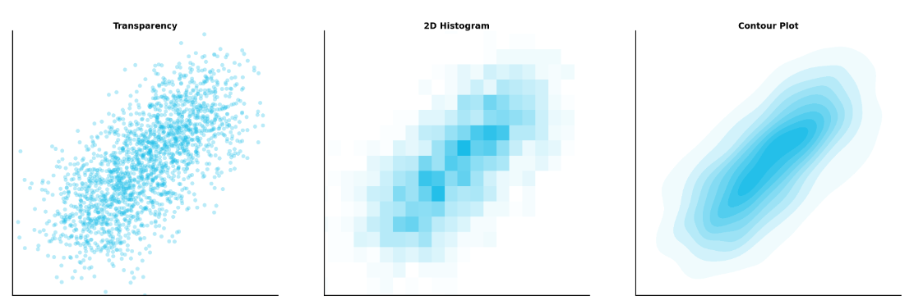

#### 2.3.2.2 점의 요소와 인지
- `color`: 연속은 gradient, 이산은 개별 색상으로!
- `marker`: 거의 구별하기 힘듦 + 크기가 고르지 않음
    - 점의 개수가 100~200만 되도 구별이 힘듦
    - 왜 중요? ink의 원칙에 따르면, 크기도 일치해야하지만
    - 실제 크기랑 보이는 크기가 마커별로 다름!!
- `size`: 흔히 bubble chart라고 부름
    - 구별하기는 쉽지만 오용하기 쉬움 (원의 크기 비교)
    - 관계보다는 각 점간 비율에 초점을 두면 좋음
    - SWOT 분석 등에 활용 가능

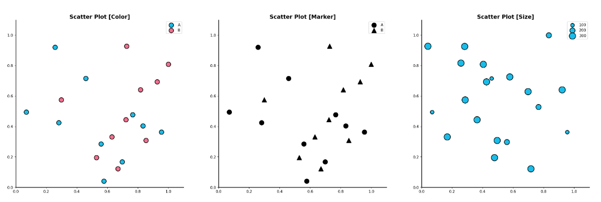

#### 2.3.2.3 인과관계와 상관관계
- `인과 관계(causal relation)`과 `상관 관계(correlation)`는 명확히 다름!
    - 분석 과정에서 꼭 고민해볼 것
- 인과 관계는 항상 사전 정보와 함께 가정으로 제시할 것
- 상관관계는 추후 heatmap에서 다시 다룰 예정

#### 2.3.2.4 추세선
- 추세선으로 Scatter의 패턴 유추가 가능하지만, 2개 이상이 되면 가독성이 떨어진다.

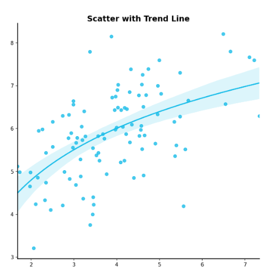

#### 2.3.2.5 ETC
- Grid는 지양. 사용한다면 최소한!
    - 색은 무채색
- 범주형이 포함된 관계에선 `heatmap`, `bubble chart`를 추천!

### 실습
- 여기엔 제공 X

 

    <b><a href="#2강-기본적인-차트의-사용">↥ back to top</a></b>

 
