# 3강 차트의 요소
가장 대표적인 3가지 차트를 통해 matplotlib의 문법을 익히고 시각화의 오용과 해결책에 대해 다룬다.

[back to super](https://github.com/jinmang2/boostcamp_ai_tech_2/tree/main/s-stage/data_viz)

<details open="open">
  <summary>Table of Contents</summary>
  <ul>
    <li>
      <a href="#31-text-사용하기">3.1 Text 사용하기</a>
    </li>
    <li>
      <a href="#32-color-사용하기">3.2 Color 사용하기</a>
    </li>
    <li>
      <a href="#33-facet-사용하기">3.3 Facet 사용하기</a>
    </li>
    <li>
      <a href="#34-more-tips">3.4 More Tips</a>
    </li>
  </ul>
</details>

## 3.1 Text 사용하기
차트의 요소들 중 Text에 대해 자세히 알아보겠습니다.

### 3.1.1 Matplotlib에서 Text

#### Text in Visualization
- 시각화에서도 text 정보는 중요함!
    - Visual repr이 줄 수 없는 많은 설명을 줄 수 있음!
    - 잘못된 전달에서 생기는 오해도 방지 가능!
- 하지만 Text를 과도하게 사용하면 이해에 방해가 될 수도...!

#### Anatomy of a Figure (Text Ver.)
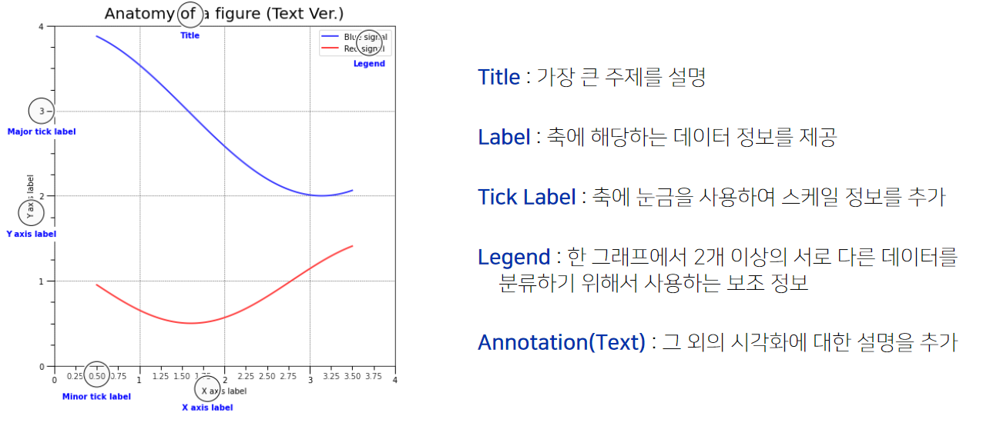

|pyplot API|Objecte-oriented API|description|
|-|-|-|
|`suptitle`|`suptitle`|title of figure|
|`title`|`set_title`|title of subplot `ax`|
|`xlabel`|`set_xlabel`|x-axis label|
|`ylabel`|`set_ylabel`|y-axis label|
|`figtext`|`text`|figure text|
|`text`|`text`|Axes taext|
|`annoatate`|`annotate`|Axes annotation with arrow|

<br/>
<div align="right">
    <b><a href="#3강-차트의-요소">↥ back to top</a></b>
</div>
<br/>

#### Title & Legend
- 제목의 위치 조정하기
- 범례에 제목, 그림자 달기, 위치 조정하기

```python
# figure 호출
fig = plt.figure(figsize=(9, 9))
ax = fig.add_subplot(111, aspect=1)

# scatter plot
ax.scatter(x=X, y=X, c=c,alpha=0.5, label=g)

# 축 예쁘게 시각화를 위해 최대 크기 조절
ax.set_xlim(-3, 102)
ax.set_ylim(-3, 102)

# 예쁜 축을 위해 상단과 우측의 선 안보이게!
ax.spines['top'].set_visible(False)
ax.spines['right'].set_visible(False)

# x축과 y축 label 설정
ax.set_xlabel('Math Score')
ax.set_ylabel('Reading Score')

# 제목 설정
ax.set_title('Score Relation')
ax.legend(
    title='Gender',
    shadow=True,
    labelspacing=1.2,
    loc='lower right',
    bbox_to_anchor=[1.1, 0.5],
    # ncol=2, nrow=2,
)   

plt.show()
```
- bbox_to_anchor을 더 이해하고 싶다면 [link](https://stackoverflow.com/questions/39803385/what-does-a-4-element-tuple-argument-for-bbox-to-anchor-mean-in-matplotlib/39806180#39806180) 참고

#### Ticks & Text
- tick을 없애거나 조정하는 방법
- text의 alignment가 필요한 이유

```python
# base 그림 그리기
fig, ax = plt.subplots(1, 1, figsize=(11, 7))
ax.bar(index, grade,
       width=0.65,
       color='royalblue',
       linewidth=1,
       edgecolor='black'
      )

ax.margins(0.01, 0.1)
# 테두리 지우기
ax.set(frame_on=False)
# 눈금 지우기!
ax.set_yticks([])
# x축 ticks 조절!
ax.set_xticks(np.arange(len(math_grade)))
ax.set_xticklabels(math_grade.index)

# 제목 설정
ax.set_title('Math Score Distribution', fontsize=14, fontweight='semibold')

# annotate 혹은 아래처럼 text로 사용
for idx, val in grade.iteritems():
    # 마스터님 코드이기에 일부만 기록
    ax.text(x=idx,
            # y축 살짝 조정해서 이쁘게!
            y=val+3, s=val,
            # text 위치 조절
            va='bottom', ha='center',
            # 폰트도 다르게 해서 이쁘게!
            fontsize=11, fontweight='semibold'
           )

plt.show()
```

#### Annotate
```python
bbox = dict(boxstyle="round", fc='wheat', pad=0.2)
arrowprops = dict(arrowstyle="->")
ax.annotate(text=f'사용될 텍스트 입력',
            # pointing의 위치
            xy=('x좌표', 'y좌표'),
            # text의 위치
            xytext=[80, 40],
            # bbox 설정 -> 가독성 높이기!
            bbox=bbox,
            # 화살표 옵션
            arrowprops=arrowprops,
            zorder=9
           )
```

<br/>
<div align="right">
    <b><a href="#3강-차트의-요소">↥ back to top</a></b>
</div>
<br/>

### 3.1.2 Text Properties
- Text를 원하는 대로 사용하자!

#### Font Components
가장 쉽게 바꿀 수 있는 요소
- `family`
- `size` or `fontsize`
- `style` or `fontstyle`
- `weight` or `fontweight`

- [Material Design : Understanding typography](https://material.io/design/typography/understanding-typography.html)
- [StackExchange : Is there any research with respect to how font-weight affects readability?](https://ux.stackexchange.com/questions/52971/is-there-any-research-with-respect-to-how-font-weight-affects-readability)

- [Fonts Demo](https://matplotlib.org/stable/gallery/text_labels_and_annotations/fonts_demo.html)입니다.


- 아래처럼 옵션을 줘서 text를 조절할 수 있다!
```python
fig, ax = plt.subplots()
ax.set_xlim(0, 1)
ax.set_ylim(0, 1)

ax.text(x=0.5, y=0.5, s='Text\nis Important',
        fontsize=20,
        fontweight='bold',
        fontfamily='serif',
       )

plt.show()
```

#### Detail
폰트 자체와는 조금 다르지만 커스텀할 수 있는 요소들
- `color`
- `linespacing`
- `backgroundcolor`
- `alpha`
- `zorder`
- `visible`

위에 text 인자로 넣어줘서 사용!

#### Alignment
정렬과 관련된 요소들!
- `ha` : horizontal alignment
- `va` : vertical alignment
- `rotation`
- `multialignment`

```python
ax.text(x=0.5, y=0.5, s='Text\nis Important',
        fontsize=20,
        fontweight='bold',
        fontfamily='serif',
        color='royalblue',
        linespacing=2,
        va='center', # top, bottom, center
        ha='center', # left, right, center
        rotation='horizontal' # vertical?
       )
```

#### Advanced
- `bbox`

- [Drawing fancy boxes](https://matplotlib.org/stable/gallery/shapes_and_collections/fancybox_demo.html)
- 진짜 이쁘다... 체고!

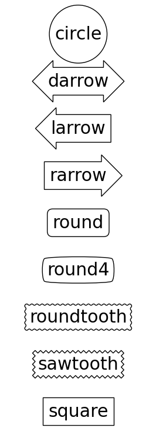

```python
ax.text(x=0.5, y=0.5, s='Text\nis Important',
        fontsize=20,
        fontweight='bold',
        fontfamily='serif',
        color='black',
        linespacing=2,
        va='center', # top, bottom, center
        ha='center', # left, right, center
        rotation='horizontal', # vertical?
        bbox=dict(boxstyle='round', facecolor='wheat', alpha=0.4)
       )
```

### 3.1.3 한글 in Matplotlib
- 영어 외의 언어를 Matplotlib에서 사용하자!

```python
# adjust 한글 font
from matplotlib import font_manager, rc
font_name = font_manager.FontProperties(fname='c:/Windows/Fonts/malgun.ttf').get_name()
rc('font', family=font_name)

# minus font
plt.rcParams['axes.unicode_minus'] = False
```

<br/>
<div align="right">
    <b><a href="#3강-차트의-요소">↥ back to top</a></b>
</div>
<br/>

## 3.2 Color 사용하기
차트의 요소들 중 색에 대해 자세히 알아보겠습니다

### 3.2.1 Color에 대한 이해

#### 색이 중요한 이유?

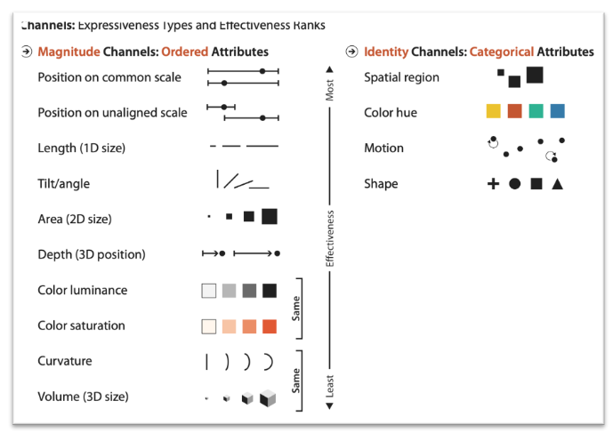

- 위치와 색은 가장 효과적인 채널 구분!
- 좋은 색과 색 배치는 예쁘다!!

#### 화려함이 시각화의 전부는 아님.

- 화려함도 필요! 매력적이라서!
- 가장 중요한 것은 독자에게 원하는 인사이트를 제공!

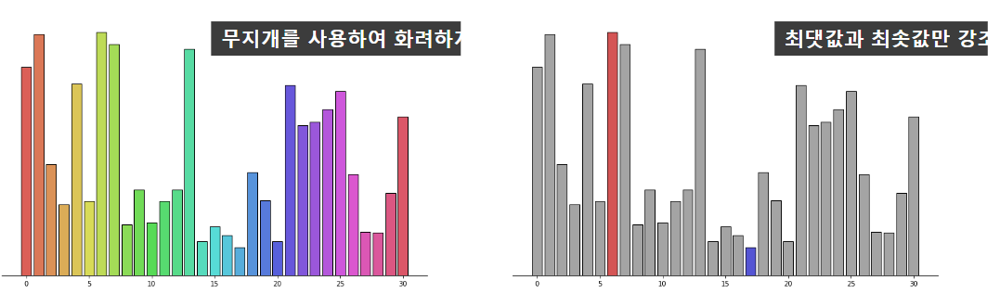

#### 색이 가지는 의미
- 2020 미국 대선 지도
    - https://edition.cnn.com/election/2020/results/president
- 우리는 살면서 이미 많은 색을 사용했기에, 기존 정보와 느낌을 잘 활용하는 것이 중요하다!

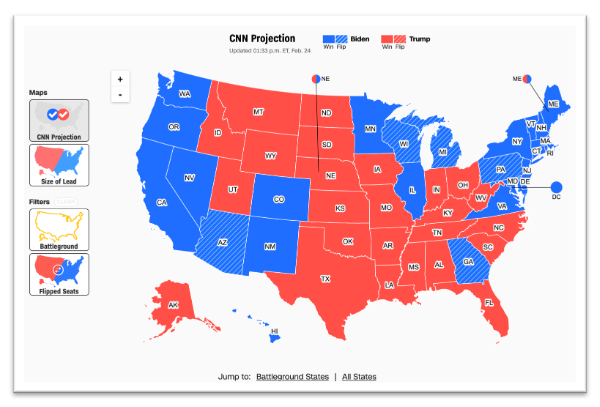

#### 색상 더 이해하기!
색을 이해하기 위해서는 `RGB`보다 `HSL`을 이해하는 것이 중요!

- **Hue(색조)** : 빨강, 파랑, 초록 등 색상으로 생각하는 부분
    - 빨강에서 보라색까지 있는 스펙트럼에서 0-360으로 표현
- **Saturate(채도)** : 무채색과의 차이
    - 선명도라고 볼 수 있음 (선명하다와 탁하다.)
- **Lightness(광도)** : 색상의 밝기


아래 자료도 참고하면 좋다고 말씀주셨다!

- [Github Topic Color-palette](https://github.com/topics/color-palette)
- [karthik/wesanderson](https://github.com/karthik/wesanderson)
- [Top R Color Palettes to Know for Great Data Visualization](https://www.datanovia.com/en/blog/top-r-color-palettes-to-know-for-great-data-visualization/)
- [Adobe Color](https://color.adobe.com/create/color-wheel)

<br/>
<div align="right">
    <b><a href="#3강-차트의-요소">↥ back to top</a></b>
</div>
<br/>

### 3.2.2 Color Palette의 종류
색을 적재적소에 쓰기 위한 기본

#### 범주형 (Categorical)
- Discrete, Qualitative
- 독립된 색상으로 구성!
- 최대 10개의 색상까지만 사용하고 그 외는 `기타`로 묶어라
- 색의 차이로 구분!

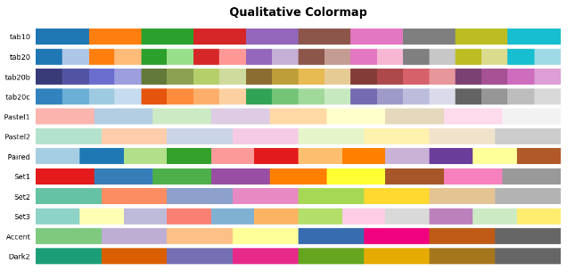

- 색으로 어떻게 보여줄지?
- 마지막에 저렇게 해버리면 같은 값에 다른 가중치처럼 보여서 잉크 양 비례의 원칙을 어긴다고 함!

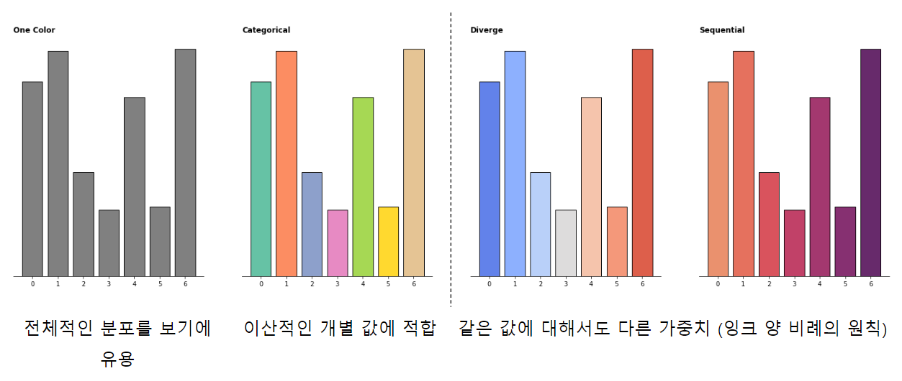

```python
...
pcm = axes[idx].scatter(
    ...,
    # 인자 이름이 버전에 따라 다름 c vs color
    c=student_sub['color'],
    cmap=ListedColormap(plt.cm.get_cmap(cm).colors[:5])
)
cbar = fig.colorbar(pcm, ax=axes[idx], ticks=range(5))
...
plt.show()
```

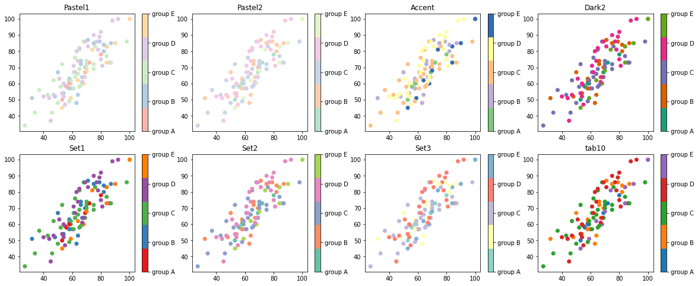


#### 연속형 (Sequential)
- 정렬된 값을 가짐
- 연속적인 색상을 사용하여 값을 표현!
    - Gradient
- 단일 색조로 표현하는 것이 좋음

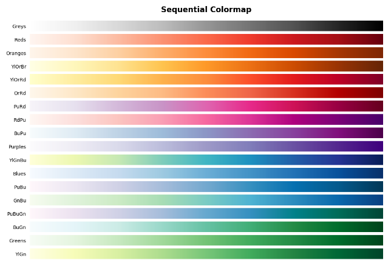

- 가장 흔한 예시? github commit log!

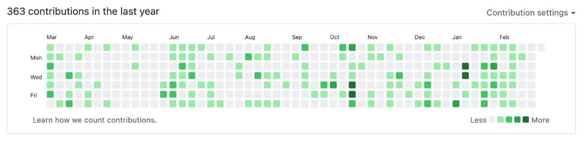

- Heatmap, Contour Plot
- 지리지도, 계층형 데이터에도 적합!

```python
sequential_cm_list = ['Greys', 'Purples', 'Blues', 'Greens', 'Oranges', 'Reds',
            'YlOrBr', 'YlOrRd', 'OrRd', 'PuRd', 'RdPu', 'BuPu',
            'GnBu', 'PuBu', 'YlGnBu', 'PuBuGn', 'BuGn', 'YlGn']
...
pcm = axes[idx].scatter(..., cmap=cm, ...)
fig.colorbar(pcm, ax=axes[idx])
...
```

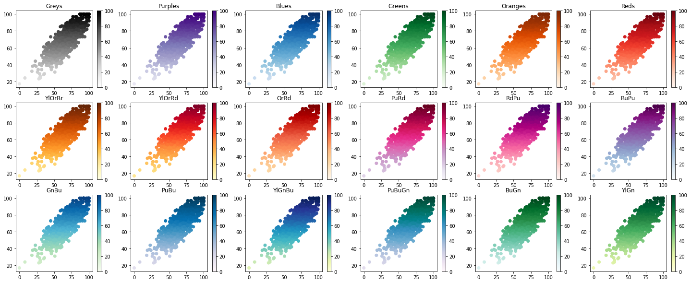


#### 발산형 (Diverge)
- 연속형과 유사해 보이나, 중앙을 기준으로 발산!
- 양 끝으로 갈수록 색이 진해짐
- 중앙의 색은 양쪽의 점에서 편향되지 않아야 한다!
    - 무채색일 필욘 없다고 한다

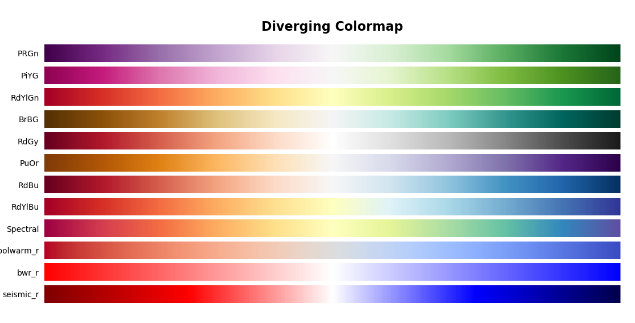

- 2019년 대한민국 평균 기온 데이터

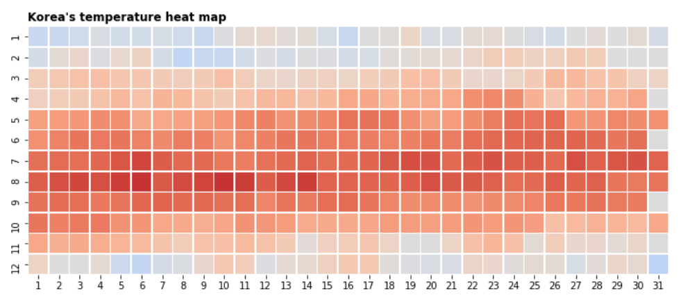

- 어디를 중심으로 삼을 것인가!
- 상관관계 등
- Geospatial

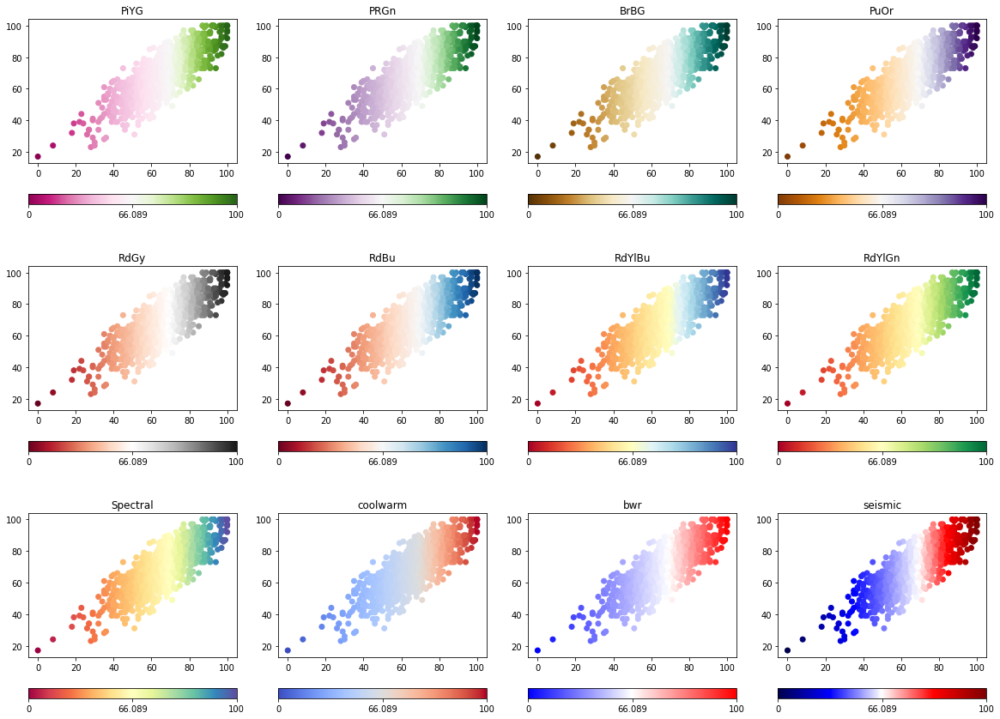

<br/>
<div align="right">
    <b><a href="#3강-차트의-요소">↥ back to top</a></b>
</div>
<br/>

### 3.2.3 그 외 색 Tips

#### 강조, 색상 대비
- 데이터에서 다름을 보이기 위해 **Highlighting** 기능!
- 강조를 위한 방법! `Color Contrast` 사용
    - `명도 대비`: 밝은 색 vs 어두운 색
    - `색상 대비`: 가까운 색은 차이가 더 큼! (상대적인?)
    - `채도 대비`: 채도? 좀 더 밝아보인다!
    - `보색 대비`: 정반대 색상을 사용하면 더 선명함!
    - 전부 뭔가 상대적인 의미가 강해보인다.

더 자세하게 알아보자! 우선 아래와 같이 단일 색상으로 그림이 있다고 가정하자. 구분이 잘 되는가? 하나도 되지 않고 있다.

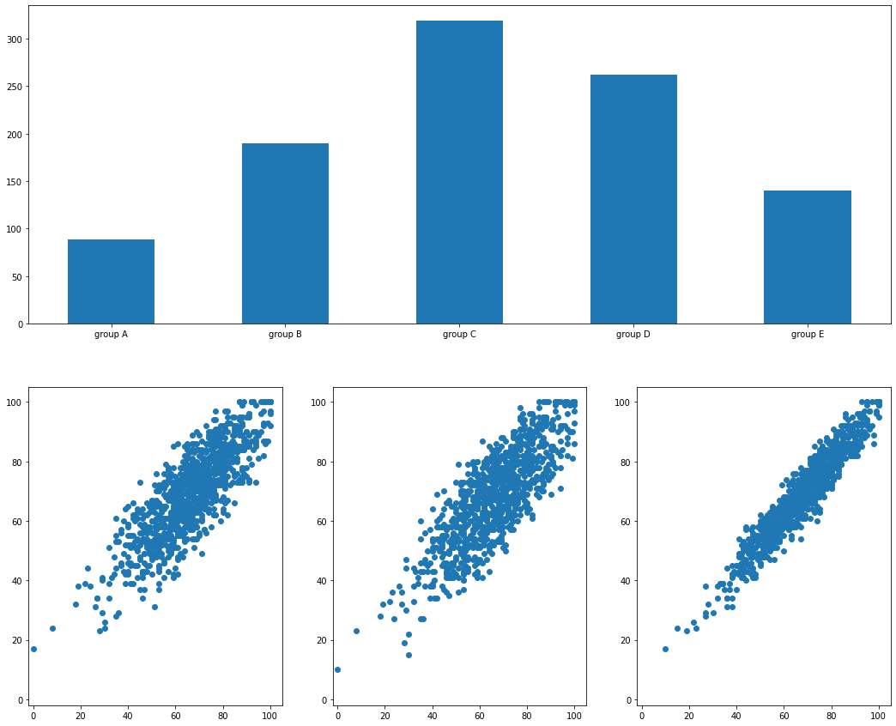

**명도 대비**

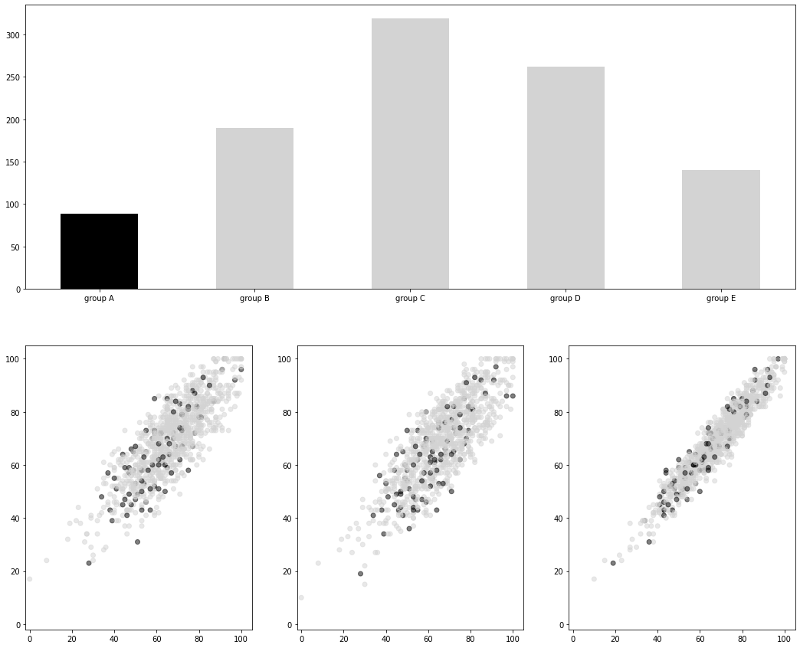

**채도 대비**

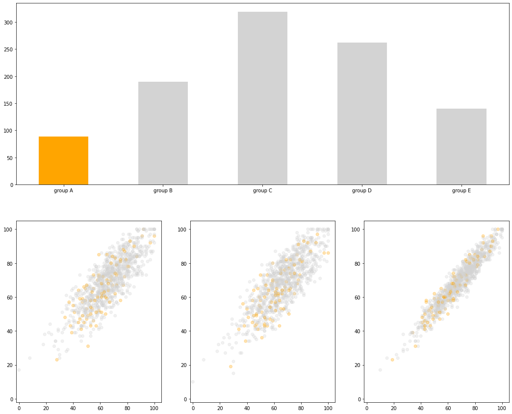

**보색 대비**

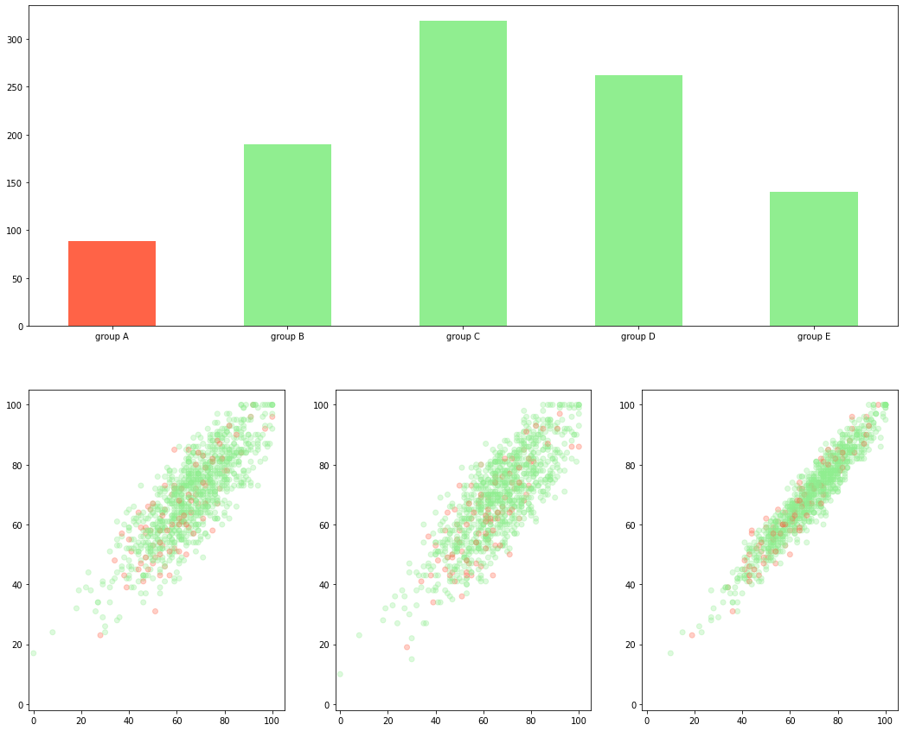


#### 색각 이상
- 삼원색 중 특정 색을 감지 못하면 `색맹`
- 부분적 인지 이상이 있다면 `색약`
- 과학/연구 등에선 이에 대한 고려가 필수

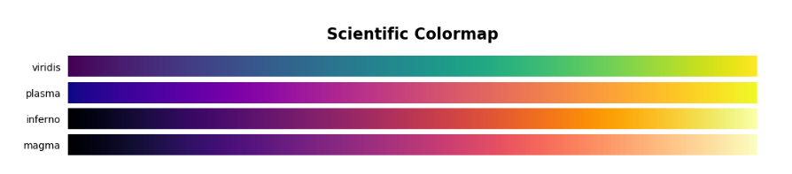

<br/>
<div align="right">
    <b><a href="#3강-차트의-요소">↥ back to top</a></b>
</div>
<br/>

## 3.3 Facet 사용하기

### 3.3.1 Facet
Facet은 무엇이고 왜 여러 개의 시각화를 한 번에 보여주는가?

#### Multiple View
- `Facet`이란 분할을 의미
- 화면 상에 View를 분할 및 추가하여 다양한 관점을 전달할 수 있다!
    - 같은 dataset에 대해 서로 다른 encoding을 통해 다른 인사이트 제공 가능
    - 같은 방법으로 동시에 여러 feature 확인 가능 (효율적)
    - 큰 틀에서 볼 수 없는 부분 집합을 세세하게 보여줄 수 있음

<br/>
<div align="right">
    <b><a href="#3강-차트의-요소">↥ back to top</a></b>
</div>
<br/>

### 3.3.2 Matplotlib에서 구현

#### Figure와 Axes

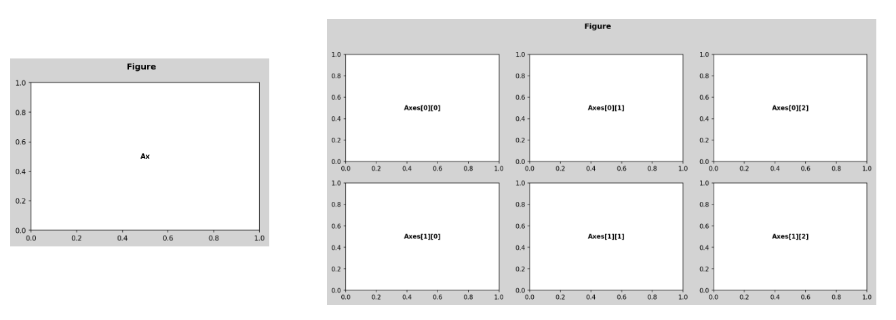

```python
# 1번 방법
fig = plt.figure()
ax = fig.add_subplot(121)
ax = fig.add_subplot(122)

# 2번 방법
fig, axes = plt.subplots(1, 2)

# 배경 색상 바꾸기
fig.set_facecolor('lightgray')
```

<br/>
<div align="right">
    <b><a href="#3강-차트의-요소">↥ back to top</a></b>
</div>
<br/>

#### NxM subplots

- 가장 쉬운 방법은 아래 3가지
    - `plt.subplot()`
    - `plt.figure()` + `fig.add_subplot()`
    - `plt.subplots()`
- 쉽게 조정 가능한 요소
    - `figuresize`
    - `dpi`
    - `sharex`, `sharey`
    - `squeeze`
    - `aspect`

**DPI** : Dots per Inch, 해상도!

```python
fig = plt.figure(dpi=150)
fig.savefig('file_name.png', dpi=150)
```

**Sharx**, **Sharey**
- 축을 공유!

```python
# 1번 방법
# figure를 그리고 ax에서 지정
fig = plt.figure()
ax1 = fig.add_subplot(121)
ax1.plot([1, 2, 3], [1, 4, 9])
ax2 = fig.add_subplot(122, sharey=ax1)
ax2.plot([1, 2, 3], [1, 2, 3])

# 2번 방법
# 그릴 때 지정
fig, axes = plt.subplots(1, 2, sharey=True)
```

**Squeeze**
- 차원을 늘리거나 줄여줌!
- `subplots()`로 생성하면 기본적으로 다음과 같이 서브플롯 ax 배열이 생성됨

    - 1 x 1 : 객체 1개 (`ax`)
    - 1 x N 또는 N x 1 : 길이 N 배열 (`axes[i]`)
    - N x M : N by M 배열 (`axes[i][j]`)

- numpy ndarray에서 각각 차원이 0, 1, 2로 나타난다.
- 이렇게 되면 경우에 따라 반복문을 사용할 수 있거나, 없거나로 구분됨

- `squeeze`를 사용하면 항상 2차원으로 배열을 받을 수 있고, 가변 크기에 대해 반복문을 사용하기에 유용!

```python
n, m = 1, 3

fig, axes = plt.subplots(n, m, squeeze=False, figsize=(m*2, n*2))
idx = 0
for i in range(n):
    for j in range(m):
        axes[i][j].set_title(idx)
        axes[i][j].set_xticks([])
        axes[i][j].set_yticks([])
        idx+=1

plt.show()
```

**Flatten**
- `plt.subplots()`나 `plt.gca()`로 받는 ax 리스트는 numpy ndarray로 전달

- 그렇기에 1중 반복문을 쓰고 싶다면 `flatten()` 메서드를 사용할 수 있음!

```python
n, m = 2, 3

fig, axes = plt.subplots(n, m, figsize=(m*2, n*2))

for i, ax in enumerate(axes.flatten()):
    ax.set_title(i)
    ax.set_xticks([])
    ax.set_yticks([])

plt.show()
```

**Aspect**
- 비율을 의미!

```python
fig = plt.figure(figsize=(12, 5))
ax1 = fig.add_subplot(121, aspect=1)
ax2 = fig.add_subplot(122, aspect=0.5)
plt.show()
```

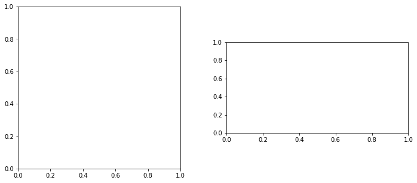    

<br/>
<div align="right">
    <b><a href="#3강-차트의-요소">↥ back to top</a></b>
</div>
<br/>

#### Grid Spec의 활용

- 여기서 다른 사이즈를 만들려면? 구현의 측면으로 보자!

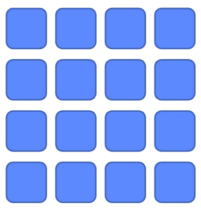

- Numpy의 Slicing...? `fig.add_grid_spec()`

```python
gs = fig.add_gridspec(3, 3) # make 3 by 3 grid (row, col)
```

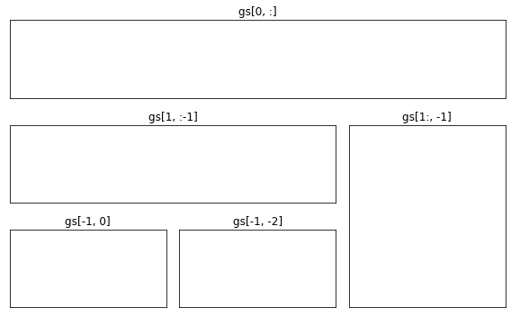

- 아니면 delta x, y로! `fig.subplot2grid`

```python
fig = plt.figure(figsize=(8, 5)) # initialize figure

ax = [None for _ in range(6)] # list to save many ax for setting parameter in each

ax[0] = plt.subplot2grid((3,4), (0,0), colspan=4)
ax[1] = plt.subplot2grid((3,4), (1,0), colspan=1)
ax[2] = plt.subplot2grid((3,4), (1,1), colspan=1)
...
```

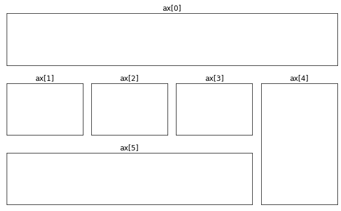


<br/>
<div align="right">
    <b><a href="#3강-차트의-요소">↥ back to top</a></b>
</div>
<br/>


#### 내부에 그리기
- Ax 내부에 서브플롯을 추가하는 방법!
- `ax.inset_axes()`

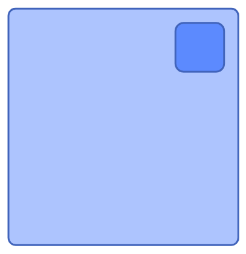

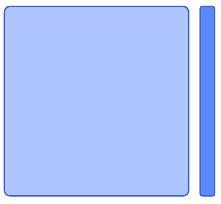

```python
axin = ax.inset_axes([0.8, 0.8, 0.2, 0.2])
axin.pie([1, 2], colors=color,
         autopct='%1.0f%%')
```

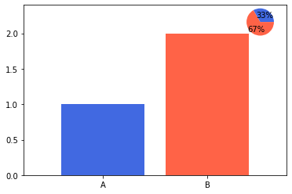

- `make_axes_locatable`
    - colorbar에 많이 사용!

```python
fig, ax = plt.subplots(1, 1)

# 이미지를 보여주는 시각화
# 2D 배열을 색으로 보여줌
im = ax.imshow(np.arange(100).reshape((10, 10)))

divider = make_axes_locatable(ax)
cax = divider.append_axes("right", size="5%", pad=0.05)

fig.colorbar(im, cax=cax)
plt.show()
```


<br/>
<div align="right">
    <b><a href="#3강-차트의-요소">↥ back to top</a></b>
</div>
<br/>

## 3.4 More Tips
이번 강의는 텍스트, 색, Facet 이외의 추가적인 팁들에 대해 알아보겠습니다.

### 3.4.1 Grid 이해하기
격자도 다양하게 사용해보자!

#### Default Grid
- 기본적으로는 축과 평행한 선을 사용
- 무채색 (`color`), 항상 layer 순서 상 맨 밑에 오도록! (`zorder`)
- 큰 격자 / 세부 격자 (`which='major', 'minor', 'both'`)
- X축? Y축? 동시에? (`axis='x', 'y', 'both'`)

#### 다양한 타입의 Grid
- 여러 형태의 Grid 중요함
- 전형적이지 않고 구현도 까다롭지만 `numpy` + `maplotlib`으로도 구현 가능!
    - https://medium.com/nightingale/gotta-gridem-all-2f768048f934
- 코드로 어떻게? 궁금하지? 제공 안함~
- 필요할 때 Google Drive 볼 것!

- minor ticks?
```python
ax.set_ticks(np.linspace(0, 1.1, 12, endpoint=True), minor=True)
```

- `linewidths` 이거도 굉장히 중요함!

**Default Grid**
```python
c='#1ABDE9'
ax.grid(zorder=0, linestyle='--')
```

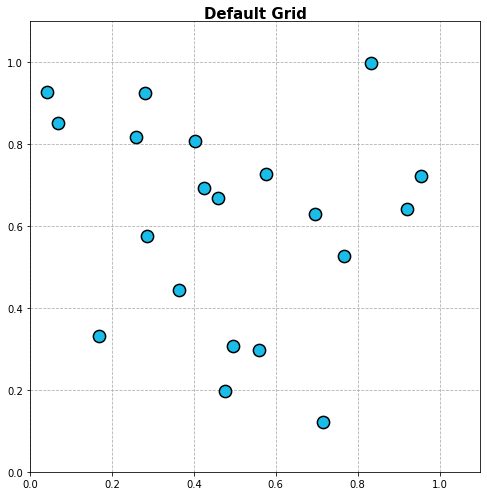

**x+y=c**
```python
c=['#1ABDE9' if xx+yy < 1.0 else 'darkgray' for xx, yy in zip(x, y)]

x_start = np.linspace(0, 2.2, 12, endpoint=True)

for xs in x_start:
    ax.plot([xs, 0], [0, xs], linestyle='--', color='gray', alpha=0.5, linewidth=1)
```

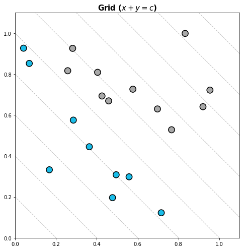

**y=cx**
```python
c=['#1ABDE9' if yy/xx >= 1.0 else 'darkgray' for xx, yy in zip(x, y)]

radian = np.linspace(0, np.pi/2, 11, endpoint=True)

for rad in radian:
    ax.plot([0,2], [0, 2*np.tan(rad)], linestyle='--', color='gray', alpha=0.5, linewidth=1)
```

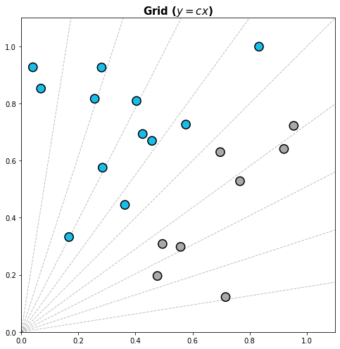

**동심원**
```python
c=['darkgray' if i!=2 else '#1ABDE9'  for i in range(20)]

## Grid Part
rs = np.linspace(0.1, 0.8, 8, endpoint=True)

for r in rs:
    xx = r*np.cos(np.linspace(0, 2*np.pi, 100))
    yy = r*np.sin(np.linspace(0, 2*np.pi, 100))
    ax.plot(xx+x[2], yy+y[2], linestyle='--', color='gray', alpha=0.5, linewidth=1)

    ax.text(x[2]+r*np.cos(np.pi/4), y[2]-r*np.sin(np.pi/4), f'{r:.1}', color='gray')
```

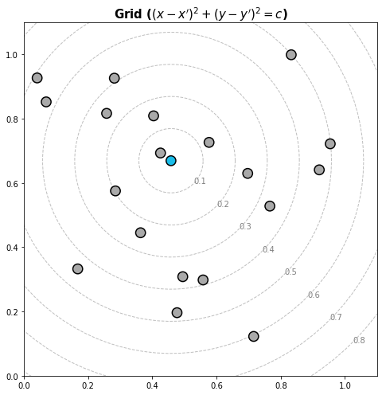


<br/>
<div align="right">
    <b><a href="#3강-차트의-요소">↥ back to top</a></b>
</div>
<br/>

### 3.4.2 심플한 처리
어렵지 않게 더 많은 정보와 주의를 줄 수 있는 방법들

#### 선 추가하기
- 단순하게 선을 추가하여 평균, 상한, 하한값을 시각화

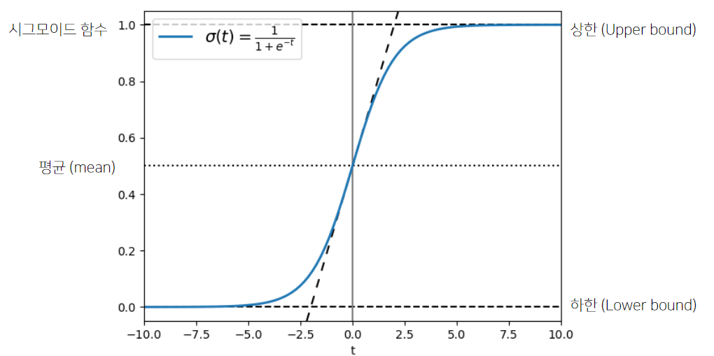

**Line**

```python
ms = student['math score']
rs = student['reading score']
mm = ms.mean()
rm = rs.mean()

ax.axvline(math_mean, color='gray', linestyle='--')
ax.axhline(reading_mean, color='gray', linestyle='--')

c=[
    'royalblue' if m>mm and r>rm else 'gray'
    for m, r in zip(ms, rs)
]
```

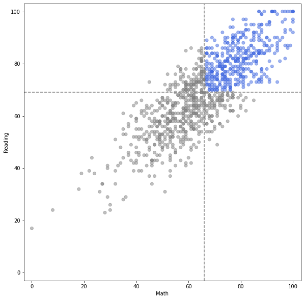


#### 면 추가하기
- 아래는 Netflix 영화 상영 등급 분포
- 확실히 이렇게 그리니까 어떤 구간인지 잘 보인다!

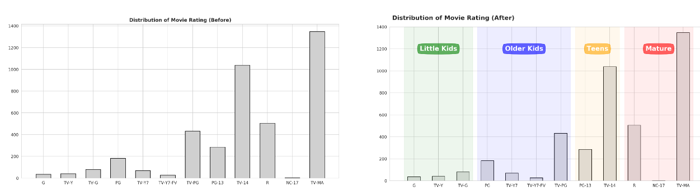

**Span**

```python
ms = student['math score']
rs = student['reading score']
mm = ms.mean()
rm = rs.mean()

ax.axvspan(-3, math_mean, color='gray', linestyle='--', zorder=0, alpha=0.3)
ax.axhspan(-3, reading_mean, color='gray', linestyle='--', zorder=0, alpha=0.3)

c=[
    'royalblue' if m>mm and r>rm else 'gray'
    for m, r in zip(ms, rs)
]
```

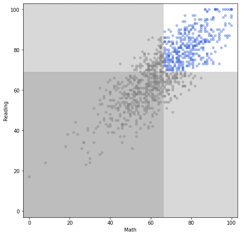

**Spines**
- `set_visible`  
- `set_linewidth`
- `set_position`

```python
fig = plt.figure(figsize=(12, 6))

_ = fig.add_subplot(1,2,1)
ax = fig.add_subplot(1,2,2)
ax.spines['top'].set_visible(False)
ax.spines['right'].set_visible(False)
ax.spines['left'].set_linewidth(1.5)
ax.spines['bottom'].set_linewidth(1.5)
plt.show()
```

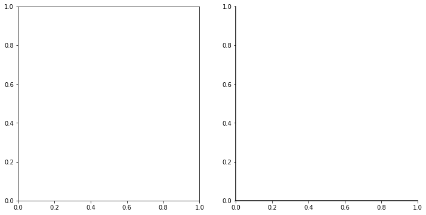

```python
ax.spines['left'].set_position('center')
ax.spines['bottom'].set_position('center')
```

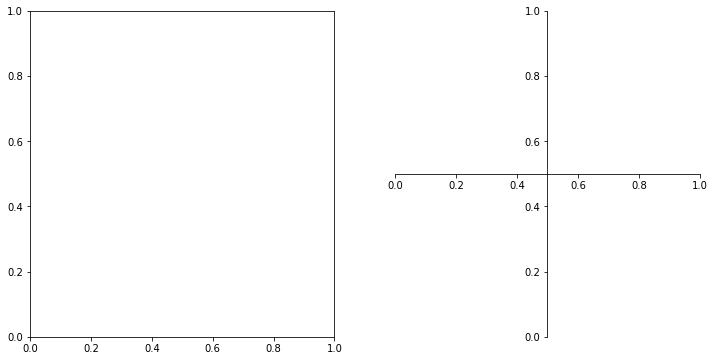

- `'center'` -> `('axes', 0.5)`
- `'zero'` -> `('data', 0.0)`

```python
ax2.spines['left'].set_position(('data', 0.3))
ax2.spines['bottom'].set_position(('axes', 0.2))
```

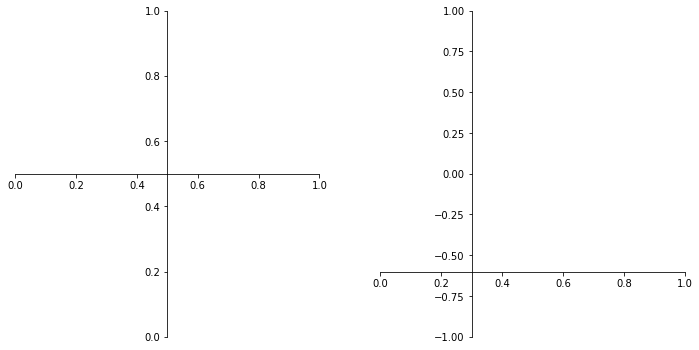

<br/>
<div align="right">
    <b><a href="#3강-차트의-요소">↥ back to top</a></b>
</div>
<br/>

### 3.4.3 Setting 바꾸기
- 우리가 일일이 parameter를 줘도 되지만, 대표적으로 많이 사용하는 테마가 있음!

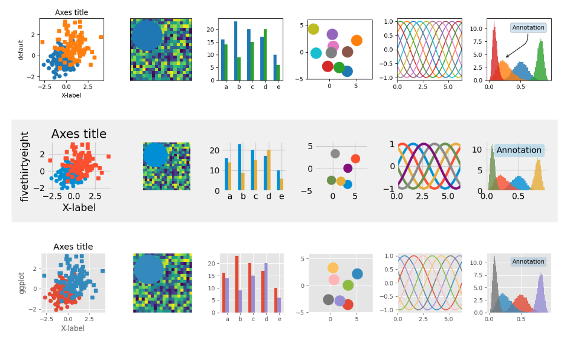

- [Customizing Matplotlib with style sheets and rcParams](https://matplotlib.org/stable/tutorials/introductory/customizing.html)

#### `mpl.rc`
```python
plt.rcParams['lines.linewidth'] = 2
plt.rcParams['lines.linestyle'] = ':'

# plt.rcParams['figure.dpi'] = 150

plt.rc('lines', linewidth=2, linestyle=':')

plt.rcParams.update(plt.rcParamsDefault)
```

#### theme
```python
print(mpl.style.available)
# ['Solarize_Light2', '_classic_test_patch', 'bmh',
#  'classic', 'dark_background', 'fast', 'fivethirtyeight',
#  'ggplot', 'grayscale', 'seaborn', 'seaborn-bright',
#  'seaborn-colorblind', 'seaborn-dark', 'seaborn-dark-palette',
#  'seaborn-darkgrid', 'seaborn-deep', 'seaborn-muted',
#  'seaborn-notebook', 'seaborn-paper', 'seaborn-pastel',
#  'seaborn-poster', 'seaborn-talk', 'seaborn-ticks',
#  'seaborn-white', 'seaborn-whitegrid', 'tableau-colorblind10']

mpl.style.use('seaborn')
mpl.style.use('ggplot')

with plt.style.context('fivethirtyeight'):
    plt.plot(np.sin(np.linspace(0, 2 * np.pi)))
plt.show()
```

<br/>
<div align="right">
    <b><a href="#3강-차트의-요소">↥ back to top</a></b>
</div>
<br/>
