# 4강 통계와 차트
 Seaborn 라이브러리와 통계학적인 테크닉에 대해 알아봅니다.

[back to super](https://github.com/jinmang2/boostcamp_ai_tech_2/tree/main/s-stage/data_viz)

<details open="open">
  <summary>Table of Contents</summary>
  <ul>
    <li>
      <a href="#41-seaborn-소개하기">4.1 Seaborn 소개</a>
    </li>
    <ul>
      <li><a href="#411-seaborn-소개">4.1.1 Seaborn 소개</a></li>
      <li><a href="#412-seaborn-설치">4.1.2 Seaborn 설치</a></li>
      <li><a href="#413-다양한-api">4.1.3 다양한 API</a></li>
    </ul>
    <li>
      <a href="#42-seaborn-기초">4.2 Seaborn 기초</a>
    </li>
    <ul>
      <li><a href="#421-seaborn의-구조-살펴보기">4.2.1 Seaborn의 구조 살펴보기</a></li>
      <li><a href="#422-categorical-api">4.2.2 Categorical API</a></li>
      <li><a href="#423-distribution-api">4.2.3 Distribution API</a></li>
      <li><a href="#424-relation-regression-api">4.2.4 Relation & Regression API</a></li>
      <li><a href="#425-matrix-plot">4.2.5 Matrix Plot</a></li>
    </ul>
    <li>
      <a href="#43-seaborn-심화">4.3 Seaborn 심화</a>
    </li>
    <ul>
      <li><a href="#431-joint-plot">4.3.1 Joint Plot</a></li>
      <li><a href="#432-pair-plot">4.3.2 Pair Plot</a></li>
      <li><a href="#433-facet-grid-사용하기">4.3.3 Facet Grid 사용하기</a></li>
    </ul>
    <li>
      <a href="#further-reading">Further Reading</a>
    </li>
  </ul>
</details>

## 4.1 Seaborn 소개

### 4.1.1 Seaborn 소개


- Seaborn은 Matplotlib 기반 통계 시각화 라이브러리
    - 통계 정보: 구성, 분포, 관계 등
    - Matplotlib 기반이라 Matplotlib으로 커스텀 가능
    - 쉬운 문법과 깔끔한 디자인이 특징

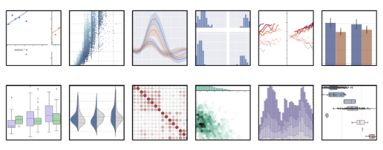
- 디테일한 커스텀보다는 **새로운 방법론**을 위주로
- 앞서 공부한 **이론과의 연결**을 중심으로

### 4.1.2 Seaborn 설치
- 아직 version 1.0이 나오지 않아 업데이트될 수 있음
- 본 내용은 `version 0.11`로 진행

```python
$ pip install seaborn==0.11
import seaborn as sns # 왜 sns인지는 아는 사람이 없음...
```

### 4.1.3 다양한 API

- Seaborn은 아래 다양한 API를 제공함
    - Categorical API
    - Distribution API
    - Relational API
    - Regression API
    - Multiples API
    - Theme API

<br/>
<div align="right">
    <b><a href="#4강-통계와-차트">↥ back to top</a></b>
</div>
<br/>


## 4.2 Seaborn 기초
Seaborn의 기초적인 문법에 대해 학습

### 4.2.1 Seaborn의 구조 살펴보기

#### Countplot
- seaborn의 Categorical API에서 대표적인 시각화로 범주를 이산적으로 세서 막대 그래프로 그려주는 함수
- 공통적인 params
    - `x`, `y`, `data`, `hue`, `hue_order`, `palette`, `color`, `saturate`, `ax`
- 이 중 `x`, `y`, `hue` 등은 기본적으로 `df`의 feature를 의미합니다
- `dict`라면 key를 의미합니다.

```python
import matplotlib.pyplot as plt
import seaborn as sns


fig, axes = plt.subplots(1, 2, figsize=(12, 5))

# https://www.delftstack.com/ko/howto/matplotlib/how-to-set-a-single-main-title-for-all-the-subplots-in-matplotlib/
fig.suptitle("Figure 1. Countplot", fontweight="bold", fontsize=18)

axes[0].set_title("vertical case")
axes[1].set_title("horizontal case")

sns.countplot(x='gender', data=student,
              hue='race/ethnicity', # 데이터 구분 기준을 색상을 통해 구분
              color="red", # hue group에 Gradient 색상 전달
              order=['male', 'female'], # 라벨 순서 지정
              hue_order=sorted(student['race/ethnicity'].unique()), # hue order
              saturation=1.0, # Control saturation
              ax=axes[0], # ax 지정
)

sns.countplot(y='race/ethnicity',data=student, # 축 변경
              hue='gender',
              palette="Set2", # hue 색상 변경,
              order=sorted(student['race/ethnicity'].unique()),
              saturation=0.7, # Control saturation
              ax=axes[1]
             )

plt.show()
```

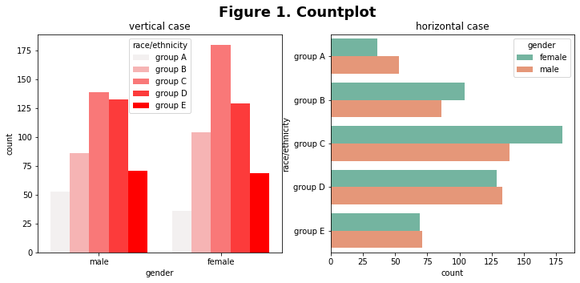

<br/>
<div align="right">
    <b><a href="#4강-통계와-차트">↥ back to top</a></b>
</div>
<br/>

### 4.2.2 Categorical API
데이터의 통계량을 기본적으로 살펴보겠습니다.

- `count`
    - missing value

데이터가 정규분포에 가깝다면 평균과 표준 편차를 살피는 게 의미가 될 수 있습니다.

- `mean` (평균)
- `std` (표준 편차)

하지만 데이터가 정규분포에 가깝지 않다면 다른 방식으로 대표값을 뽑는 게 더 좋을 수 있습니다.

> 예시로 직원 월급 평균에서 임원급 월급은 빼야하듯?

분위수란 자료의 크기 순서에 따른 위치값으로 백분위값으로 표기하는 게 일반적입니다.

- 사분위수 : 데이터를 4등분한 관측값
    - `min`
    - `25%` (lower quartile)
    - `50%` (median)
    - `75%` (upper quartile)
    - `max`

```python
student.describe()
```

|**math score**|**reading score**|**writing score**
-----|-----|-----|-----
count|1,000.00000|1,000.000000|1,000.000000
mean|66.08900|69.169000|68.054000
std|15.16308|14.600192|15.195657
min|0.00000|17.000000|10.000000
25%|57.00000|59.000000|57.750000
50%|66.00000|70.000000|69.000000
75%|77.00000|79.000000|79.000000
max|100.00000|100.000000|100.000000

<br/>
<div align="right">
    <b><a href="#4강-통계와-차트">↥ back to top</a></b>
</div>
<br/>

#### Box plot
- [Understanding Boxplots](https://towardsdatascience.com/understanding-boxplots-5e2df7bcbd51)


```python
fig, ax = plt.subplots(1,1, figsize=(12, 5))
sns.boxplot(x='math score', data=student, ax=ax)
plt.show()
```

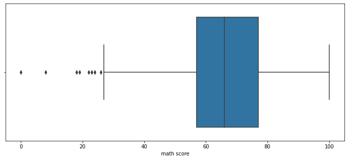

추가적으로 Boxplot을 이해하기 위해서는 IQR을 알아야 합니다.

- **interquartile range (IQR)**: 25th to the 75th percentile.

그리고 Boxplot에서 outlier은 다음과 같이 표현하고 있습니다.

- **whisker** : 박스 외부의 범위를 나타내는 선
- **outlier** : `-IQR*1.5`과 `+IQR*1.5`을 벗어나는 값

그래서 왼쪽과 오른쪽 막대는 +-IQR * 1.5 범위를 점들이 Outlier를 의미합니다.
하지만 whisker의 길이는 같지 않습니다. 이는 실제 데이터의 위치를 반영하여

- min : -IQR * 1.5 보다 크거나 같은 값들 중 최솟값
- max : +IQR * 1.5 보다 작거나 같은 값들 중 최댓값

```python
fig, ax = plt.subplots(1,1, figsize=(10, 5))

sns.boxplot(x='race/ethnicity', y='math score', data=student,
            hue='gender',
            order=sorted(student['race/ethnicity'].unique()),
            width=0.8,
            linewidth=2,
            fliersize=10,
            ax=ax)

plt.show()
```

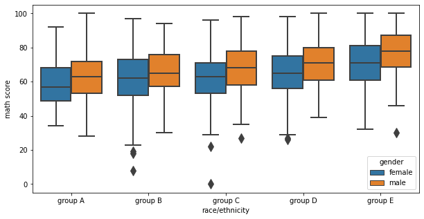

<br/>
<div align="right">
    <b><a href="#4강-통계와-차트">↥ back to top</a></b>
</div>
<br/>

#### Violin Plot
- [violinplot](https://seaborn.pydata.org/generated/seaborn.violinplot.html)
- box plot은 대푯값에 대한 시각화는 잘 해줌
- 그러나 실제 분포를 표현하기에는 부족
- 이 때 사용할 plot이 violin plot!
- 흰 점이 50%, 중간 검정 막대가 IQR 범위를 의미

```python
fig, ax = plt.subplots(1,1, figsize=(12, 5))
sns.violinplot(x='math score', data=student, ax=ax)
plt.show()
```

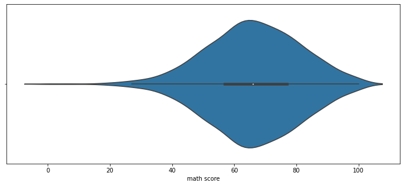

violin plot은 오해가 생기기 충분한 분포 표현 방식입니다.

- 데이터는 연속적이지 않습니다. (kernel density estimate를 사용합니다.)
- 또한 연속적 표현에서 생기는 데이터의 손실과 오차가 존재합니다.
- 데이터의 범위가 없는 데이터까지 표시됩니다.

이런 오해를 줄이고 정보량을 높이는 방법은 다음과 같은 방법이 있습니다.

- `bw` : 분포 표현을 얼마나 자세하게 보여줄 것인가
    - ‘scott’, ‘silverman’, float
- `cut` : 끝부분을 얼마나 자를 것인가?
    - float
- `inner` : 내부를 어떻게 표현할 것인가
    - “box”, “quartile”, “point”, “stick”, None

```python
fig, ax = plt.subplots(1,1, figsize=(12, 5))
sns.violinplot(x='math score', data=student, ax=ax,
               bw=0.1,
               cut=0,
               inner='quartile'
              )
plt.show()
```

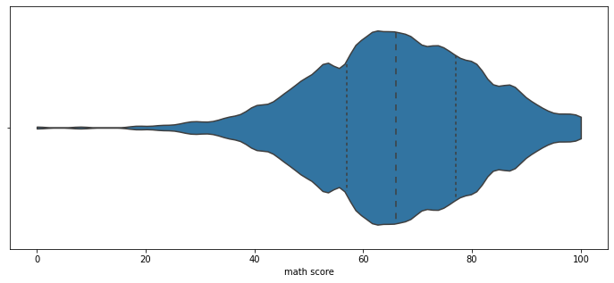

여기서도 적합한 비교를 위해 다양한 변수를 조정할 수 있습니다.

- `scale` : 각 바이올린의 종류
    - “area”, “count”, “width”
- `split` : 동시에 비교


```python
fig, ax = plt.subplots(1,1, figsize=(12, 7))

sns.violinplot(x='race/ethnicity', y='math score', data=student, ax=ax,
               hue='gender', order=sorted(student['race/ethnicity'].unique()),
               palette='Set2', # color palette
               split=True, # 동시에 비교
               scale='count', # violin의 종류
               scale_hue=False,
               inner='quartile', # 내부를 어떻게 표현할 것인가?
               bw=0.2, # Use a narrow bandwidth to reduce the amount of smoothing:
               cut=0.1, # 끝 부분을 얼마나 자를 것인가?
              )
ax.set_axisbelow(True)
ax.grid(axis='y', zorder=0)
ax.legend(loc="lower right", prop={'size': 15})
plt.show()
```

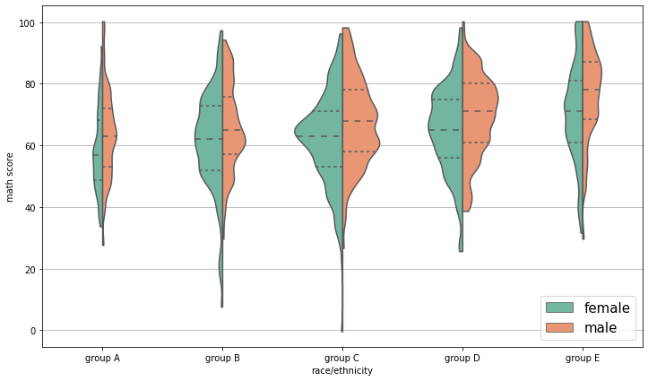

<br/>
<div align="right">
    <b><a href="#4강-통계와-차트">↥ back to top</a></b>
</div>
<br/>

#### ETC

```python
fig, axes = plt.subplots(3,1, figsize=(12, 21))

# Boxenplot
# 일반적으로 사용하진 않음
sns.boxenplot(x='race/ethnicity', y='math score', data=student, ax=axes[0],
              order=sorted(student['race/ethnicity'].unique()),
              palette='Set2',
             )
# Swarmplot
# random sampling을 통해 scatter plot처럼 그려줌
sns.swarmplot(x='race/ethnicity', y='math score', data=student, ax=axes[1],
              order=sorted(student['race/ethnicity'].unique()),
              palette='Set2',
             )
# Stripplot
# 점이 얼마나 밀도있게 뭉쳐있는가를 시각화
sns.stripplot(x='race/ethnicity', y='math score', data=student, ax=axes[2],
              order=sorted(student['race/ethnicity'].unique()),
              palette='Set2',
             )
plt.show()
```

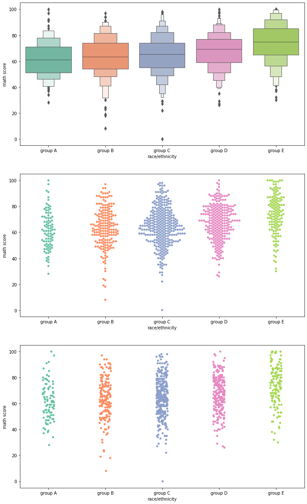

<br/>
<div align="right">
    <b><a href="#4강-통계와-차트">↥ back to top</a></b>
</div>
<br/>

### 4.2.3 Distribution API
범주형/연속형을 모두 살펴볼 수 있는 분포 시각화를 살펴봅시다.

#### Univariate Distribution

- `histplot` : 히스토그램
- `kdeplot` : Kernel Density Estimate
- `ecdfplot` : 누적 밀도 함수
- `rugplot` : 선을 사용한 밀도함수

```python
fig, axes = plt.subplots(2,2, figsize=(12, 10))
axes = axes.flatten()

sns.histplot(x='math score', data=student, ax=axes[0])

sns.kdeplot(x='math score', data=student, ax=axes[1])

sns.ecdfplot(x='math score', data=student, ax=axes[2])

sns.rugplot(x='math score', data=student, ax=axes[3])


plt.show()
```

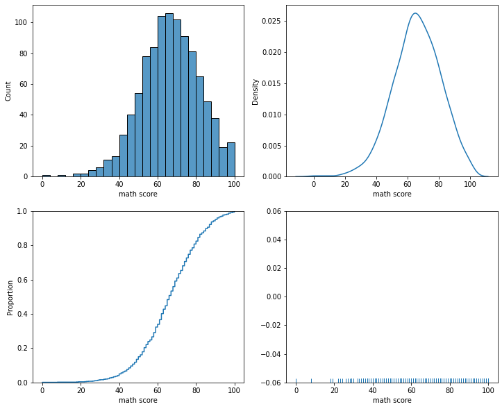

`histplot`부터 살펴보겠습니다.

막대 개수나 간격에 대한 조정은 대표적으로 2가지 파라미터가 있습니다.

- `binwidth`
- `bins`

```python
fig, ax = plt.subplots(figsize=(12, 7))

sns.histplot(x='math score', data=student, ax=ax,
             binwidth=2, # 막대 너비로 조절
            #  bins=25, # 막대 갯수로 조절
             element='poly', # step, poly
             hue='gender',
             multiple='stack', # layer, dodge, stack, fill
            )

ax.set_axisbelow(True)
ax.grid(axis='y', zorder=0)
plt.show()
```

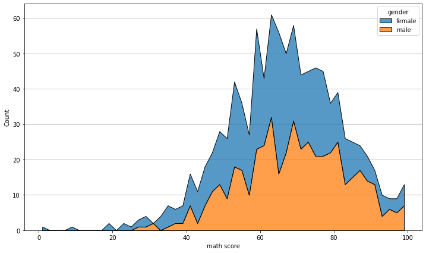

다음은 `Kdeplot`!

```python
fig, ax = plt.subplots(figsize=(12, 7))
sns.kdeplot(x='math score', data=student, ax=ax,
            fill=True,
            hue='race/ethnicity',
            hue_order=sorted(student['race/ethnicity'].unique()),
            palette='Set1',
            multiple="layer", # layer, stack, fill
            # cumulative=True,
            cut=0
           )
plt.show()
```

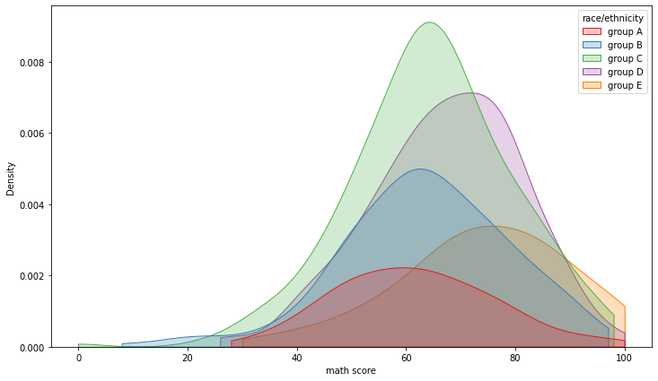

다음은 `ecdfplot`! 많이 사용하진 않음
```python
fig, ax = plt.subplots(figsize=(12, 7))
sns.ecdfplot(x='math score', data=student, ax=ax,
             hue='gender',
             stat='count', # proportion, count
             complementary=False,
            )
plt.show()
```

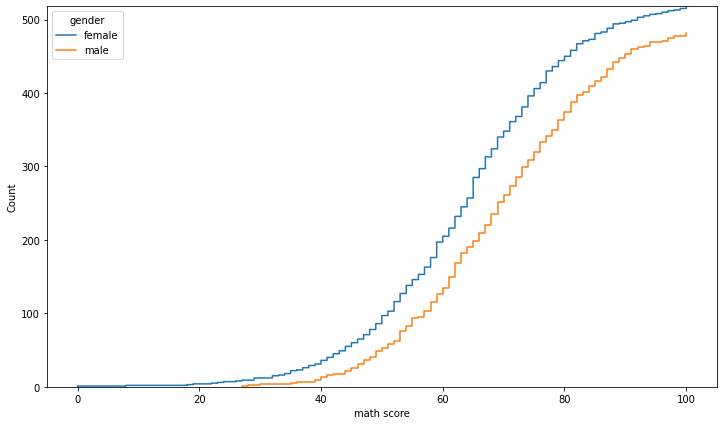


다음은 `rugplot`! 한정된 공간 내에서 분포를 표현하기엔 좋아보이지만... 비추
- 조밀한 정도를 통해 밀도를 나타냄
```python
fig, ax = plt.subplots(figsize=(12, 7))
sns.rugplot(x='math score', data=student, ax=ax)
plt.show()
```

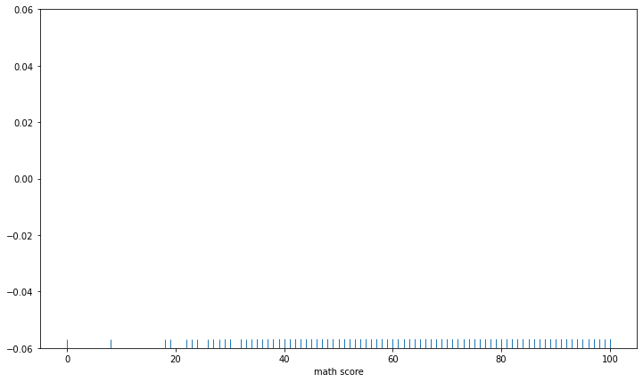

<br/>
<div align="right">
    <b><a href="#4강-통계와-차트">↥ back to top</a></b>
</div>
<br/>

#### Bivariate Distribution

이제는 2개 이상 변수를 동시에 분포를 살펴보도록 하겠습니다.

결합 확률 분포(joint probability distribution)를 살펴 볼 수 있습니다.

함수는 histplot과 kdeplot을 사용하고, 입력에 1개의 축만 넣는 게 아닌 2개의 축 모두 입력을 넣어주는 것이 특징입니다.

```python
fig, axes = plt.subplots(1,2, figsize=(14, 7))
ax.set_aspect(1)

axes[0].scatter(student['math score'], student['reading score'], alpha=0.2)

sns.histplot(x='math score', y='reading score',
             data=student, ax=axes[1],
            #  color='orange',
             cbar=True, # color bar
             bins=(20, 20),
            )

plt.show()
```

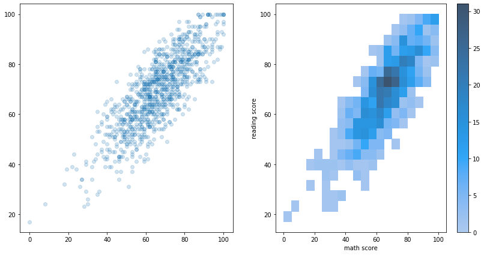

```python
fig, ax = plt.subplots(figsize=(7, 7))
ax.set_aspect(1)

sns.kdeplot(x='math score', y='reading score',
             data=student, ax=ax,
            fill=True,
            bw_method=0.3
            )

ax.set_axisbelow(True)
ax.grid(axis="both")
plt.show()
```

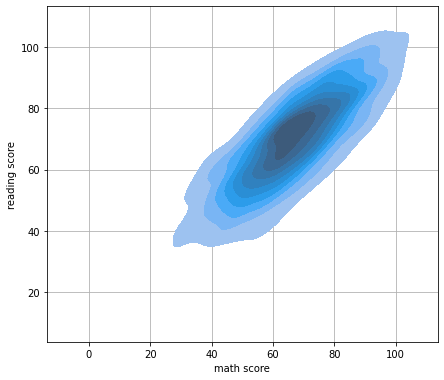

<br/>
<div align="right">
    <b><a href="#4강-통계와-차트">↥ back to top</a></b>
</div>
<br/>

### 4.2.4 Relation & Regression API

#### Scatter Plot
산점도는 다음과 같은 요소를 사용할 수 있습니다.

- `style`
- `hue`
- `size`

앞서 차트의 요소에서 다루었기에 가볍게만 살펴보고 넘어가겠습니다.

`style, hue, size`에 대한 순서는 각각 `style_order, hue_order, size_order`로 전달할 수 있습니다.

```python
fig, ax = plt.subplots(figsize=(7, 7))
sns.scatterplot(x='math score', y='reading score', data=student,
            #    style='gender', markers={'male':'s', 'female':'o'},
                hue='race/ethnicity',
                # size='writing score', # 같이 사용하면 가독성이 떨어짐
               )
plt.show()
```

#### Line Plot


```python
flights = sns.load_dataset("flights")
# 연도, 월 별 탑승객의 수 pivot table
flights_wide = flights.pivot("year", "month", "passengers")

fig, ax = plt.subplots(1, 1, figsize=(12, 7))
sns.lineplot(data=flights, x="year", y="passengers", ax=ax,
              # 아래 주석처리하면 자동으로 평균과 표준편차로 오차범위 시각화 가능
             hue='month',  style='month', markers=True, dashes=False,
             )
plt.show()
```

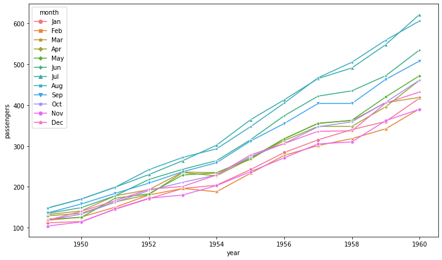

#### Regplot
- 회귀선을 추가한 scatter plot

```python
fig, ax = plt.subplots(figsize=(7, 7))
sns.regplot(x='math score', y='reading score', data=student,
            x_estimator=np.mean, x_bins=20,
            order=2, # order랑 logx는 같이 쓰면 에러남
                     # if sum((order > 1, logistic, robust, lowess, logx)) > 1:
                     # ValueError: Mutually exclusive regression options.
            logx=True,
           )
plt.show()
```

<br/>
<div align="right">
    <b><a href="#4강-통계와-차트">↥ back to top</a></b>
</div>
<br/>

### 4.2.5 Matrix Plot

#### Heatmap
상관관계 시각화에 주로 사용!


이런 상관관계는 다양한 방법이 있는데, pandas에서는 다음과 같은 방법을 제공함

더 자세한 상관관계는 scatter plot과 reg plot으로 살펴보는 것 추천합니다.

|방법|설명|
|-|-|
|Pearson Linear correlation coefficient|모수적 방법(두 변수의 정규성 가정), 연속형 & 연속형 변수 사이의 선형 관계 검정, (-1,1)사이의 값을 가지며 0으로 갈수록 선형 상관관계가 없다는 해석 가능 |
|Spearman Rank-order correlation coefficient|비모수적 방법(정규성 가정 x), 연속형 & 연속형 변수 사이의 단조 관계 검정, 값에 순위를 매셔 순위에 대한 상관성을 계수로 표현 - 연속형 변수가 아닌 순서형 변수에도 사용 가능 단조성(monotonicity) 평가 - 곡선 관계도 가능|
|kendall Rank-order correlation coefficient|비모수적 방법(정규성 가정 x), 연속형 & 연속형 변수 사이의 단조 관계 검정, 값에 순위를 매셔 순위에 대한 상관성을 계수로 표현함 - 연속형 변수가 아닌 순서형 변수에도 사용 가능 단조성(monotonicity) 평가. 일반적으로 Spearman의 rho 상관 관계보다 값이 작다. 일치/불일치 쌍을 기반으로 계산하며 오류에 덜 민감|

```python
heart = pd.read_csv('./heart.csv')
heart.head()
```

|   | age | sex | cp | trestbps | chol | fbs | restecg | thalach | exang | oldpeak | slope | ca | thal | target |
|--:|----:|----:|---:|---------:|-----:|----:|--------:|--------:|------:|--------:|------:|---:|-----:|-------:|
| 0 |  63 |   1 |  3 |      145 |  233 |   1 |       0 |     150 |     0 |     2.3 |     0 |  0 |    1 |      1 |
| 1 |  37 |   1 |  2 |      130 |  250 |   0 |       1 |     187 |     0 |     3.5 |     0 |  0 |    2 |      1 |
| 2 |  41 |   0 |  1 |      130 |  204 |   0 |       0 |     172 |     0 |     1.4 |     2 |  0 |    2 |      1 |
| 3 |  56 |   1 |  1 |      120 |  236 |   0 |       1 |     178 |     0 |     0.8 |     2 |  0 |    2 |      1 |
| 4 |  57 |   0 |  0 |      120 |  354 |   0 |       1 |     163 |     1 |     0.6 |     2 |  0 |    2 |      1 |

```python
heart.corr()
```

|      age |       sex |        cp |  trestbps |      chol |       fbs |   restecg |   thalach |     exang |   oldpeak |     slope |        ca |      thal |    target |    target |
|---------:|----------:|----------:|----------:|----------:|----------:|----------:|----------:|----------:|----------:|----------:|----------:|----------:|----------:|----------:|
|    age   |  1.000000 | -0.098447 | -0.068653 |  0.279351 |  0.213678 |  0.121308 | -0.116211 | -0.398522 |  0.096801 |  0.210013 | -0.168814 |  0.276326 |  0.068001 | -0.225439 |
|    sex   | -0.098447 |  1.000000 | -0.049353 | -0.056769 | -0.197912 |  0.045032 | -0.058196 | -0.044020 |  0.141664 |  0.096093 | -0.030711 |  0.118261 |  0.210041 | -0.280937 |
|    cp    | -0.068653 | -0.049353 |  1.000000 |  0.047608 | -0.076904 |  0.094444 |  0.044421 |  0.295762 | -0.394280 | -0.149230 |  0.119717 | -0.181053 | -0.161736 |  0.433798 |
| trestbps |  0.279351 | -0.056769 |  0.047608 |  1.000000 |  0.123174 |  0.177531 | -0.114103 | -0.046698 |  0.067616 |  0.193216 | -0.121475 |  0.101389 |  0.062210 | -0.144931 |
|   chol   |  0.213678 | -0.197912 | -0.076904 |  0.123174 |  1.000000 |  0.013294 | -0.151040 | -0.009940 |  0.067023 |  0.053952 | -0.004038 |  0.070511 |  0.098803 | -0.085239 |
|    fbs   |  0.121308 |  0.045032 |  0.094444 |  0.177531 |  0.013294 |  1.000000 | -0.084189 | -0.008567 |  0.025665 |  0.005747 | -0.059894 |  0.137979 | -0.032019 | -0.028046 |
|  restecg | -0.116211 | -0.058196 |  0.044421 | -0.114103 | -0.151040 | -0.084189 |  1.000000 |  0.044123 | -0.070733 | -0.058770 |  0.093045 | -0.072042 | -0.011981 |  0.137230 |
|  thalach | -0.398522 | -0.044020 |  0.295762 | -0.046698 | -0.009940 | -0.008567 |  0.044123 |  1.000000 | -0.378812 | -0.344187 |  0.386784 | -0.213177 | -0.096439 |  0.421741 |
|   exang  |  0.096801 |  0.141664 | -0.394280 |  0.067616 |  0.067023 |  0.025665 | -0.070733 | -0.378812 |  1.000000 |  0.288223 | -0.257748 |  0.115739 |  0.206754 | -0.436757 |
|  oldpeak |  0.210013 |  0.096093 | -0.149230 |  0.193216 |  0.053952 |  0.005747 | -0.058770 | -0.344187 |  0.288223 |  1.000000 | -0.577537 |  0.222682 |  0.210244 | -0.430696 |
|   slope  | -0.168814 | -0.030711 |  0.119717 | -0.121475 | -0.004038 | -0.059894 |  0.093045 |  0.386784 | -0.257748 | -0.577537 |  1.000000 | -0.080155 | -0.104764 |  0.345877 |
|    ca    |  0.276326 |  0.118261 | -0.181053 |  0.101389 |  0.070511 |  0.137979 | -0.072042 | -0.213177 |  0.115739 |  0.222682 | -0.080155 |  1.000000 |  0.151832 | -0.391724 |
|   thal   |  0.068001 |  0.210041 | -0.161736 |  0.062210 |  0.098803 | -0.032019 | -0.011981 | -0.096439 |  0.206754 |  0.210244 | -0.104764 |  0.151832 |  1.000000 | -0.344029 |
|  target  | -0.225439 | -0.280937 |  0.433798 | -0.144931 | -0.085239 | -0.028046 |  0.137230 |  0.421741 | -0.436757 | -0.430696 |  0.345877 | -0.391724 | -0.344029 |  1.000000 |

```python
fig, ax = plt.subplots(1,1 ,figsize=(7, 6))
sns.heatmap(heart.corr(), ax=ax)
plt.show()
```

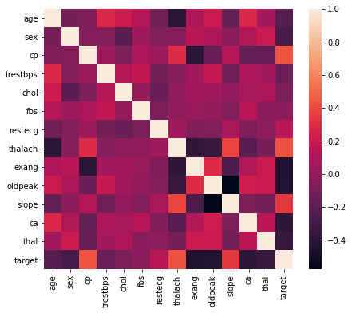

상관계수는 -1~1까지이므로 색의 범위를 맞추기 위해 `vmin`과 `vmax`로 범위를 조정합니다.

0을 기준으로 음/양이 중요하므로 `center`를 지정해줄 수도 있습니다.

`cmap`을 바꿔 가독성을 높여보겠습니다. 여기서는 음/양이 정반대의 의미를 가지니 diverse colormap인 coolwarm을 사용해보았습니다.

`annot`와 `fmt`를 사용하면 실제 값에 들어갈 내용을 작성할 수 있습니다.

`linewidth`를 사용하여 칸 사이를 나눌 수도 있습니다.

그리고 `square`를 사용하여 정사각형을 사용할 수도 있습니다.

```python
fig, ax = plt.subplots(1,1 ,figsize=(12, 9))
sns.heatmap(heart.corr(), ax=ax,
           vmin=-1, vmax=1, center=0,
            cmap='coolwarm',
            annot=True, fmt='.2f',
            linewidth=0.1, square=True
           )
plt.show()
```

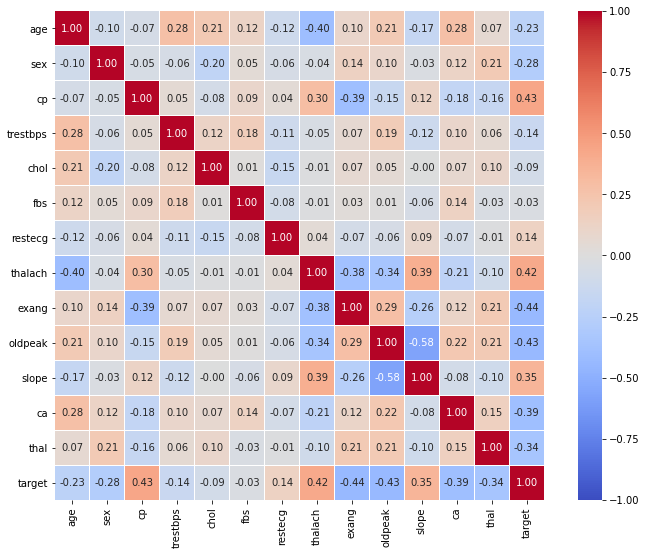

대칭일 경우 아래 코드로 필요없는 부분 지울 수 있음!

```python
fig, ax = plt.subplots(1,1 ,figsize=(10, 9))

mask = np.zeros_like(heart.corr())
mask[np.triu_indices_from(mask)] = True

sns.heatmap(heart.corr(), ax=ax,
           vmin=-1, vmax=1, center=0,
            cmap='coolwarm',
            annot=True, fmt='.2f',
            linewidth=0.1, square=True, cbar=False,
            mask=mask
           )
plt.show()
```

<br/>
<div align="right">
    <b><a href="#4강-통계와-차트">↥ back to top</a></b>
</div>
<br/>

## 4.3 Seaborn 심화
여러 차트의 정보량을 향상 시키는 방법에 대해 학습

### 4.3.1 Joint Plot
- distribution api의 두 feature의 결합 확률 분포와 각각의 분포를 함께 살필 수 있는 시각화 제공
- joint_kws, marginal_kws로 여러 config 전달할 수 있을 것 같은데, 에러가 좀 많네
- 겹치는 부분 조절이 필요할 땐 어떻게 해야할까?

```python
sns.jointplot(x='math score', y='reading score',data=student,
              hue='gender',
              kind='hist', # { “scatter” | “kde” | “hist” | “hex” | “reg” | “resid” },
            #   fill=True # kde일 때!
              alpha=0.7,
            #   joint_kws={'hist_kws':dict(alpha=0.5)},
              marginal_kws={'hist_kws': {'alpha': 0.1}}
             )
```

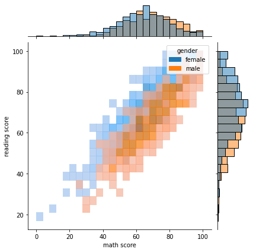

<br/>
<div align="right">
    <b><a href="#4강-통계와-차트">↥ back to top</a></b>
</div>
<br/>

### 4.3.2 Pair Plot
- 데이터셋의 pair-wise 관계를 시각화

```python
iris.head()
```
|   | Id | SepalLengthCm | SepalWidthCm | PetalLengthCm | PetalWidthCm |     Species |
|--:|---:|--------------:|-------------:|--------------:|-------------:|------------:|
| 0 |  1 |           5.1 |          3.5 |           1.4 |          0.2 | Iris-setosa |
| 1 |  2 |           4.9 |          3.0 |           1.4 |          0.2 | Iris-setosa |
| 2 |  3 |           4.7 |          3.2 |           1.3 |          0.2 | Iris-setosa |
| 3 |  4 |           4.6 |          3.1 |           1.5 |          0.2 | Iris-setosa |
| 4 |  5 |           5.0 |          3.6 |           1.4 |          0.2 | Iris-setosa |

```python
sns.pairplot(data=iris)
```

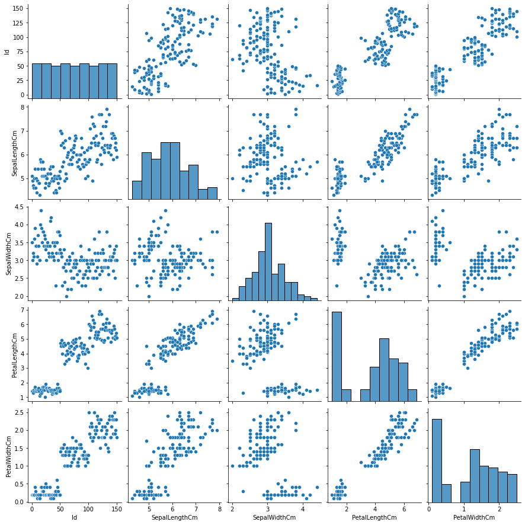

```python
sns.pairplot(data=iris, hue='Species')
```

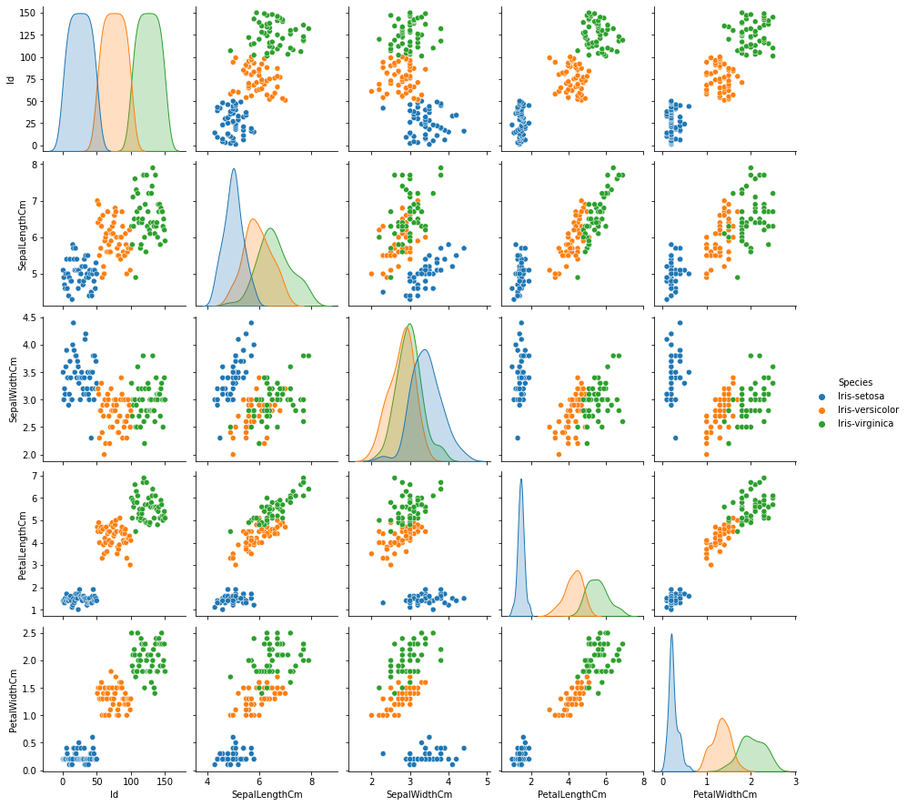

2가지 변수를 사용하여 시각화 방법을 조정할 수 있습니다.

`kind`는 전체 서브플롯, `diag_kind`는 대각 서브플롯을 조정합니다.

- `kind` : {‘scatter’, ‘kde’, ‘hist’, ‘reg’}
- `diag_kind` : {‘auto’, ‘hist’, ‘kde’, None}

```python
sns.pairplot(data=iris, hue='Species', kind='hist', corner=True)
```

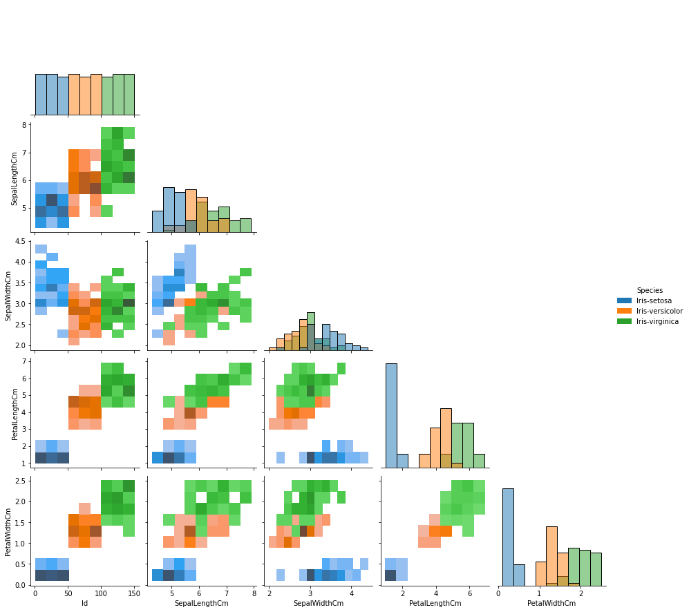

<br/>
<div align="right">
    <b><a href="#4강-통계와-차트">↥ back to top</a></b>
</div>
<br/>

### 4.3.3 Facet Grid 사용하기

pairplot과 같이 다중 패널을 사용하는 시각화를 의미합니다.

다만 pairplot은 feature-feature 사이를 살폈다면, Facet Grid는 feature-feature 뿐만이 아니라 feature's category-feature's category의 관계도 살펴볼 수 있습니다.

단일 시각화도 가능하지만, 여기서는 최대한 여러 pair를 보며 관계를 살피는 것을 위주로 보면 좋습니다.

총 4개의 큰 함수가 Facet Grid를 기반으로 만들어졌습니다.

- `catplot` : Categorical
- `displot` : Distribution
- `relplot` : Relational
- `lmplot` : Regression

#### catplot: Categorical
이미 수 많은 방법을 앞에서 살펴보았기에 각각에 대한 설명은 생략하도록 하겠습니다.
`catplot`은 다음 방법론을 사용할 수 있습니다.

- Categorical scatterplots:
    - `stripplot()` (with `kind="strip"`; the default)
    - `swarmplot()` (with `kind="swarm"`)

- Categorical distribution plots:
    - `boxplot()` (with `kind="box"`)
    - `violinplot()` (with `kind="violin"`)
    - `boxenplot()` (with `kind="boxen"`)

- Categorical estimate plots:
    - `pointplot()` (with `kind="point"`)
    - `barplot()` (with `kind="bar"`)
    - `countplot()` (with `kind="count"`)

```python
student.head()
```

| gender | race/ethnicity | parental level of education |              lunch | test preparation course | math score | reading score | writing score |    |
|-------:|---------------:|----------------------------:|-------------------:|------------------------:|-----------:|--------------:|--------------:|----|
|    0   |         female |                     group B |  bachelor's degree |                standard |       none |            72 |            72 | 74 |
|    1   |         female |                     group C |       some college |                standard |  completed |            69 |            90 | 88 |
|    2   |         female |                     group B |    master's degree |                standard |       none |            90 |            95 | 93 |
|    3   |           male |                     group A | associate's degree |            free/reduced |       none |            47 |            57 | 44 |
|    4   |           male |                     group C |       some college |                standard |       none |            76 |            78 | 75 |

기본은 `stripplot`
```python
sns.catplot(x="race/ethnicity", y="math score", hue="gender", data=student)
```

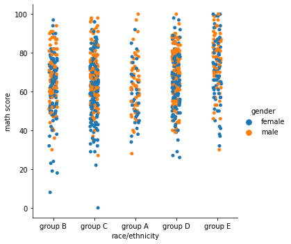

다른 plot도 사용할 수 있고, FacetGrid는 행과 열을 조정하는 것이 중요함!
```python
sns.catplot(x="race/ethnicity", y="math score", hue="gender", data=student,
            kind='box', col='lunch', row='test preparation course'
           )
```

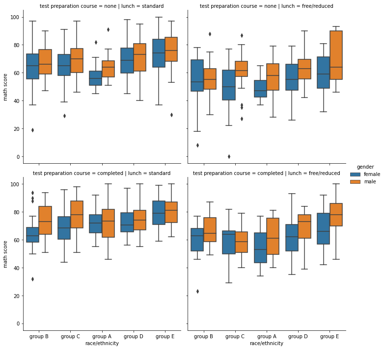

#### displot: Distribution
- `histplot()` (with `kind="hist"`; the default)
- `kdeplot()` (with `kind="kde"`)
- `ecdfplot()` (with `kind="ecdf"`; univariate-only)

```python
sns.displot(x="math score", hue="gender", data=student,
           col='race/ethnicity', # kind='kde', fill=True
            col_order=sorted(student['race/ethnicity'].unique())
           )
```

#### replot: Relation

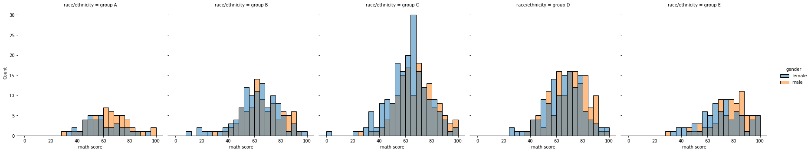

```python
sns.relplot(x="math score", y='reading score', hue="gender", data=student,
           col='lunch')
```

#### lmplot: Regression

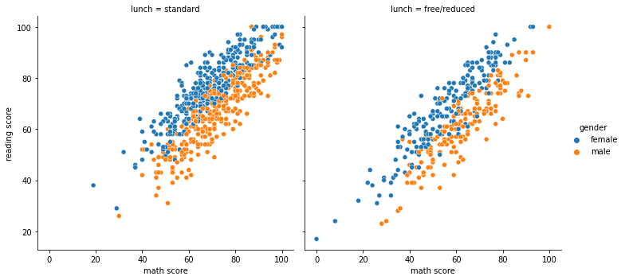

```python
sns.lmplot(x="math score", y='reading score', hue="gender", data=student)
```

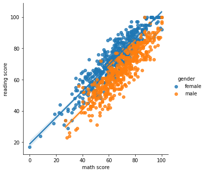

<br/>
<div align="right">
    <b><a href="#4강-통계와-차트">↥ back to top</a></b>
</div>
<br/>


### Further Reading
- [Journal - seaborn: statistical data visualization](https://joss.theoj.org/papers/10.21105/joss.03021)
- [Seaborn API Docs](https://seaborn.pydata.org/api.html)
- [Example Gallery](https://seaborn.pydata.org/examples/index.html)


<br/>
<div align="right">
    <b><a href="#4강-통계와-차트">↥ back to top</a></b>
</div>
<br/>
