# 5강 다양한 시각화 방법론
 Seaborn 라이브러리와 통계학적인 테크닉에 대해 알아봅니다.

[back to super](https://github.com/jinmang2/boostcamp_ai_tech_2/tree/main/s-stage/data_viz)

<details open="open">
  <summary>Table of Contents</summary>
  <ul>
    <li>
      <a href="#51-polar-coordinate">5.1 Polar Coordinate</a>
    </li>
    <ul>
      <li><a href="#511-polar-plot">5.1.1 Polar Plot</a></li>
      <li><a href="#512-radar-plot">5.1.2 Radar Plot</a></li>
    </ul>
    <li>
      <a href="#52-pie-charts">5.2 Pie Charts</a>
    </li>
    <ul>
      <li><a href="#521-pie-chart">5.2.1 Pie Chart</a></li>
      <li><a href="#522-pie-chart-응용">5.2.2 Pie Chart 응용</a></li>
    </ul>
    <li>
      <a href="#53-다양한-시각화-라이브러리">5.3 다양한 시각화 라이브러리</a>
    </li>
    <ul>
      <li><a href="#531-missingno">5.3.1 Missingno</a></li>
      <li><a href="#532-treemap">5.3.2 Treemap</a></li>
      <li><a href="#533-waffle-chart">5.3.3 Waffle Chart</a></li>
      <li><a href="#534-venn">5.3.4 Venn</a></li>
    </ul>
    <li>
      <a href="#further-reading">Further Reading</a>
    </li>
  </ul>
</details>

## 5.1 Polar Coordinate

### 5.1.1 Polar Plot
- 극 좌표계(Polar Coordinate)를 사용하는 시각
    - 거리(R), 각(Theta)를 사용하여 Plot
- 회전, 주기성 등을 표현하기에 적합
- `projection=polar`을 추가하여 사용
- 해당 그래프는 Scatter
    - Line, Bar 모두 사용 가능

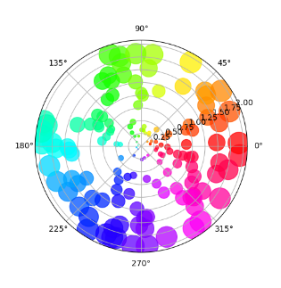

- Matplotlib 공식 로고도 그릴 수 있음
- https://matplotlib.org/stable/gallery/misc/logos2.html

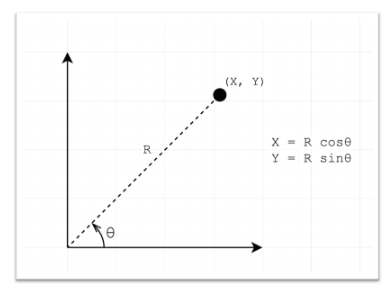

- 우리가 앞서 사용한 방식! (Grid 등)
- 직교 좌표계 X, Y에서 변환 가능

<br/>
<div align="right">
    <b><a href="#5강-다양한-시각화-방법론">↥ back to top</a></b>
</div>
<br/>

### Code 실습

#### Polar Coordinate 만들기

```python
import numpy as np
import pandas as pd
import matplotlib as mpl
import matplotlib.pyplot as plt

fig = plt.figure()
ax = fig.add_subplot(111, projection='polar')
# ax = fig.add_subplot(111, polar=True)
plt.show()
```

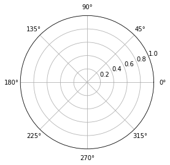

#### Polar Coordinate 조정하기

```python
fig = plt.figure()
ax = fig.add_subplot(111, polar=True)

ax.set_rmax(2)
# ax.set_rmin(1) # 반지름 조정 -> 시작점 조정
ax.set_rticks([1, 1.5, 2]) # 원하는 간격으로 labeling
ax.set_rlabel_position(-90) # 반지름 label 위치 각도 조잘
ax.set_thetamin(45) # 각도의 min값
ax.set_thetamax(135) # 각도의 max값

plt.show()
```

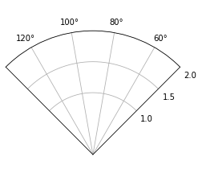

#### Polar 기본 차트
- scatter
```python
np.random.seed(19680801)

N = 100
r = 2 * np.random.rand(N)
theta = 2 * np.pi * np.random.rand(N)
area = 200 * r**2
colors = theta

fig = plt.figure()
ax = fig.add_subplot(111, projection='polar')
c = ax.scatter(theta, r, c=colors, s=area, cmap='hsv', alpha=0.75)
plt.show()
```

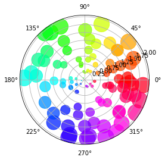

- bar
```python
np.random.seed(19680801)

N = 6
r = np.random.rand(N)
theta = np.linspace(0, 2*np.pi, N, endpoint=False)

fig = plt.figure()
ax = fig.add_subplot(111, projection='polar')
ax.bar(theta, r, width=0.5, alpha=0.5)
plt.show()
```

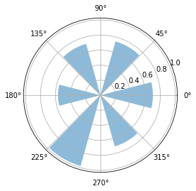

- plot
```python
np.random.seed(19680801)

N = 1000
r = np.linspace(0, 1, N)
theta = np.linspace(0, 2*np.pi, N)

fig = plt.figure()
ax = fig.add_subplot(111, projection='polar')
ax.plot(theta, r)

plt.show()
```

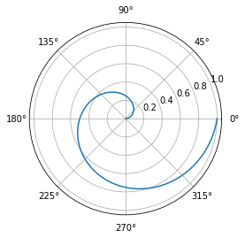

- fill
```python
np.random.seed(19680801)

N = 1000
r = np.linspace(0, 1, N)
theta = np.linspace(0, 2*np.pi, N)

fig = plt.figure()
ax = fig.add_subplot(111, projection='polar')
ax.fill(theta, r)
plt.show()
```

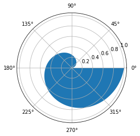


<br/>
<div align="right">
    <b><a href="#5강-다양한-시각화-방법론">↥ back to top</a></b>
</div>
<br/>

### 5.1.2 Radar Plot
- 극좌표계를 사용하는 대표적인 차트
- 별 모양으로 생겨 Star Plot으로 불리기도 함
- 중심점을 기준으로 N개의 변수 값을 표현할 수 있음
- 데이터의 Quality를 표현하기에 좋음

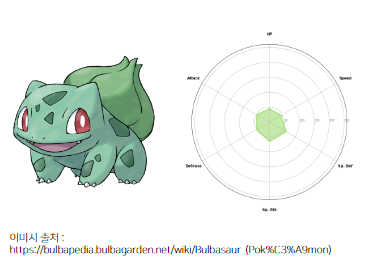

#### 주의점!
- 각 feature는 독립적, 척도가 같아야 함
- 아래는 다각형의 면적이 중요해보이지만 feature의 순서에 따라 많이 달라짐

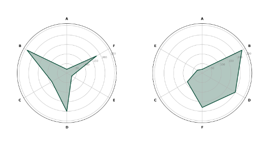

- feature를 많이 추가할 수록 지저분해짐

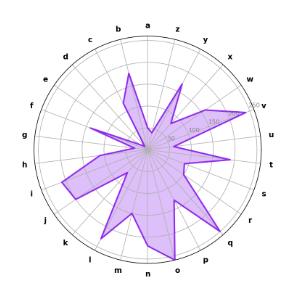

<br/>
<div align="right">
    <b><a href="#5강-다양한-시각화-방법론">↥ back to top</a></b>
</div>
<br/>

### Code 실습

#### Radar Chart 기본 툴 구성

```python
# from kaggle
pokemon = pd.read_csv('./pokemon.csv')
pokemon.head()
```

|   | # |                  Name | Type 1 | Type 2 | Total | HP | Attack | Defense | Sp. Atk | Sp. Def | Speed | Generation | Legendary |
|--:|--:|----------------------:|-------:|-------:|------:|---:|-------:|--------:|--------:|--------:|------:|-----------:|----------:|
| 0 | 1 |             Bulbasaur |  Grass | Poison |   318 | 45 |     49 |      49 |      65 |      65 |    45 |          1 |     False |
| 1 | 2 |               Ivysaur |  Grass | Poison |   405 | 60 |     62 |      63 |      80 |      80 |    60 |          1 |     False |
| 2 | 3 |              Venusaur |  Grass | Poison |   525 | 80 |     82 |      83 |     100 |     100 |    80 |          1 |     False |
| 3 | 3 | VenusaurMega Venusaur |  Grass | Poison |   625 | 80 |    100 |     123 |     122 |     120 |    80 |          1 |     False |
| 4 | 4 |            Charmander |   Fire |    NaN |   309 | 39 |     52 |      43 |      60 |      50 |    65 |          1 |     False |

```python
pokemon.describe()
```

|       |          # |     Total |         HP |     Attack |    Defense |    Sp. Atk |    Sp. Def |      Speed | Generation | Sp. Def | Speed | Generation | Legendary |
|------:|-----------:|----------:|-----------:|-----------:|-----------:|-----------:|-----------:|-----------:|-----------:|--------:|------:|-----------:|----------:|
| count | 800.000000 | 800.00000 | 800.000000 | 800.000000 | 800.000000 | 800.000000 | 800.000000 | 800.000000 |  800.00000 |      65 |    45 |          1 |     False |
|  mean | 362.813750 | 435.10250 |  69.258750 |  79.001250 |  73.842500 |  72.820000 |  71.902500 |  68.277500 |    3.32375 |      80 |    60 |          1 |     False |
|  std  | 208.343798 | 119.96304 |  25.534669 |  32.457366 |  31.183501 |  32.722294 |  27.828916 |  29.060474 |    1.66129 |     100 |    80 |          1 |     False |
|  min  |   1.000000 | 180.00000 |   1.000000 |   5.000000 |   5.000000 |  10.000000 |  20.000000 |   5.000000 |    1.00000 |     120 |    80 |          1 |     False |
|  25%  | 184.750000 | 330.00000 |  50.000000 |  55.000000 |  50.000000 |  49.750000 |  50.000000 |  45.000000 |    2.00000 |      50 |    65 |          1 |     False |
|  50%  | 364.500000 | 450.00000 |  65.000000 |  75.000000 |  70.000000 |  65.000000 |  70.000000 |  65.000000 |    3.00000 |         |       |            |           |
|  75%  | 539.250000 | 515.00000 |  80.000000 | 100.000000 |  90.000000 |  95.000000 |  90.000000 |  90.000000 |    5.00000 |         |       |            |           |
|  max  | 721.000000 | 780.00000 | 255.000000 | 190.000000 | 230.000000 | 194.000000 | 230.000000 | 180.000000 |    6.00000 |         |       |            |           |

```python
stats = ["HP", "Attack", "Defense", "Sp. Atk", "Sp. Def", "Speed"]
# [45, 49, 49, 65, 65, 45]
values = pokemon.iloc[0][stats].to_list()
# [0., 1.04719755, 2.0943951, 3.14159265, 4.1887902, 5.23598776]
theta = np.linspace(0, 2*np.pi, 6, endpoint=False)

fig = plt.figure()
ax = fig.add_subplot(111, projection='polar')

# 끝 점을 더해줘야 완벽하게 그려줌
values.append(values[0])
theta = theta.tolist() + [theta[0]]

ax.plot(theta, values)
ax.fill(theta, values, alpha=0.5)

plt.show()
```

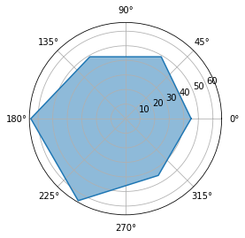

#### 커스텀 및 조정

```python
# 각도에 따른 grid 및 ticklabels 변경
ax.set_thetagrids([n*60 for n in range(6)], stats)
# 시작 각도 변경
ax.set_theta_offset(np.pi/2)
```

3개의 순차적 데이터를 비교

```python
fig = plt.figure(figsize=(14, 4))

for idx in range(3):
    ax = fig.add_subplot(1,3,idx+1, projection='polar')

    values = pokemon.iloc[idx][stats].to_list()
    values.append(values[0])


    ax.plot(theta, values, color='forestgreen')
    ax.fill(theta, values, color='forestgreen', alpha=0.3)

    ax.set_rmax(100)
    ax.set_thetagrids([n*60 for n in range(6)], stats)
    ax.set_theta_offset(np.pi/2)

plt.show()
```

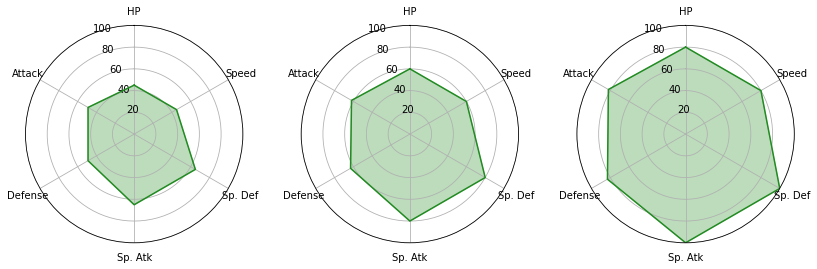

```python
fig = plt.figure(figsize=(7, 7))

ax = fig.add_subplot(111, projection='polar')

for idx in range(3):


    values = pokemon.iloc[idx][stats].to_list()
    values.append(values[0])

    ax.plot(theta, values, color='forestgreen')
    ax.fill(theta, values, color='forestgreen', alpha=0.3)

ax.set_rmax(110)
ax.set_thetagrids([n*60 for n in range(6)], stats)
ax.set_theta_offset(np.pi/2)

plt.show()
```

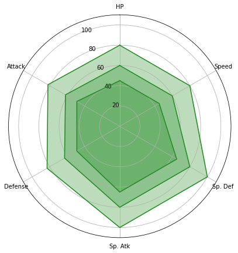


<br/>
<div align="right">
    <b><a href="#5강-다양한-시각화-방법론">↥ back to top</a></b>
</div>
<br/>


## 5.2 Pie Charts
- 이거는 Level1의 결과물을 기록할 때 이미 사용한 바가 있음!

### 5.2.1 Pie Chart
- 원꼴 부채꼴로 분할하여 표현하는 통계 차트
- 가장 많이 사용하는 차트지만... 지양
    - 비교가 어렵고
    - 유용성이 떨어짐
    - bar plot이 더 유용함
    - 후에 waffle chart가 더 비교에 유용

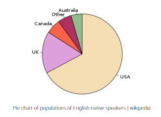

### 5.2.2 Pie Chart 응용
**Donut Chart**
- 중간이 비어있는 Pie Chart
    - 디자인적으로 선호
    - 인포그래픽에서 종종 사용
    - Plotly에서 쉽게 사용 가능

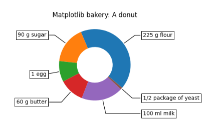

**Sunburst Chart**
- 햇살(sunburst)을 닮은 차트
- 계층적 데이터를 시각화하는 데 사용
    - 구현 난이도에 비해 화려하다는 장점
    - 오히려 Treemap을 추천
    - Plotly로 쉽게 사용 가능

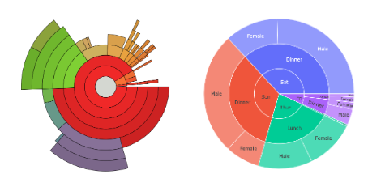

<br/>
<div align="right">
    <b><a href="#5강-다양한-시각화-방법론">↥ back to top</a></b>
</div>
<br/>

## 5.3 다양한 시각화 라이브러리

### 5.3.1 Missingno
- 결측치를 시각화하는 Missingno
- `pip install missingno`

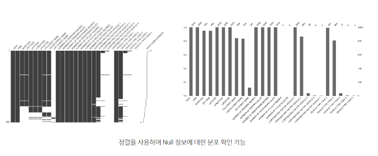

#### Code
```python
import numpy as np
import matplotlib as mpl
import matplotlib.pyplot as plt
import seaborn as sns

import missingno as msno


titanic = sns.load_dataset('titanic')
msno.matrix(titanic,
            sort='descending', # ascending
           )
```

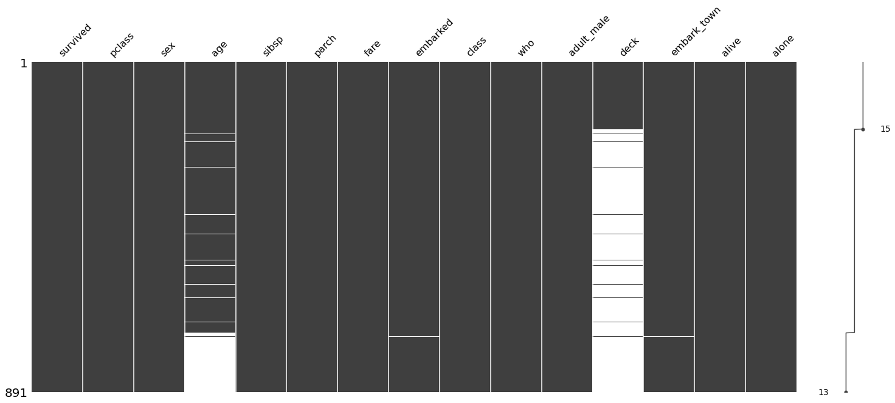

```python
msno.bar(titanic)
```

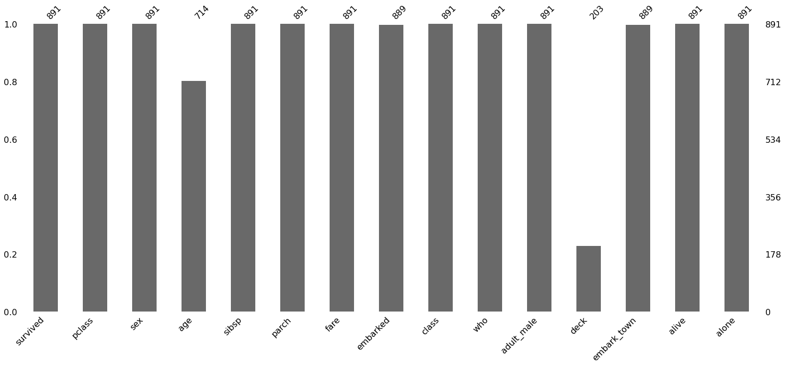

<br/>
<div align="right">
    <b><a href="#5강-다양한-시각화-방법론">↥ back to top</a></b>
</div>
<br/>


### 5.3.2 Treemap
- 계층적 데이터를 직사각형을 사용하여 포함 관계를 표현한 시각화 방법
- 사각형을 분할하는 타일링 알고리즘에 따라 형태가 다양
- 큰 사각형을 분할하여 전체를 나타내는 **모자이크 플롯(Mosaic Plot)**과도 유사
- `pip install squarify`
- `plotly`의 treemap 사용

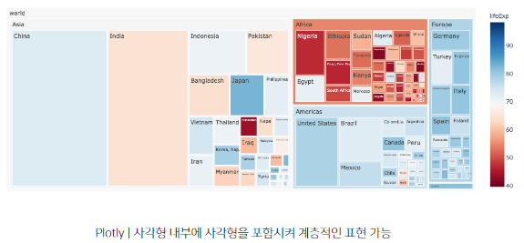

#### Code
```python
import squarify
import matplotlib.pyplot as plt


fig, ax = plt.subplots()
values = [100, 200, 300, 400]
label = list('ABCD')
color = ['#4285F4', '#DB4437', '#F4B400', '#0F9D58']

squarify.plot(values, label=label, color=color, pad=0.2,
               text_kwargs={'color':'white', 'weight':'bold'}, ax=ax)

ax.axis('off')
plt.show()
```

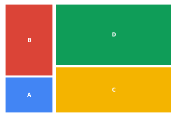

<br/>
<div align="right">
    <b><a href="#5강-다양한-시각화-방법론">↥ back to top</a></b>
</div>
<br/>

### 5.3.3 Waffle Chart
- 좀 더 특별한 시각화를 원한다면?
- 와플 형태로 discrete하게 값을 나타내는 차트
    - 기본적인 형태는 정사각형이나 원하는 벡터 이미지로 사용 가능
- `pip install pywaffle`

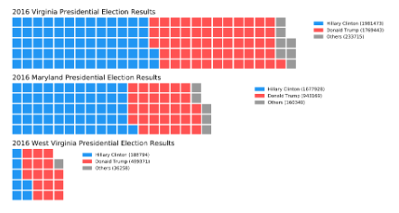

- Icon을 활용할 수도 있음


#### code

```python
from pywaffle import Waffle
import matplotlib.pyplot as plt


data = {'A': 50, 'B': 45, 'C': 15}

fig = plt.figure(
    FigureClass=Waffle,
    rows=5,
    values=data,
    # cmap_name='tab10'
    colors=["#232066", "#983D3D", "#DCB732"],
    legend={'loc': 'lower left', 'bbox_to_anchor': (0, -0.4), 'ncol': len(data), 'framealpha': 0},
    starting_location='SE', # NW, SW, NE and SE
    # vertical=True,
    block_arranging_style='snake', # new-line, snake
)

plt.show()
```

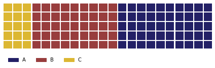

- [Font Awesome의 Icon](https://fontawesome.com/)도 사용 가능!

```python
fig = plt.figure(
    FigureClass=Waffle,
    rows=10,     
    values=data,
    legend={'loc': 'lower left', 'bbox_to_anchor': (0, -0.4), 'ncol': len(data), 'framealpha': 0},
    icons='child',
    icon_legend=True,
    font_size=15,
)
plt.show()
```

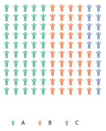

<br/>
<div align="right">
    <b><a href="#5강-다양한-시각화-방법론">↥ back to top</a></b>
</div>
<br/>

### 5.3.4 Venn
- 벤 다이어그램!
    - EDA보다는 출판 및 PPT에 사용
    - 디테일한 사용이 draw.io나 ppt에 비해 어려움
- `pip install pyvenn`
- `pip install matplotlib-venn`

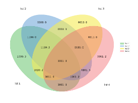

#### Code
```python
from matplotlib_venn import venn2

set1 = set(['A', 'B', 'C', 'D'])
set2 = set(['B', 'C', 'D', 'E'])
set3 = set(['C', 'D',' E', 'F', 'G'])

venn3([set1, set2, set3], ('Set1', 'Set2', 'Set3'))
plt.show()
```

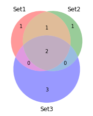

<br/>
<div align="right">
    <b><a href="#5강-다양한-시각화-방법론">↥ back to top</a></b>
</div>
<br/>


## Further Reading
- [projection api](https://matplotlib.org/stable/api/projections_api.html)
- [Radar Chart](https://matplotlib.org/stable/gallery/specialty_plots/radar_chart.html)
- [Pie Chart in Matplotlib](https://matplotlib.org/stable/api/_as_gen/matplotlib.pyplot.pie.html#matplotlib.pyplot.pie)
- [Multiple Pie Charts: Unreadable, Inefficient, and Over-Used](https://www.readcube.com/articles/10.3138%2Fjsp.46.3.05)
- [Pie Chart 대체 예제](https://funnel.io/blog/why-we-dont-use-pie-charts-and-some-tips-on-better-data-visualizations)
- [missingno](https://github.com/ResidentMario/missingno)
- [squarify](https://github.com/laserson/squarify)
- [History of Treeviews](http://www.cs.umd.edu/hcil/treemap-history/index.shtml)
- [PyWaffle](https://pywaffle.readthedocs.io/en/latest/)
- [pyvenn](https://github.com/tctianchi/pyvenn)

<br/>
<div align="right">
    <b><a href="#5강-다양한-시각화-방법론">↥ back to top</a></b>
</div>
<br/>
