# 6강 Interactive Visualization
인터랙티브를 사용해야 하는 이유와 간단한 라이브러리 사용법을 소개합니다.

[back to super](https://github.com/jinmang2/boostcamp_ai_tech_2/tree/main/s-stage/data_viz)

<details open="open">
  <summary>Table of Contents</summary>
  <ul>
    <li>
      <a href="#61-interactive-visualization">6.1 Interactive Visualization</a>
    </li>
    <ul>
      <li><a href="#611-interactive를-사용하는-이유">6.1.1 Interactive를 사용하는 이유</a></li>
      <li><a href="#612-interactive-viz-library">6.1.2 Interactive Viz Library</a></li>
    </ul>
    <li>
      <a href="#62-interactive-visualization-실습">6.2 Interactive Visualization 실습</a>
    </li>
    <ul>
      <li><a href="#621-install-plotly">6.2.1 Install Plotly</a></li>
      <li><a href="#622-scatter-bar-line">6.2.2 Scatter, Bar, Line</a></li>
      <li><a href="#623-다양한-차트">6.2.3 다양한 차트</a></li>
    </ul>
    <li>
      <a href="#further-reading">Further Reading</a>
    </li>
  </ul>
</details>

## 6.1 Interactive Visualization

### 6.1.1 Interactive를 사용하는 이유

#### 정적 시각화의 단점

정형 데이터에서 Feature가 10개 있다면?
- 각각 살펴보는데 10개의 plot
- 각각의 관계를 살펴보는데 10 x 9 / 2 = 45개의 plot
- 가볍게 살펴보는 것도 50개의 plot이 필요
- 공간적 낭비가 큼...!!

각각의 사용자는 원하는 insight가 다를 수 있음
- 설득을 위해 **원하는 메세지를 압축해서 담는 것은 정적 시각화의 장점**
- 하지만 필요한 interaction을 통해 원하는 정보를 직접 얻을 수 있다면?

#### 인터랙티브의 종류
In [Toward a Deeper Understanding of the Role of Interaction in Information Visualization](https://www.cc.gatech.edu/~stasko/papers/infovis07-interaction.pdf),
- `Select`: mark something as interesting
- `Explore`: show me something else
- `Reconfigure`: show me a different arrangement
- `Encode`: show me a different representation
- `Abstract`: show me more or less detail
- `Filter`: show me something conditionally
- `Connect`: show me related items

#### 라이브러리 소개
대표 라이브러리 3개
- Plotly
- Bokeh
- Altair

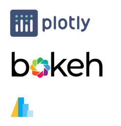

<br/>
<div align="right">
    <b><a href="#6강-interactive-visualization">↥ back to top</a></b>
</div>
<br/>

### 6.1.2 Interactive Viz Library

#### Matplotlib
- 인터랙티브를 제공하지만, jupyter notebook 또는 Local에서만 실행 가능
- 다른 library들은 웹에 deploy가능
- `mpld3`을 사용하면 웹에서 D3-based Viewer 제공

#### Plotly
- 인터랙티브 시각화에 가장 많이 사용되는 Plotly
    - R, JS에서도 제공
- 예시 + 문서화가 잘되어 있음
- 통계 시각화 외에도 지리 시각화 + 3D 시각화 + 금융 시각화 등 다양한 시각화 기능 제공
- JS 시각화 라이브러리 D3js를 기반으로 만들어져 웹에서 사용 가능
- 형광 Color가 인상적

#### Plotly Express
- Seaborn 문법과 유사하게 만듦!
- 커스텀 부분이 부족하단 단점이 있음

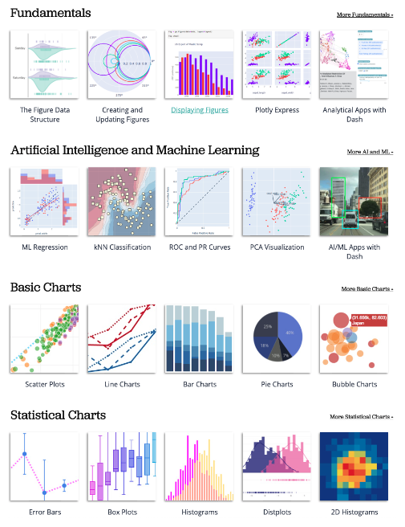

#### Bokeh
- 문법은 Matplotlib과 비슷
- 기본 Theme가 Plotly에 비해 깔끔함
- 문서화가 부족함...

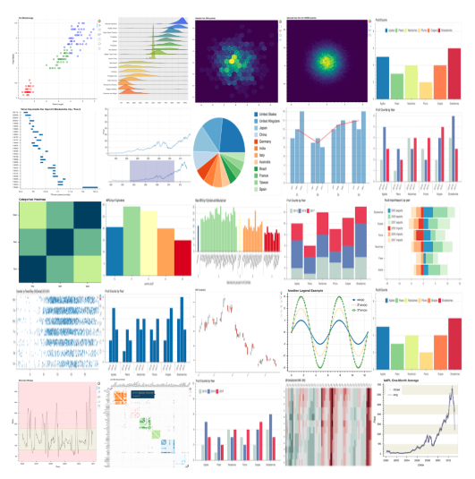

#### Altair
- Vega 라이브러리를 사용하여 만든 인터랙티브
- 시각화를 + 연산 등으로 배치하는 것이 특징
- 문법이 pythonic하지 않고 되려 js스러움
- 데이터 크기 5,000개 제한
- Bar, Line, Scatter, Histogram에 특화

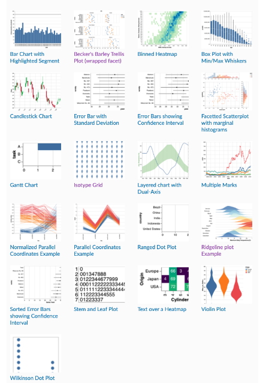

<br/>
<div align="right">
    <b><a href="#6강-interactive-visualization">↥ back to top</a></b>
</div>
<br/>


## 6.2 Interactive Visualization 실습
- plotly의 단순화 버전
    - 간단한 interactive
- 유연한 input (list, dict, DataFrame, GeoDataFrame)
- 적절한 color encoding
- Facet 등 seaborn의 기능 대다수 제공
- 그 외 다수 plotly에서 제공하는 유용한 시각화 제공
- 3D, animation 제공
- https://ichi.pro/ko/plotly-expressleul-sayonghan-sigaghwa-pogwaljeog-in-gaideu-258792796523351

### 6.2.1 Install Plotly

```python
$ pip install plotly statsmodels

import plotly
import plotly.express as px
print(plotly.__version__) # 4.14.3
import seaborn as sns
```

<br/>
<div align="right">
    <b><a href="#6강-interactive-visualization">↥ back to top</a></b>
</div>
<br/>

### 6.2.2 Scatter, Bar, Line


#### Scatter

아래와 같은 문법으로 시각화
```python
import plotly.express as px

iris = px.data.iris()
fig = px.scatter(iris,
                 x='sepal_length',
                 y='petal_length',
                 color='species',
                #  size='sepal_length', # marker의 크기
                 marginal_y="violin", # 주변 분포 y
                 marginal_x="box", # 주변 분포 x
                 hover_data=['sepal_width', 'petal_width'], # 데이터에 대한 정보 표시
                 hover_name='species', # label name
                 trendline="ols", # regression line
                #  facet_col='species', # facet column
                #  facet_row='species', # facet row
)

fig.show()
```

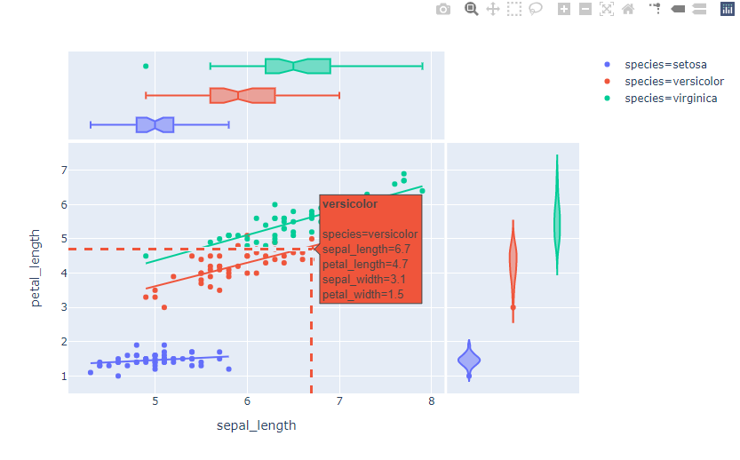

<br/>
<div align="right">
    <b><a href="#6강-interactive-visualization">↥ back to top</a></b>
</div>
<br/>

#### Line

```python
import seaborn as sns
import plotly.express as px

flights = sns.load_dataset('flights')
fig = px.line(flights,
              x='year',
              y='passengers',
              color='month',
             )

fig.show()
```

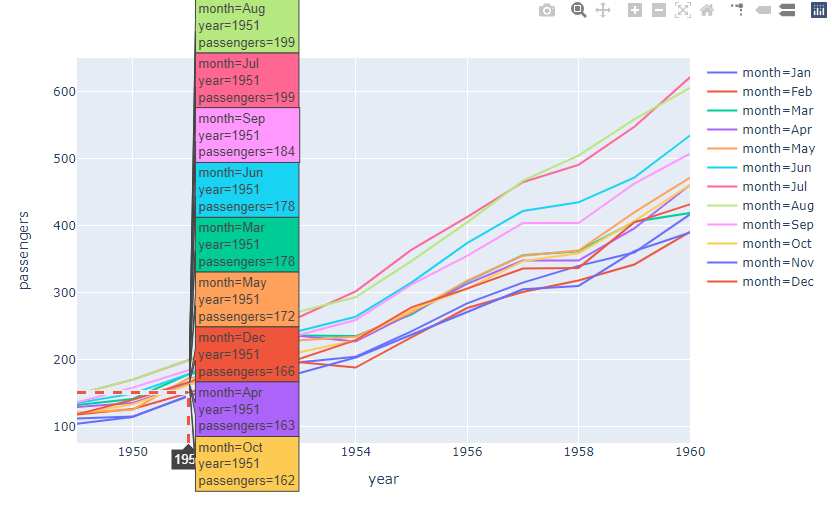

<br/>
<div align="right">
    <b><a href="#6강-interactive-visualization">↥ back to top</a></b>
</div>
<br/>

#### Bar

```python
import plotly.express as px

# Groupby된 데이터로 시각화
medals = px.data.medals_long()
medals
```
|   |      nation |  medal | count |
|--:|------------:|-------:|------:|
| 0 | South Korea |   gold |    24 |
| 1 |       China |   gold |    10 |
| 2 |      Canada |   gold |     9 |
| 3 | South Korea | silver |    13 |
| 4 |       China | silver |    15 |
| 5 |      Canada | silver |    12 |
| 6 | South Korea | bronze |    11 |
| 7 |       China | bronze |     8 |
| 8 |      Canada | bronze |    12 |

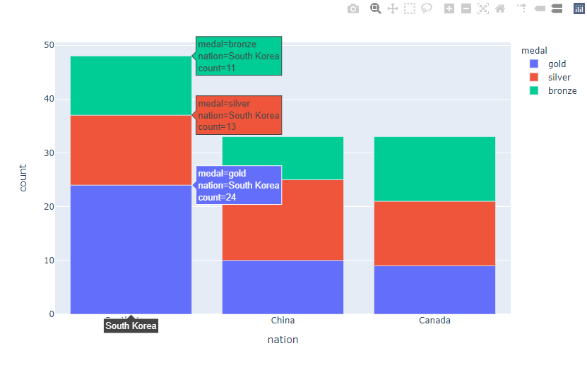

아래로도 위와 동일한 figure를 얻을 수 있다.

```python
import plotly.express as px

# Groupby된 데이터로 시각화
medals_wide = px.data.medals_wide()
medals_wide
```
|   |      nation | gold | silver | bronze |
|--:|------------:|-----:|-------:|-------:|
| 0 | South Korea |   24 |     13 |     11 |
| 1 |       China |   10 |     15 |      8 |
| 2 |      Canada |    9 |     12 |     12 |

- grouping도 가능

```python
import plotly.express as px

medals = px.data.medals_long()

fig = px.bar(medals,
             x="nation",
             y="count",
             color="medal",
             barmode="group",
            )

fig.show()
```

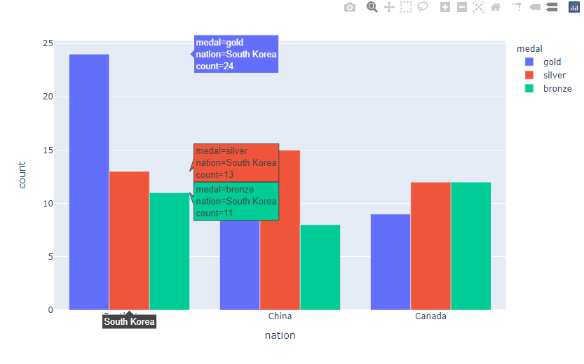

<br/>
<div align="right">
    <b><a href="#6강-interactive-visualization">↥ back to top</a></b>
</div>
<br/>

### 6.2.3 다양한 차트

seaborn의 다양한 내용과 겹치고. 필요에 따라 보면 좋습니다.

- `hist` : `histogram`, `density_heatmap`
- `kdeplot` : `density_contour`
- `boxplot` : `box`
- `violinplot` : `violin``
- `stripplot` : `strip`
- `heatmap` : `imshow`
- `pairplot` : `scatter_matrix`

#### Part-of-Whole
데이터를 트리 구조로 살필 때 유용한 시각화 방법론

Sunburst, Treemap!

```python
import plotly.express as px

tips = px.data.tips()
tips.head()
```

|   | total_bill |  tip |    sex | smoker | day |   time | size |
|--:|-----------:|-----:|-------:|-------:|----:|-------:|-----:|
| 0 |      16.99 | 1.01 | Female |     No | Sun | Dinner |    2 |
| 1 |      10.34 | 1.66 |   Male |     No | Sun | Dinner |    3 |
| 2 |      21.01 | 3.50 |   Male |     No | Sun | Dinner |    3 |
| 3 |      23.68 | 3.31 |   Male |     No | Sun | Dinner |    2 |
| 4 |      24.59 | 3.61 | Female |     No | Sun | Dinner |    4 |

- Sunburst

```python
fig = px.sunburst(tips,
                  path=['day', 'time', 'sex'],
                  values='total_bill')
fig.show()
```

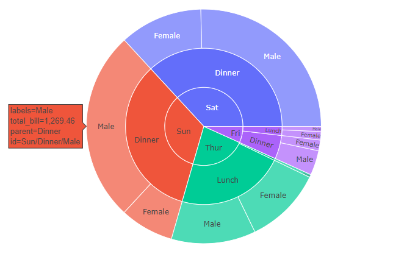

- Treemap

```python
fig = px.treemap(tips,
                  path=['day', 'time', 'sex'],
                  values='total_bill')
fig.show()
```

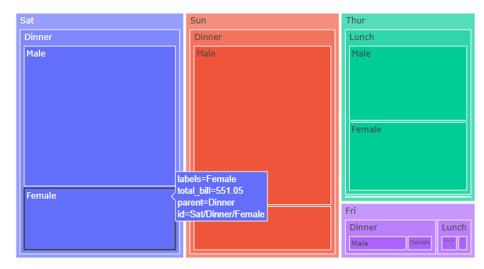


<br/>
<div align="right">
    <b><a href="#6강-interactive-visualization">↥ back to top</a></b>
</div>
<br/>

#### 3-Dimensional

```python
fig = px.scatter_3d(iris,
                    x='sepal_length',
                    y='sepal_width',
                    z='petal_width',
                    symbol='species',
                    color='species')
fig.show()
```

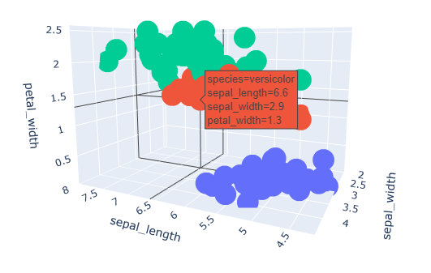

<br/>
<div align="right">
    <b><a href="#6강-interactive-visualization">↥ back to top</a></b>
</div>
<br/>

#### Multidimensional
다차원 데이터를 시각화하는 또 다른 방법론
- parallel_coordinates
- parallel_categories

```python
fig = px.parallel_coordinates(iris,
                              color="species_id",
                            #  color_continuous_scale=px.colors.diverging.Tealrose,
                             )
fig.show()
```
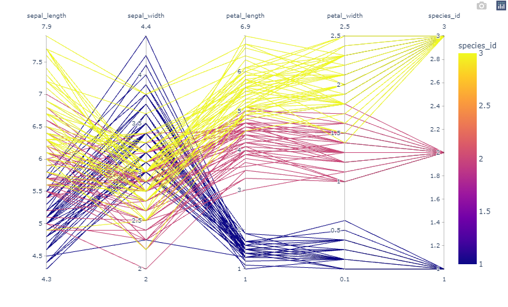

어? 이거 WandB에서 보던거다!!

소비자 행동 패턴을 볼 때 유용함!

```python
tips = px.data.tips()
tips['sex'] = tips['sex'].apply(lambda x : 'red' if x=='Female' else 'gray')
fig = px.parallel_categories(tips, color='sex')
fig.show()
```

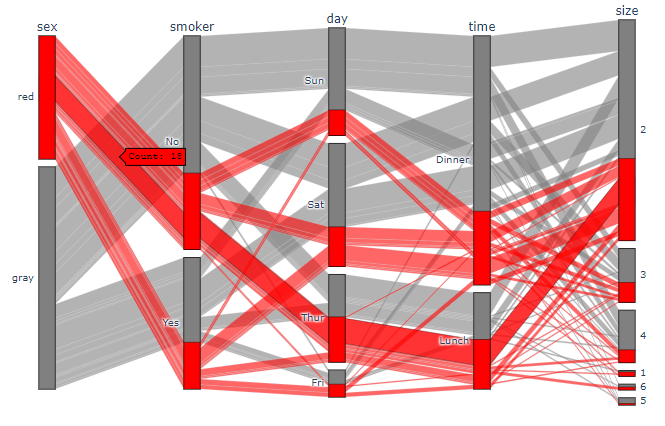

범주형 데이터를 추적!

<br/>
<div align="right">
    <b><a href="#6강-interactive-visualization">↥ back to top</a></b>
</div>
<br/>

#### Geo

```python
import plotly.express as px

geo = px.data.gapminder()#.query("year == 2007")
geo.head()
```

|   |     country | continent | year | lifeExp |      pop |  gdpPercap | iso_alpha | iso_num |
|--:|------------:|----------:|-----:|--------:|---------:|-----------:|----------:|--------:|
| 0 | Afghanistan |      Asia | 1952 |  28.801 |  8425333 | 779.445314 |       AFG |       4 |
| 1 | Afghanistan |      Asia | 1957 |  30.332 |  9240934 | 820.853030 |       AFG |       4 |
| 2 | Afghanistan |      Asia | 1962 |  31.997 | 10267083 | 853.100710 |       AFG |       4 |
| 3 | Afghanistan |      Asia | 1967 |  34.020 | 11537966 | 836.197138 |       AFG |       4 |
| 4 | Afghanistan |      Asia | 1972 |  36.088 | 13079460 | 739.981106 |       AFG |       4 |

```python
fig = px.scatter_geo(geo,
                     locations="iso_alpha",
                     color="continent",
                     size="pop",
                     animation_frame="year",
                     projection="natural earth")
fig.show()
```

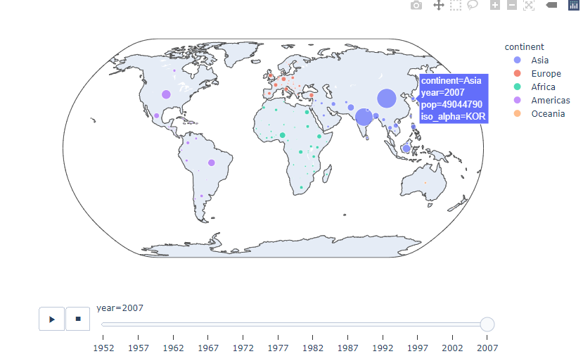

```python
fig = px.choropleth(geo,
                     locations="iso_alpha",
                     color="continent",
                     projection="natural earth")
fig.show()
```

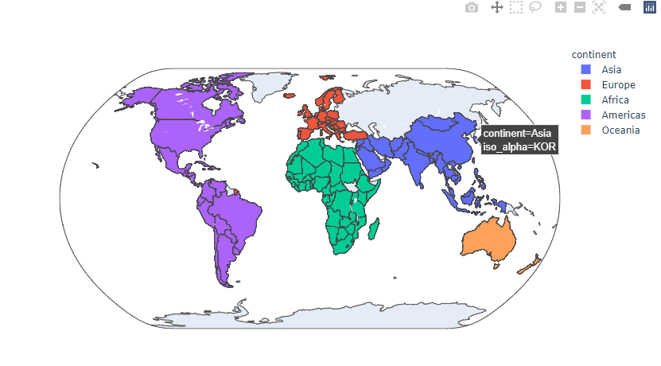

<br/>
<div align="right">
    <b><a href="#6강-interactive-visualization">↥ back to top</a></b>
</div>
<br/>

## Further Reading
- [Toward a Deeper Understanding of the Role of Interaction in Information Visualization](https://www.cc.gatech.edu/~stasko/papers/infovis07-interaction.pdf)
- [Plotly](https://plotly.com/python/)
- [Bokeh](https://docs.bokeh.org/en/latest/index.html)
- [Altair](https://altair-viz.github.io/)
- [Plotly Express API docs](https://plotly.com/python-api-reference/plotly.express.html)


<br/>
<div align="right">
    <b><a href="#6강-interactive-visualization">↥ back to top</a></b>
</div>
<br/>
