# 7장 주제별 시각화 테크닉
앞서 공부한 시각화를 바탕으로 태스크 별 추가적인 테크닉을 소개합니다.

[back to super](https://github.com/jinmang2/boostcamp_ai_tech_2/tree/main/s-stage/data_viz)

<details open="open">
  <summary>Table of Contents</summary>
  <ul>
    <li>
      <a href="#71-custom-matplotlib-theme">7.1 Custom Matplotlib Theme</a>
    </li>
    <ul>
      <li><a href="#711-색의-선정">7.1.1 색의 선정</a></li>
      <li><a href="#712-facet-dark-mode를-활용한-예시">7.1.2 Facet + Dark Mode를 활용한 예시</a></li>
    </ul>
    <li>
      <a href="#72-image-text-visualization-techniques">7.2 Image & Text Visualization Techniques</a>
    </li>
    <ul>
      <li><a href="#721-비정형-데이터셋에-사용할-수-있는-eda-visualization">7.2.1 비정형 데이터셋에 사용할 수 있는 EDA & Visualization</a></li>
      <li><a href="#722-image-dataset-visualization">7.2.2 Image Dataset Visualization</a></li>
      <li><a href="#723-text-dataset-visualization">7.2.3 Text Dataset Visualization</a></li>
    </ul>
    <li>
      <a href="#further-reading">Further Reading</a>
    </li>
  </ul>
</details>

비정형 데이터에 대한 시각화도 공부해봅시다!

## 7.1 Custom Matplotlib Theme

```python
import numpy as np
import pandas as pd
import matplotlib as mpl
import matplotlib.pyplot as plt
import seaborn as sns
```

### 7.1.1 색의 선정
- https://developer.apple.com/design/human-interface-guidelines/ios/visual-design/color
색은 cycler를 기본으로 사용하여 전체적인 color palette를 바꿀 수 있음

```python
from cycler import cycler

raw_light_palette = [
    (0, 122, 255), # Blue
    (255, 149, 0), # Orange
    (52, 199, 89), # Green
    (255, 59, 48), # Red
    (175, 82, 222),# Purple
    (255, 45, 85), # Pink
    (88, 86, 214), # Indigo
    (90, 200, 250),# Teal
    (255, 204, 0)  # Yellow
]

raw_dark_palette = [
    (10, 132, 255), # Blue
    (255, 159, 10), # Orange
    (48, 209, 88),  # Green
    (255, 69, 58),  # Red
    (191, 90, 242), # Purple
    (94, 92, 230),  # Indigo
    (255, 55, 95),  # Pink
    (100, 210, 255),# Teal
    (255, 214, 10)  # Yellow
]

raw_gray_light_palette = [
    (142, 142, 147),# Gray
    (174, 174, 178),# Gray (2)
    (199, 199, 204),# Gray (3)
    (209, 209, 214),# Gray (4)
    (229, 229, 234),# Gray (5)
    (242, 242, 247),# Gray (6)
]

raw_gray_dark_palette = [
    (142, 142, 147),# Gray
    (99, 99, 102),  # Gray (2)
    (72, 72, 74),   # Gray (3)
    (58, 58, 60),   # Gray (4)
    (44, 44, 46),   # Gray (5)
    (28, 28, 39),   # Gray (6)
]


light_palette = np.array(raw_light_palette)/255
dark_palette = np.array(raw_dark_palette)/255
gray_light_palette = np.array(raw_gray_light_palette)/255
gray_dark_palette = np.array(raw_gray_dark_palette)/255

print('Light mode palette')
sns.palplot(light_palette)
sns.palplot(gray_light_palette)

print('Dark mode palette')
sns.palplot(dark_palette)
sns.palplot(gray_dark_palette)
```

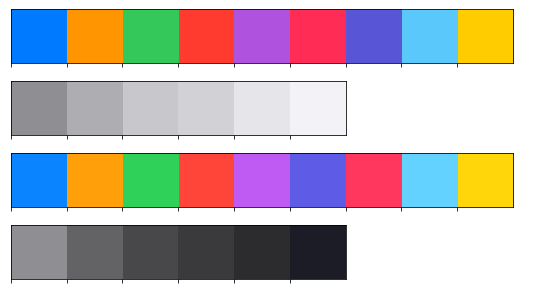

위에서 선언한 다크모드 색상으로 palette 수정!

```python
# cmap 수정
mpl.rcParams['axes.prop_cycle'] = cycler('color',dark_palette)

# 전체적인 배경색 수정
mpl.rcParams['figure.facecolor']  = gray_dark_palette[-2]
mpl.rcParams['figure.edgecolor']  = gray_dark_palette[-2]
mpl.rcParams['axes.facecolor'] =  gray_dark_palette[-2]

# 사용되는 텍스트 색상 흰색으로 수정
white_color = gray_light_palette[-2]
mpl.rcParams['text.color'] = white_color
mpl.rcParams['axes.labelcolor'] = white_color
mpl.rcParams['axes.edgecolor'] = white_color
mpl.rcParams['xtick.color'] = white_color
mpl.rcParams['ytick.color'] = white_color

# 해상도 조정
mpl.rcParams['figure.dpi'] = 200

# ax의 우측과 상단 지우기
mpl.rcParams['axes.spines.top'] = False
mpl.rcParams['axes.spines.right'] = False
```

### 7.1.2 Facet + Dark Mode를 활용한 예시

```python
student = pd.read_csv('./StudentsPerformance.csv')
iris = pd.read_csv('./Iris.csv')
```

#### Scatter Plot

```python
# 강의에서 사용한 function
# colab 파일 참고 (본 정리에선 제공 X)
score_distribution('math', 'reading')
```

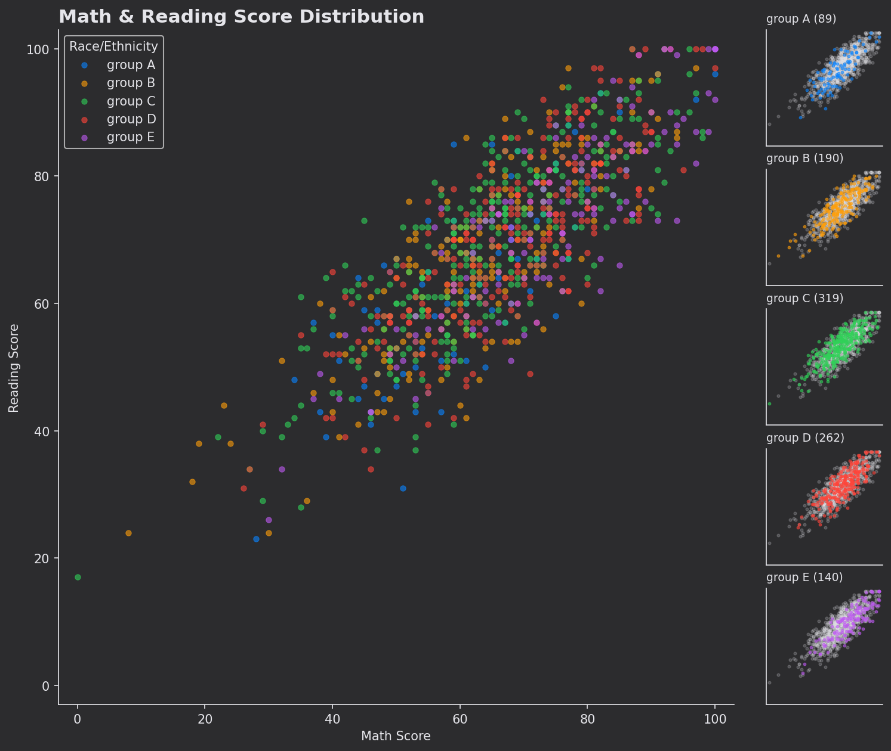

#### KDE Plot

```python
# 강의에서 사용한 function
# colab 파일 참고 (본 정리에선 제공 X)
score_distribution_kde('math score')
```

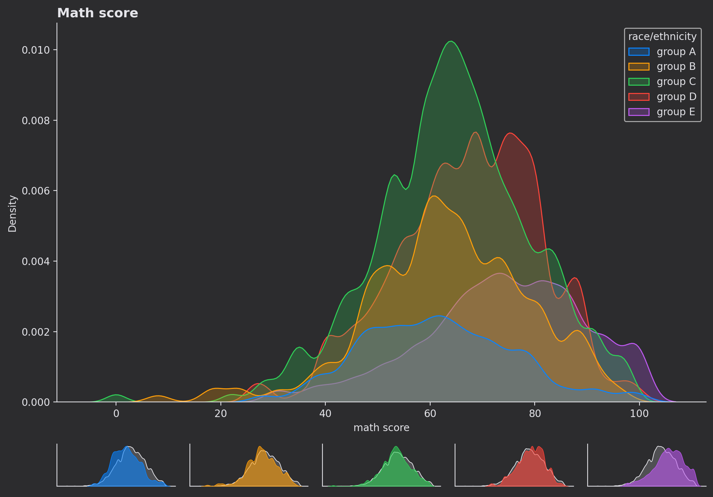

#### Pairplot

```python
sns.pairplot(iris, hue='Species', corner=True)
```

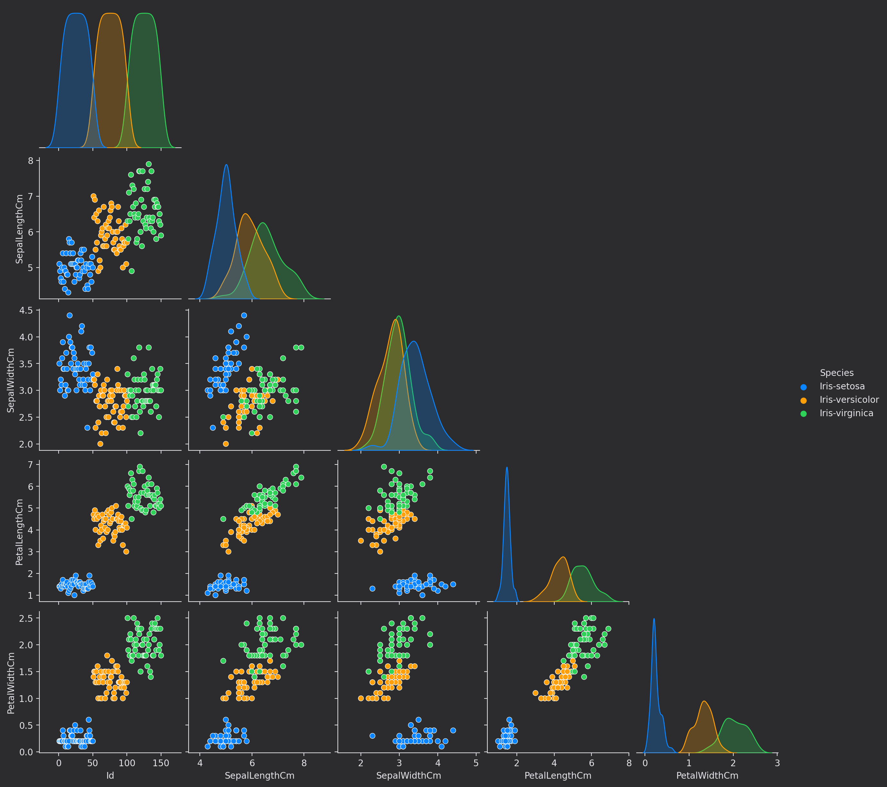

#### Ployly 3D Plot

```python
import plotly.graph_objects as go

x, y, z = student['math score'], student['reading score'], student['writing score']
gtc = dict(zip(sorted(student['race/ethnicity'].unique()), raw_dark_palette[:5]))
color = student['race/ethnicity'].map(gtc)

data = go.Scatter3d(x=x, y=y, z=z, mode='markers',
                    marker=dict(size=5, color=color, opacity=0.8))
layout = go.Layout(plot_bgcolor='rgba(255,0,0,1)',
                   paper_bgcolor=f'rgb{raw_gray_dark_palette[-2]}',
                   font=dict(color='white'))      
fig = go.Figure(data=[data], layout=layout)

# tight layout
fig.update_layout(margin=dict(l=0, r=0, b=0, t=0))
margin=dict(r=10, l=10, b=10, t=10)
scene = dict(
    xaxis_title='MATH',
    yaxis_title='READING',
    zaxis_title='WRITING',

    xaxis = dict(
         gridcolor="white",
         showbackground=False,
         zerolinecolor="white",
        range=[0, 100]
    ),
    yaxis = dict(
        gridcolor="white",
         showbackground=False,
        zerolinecolor="white",
        range=[0, 100]
    ),
    zaxis = dict(
        gridcolor="white",
         showbackground=False,
        zerolinecolor="white",
        range=[0, 100]                    
    ),
)
fig.update_layout(scene=scene,
                  margin=dict(l=10, r=10, b=10, t=10))
eye = dict(x=1.4, y=1.4, z=1.4)
fig.update_layout(scene_camera={"eye": eye})

fig.show()
```
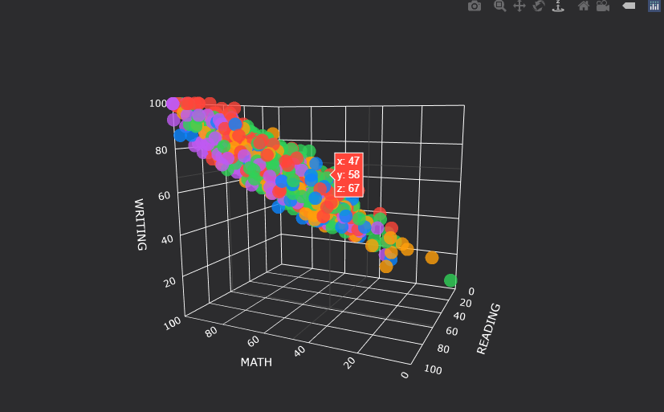


<br/>
<div align="right">
    <b><a href="#7장-주제별-시각화-테크닉">↥ back to top</a></b>
</div>
<br/>


## 7.2 Image & Text Visualization Techniques

```python
import numpy as np
import pandas as pd
import matplotlib as mpl
import matplotlib.pyplot as plt
import seaborn as sns
```

### 7.2.1 비정형 데이터셋에 사용할 수 있는 EDA & Visualization

1. **dataset meta data visualization**
    - target distribution
        - 훈련 상에서 발생할 수 있는 문제점 예측
        - augmentation 방법론 및 모델 선택 시 도움
2. **dataset listup**
    - only dataset
        - 데이터셋의 일부를 리스트업하여
    - datset-target(bounding box 등)
        - gt, prediction 등을 정답 데이터와 비교하여 문제점 발견 가능
3. **visual analytics**
    - dimension reduction(pca, lda, tsne, umap) + scatter plot (2d, 3d)
        - text의 경우에는 word2vec 등의 과정을 거쳐야함
    - data-data relation  network visualization
3. **train/inference visualization**
    - loss graph
        - wandb / tensorboard 등 다양한 툴로 모델의 훈련과정 확인
    - result  
4. **etc**
    - XAI :
        - [Visual Analytics in Deep Learning: An Interrogative Survey for the Next Frontiers](https://arxiv.org/abs/1801.06889)
        - XAI using torch : https://captum.ai/
        - saliency map (heatmap visualization)
    - node-link diagram (network visualization)
        - http://alexlenail.me/NN-SVG/
        - https://github.com/HarisIqbal88/PlotNeuralNet
        - http://ethereon.github.io/netscope/quickstart.html

- Interaction의 필요성
    - jupyter notebook : 함수형으로 1번에 1개를 만드는 방식
    - web demo : 모든 내용을 한 번에 db에 올려서 사용 (느릴 수 있음)
- 데이터셋의 배치
- 적절한 색과 투명도 사용

<br/>
<div align="right">
    <b><a href="#7장-주제별-시각화-테크닉">↥ back to top</a></b>
</div>
<br/>

### 7.2.2 Image Dataset Visualization

#### 이미지 나열
- Facet : https://pair-code.github.io/facets/

```python
from sklearn.datasets import load_digits

digits = load_digits()
data = digits['data']
target = digits['target']

fig, axes = plt.subplots(2, 5, figsize=(20, 8))
axes = axes.flatten()
for i in range(10):
    axes[i].imshow(data[i].reshape(8, 8),
                   cmap='gray_r'
                  )
    axes[i].set_title(target[i], fontweight='bold', fontsize=20)
    # @Edit by jinmang2
    # 왜 아래 코드에서 에러가 뜰까?
    for axis in ['top', 'bottom', 'left', 'right']:
        axes[i].spines[axis].set_color('red')
        axes[i].spines[axis].set_linewidth(2)
    # axes[i].spines[['top', 'bottom', 'left', 'right']].set_color('red')
    # axes[i].spines[['top', 'bottom', 'left', 'right']].set_linewidth(2)
    axes[i].set_xticks([])
    axes[i].set_yticks([])
#     axes[i].axis('off')

# margin 조정
fig.subplots_adjust(left=0.125,
                    bottom=0.1,
                    right=0.9,
                    top=0.9,
                    wspace=0,
                    hspace=0)

fig.tight_layout()

plt.show()
```

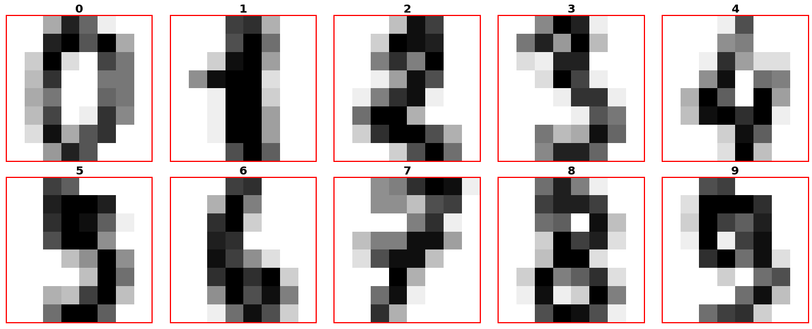

<br/>
<div align="right">
    <b><a href="#7장-주제별-시각화-테크닉">↥ back to top</a></b>
</div>
<br/>

#### Patch 사용하기

```python
import matplotlib.patches as patches

fig, ax = plt.subplots(1, 1, figsize=(5, 5))

ax.imshow(data[0].reshape(8, 8), cmap='gray_r')
# ax.axis('off')

rect = patches.Rectangle((1, 2),
                         3, 4,
                         linewidth=2, edgecolor='r', facecolor='red', alpha=0.3)

ax.add_patch(rect)
plt.show()
```
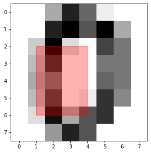

baseline 코드 사용해서 아래 이미지 겹쳐 그리기!
- 코드는 따로 제공 X

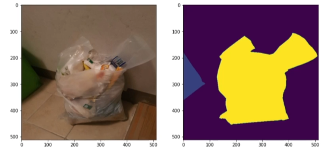

```python
images, masks, image_infos = train_dataset[0]

fig, ax = plt.subplots(1, 1, figsize=(10, 10))
ax.imshow(images)
ax.imshow(masks, alpha=0.5, cmap='gray')

plt.show()
```

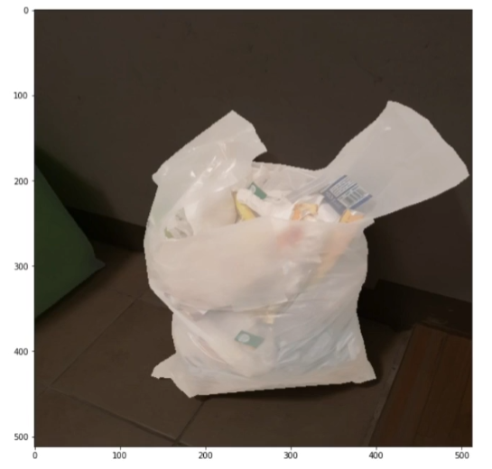

- Plotly로도 가능!

<br/>
<div align="right">
    <b><a href="#7장-주제별-시각화-테크닉">↥ back to top</a></b>
</div>
<br/>

#### Dimension Reduction + Scatter Plot
- tsne과 UMAP을 보통 사용!

```python
$ pip install umap-learn

from umap import UMAP
from matplotlib.colors import ListedColormap

data = digits['data']
target = digits['target']

umap = UMAP(random_state=0)
data_dr = umap.fit_transform(data, target)

colors = plt.cm.get_cmap('tab10').colors
```

- 이전 강의의 Facet을 이용하여 아래처럼 시각화
```python
fig = plt.figure(figsize=(12, 12))
gs = fig.add_gridspec(6, 5)
ax = fig.add_subplot(gs[1:-1,1:-1])

sub_axes = [None] * 10
for idx in range(10):
    sub_axes[idx] = fig.add_subplot(gs[0-idx//5,idx%5])

for idx in range(10):
    ax.scatter(x=data_dr[:,0][target==idx], y=data_dr[:,1][target==idx],
              s=10, alpha=0.1, color=colors[idx]
              )

    for j in range(10):
        sub_axes[j].scatter(x=data_dr[:,0][target==idx], y=data_dr[:,1][target==idx],
                            s=10, alpha = 0.4 if idx==j else 0.008,
                            color = (colors[j]) if idx==j else 'lightgray',
                            zorder=(idx==j)
                           )

    inset_ax = sub_axes[idx].inset_axes([0.81, 0.79, 0.2, 0.2])
    inset_ax.axis('off')


    num_idx = target.tolist().index(idx)
    inset_ax.imshow(data[num_idx].reshape(8, 8), cmap='gray')

    sub_axes[idx].set_xticks([])
    sub_axes[idx].set_yticks([])
    sub_axes[idx].set_xlabel('')
    sub_axes[idx].set_ylabel('')
    sub_axes[idx].spines['right'].set_visible(True)
    sub_axes[idx].spines['top'].set_visible(True)

ax.set_xticks([])
ax.set_yticks([])
ax.set_xlabel('')
ax.set_ylabel('')
ax.axis('off')

fig.tight_layout()
plt.show()
```

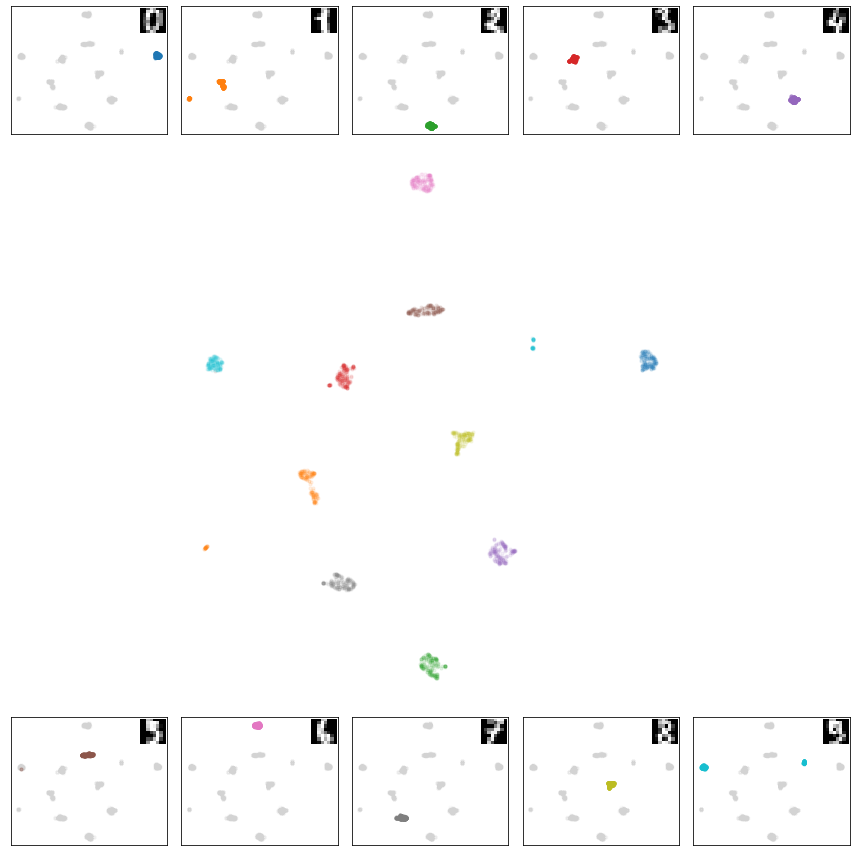

<br/>
<div align="right">
    <b><a href="#7장-주제별-시각화-테크닉">↥ back to top</a></b>
</div>
<br/>

### 7.2.3 Text Dataset Visualization

#### Console output에 Highlight
- https://stackoverflow.com/questions/287871/how-to-print-colored-text-to-the-terminal
    - https://github.com/ikalnytskyi/termcolor
    - https://github.com/feluxe/sty
    - https://github.com/erikrose/blessings
    - https://github.com/willmcgugan/rich

```python
$ pip install termcolor

from termcolor import colored, cprint

print(colored('hello', 'red'), colored('world', 'green'))
print(colored("hello red world", 'red'))
```


```python
def word_highligt(txt, word, color=None, highlight=None, attr=None):
    if isinstance(word, str):
        txt = txt.replace(word, colored(word, color, highlight))
    else :
        if not isinstance(color, list):
            color = [color] * len(word)
        if not isinstance(highlight, list):
            highlight = [highlight] * len(word)
        for w, c, h in zip(word, color, highlight):
            txt = txt.replace(w, colored(w, c, h))
    return txt


print(word_highligt(lyrics,  ['to', 'I'], [None, 'cyan'], ['on_red', None]))
```

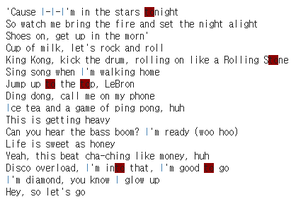

<br/>
<div align="right">
    <b><a href="#7장-주제별-시각화-테크닉">↥ back to top</a></b>
</div>
<br/>

#### IPython의 HTML 활용

```python
from IPython.core.display import HTML
HTML("<span style='color:red'>hello</span> word")
```

```python
def word_highligt_html(txt, word, color='black', highlight=None, attr=None):
    if isinstance(word, str):
        txt = txt.replace(word, f'<span style="color: {color}; background-color:{highlight}">{word}</span>')
    else :
        if not isinstance(color, list):
            color = [color] * len(word)
        if not isinstance(highlight, list):
            highlight = [highlight] * len(word)
        for w, c, h in zip(word, color, highlight):

            txt = txt.replace(w, f'<span style="color: {c}; background-color:{h}">{w}</span>')
    return txt

HTML(word_highligt_html(lyrics, ['and', 'Yeah'], ['red', 'white'],  [None, '#B19CD9']))
```

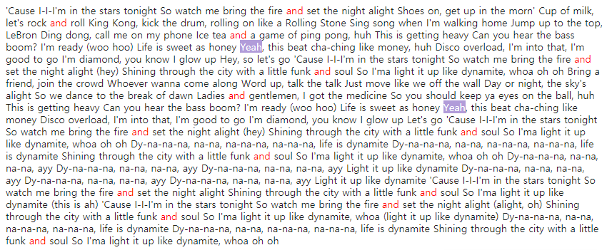

이런 범용 툴 및 라이브러리 소스들이 있으니 살펴보면 좋습니다.

- LIT : https://github.com/PAIR-code/lit
    - interactive model-understanding tool for NLP models
- Ecco : https://www.eccox.io/
    - Ecco is a python library that creates interactive visualizations allowing you to explore what your NLP Language Model is thinking.
- https://github.com/jessevig/bertviz
- https://github.com/jbesomi/texthero
- https://github.com/bmabey/pyLDAvis
- https://github.com/JasonKessler/scattertext
- https://github.com/ryanjgallagher/shifterator

<br/>
<div align="right">
    <b><a href="#7장-주제별-시각화-테크닉">↥ back to top</a></b>
</div>
<br/>


## Further Reading
- [Apple Human Interface Guidelines - Color](https://developer.apple.com/design/human-interface-guidelines/ios/visual-design/color/)
- [Google Material Design - Color](https://material.io/design/color/the-color-system.html#color-usage-and-palettes)
- [Color Palettes in Seaborn](https://seaborn.pydata.org/tutorial/color_palettes.html)
- 딥러닝/머신러닝을 공부하는 분들에게 마지막으로 전달하는 AI + Visualization 자료
    - Distill.pub : https://distill.pub/
    - Poloclub : https://poloclub.github.io/
    - Google Pair : https://pair.withgoogle.com/
    - Open AI Blog : https://openai.com/blog/
- 그 외 visualization 아이디어를 얻을 수 있는 소스
    - Observable : https://observablehq.com/
    - https://textvis.lnu.se/
    - https://visimages.github.io/visimages-explorer/


<br/>
<div align="right">
    <b><a href="#7장-주제별-시각화-테크닉">↥ back to top</a></b>
</div>
<br/>
