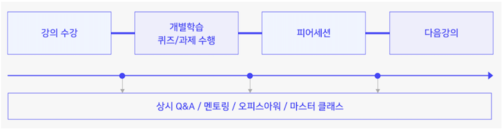

# U stage

- [핵심 이론 5주 과정](https://github.com/jinmang2/boostcamp_ai_tech_2/tree/main/u-stage)
- AI 모델 개발과 서비스 적용에 필요한 기초 지식을 학습, 도메인마다 널리 쓰이는 backbone 모델을 다룬다.

- 모든 과정은 온라인 환경에서 자기 주도적으로 진행
- 매주 공개되는 온라인 강의를 boostcourse에서 수강하고 강의마다 출제되는 퀴즈와 프로그래밍 과제를 수행하고 제출

## [Python Basics for AI](https://github.com/jinmang2/boostcamp_ai_tech_2/tree/main/u-stage/python_basic)
- 최성철 마스터
- Week1 `2021.08.02` ~ `2021.08.06`

## [AI Math](https://github.com/jinmang2/boostcamp_ai_tech_2/tree/main/u-stage/ai_math)
- 임성빈 마스터
- Week1 `2021.08.02` ~ `2021.08.06`

## [Deep Learning Basic](https://github.com/jinmang2/boostcamp_ai_tech_2/tree/main/u-stage/dl_basic)
- 최성준 마스터
- Week2 `2021.08.09` ~ `2021.08.13`
