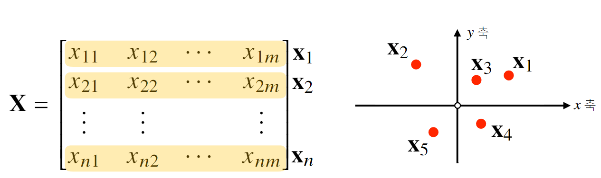
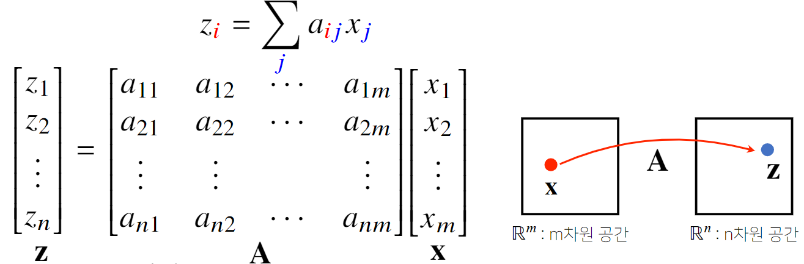
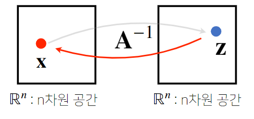

# 2강 행렬이 뭐에요?
**행렬의 개념과 연산**, 그리고 **벡터공간에서 가지는 의미**를 설명
**연립방정식 풀기**와 **선형회귀분석**에 응용하는 방법을 소개

[back to super](https://github.com/jinmang2/BoostCamp_AI_Tech_2/tree/main/u-stage/ai_math)

- 행렬는 벡터를 원소로 가지는 **2차원 배열**
```python
x = np.array([[1, 7, 2],
              [3, -1, 0],
              [9, 2, -3]])
```

- 보통 아래와 같은 notation으로 표현한다
$$X=\begin{bmatrix}
X_1\\
X_2\\
\vdots\\
X_d
\end{bmatrix}
=\begin{bmatrix}
x_{11} & x_{12} & \cdots & x_{1m}\\
x_{21} & x_{22} & \cdots & x_{2m}\\
\vdots & \vdots & x_{ij} & \vdots\\
x_{n1} & x_{n2} & \cdots & x_{nm}\\
\end{bmatrix}=(x_{ij})$$

- 이름에서 알 수 있듯, **행(row)** 과 **열(column)** 이라는 index를 가짐

- 전치행렬은 행과 열의 인덱스를 바꾼 것을 의미하고 아래의 notation으로 표기

$$X^\intercal=\begin{bmatrix}
{X_1}^\intercal & {X_2}^\intercal & \cdots & {X_d}^\intercal
\end{bmatrix}
=\begin{bmatrix}
x_{11} & x_{21} & \cdots & x_{n1}\\
x_{12} & x_{22} & \cdots & x_{n2}\\
\vdots & \vdots & x_{ji} & \vdots\\
x_{1m} & x_{2m} & \cdots & x_{nm}\\
\end{bmatrix}=(x_{ji})$$

## 행렬을 이해하는 방법 (1)
- 행렬은 벡터 공간 상에서의 여러 점!


## 행렬의 덧셈, 뺄셈, 성분곱, 스칼라곱
- vector와 다를 바가 없음
- notation은 생략하고 직접 코드로 개념 복습
```python
import numpy as np

# 행렬 정의
x = np.array([[3, 1, 5, 0],
              [5, -1, 2, 1],
              [7, 7, 3, 2],
              [2, 4, 7, 4]])

y = np.array([[1, 1, -1, 0],
              [8, 4, 0, 1],
              [2, 2, 3, 2],
              [0, 0, 1, -1]])

# 행렬의 덧셈
x + y
# array([[ 4,  2,  4,  0],
#        [13,  3,  2,  2],
#        [ 9,  9,  6,  4],
#        [ 2,  4,  8,  3]])

# 행렬의 뺄셈
x - y
# array([[ 2,  0,  6,  0],
#        [-3, -5,  2,  0],
#        [ 5,  5,  0,  0],
#        [ 2,  4,  6,  5]])

# 성분 곱
x * y
# array([[ 3,  1, -5,  0],
#        [40, -4,  0,  1],
#        [14, 14,  9,  4],
#        [ 0,  0,  7, -4]])

# 스칼라 곱
x * 5
# array([[15,  5, 25,  0],
#        [25, -5, 10,  5],
#        [35, 35, 15, 10],
#        [10, 20, 35, 20]])
```

## 행렬의 곱셈
- 왜 성분곱, 스칼라곱이 있는데 행렬의 곱셈을 정의하는 지 이해가 안 갈 수 있다.
- 이는 뭐... 대수적으로 원소끼리의 스칼라곱과 곱이 정의가 되어있어야 벡터 공간이라고 할 수 있기 때문에
- 성분곱으로는 해당 공리를 만족시킬 수 없다.
- 근데 이게 조금 골치가 아픈게, 행렬의 shape 혹은 rank 등지에 따라 고려해줄 부분이 좀 많이 생긴다.
- 확실한 것은, 행벡터와 열벡터의 내적으로 연산이 정의된다는 것이다! (유사도)
- Self-Attention의 content-based Query, Key MM을 생각하면 이해하기 쉽다.

$$XY=\bigg(\sum_k{x_{ik} y_{kj}}\bigg)$$

- 한 가지 더 TMI를 하자면, 위 계산 복잡도는 $\mathcal{O}(mkn)$이다.
- 연산을 하기 위해 가운데 shape이 알맞게 맞아 떨어져야 함을 알 수 있다.
```python
import numpy as np

# (3X4) 행렬 X 정의
X = np.array([[3, 1, 5, 0],
              [5, -1, 2, 1],
              [7, 7, 3, 2]])
# (4X3) 행렬 Y 정의
Y = np.array([[1, 1, -1],
              [8, 4, 0],
              [2, 2, 3],
              [0, 0, 1]])

# 행렬의 곱셈
X @ Y
# array([[21, 17, 12],
#        [ 1,  5,  2],
#        [69, 41,  4]])

# 아래처럼 계산도 가능하다
# 수학에서 말하는 내적과는 조금 다름...
# 그래서 Transpose를 취해줬다.
np.inner(X, Y.T)
# array([[21, 17, 12],
#        [ 1,  5,  2],
#        [69, 41,  4]])
```

## 행렬을 이해하는 방법 (2)
- 행렬은 **벡터 공간에서 사용되는 연산자(operator)** 로 이해한다.
- 이는 선대에서 `linear transfomation`이라고 부르는 개념이다.
    - 행렬곱으로 다른 차원의 공간으로!
    - self-attention의 경우, 차원을 정리해주는 용도로 보통 같은 차원으로 다시 보내는 경우도 있다. (basis 정리 when full-rank가 보존될 때)
    - 이를 Auto-Encoder에선 패턴 추출, 혹은 데이터 압축으로도 활용한다.
    - 왜냐, 어떻게 변화시킬지에 대해 모수로 기록, 새롭게 들어오는 input에 대해서 동일한 작업을 실행 가능하기 때문
    - seq2seq에서도 encoder가 input repr을 context vector로 압축하는 것과 같은 맥락이다.



## 역행렬
- 대망의 역행렬! 대수라 함은 역원도 가져야지 암암
- 어떤 행렬 $A$의 연산을 거꾸로 되돌리는 행렬을 **역행렬(inverse matrix)** 라 부르고 $A^{-1}$로 표기
- 역행렬은 행과 열의 숫자가 같고 행렬식이 0이 아닌 경우에만 계산 가능
    - 이는 선대에서 거의 20개정도의 동치로 정리하기도 하는데
    - 예를 들어 A가 Full-rank랄지
    - 모든 행벡터들이 독립이랄지
    - 모든 열벡터들이 독립이랄지
    - $Ax=0$이 trivial solution을 가진달지
    - 0인 eigenvalue가 없달지
    - 등등이 있다. 차후 이 문서에 추가하도록 하겠다.



```python
import numpy as np

X = np.array([[3, 1, 5, 0],
              [5, -1, 2, 1],
              [7, 7, 3, 2],
              [1, 1, 2, 1]])

# 역행렬을 계산하면 다음과 같다.
(np.linalg.inv(X)).astype(np.int64)
# array([[ 0.0125,  0.1625,  0.0625, -0.2875],
#        [ 0.025 , -0.175 ,  0.125 , -0.075 ],
#        [ 0.1875, -0.0625, -0.0625,  0.1875],
#        [-0.4125,  0.1375, -0.0625,  0.9875]])

# X @ X^-1은 항상 Identity Matrix가 나온다.
# 여기서 Identity Matrix란, 실수체계에서 1과 같다고 이해하면 된다.
X @ np.linalg.inv(X)
# array([[1, 0, 0, 0],
#        [0, 1, 0, 0],
#        [0, 0, 1, 0],
#        [0, 0, 0, 1]], dtype=int64)

# 만일, full-rank가 아닌, determinant가 0인 X일 경우
# 일반적으로는 역행렬 계산이 불가능하다.
X = np.array([[3, 1, 5, 0],
              [5, -1, 2, 1],
              [7, 7, 3, 2],
              [3, 1, 5, 0]])
np.linalg.inv(X)
# LinAlgError: Singular matrix

# 또한 정방행렬이 아닐 경우에도 일반적으로는 역행렬 계산이 불가능하다
X = np.array([[3, 1, 5, 0],
              [5, -1, 2, 1],
              [7, 7, 3, 2],])
# LinAlgError: Last 2 dimensions of the array must be square
```

- 만일 위에 `LinAlgError`처럼 역행렬을 계산할 수 없는 경우가 발생한다면, **유사역행렬(pseudo-inverse)** 또는 **무어펜로즈(Moore-Penrose) 역행렬** $A^{+}$를 이용한다.
    - $n\geq m,\quad A^{+}=(A^\intercal A)^{-1}A^\intercal$
    - $n\leq m,\quad A^{+}=A^\intercal(A A^\intercal)^{-1}$
    - 이는 Full-rank가 아닌 경우에도 계산 가능하다. (피어세션에서 논의된 부분)
    - 이 pseudo inverse를 활용하여 연립방정식($n\leq m$인 경우)과 선형회귀분석($n\geq m$) 문제를 풀 수 있다.
```python
import numpy as np

# (3X4) 행렬 정의
Y = np.array([[1, 1, -1],
              [8, 4, 0],
              [2, 2, 3],
              [0, 0, 1]])

# 정방행렬이 아니기 때문에 역행렬을 계산하고자 하면 에러가 발생한다.
np.linalg.inv(Y)
# LinAlgError: Last 2 dimensions of the array must be square

# 이를 moore-penrose로 계산
np.linalg.pinv(Y)
# array([[-5.33333333e-01,  2.50000000e-01, -2.33333333e-01,
#          1.66666667e-01],
#        [ 1.06666667e+00, -2.50000000e-01,  4.66666667e-01,
#         -3.33333333e-01],
#        [-3.33333333e-01, -7.23349657e-17,  1.66666667e-01,
#          1.66666667e-01]])
```
