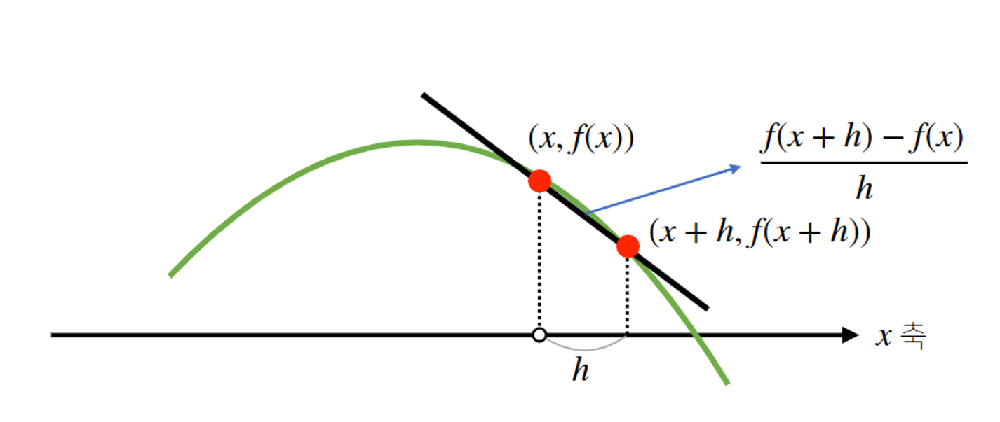
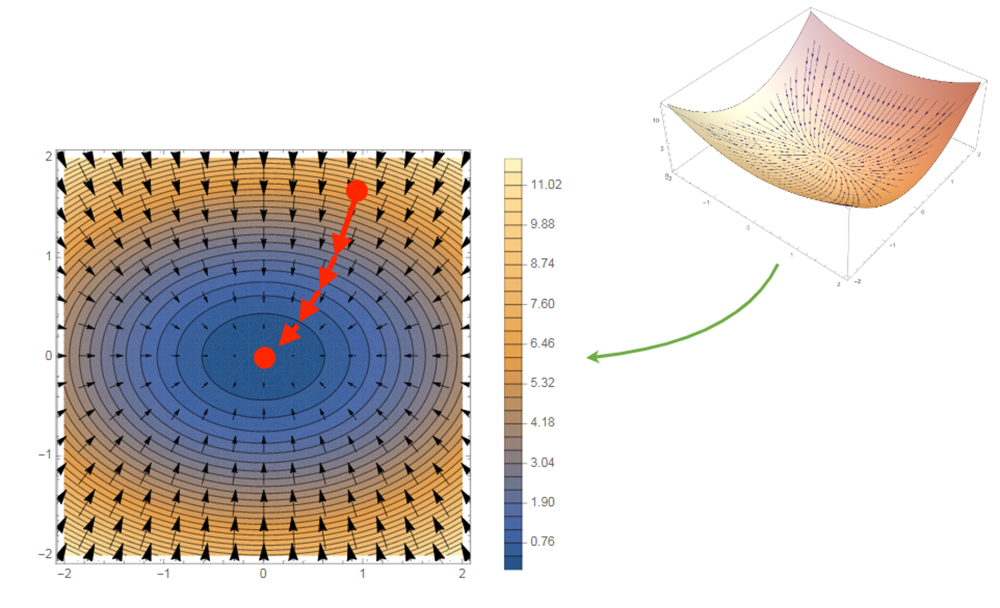

# 3강 경사하강법 - 순한맛
미분의 개념과 **그레디언트 벡터** 에 대해 설명
**경사하강법** 의 알고리즘과 실제 코드에서의 구현 실습

[back to super](https://github.com/jinmang2/BoostCamp_AI_Tech_2/tree/main/u-stage/ai_math)

## 미분이란?
- 미분(differentiation)은 **변수의 움직임에 따른 함수값의 변화를 측정하기 위한 도구** 로 최적화에서 제일 많이 사용하는 기법
$$f^\prime(x)=\lim_{h\rightarrow 0}\cfrac{f(x+h)-f(x)}{h}$$

- 최근에 누가 손으로 미분을 계산하는가? (그게 나아... 뚬빠...)
- 컴퓨터가 대신 계산해준다.

```python
import sympy as sym
from sympy.abc import x, y, z

# cosine 미분
sym.diff(sym.cos(x), x)
# -sin(x)

# x^4를 미분
sym.diff(x ** 4, x)
# 4x^3

# x^4를 이계미분
sym.diff(x ** 4, x, x)
# 12x^2

# x^4를 삼계미분
sym.diff(x ** 4, x, x, x)
# 24x
```
- 미분을 시각화하면 다음과 같음
- 미분을 하려면 함수가 smooth하다는 조건이 있어야 함.
    - [smoothness](https://en.wikipedia.org/wiki/Smoothness)


- 위 접선의 기울기로 함수를 어떤 변수의 어느 방향으로 움직이면 함숫값이 증가하는지/감소하는지 알 수 있다.
    - **경사상승법(gradient ascent)** 미분값을 더하여 함수의 극댓값의 위치를 구할 때 사용
        - 사실 gradient descent의 반대!
        - 강화학습에서 reward 최대화의 개념으로 쓰임
    - **경사하강법(gradient descent)** 미분값을 빼서 함수의 극솟값의 위치를 구할 때 사용
- 고2를 기억하자. 미분의 변화값이 없어지는 지점이 어디인가?
    - 극값에 도달할 때이다.
    - 극값에 도달하면 gd, ga는 멈춘다.

```
# 경사하강법 알고리즘 (1)
Input: gradient, init, lr, eps
Output: var
-------------------------------------
gradient: 미분을 계산하는 함수
init: 시작점
lr: 학습률 (learning rate)
eps: 알고리즘 종료 조건
-------------------------------------
var = init
grad = gradient(var)
while (abs(grad) > eps):
    var = var - lr * grad
    grad = gradient(var)
```

## 변수가 벡터이면요?
- 벡터가 입력인 다변수 함수의 경우 **편미분(partial differentiation)** 을 사용한다.
```python
import sympy as sym
from sympy.abc import x, y, z

# 아래 식을 x로 편미분
sym.diff(x ** 4 + 2 * y ** 2, x)
# 4x^3

# 아래 식을 y로 편미분
sym.diff(x ** 4 + 2 * y ** 2, y)
# 4y
```
- 각 변수 별 편미분을 계산한 벡터를 **gradient vector** 라고 하며 gradient ascent/descent 알고리즘에 사용할 수 있다.
$$\nabla f = (\partial_{x_1}f,\partial_{x_2}f,\cdots, \partial_{x_d}f),\quad \partial_{x_1}f(x)=\lim_{h\rightarrow 0}\cfrac{f(x+he_i)-f(x)}{h}$$



```
# 경사하강법 알고리즘 (2)
Input: gradient, init, lr, eps
Output: var
-------------------------------------
gradient: 그레디언트 벡터를 계산하는 함수
init: 시작점
lr: 학습률 (learning rate)
eps: 알고리즘 종료 조건
-------------------------------------
var = init
grad = gradient(var)
while (norm(grad) > eps):
    var = var - lr * grad
    grad = gradient(var)
```
