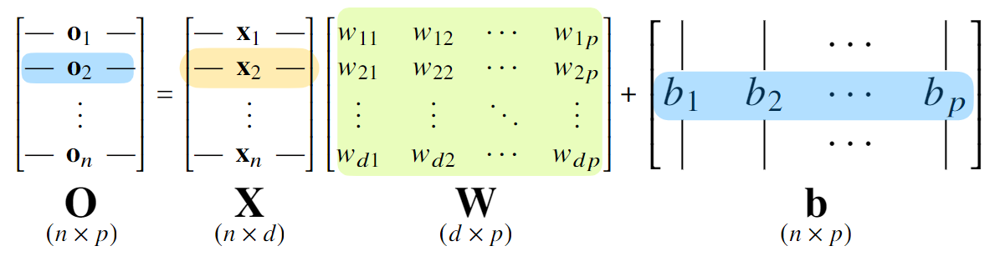
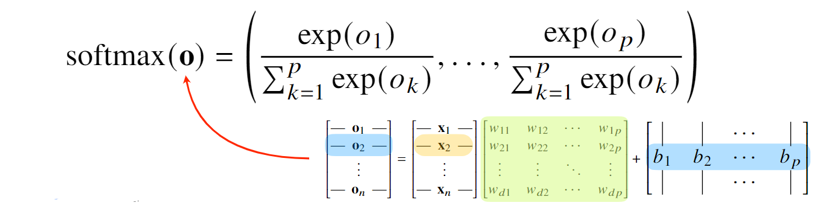
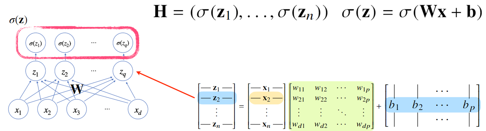
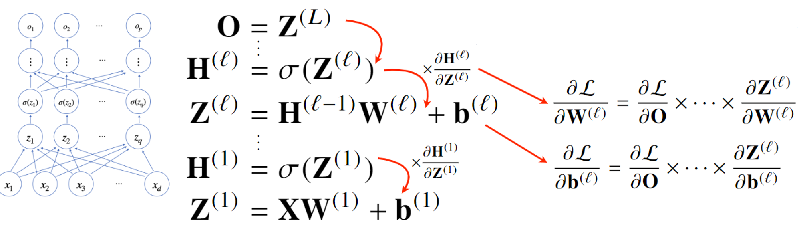
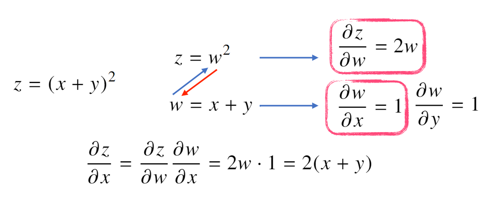

# 5강 딥러닝 학습방법 이해하기

[back to super](https://github.com/jinmang2/boostcamp_ai_tech_2/tree/main/u-stage/ai_math)

## 신경망을 수식으로 분해해보자
- 신경망은 비선형모델(nonlinear funciton)이다.



- 위 그림은 기존에 학습했던 linear 수식이다.
- 출력 logit $O$에 `softmax`함수를 적용하여 각 class에 속할 확률로 변환시켜준다.
    - 왜 softmax? 그냥 softmax만 쓰나? [Further Question](https://github.com/jinmang2/boostcamp_ai_tech_2/tree/main/u-stage/ai_math/ch05_deep_learning/further_question.md)



```python
import numpy as np

def softmax(v):
    # overflow 방지용
    c = np.max(v, axis=-1, keepdims=True)
    denumerator = np.exp(v - c)
    # 확률해석을 위해 나눠줄 sum을 계산
    numerator = np.sum(denumerator, axis=-1, keepdims=True)
    return denumerator / numerator    
```

- 응? 이러면 그냥 선형함수가 아닌가?
- 걱정하지 말라, 손은 눈보다 빠르니
- 중간에 non-linear activation 이 낀다구 후후



```python
import numpy as np


def relu(v):
    v = v.copy()
    v[v <= 0] = 0
    return v


def sigmoid(v):
    return 1 / (1 + np.exp(-v))


def tanh(v):
    denumerator = np.exp(v) - np.exp(-v)
    numerator = np.exp(v) + np.exp(-v)
    return denumerator / numerator


def tanh(v):
    # sigmoid와의 관계를 이용해서 아래처럼 구현도 가능
    return 2 * sigmoid(2 * v) - 1
```

- 왜 활성화 함수를 쓰지 않으면 딥러닝 모형은 선형모형과 다를 바가 없을까?

$$W_1(W_2(W_3\cdots(W_kX + b_k)\cdots +b_3)+b_2)+b_1=WX+b$$

- 여러 층으로 쌓으면 Multi-Layer Perceptron (MLP)가 된다.

```python
import torch
import torch.nn as nn

in_feature = 784
hid_dims = [128, 128, 64]
out_features = 3

model = nn.Sequential(
    nn.Linear(in_features, hid_dims[0]),
    nn.ReLu(),
    nn.Linear(hid_dims[0], hid_dims[1]),
    nn.ReLU(),
    nn.Linear(hid_dims[1], hid_dims[2]),
    nn.ReLU(),
    nn.Linear(hid_dims[2], out_features),
)
```

## 왜 층을 여러 개 쌓나요?
- Universal Approximation Theorem
    - https://towardsdatascience.com/can-neural-networks-really-learn-any-function-65e106617fc6
    - https://arxiv.org/abs/2102.10993
- 층이 깊을 수록 목적함수를 근사하는데 필요한 뉴런(노드)의 숫자가 훨씬 빨리 줄어들어 좀 더 효율적으로 학습이 가능
    - 무슨 말인가? peer session 때도 나왔던 질문!
    - 단층일 경우, 더 많은 노드가 필요해서 연산량 증가
    - 복층일 경우, 강 층 별 더 적은 노드로도 충분히 좋은 performance가 나옴.
    - but, 최적화가 힘들어짐(왜? 역전파 path가 길어짐. gradient vanishing / exploding)

## 딥러닝 학습원리: 역전파 알고리즘
- 역전파는 loss를 반대방향으로 전파시켜 그 gradient로 모델 parameter를 업데이트시키는 방법
- 출력층부터 입력층으로 거꾸로 업데이트한다.



- 역전파의 기본 개념은 **Chain rule** 이다.
- 이를 위해 Auto-Differentiation을 보통 사용한다.


