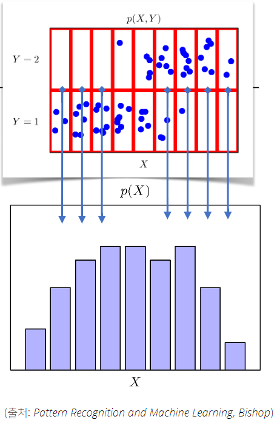
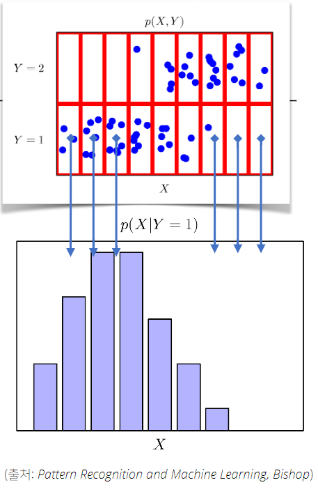

# 6강 확률론 맛보기
딥러닝의 기본 바탕이되는 **확률론**에 대해 소개
**확률분포, 조건부확률, 기댓값** 의 개념과 **몬테카를로 샘플링** 방법을 설명

### 딥러닝에서 확률론이 왜 필요한가요?
- 딥러닝은 확률론 기반의 기계학습 이론에 기반을 둠
- loss function들의 작동 원리는 데이터 공간을 통계적으로 해석해서 유도하게 된다.
    - 당장에 MLM만해도 Cross Entropy고
    - BLEU, ROUGE 다 통계 기반의 automatic evaluation 지표들임
- 즉, 분산 및 불확실성을 최소화하기 위해서는 이것들이 통계적으로 어떻게 측정되는지 그 방법을 알아야 함!!

## 확률 분포는 데이터의 초상화
- Data Space $\mathcal{X}\times\mathcal{Y}$
    - 지도학습 가정
- Sample Distribution $\mathcal{D}$
- Data, Random Variable $(x,y) \sim \mathcal{D}$

>### 이산확률변수 vs 연속확률변수
- Random Variable은 Probability Distribution $\mathcal{D}$에 따라 **이산형(Discrete)** 과 **연속형(Continuous)** 으로 구분된다.
- 이산형 확률 변수
    - 확률변수가 가질 수 있는 경우의 수를 모두 고려하여 확률을 더해서 모델링
    $$\mathbb{P}(X\in A) = \sum_{x\in A}P(X=x)$$
- 연속형 확률 변수
    - 데이터 공간에 정의된 확률변수의 밀도(density) 위에서의 적분을 통해 모델링
    $$\mathbb{P}(X\in A) = \int_A P(x)dx$$
    - 여기서 주의할 점! 밀도를 확률로 해석하면 안된다고 한다.
        - 밀도는 누적확률분포의 변화율을 모델링한 것이기 때문!
        $$P(x)=\lim_{h\rightarrow 0}\cfrac{\mathbb{P}(x-h\leq X \leq x + h)}{2h}$$
---

- 결합분포 $P(x,y)$는 Sample Distribution $\mathbb{D}$를 모델링한다.
- $P(x)$는 입력 $x$에 대한 주변확률 분포!
    - 당연하게도 $y$에 대한 정보를 주진 않는다.
    - 아래 그림 참고
    
- 우리가 풀고 싶은 문제? label $y$에 따라 달라지는 분포를 학습하고 싶은거지!
- 조건부확률분포 $P(x|y)$는 데이터 공간 상의 입력 $x$와 출력 $y$ 사이의 관계를 모델링한다!
    - bar 뒤에 $y$가 조건
    - 즉, 특정 라벨이 주어졌을 때 데이터의 분포!
    

## 조건부확률과 기계학습
- 조건부확률 $P(y|x)$는 입력변수 $x$에 대해 정답이 $y$일 확률!
    - 전에는 **분포** 였고 이거는 **확률** 임.
    - 우리가 softmax를 사용했던 진짜 이유~
- 회귀 문제의 경우 조건부기댓값 $\mathbb{E}[y|x]$를 추정!
    - 위 조건부 기댓값은 $\mathbb{E}\lvert\lvert y-f(x)\rvert\rvert_2$를 최소화하는 함수 $f(x)$와 일치한다고 함!
    - http://www.columbia.edu/~ltg2111/resources/mostlyharmlesslecturenotes.pdf

## 기댓값이 뭔가요?
- 확률분포가 주어지면 데이터를 분석하는데 사용가능한 여러 종류의 **통계적 범함수(statistical functional)** 를 계산할 수 있다
- **기댓값(expectation)** 은 데이터를 대표하는 통계량!
    - 확률분포를 통해 다른 statistical functional을 계산하는데 사용
$$\mathbb{E}_{x\sim P(x)}\big[f(x)\big]=\int_{\mathcal{X}}f(x)P(x)dx,\quad\mathbb{E}_{x\sim P(x)}\big[f(x)\big]=\sum_{x\in\mathcal{X}}f(x)P(x)$$

- 기댓값을 이용해서 여러 통계량을 계산할 수 있다.
    - 위 $f(x)$대신 아래 식을 넣으면 계산 가능

$$\mathbb{V}(x)=\mathbb{E}_{x\sim P(x)}\big[(x-\mathbb{E}[x])^2 \big]$$

$$Skewness(x)=\mathbb{E}\big[(x-\mathbb{E}[x])^2 \big]$$

$$Cov(x_1,x_2)=\mathbb{E}_{x_1,x_2\sim P(x_1,x_2)}\big[(x_1-\mathbb{E}[x_1])(x_2-\mathbb{E}[x_2])\big]$$

### 조건부확률과 기계학습
- 딥러닝은 MLP를 사용하여 데이터로부터 특징 패턴 $\phi$를 추출

## 몬테카를로 샘플링
- 위에 설명에서, 확률분포를 알면 기댓값을 활용하여 함수값을 계산한다고 얘기했다.
- 하지만 대부분의 ML의 문제들은 확률분포를 명시적으로 모를 때가 대부분임
- 즉, 이렇게 확률분포를 모를 땐 어떻게 기댓값을 계산하지...?
    - 모르는데 어떻게 해요
- **Monte Carlo Sampling**
$$\mathbb{E}_{x\sim P(x)}\big[f(x)\big]\approx \cfrac{1}{N}\sum_{i=1}^{N}f(x^{(i)}),\quad x^{(i)}\xrightarrow{\text{i.i.d}}P(x)$$

- 몬테카를로 샘플링은 독립추출만 보장되면 `law of large number`에 의해 수렴성을 보장한다.

### 예제: 적분 계산하기
$$f(x)=e^{-x^2}$$

### 예제: 원주율 계산하기
- [Further Question](https://github.com/jinmang2/BoostCamp_AI_Tech_2/tree/beauty/u-stage/ai_math/ch06_probability/further_question.md)
