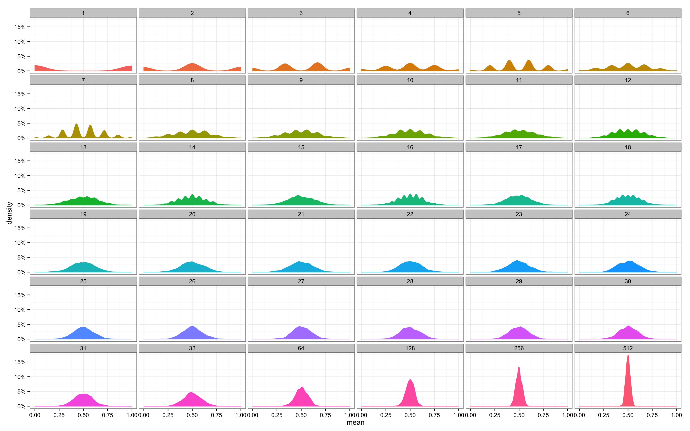

# 7강 통계학 맛보기
모수의 개념과 모수를 추정하는 방법으로 **최대가능도 추정법** 소개
정규분포, 카테고리분포에서의 예제로 최대가능도 추정법을 설명

## 모수가 뭐에요?
- 통계적 모델링은 적절한 가정 위에서 확률분포를 추정(inference)하는 것이 목표!
- 기계학습과 통계학이 공통적으로 추구하는 목표

- 그러나 우리가 다루는 데이터? population을 모두 다 모을 수 있을까 과연?
    - 이는 불가능... 즉, **근사적으로 확률분포를 추정**할 수 밖에 없음.

## 모수적 방법론 vs 비모수적 방법론
- 모수적 방법론
    - 데이터가 특정 확률분포를 따른다고 선험적으로 (a priori) 가정한 후 그 분포를 결정하는 모수(parameter)를 추정하는 방법
- 비모수적 방법론
    - 특정 확률분포를 가정하지 않고 데이터에 따라 모델의; 구조 및 모수의 개수가 유연하게 바뀌는 방법
- 중요한 것!: **모수의 유무로 방법론이 갈리는 것이 아님**

## 데이터로 모수를 추정해보자!
- 모수적 방법, 데이터의 확률분포를 가정
- 그러면 모수를 추정해볼 수 있음
- 예를 들어, 정규분포의 모수는 평균 $\mu$, 분산 $\sigma^2$으로 이를 추정하는 통계량은 아래에 기재

$$\bar{X}=\cfrac{1}{N}\sum_{i=1}^{N}X_i,\quad \mathbb{E}[\bar{X}]=\mu$$

$$S^2=\cfrac{1}{N-1}\sum_{i=1}^{N}(X_i-\bar{X})^2,\quad \mathbb{E}[S^2]=\sigma^2$$

- 표집분포(Sampling Distribution): 통계량의 확률분포
- 중심극한정리(Central Limit Theorem): 표본평균의 표집분포는 N이 커질수록 정규분포 $N(\mu, \sigma^2 / N)$을 따름!
    - 중요한 점: 표본 분포(Sample Distribution)과 표집 분포(Sampling Distribution)을 헷갈리면 안된다!

https://github.com/resendedaniel/math/tree/master/17-central-limit-theorem

## 최대가능도추정(MLE)
- 표본 평균, 표본 분산이 만능? Nope!
- 확률분포마다 사용하는 모수가 다름
    - 즉, 적절한 통계량이 달라짐
- 이론적으로 가장 가능성이 높은 모수를 추정하는 방법이 뭐가 있을까?
- 가장 큰거 뽑으면 되지! (Maximum Likelihood Estimation)
    - argmax로 뽑아버리자~!
$$\hat{\theta}_{MLE}=\argmax_\theta L(\theta;x)=\argmax_\theta P(x|\theta)$$
- 데이터 집합 X가 **독립적으로 추출되었을 경우 로그가능도를 최적화** 실시
$$L(\theta;X)=\prod_{i=1}^n{P(x_i|\theta)}\Rightarrow \log{L(\theta;X)=\sum_{i=1}^n \log{P(x_i|\theta)}}$$

## 왜 로그가능도를 사용하나요?
- 동일하게 동작함
- 데이터가 무한히 많은 수일 때 scaling
- 데이터가 독립일 경우 덧셈으로 바꿔서 연산 가능
- gradient descent로 최적화할 때 연산량을 $O(n^2)$에서 $O(n)$으로 줄여줌
- 보통 negative log-likelihood(NLL)로 최적화
- https://towardsdatascience.com/probability-concepts-explained-maximum-likelihood-estimation-c7b4342fdbb1

## 최대가능도 추정 예시: 정규분포
- https://towardsdatascience.com/maximum-likelihood-estimation-explained-normal-distribution-6207b322e47f

## 최대가능도 추정 예시: 카테고리 분포
- https://math.stackexchange.com/questions/2725539/maximum-likelihood-estimator-of-categorical-Distribution
- https://www.youtube.com/watch?v=rtH7ia9Y5HM

## 딥러닝에서의 MLE
- 딥러닝 모델의 가중치를 $\theta=(W^{(1)},\cdots,W^{(L)})$로 표기했을 때,
- 분류 문제에서 softmax vector는 categorical distrib의 모수 (p_1,\cdots,p_k)를 모델링
- one-hot으로 표현한 golden label $y=(y_1,\cdots,y_k)$를 관찰데이터로 이용해 MLE를 최대화할 수 있음
$$\hat{\theta}_{MLE}=\argmax_\theta{\cfrac{1}{n}\sum_{i=1}^n \sum_{k=1}^K{y_{i,k}\log(\text{MLP}_{\theta}(x_i)_k)}}$$

## 확률분포의 거리
- 왜 중요하냐? ML에서 사용되는 손실함수들은 모델이 학습하는 확률분포와 데이터에서 관찰되는 확률분포의 거리를 통해 유도
- 데이터 공간에 두 개의 확률분포 P(x), Q(x)가 있을 경우, **두 확률 분포 사이의 거리(distance)** 를 계산할 때 다음과 같은 함수들을 사용한다
    - Total Variation Distance, TV
    - Kullback-Leibler Divergence, KL
    - Wasserstein Distance

## 쿨백-라이블러 발산
- KL-Divergence는 아래와 같이 정의 (이산/연속)

$$\mathbb{KL}(P||Q)=\sum_{x\in\mathcal{X}}P(x)\log\bigg(\cfrac{P(x)}{Q(x)}\bigg)$$

$$\mathbb{KL}(P||Q)=\int_\mathcal{X}P(x)\log\bigg(\cfrac{P(x)}{Q(x)}\bigg)dx$$

- KL-Divergence는 사실 CE와 Entropy로 이루어짐

$$\mathbb{KL}(P||Q)=-\mathbb{E}_{x\sim P(x)}{\big[\log{Q(x)}\big]}+\mathbb{E}_{x\sim P(x)}{\big[\log{P(x)}\big]}$$

- 정보이론에서 Entropy가 정답 분포? 그리고 CE가 새로운 정보가 실제와 얼마나 다른지를 체크한 것이 Cross Entropy인데 결국 MLE는 KL-Div를 최소화하는 것과 같다
- 참고로, 이는 Distance는 아니다.
