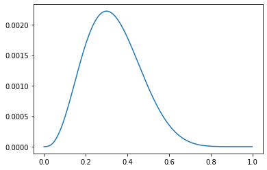

# Further Question

## Statistics
- 확률과 가능도의 차이는 무엇일까요? (개념적인 차이, 수식에서의 차이, 확률밀도함수에서의 차이)
- 확률 대신 가능도를 사용하였을 때의 이점은 어떤 것이 있을까요?
- 다음의 code snippet은 어떤 확률분포를 나타내는 것일까요? 해당 확률분포에서 변수 theta가 의미할 수 있는 것은 무엇이 있을까요?

### Q1) probability vs likelihood

### Q2) Likelihood를 사용했을 때의 이점은?

### Q3) 아래 code snippet이 나타내는 확률분포?
```python
import numpy as np
import matplotlib.pyplot as plt
theta = np.arange(0, 1, 0.001)
p = theta ** 3 * (1 - theta) ** 7
plt.plot(theta, p)
plt.show()
```

