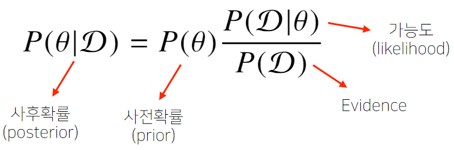
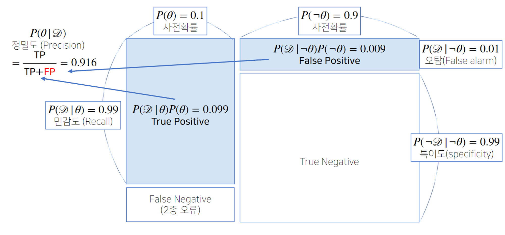
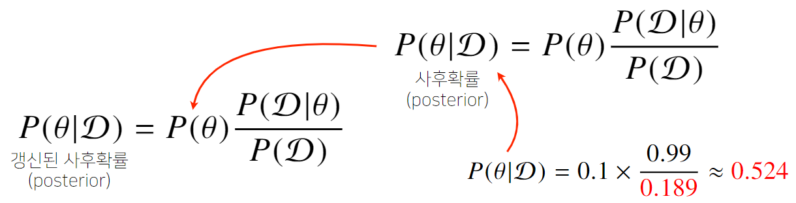
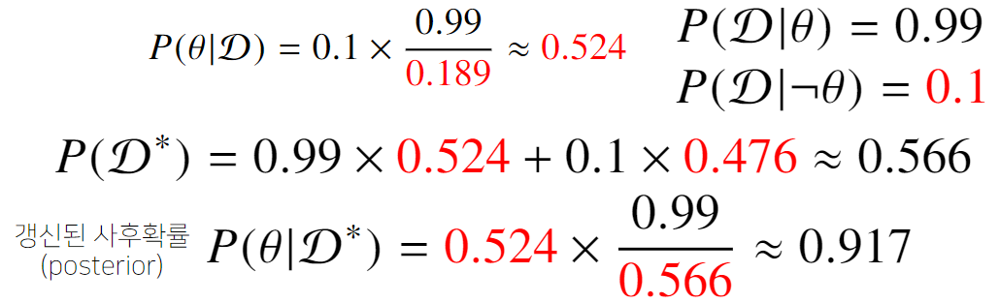
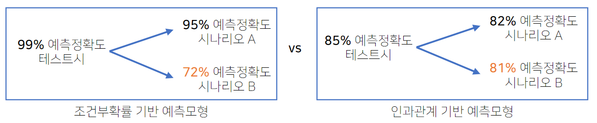

# 8강 베이즈 통계학 맛보기
조건부확률에서 이어지는 개념인 **베이즈 정리** 와 **인과관계 추론** 에 대해 설명
베이즈 정리는 **데이터가 새로 추가되었을 때 정보를 업데이트하는 방식**에 대한 기반이 됨
**사전확률**, **사후확률**, **evidence** 등의 개념을 잘 이해할 것

[back to super](https://github.com/jinmang2/BoostCamp_AI_Tech_2/tree/main/u-stage/ai_math)

## 조건부 확률이란?
- 빈도주의 vs 베이즈주의
- **베이즈 정리** 조건부 확률을 이용하여 정보를 갱신하는 방법을 알려줌

$$P(A\cap B)=P(B)P(A|B)$$

$$P(B|A)=\cfrac{P(A\cap B)}{P(A)}=P(B)\cfrac{P(A|B)}{P(A)}$$

- 이는, $A$라는 새로운 정보가 주어졌을 때 $P(B)$로부터 $P(B|A)$를 계산하는 방법을 제공
- 참고로, 아래의 개념도 기억할 것
    - 독립사건: $P(A\cap B)=P(A)P(B)$
    - 배반사건: $P(A\cap B)=\phi$

## 베이즈 정리: 예제

- 어떤 질병의 발병률이 10%로 알려져있다. 그 질병에 실제로 걸렸을 때 검진될 확률은 99%, 실제로 걸리지 않았을 때 오검진될 확률이 1%라고 할 때, 어떤 사람이 질병에 걸렸다고 검진결과가 나왔을 때 정말로 질병에 감염되었을 확률은?

- False Alarm + Recall은 1이 아니다. False Alarm이 0.1로 올라갈 경우 $P(\mathcal{D})$는 0.189가 되고(베이즈 정리로 계산) $P(\theta|\mathcal{D})$(정밀도)는 0.524까지 떨어지게 된다.
- 베이즈 정리를 통해 정보의 갱신이 가능하다고 언급했는데,
- 앞서 그 질병을 판정받은 사람이 두 번째 검진을 받았을 때도 양성이 나왔을 때 진짜 질병에 걸렸을 확률은?

## 조건부 확률 $\rightarrow$ 인과관계?
- 조건부확률은 유용한 통계적 해석을 제공하나 이를 **인과관계(causality)** 를 추론할 때 함부로 사용해서는 안 된다.
    - 데이터가 무한정 많다고 해도 이를 간과해선 안된다.
- 인과 관계는 **데이터 분포의 변화에 강건한 예측 모형** 을 만들 때 필요하다.
    - 약간 trade-off일 수 있는게, 인과 관계만으로는 높은 예측 정확도를 얻기는 힘들다.

- 인과 관계를 알아내기 위해선 중첩요인(Confounding factor)의 효과를 제거, 원인에 해당하는 변수만의 인과관계를 계산해야 한다.
    - 이를 제거하지 않으면 가짜 연관성(spurious correlation)이 나온다고 한다.
