# 9강 CNN 첫걸음
**Convolution 연산**과 **다양한 차원에서의 연산방법**을 소개합니다.
**Convolution 연산의 역전파**에 대해 설명합니다.

[back to super](https://github.com/jinmang2/BoostCamp_AI_Tech_2/tree/main/u-stage/ai_math)

## Convolution 연산 이해하기
- MLP는 fully-connected
<div align="center">
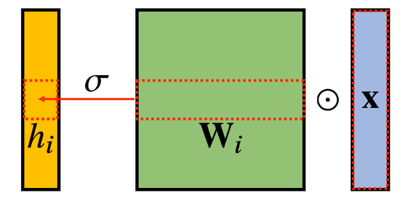
</div>

$$h_i=\sigma\bigg(\sum_{j=1}^{p}{W_{ij}x_j}\bigg)$$
- Convolution은 locally connected임
<div align="center">
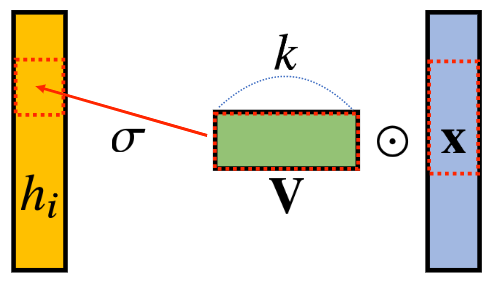
</div>

$$h_i=\sigma\bigg(\sum_{j=1}^{k}v_j x_{i+j-1}\bigg)$$
- Convolution 연산의 수학적인 의미?
    - 신호(signal)을 **커널을 이용해 국소적으로(locally) 증폭 혹은 감소** 시켜 정보를 추출 혹은 필터링하는 것
    - CNN에서 사용하는 convolution은 사실 `cross-correlation`임.
    - 이게 크게 보니 동일하게 작동해서 쓰는거지 원랜 다른 의미!

$$\text{continuous}\quad[f*g](x)=\int_{\mathbb{R}^d}{f(z)g(x+z)dz}=\int_{\mathbb{R}^d}{f(x+z)g(z)dz}=[g*f](x)$$

$$\text{discrete}\quad\quad[f*g](i)=\sum_{a\in \mathbb{Z}^d}{f(a)g(i+a)}=\sum_{a\in\mathbb{Z}^d}{f(i+a)g(a)}=[g*f](x)$$

- 커널은 정의역 내에서 움직여도 변하지 않고(**translation invariant**) 주어진 신호에 **국소적(local)** 으로 적용된다.

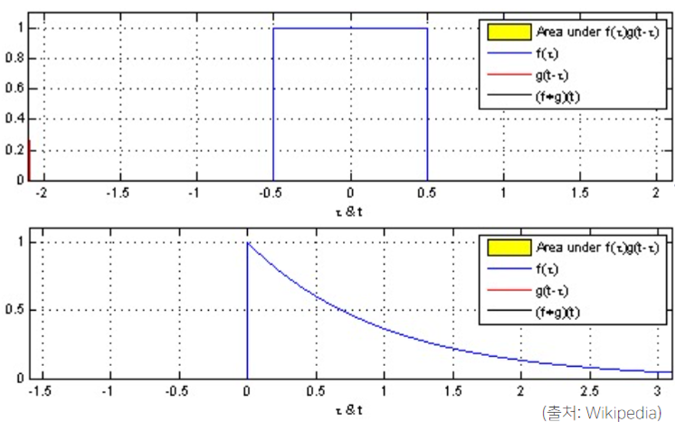

## 다양한 차원에서의 Convolution
- 1d, 2d, 3d 다 존재함!
- 실제로 torch에서도 보면 `nn.Conv1d`, `nn.Conv2d`, `nn.Conv3d` 다 제공하고 있음

$$\begin{array}{lll}
\text{1D-conv}\quad[f*g](i)=\sum_{p=1}^d{f(p)g(i+p)} \\\\
\text{2D-conv}\quad[f*g](i,j)=\sum_{p,q}{f(p,q)g(i+p,j+q)} \\\\
\text{3D-conv}\quad[f*g](i,j,k)=\sum_{p,q}{f(p,q,r)g(i+p,j+q,k+r)}
\end{array}$$

## 2차원 Convolution 연산 이해하기
- 2D-Conv 연산은 커널을 입력벡터 상에서 움직여가면서 선형모델과 합성함수가 적용되는 구조

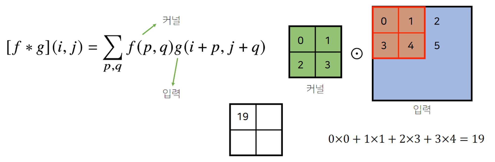

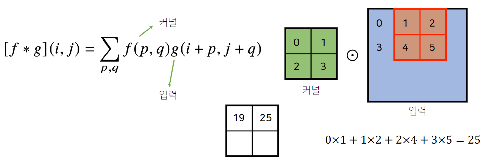

- 입력크기, 커널크기, 출력크기 계산 수식
    - https://discuss.pytorch.org/t/how-to-keep-the-shape-of-input-and-output-same-when-dilation-conv/14338
    - o = output
    - p = padding (default 0)
    - k = kernel_size
    - s = stride (default 1)
    - d = dilation (default 1)
    ```
    o = [i + 2*p - k - (k-1)*(d-1)]/s + 1
    ```
- 채널이 여러 개로 확장되면 Tensor로 아래와 같이 이해하면 편함

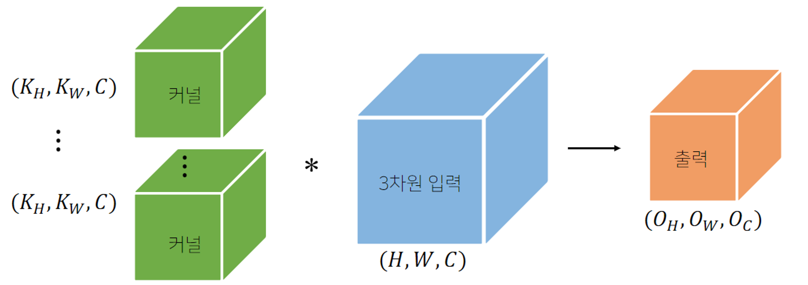

## Convolution 연산의 역전파 이해하기
- Convolution 연산은 커널이 모든 입력데이터에 공통으로 적용된다.
- 즉, 역전파를 계산할 때도 convolution 연산이 나오게 된다.

$$\begin{array}{lll}
\cfrac{\partial}{\partial x}[f*g](x)&=\cfrac{\partial}{\partial x}\displaystyle\int_{\mathbb{R}^d}{f(y)g(x-y)dy}\\
\\
&=\displaystyle \int_{\mathbb{R}^d}{f(y)\cfrac{\partial}{\partial x}g(x-y)dy}\\\\
&=[f*g^\prime](x)
\end{array}$$

- 차후에 수식으로 정리하고...
- 본 정리에는 강의의 스크린샷으로 대체하고자 한다.

<div align="center">
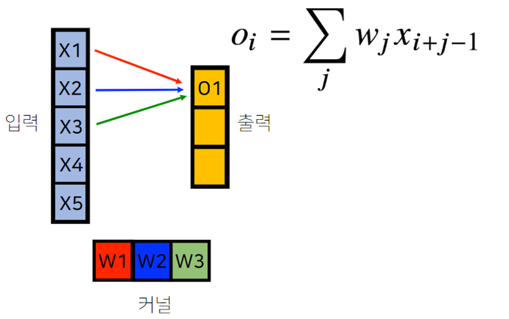
</div>

<div align="center">

</div>

<div align="center">
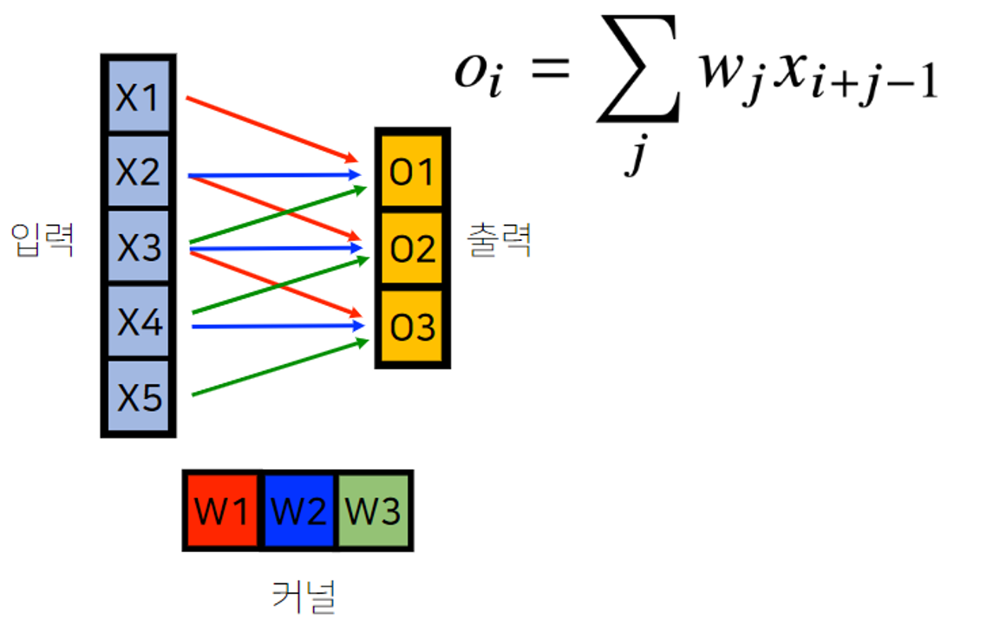
</div>

<div align="center">
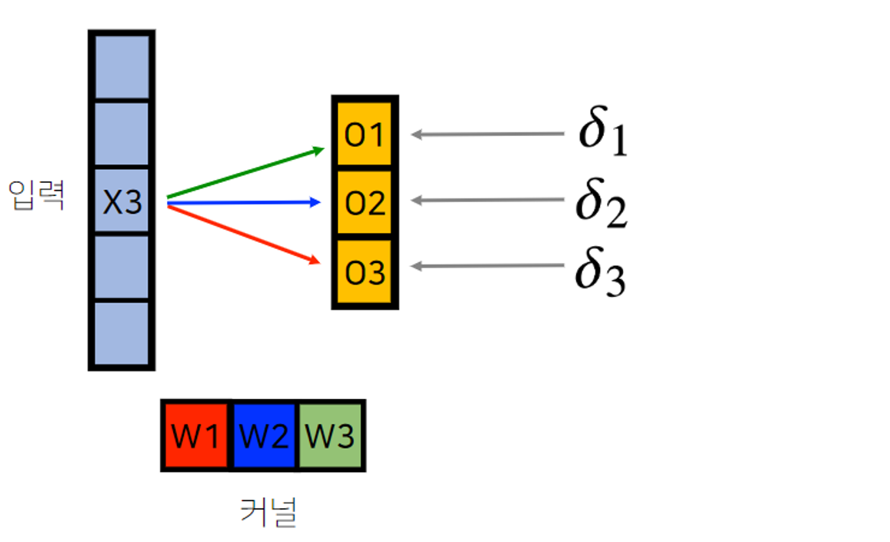
</div>

<div align="center">
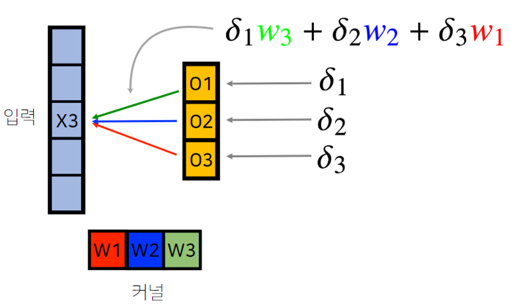
</div>

<div align="center">
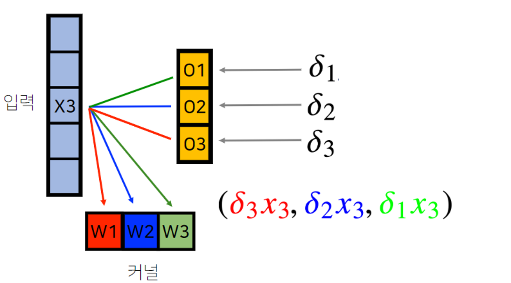
</div>

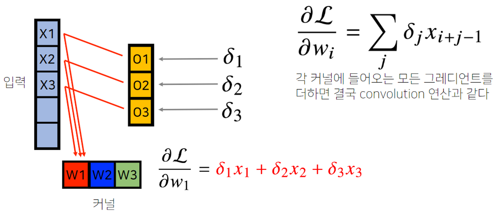

- 참고
    - https://ratsgo.github.io/deep%20learning/2017/04/05/CNNbackprop/
    - https://metamath1.github.io/cnn/index.html
