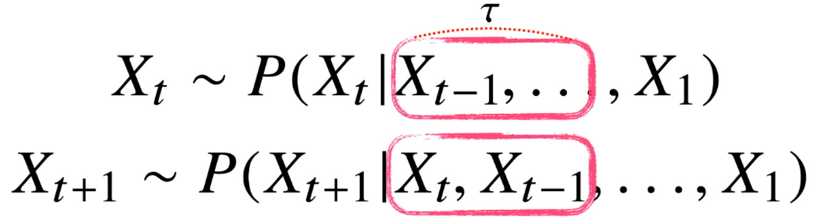
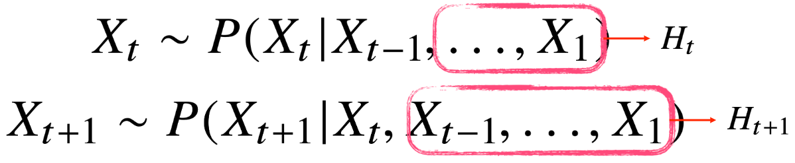
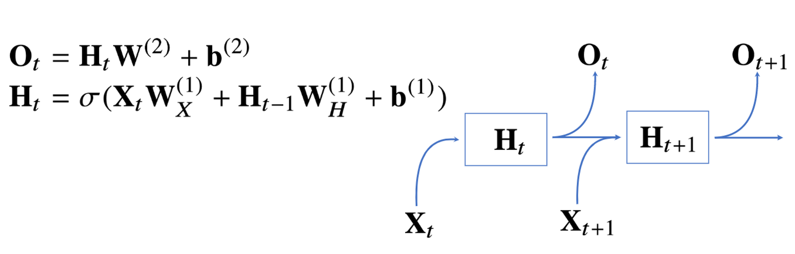
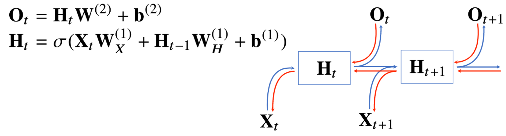
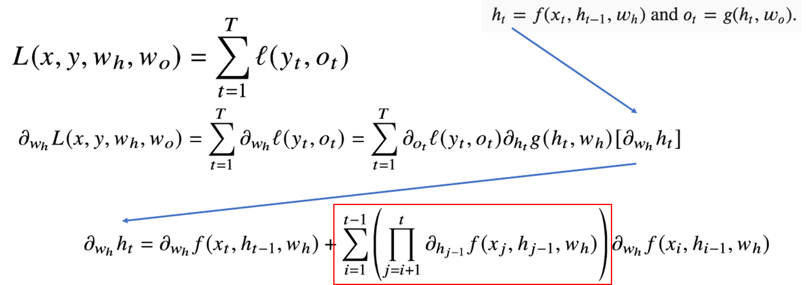

# 10강 RNN 첫걸음
**시퀀스 데이터**의 개념과 특징, 그리고 이를 처리하기 위한 **RNN**을 소개합니다.
RNN에서의 역전파방법인 **BPTT**와 **기울기 소실**문제에 대해 설명합니다.

## 시퀀스 데이터 이해하기
- 순서가 중요한 데이터!
- 소리, 문자열, 주가 등의 데이터를 시퀀스(Sequence) 데이터로 분류
- 얘는 `i.i.d` 가정을 잘 위배함! 때문에 순서가 바뀌거나 과거 정보에 손실이 발생하면 데이터의 분포도 바뀌게 됨

## 시퀀스 데이터를 어떻게 다루나요?
- 이전 시퀀스의 정보를 가지고 앞으로 발생할 데이터의 확률분포를 다루기 위해 조건부확률을 이용할 수 있음

$$\begin{array}{lll}
P(X_1,\cdots,X_t)&=P(X_t|X_1,\cdots,X_{t-1})P(X_1,\cdots,X_{t-1})\\
\\
&=P(X_t|X_1,\cdots,X_{t-1})P(X_{t-1}|X_1,\cdots,X_{t-2})P(X_1,\cdots,X_{t-2})\\
\\
&=\displaystyle\prod_{s=1}^{t}{P(X_s|X_{s-1},\cdots,X_1)}
\end{array}$$

- 시퀀스 데이터를 다룰 때, 과거의 가변적인 길이를 고정하느냐 혹은 변하게 두느냐에 따라 처리가 달라진다.
    - 고정적으로 처리 $AR(\tau)$
    
    - 가변적으로 처리 RNN
    

## Recurrent Neural Network 이해하기
- 순전파, 역전파 모두 recurrence한 특징 때문에 바뀐 부분이 많음

## BPTT 상세
- 수식은 아래와 같이 나온다!
- sequence 길이가 길어질수록 아래 빨간 box의 부분이 불안정해지기 쉽다!
    - gradient vanishing/exploding

## 기울기 소실의 해결책?
- sequence 길이가 길어지는 경우를 위해 BPTT를 통한 역전파 알고리즘의 계산이 불안정해지고, 이를 끊어주는 기법이 `truncated-BPTT`
- 그래도 문제임... 이를 memory cell 개념으로 해결하고자 했던게 `LSTM`이고 그 경량화 버전이 `GRU`
- 그래도 계속 발생하는 문제들... gradient clipping, RNN Dropout, Highway Recurrence Network 등 여러 방법이 고안됐지만...
- Self-Attention 한 방에 해결!
    - 심지어 LSTM은 layer별 연산량도 quadratic함...
