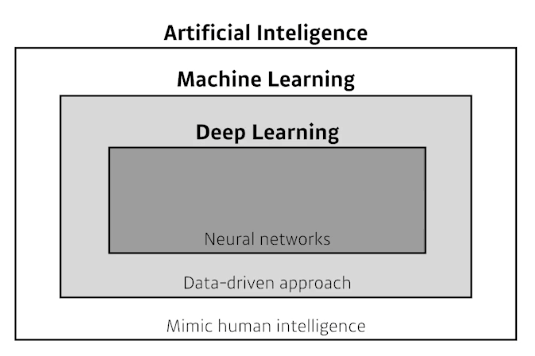
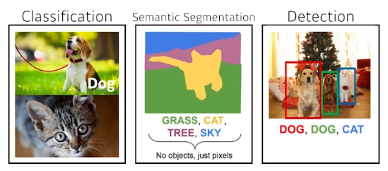
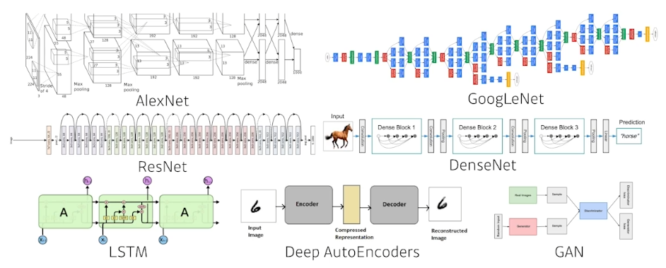
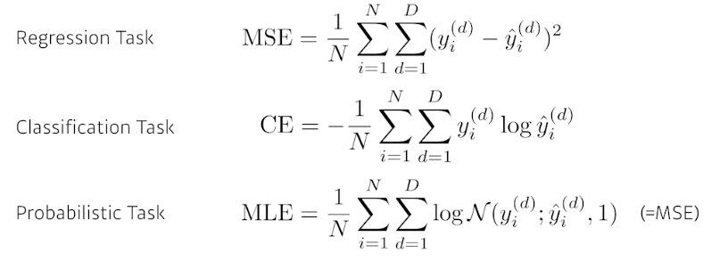
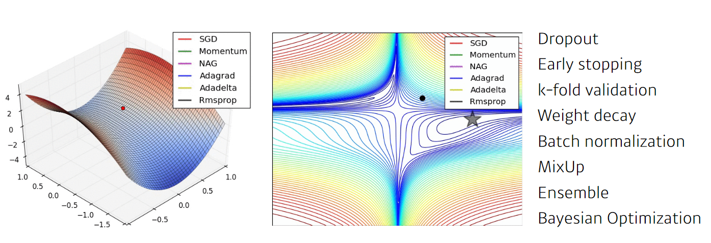
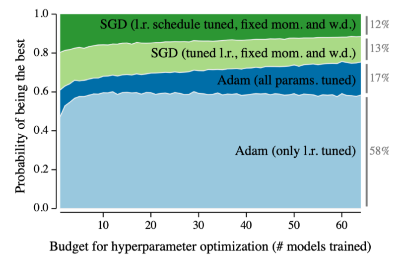
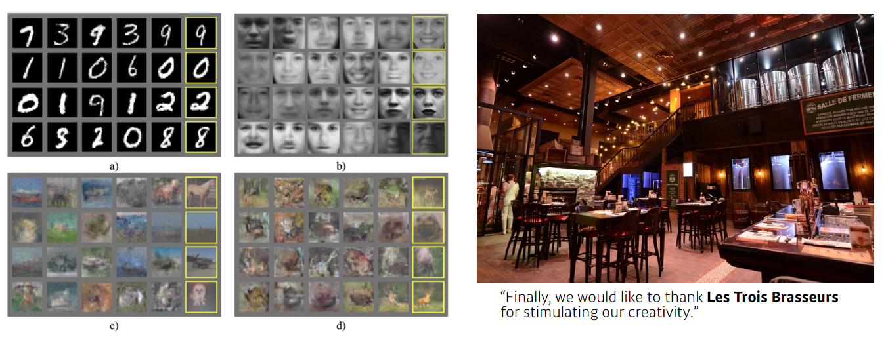
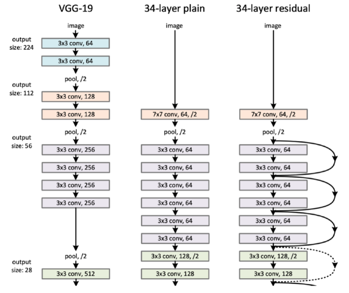
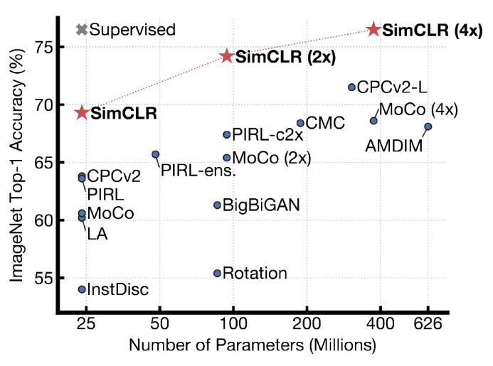

# 1강 딥러닝 기본 용어 설명 - Historical Review
**딥러닝에 대한 소개**: CNN(Convolutional neural networks), RNN(Recurrent Neural Networks)와 같은 딥러닝 모델을 공부하기 전에 중요한 요소인 Data, Model, Loss, Optimization algorithms에 대해 배웁니다.
**딥러닝의 역사**: 2012년부터 2021년까지의 패러다임에 대해 배웁니다.

## Introduction
- What make you a good deep learner?
    - Implementation Skills가 중요
        - Tensorflow / Pytorch
    - Math Skills
        - Linear albegra / Probability
    - Knowing a lot of recent Papers

### Data
- 데이터는 풀고자하는 문제에 종속된다.

### Model

### Loss
- 우리가 성취하고자 하는 proxy

- Loss function의 값이 줄어든다고 해서 우리가 원하는대로 항상 수렴한다? Nope!
- Data의 noise? L1 등 Robust Error를 써야 한다.
- 풀고자하는 문제를 어떻게 풀건지가 중요함

### Optimization Algorithm
- 학습하지 않은 데이터에서도 잘 동작될 수 있게 하는 것이 목적임!

## Historical Review
- Deep Learning's Most Important Ideas - A Brief Historical Review
    - https://dennybritz.com/blog/deep-learning-most-important-ideas/
- `2012` - AlexNet
    - Paradigm shift다 일어나게 된 시초
    - 실질적으로 성능을 발휘하기 시작했던 모델
- `2013` - DQN
    - Deep Q-Network
    - 강화학습의 시작
    - Atari 게임 50개 중에 처음엔 25개를 풀었음
    - 이때까지만 해도 DeepMind는 런던의 스타트업이었음
    - 이 연구 결과로 Google에서 매수
- `2014` - ENcoder/Decoder, Adam
    - 기계번역을 풀기 위한 Sequence to Sequence
    - 문장을 어떻게 표현해서 어떻게 생성해줄 것 인가
    
    - 왜 Adam을 사용할까?
    - learning rate schedule을 왜 줄여줘야하는가?
    - 다양한 Hyper Parameter search가 들어감
    - 일반적인 소상공인은 1,000개의 configuration을 다 못돌려보는데,
    - Adam이 이를 해결해줌
- `2015` - GAN, ResNet
    
    - 술집가서 연구를 생각하다니 ㄷㄷ
    
    - 왜 Deep Learning이냐?
        - Network를 깊히 쌓자!
        - 너무 깊게 쌓으면 학습이 잘 안되지 않느냐?
            - Test rate...
        - ResNet 이후로 쌓을 수 있는 깊이를 어마어마하게 늘려줌
- `2017` - Transformer
    - Attention is all you need
    - 굉장히 도발적이고 도전적인 논문 제목
    - 그 당시에는 자기네 분야에선 좋을거라 생각했는데...
    - 지금은 어지간한 분야에 다 쓰고있는 구조
- `2018` - BERT
    - Bidirectional Encoder Representations from Transformers
    - fine-tuned NLP models
    - 언어 모델: 다음에 어떤 단어가 올지 예측하는 모델
- `2019` - Big Language Models(GPT-X)
    - GPT-3, an autoregressive language model with 175 billion parameters
- `2020` - Self-Supervised Learning
    
    - 학습데이터를 추가로 만들거나 삽입!
    - BYOL
